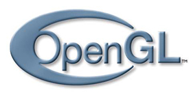
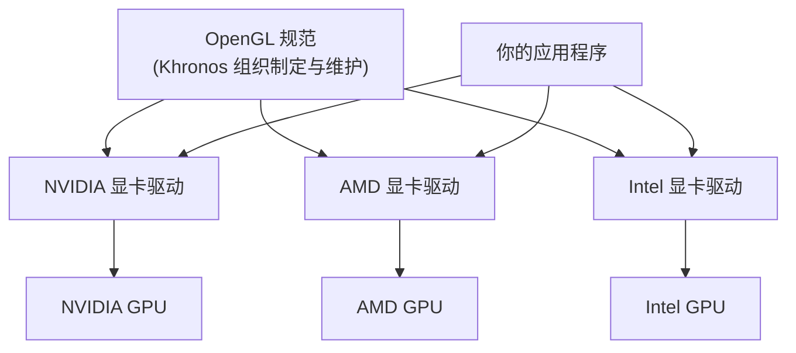

# 认识 OpenGL：规范、状态机与对象

| 项目 | 内容 |
| --- | --- |
| 原文 | [OpenGL](http://learnopengl.com/#!Getting-started/OpenGL) |
| 作者 | JoeyDeVries |
| 来源 | LearnOpenGL-CN（本文基于其内容整理修订） |

在开始这段旅程之前，我们先了解一下 OpenGL 到底是什么。

## OpenGL 是一个规范，而不是一个 API

**一句话核心：OpenGL 不是一份可以链接进程序的代码库，而是一份规定"每个函数应该做什么"的规范文档；真正提供可执行代码的是各家显卡驱动。**

一般它被认为是一个 API（Application Programming Interface，应用程序编程接口），包含了一系列可以操作图形、图像的函数。然而，OpenGL 本身并不是一个 API，它仅仅是一个由 [Khronos 组织](http://www.khronos.org/) 制定并维护的规范（Specification）。



OpenGL 规范严格规定了每个函数该如何执行，以及它们的输出值。至于内部具体每个函数是如何实现（Implement）的，将由 OpenGL 库的开发者自行决定（这里的"开发者"指编写 OpenGL 库的人，也就是显卡厂商的驱动团队）。因为 OpenGL 规范并没有规定实现的细节，具体的 OpenGL 库允许使用不同的实现，只要其功能和结果与规范相匹配——作为用户，你不会感受到功能上的差异。

实际的 OpenGL 库的开发者通常是显卡的生产商。你购买的显卡所支持的 OpenGL 版本，都是为该系列显卡专门开发的。当你使用 Apple 系统的时候，OpenGL 库是由 Apple 自身维护的。在 Linux 下，有显卡生产商提供的 OpenGL 库，也有一些爱好者改编的版本。这也意味着，任何时候 OpenGL 库表现的行为与规范规定的不一致时，基本都是库的开发者留下的 bug。

> **重要：** 由于 OpenGL 的大多数实现都是由显卡厂商编写的，当产生一个 bug 时，通常可以通过升级显卡驱动来解决。这些驱动会包含你的显卡能支持的最新版本的 OpenGL，这也是为什么总是建议你偶尔更新一下显卡驱动。

所有版本的 OpenGL 规范文档都公开地保存在 Khronos 那里。有兴趣的读者可以找到 OpenGL 3.3（我们将要使用的版本）的[规范文档](https://www.opengl.org/registry/doc/glspec33.core.20100311.withchanges.pdf)。如果你想深入到 OpenGL 的细节（只关心函数功能的描述，而不是函数的实现），这是个很好的选择；如果你想知道每个函数**具体的**运作方式，这个规范也是一个很棒的参考。

### 分层解释：规范、实现、应用各司其职

把"规范"和"实现"分开，是理解 OpenGL 的第一把钥匙。它们的分工可以用下面的全景图概括：



- **规范（Specification）**：一份文档，规定 `glDrawArrays`、`glClear` 这些函数叫什么、接受什么参数、调用后状态如何改变、最终渲染行为是什么。
- **实现（Implementation）**：显卡驱动里的真实机器码。不同厂商的驱动可以在内部天差地别，只要对外行为符合规范即可。
- **应用程序（Application）**：你的代码。调用同一个函数名，底层执行的却是当前显卡驱动提供的实现。

> **常见误解：** 有人以为"OpenGL 是 Khronos 发布的一个库，装上就能用"。实际上 Khronos 只发布文档和头文件定义，不发布任何可执行实现。你机器上真正的 OpenGL 是显卡驱动的一部分——这也是为什么下一节要引入 GLAD 在运行时加载函数。

## 核心模式与立即渲染模式

**一句话核心：立即渲染模式把绘图细节藏进固定管线，画起来简单但效率低、可控性差；核心模式把细节交还给你，难学但灵活高效，也是现代 OpenGL 的路线。**

早期的 OpenGL 使用**立即渲染模式**（Immediate Mode，也就是**固定渲染管线**），这个模式下绘制图形很方便。OpenGL 的大多数功能都被库隐藏起来，开发者很少有控制 OpenGL 如何进行计算的自由。而开发者迫切希望能有更多的灵活性。随着时间推移，规范越来越灵活，开发者对绘图细节有了更多的掌控。立即渲染模式确实容易使用和理解，但是效率太低。因此从 OpenGL 3.2 开始，规范文档开始废弃立即渲染模式，并鼓励开发者在 OpenGL 的**核心模式**（Core-profile）下进行开发，这个分支的规范完全移除了旧的特性。

当使用 OpenGL 的核心模式时，OpenGL 迫使我们使用现代的函数。当我们试图使用一个已废弃的函数时，OpenGL 会抛出一个错误并终止绘图。现代函数的优势是更高的灵活性和效率，然而也更难于学习。立即渲染模式从 OpenGL**实际**运作中抽象掉了很多细节，因此它在易于学习的同时，也很难让人把握 OpenGL 具体是如何运作的。现代函数要求使用者真正理解 OpenGL 和图形编程，它有一些难度，然而提供了更多的灵活性、更高的效率，更重要的是可以更深入地理解图形编程。

这也是为什么我们的教程面向 OpenGL 3.3 的核心模式。虽然上手更困难，但这份努力是值得的。

现今，更高版本的 OpenGL 已经发布（写作时最新版本为 4.5），你可能会问：既然 OpenGL 4.5 都出来了，为什么我们还要学习 OpenGL 3.3？答案很简单：所有 OpenGL 的更高版本都是在 3.3 的基础上，引入了额外的功能，并没有改动核心架构。新版本只是引入了一些更有效率或更有用的方式去完成同样的功能。因此，所有的概念和技术在现代 OpenGL 版本里都保持一致。当你的经验足够时，你可以轻松使用来自更高版本 OpenGL 的新特性。

> **注意：** 当使用新版本的 OpenGL 特性时，只有新一代的显卡能够支持你的应用程序。这也是为什么大多数开发者基于较低版本的 OpenGL 编写程序，并只提供选项启用新版本的特性。
>
> 在有些教程里你会看见更现代的特性，它们同样会以这种提示的方式标明。

## 扩展

**一句话核心：扩展是显卡厂商在驱动里提前实现的"新功能试用装"——程序先检查显卡是否支持，再决定走新路径还是旧路径。**

OpenGL 的一大特性就是对扩展（Extension）的支持。当一个显卡公司提出一个新特性或者渲染上的大优化，通常会以**扩展**的方式在驱动中实现。如果一个程序在支持这个扩展的显卡上运行，开发者可以使用这个扩展提供的一些更先进、更有效的图形功能。通过这种方式，开发者不必等待一个新的 OpenGL 规范面世，就可以使用这些新的渲染特性，只需要简单地检查一下显卡是否支持此扩展。通常，当一个扩展非常流行或者非常有用的时候，它将最终成为未来的 OpenGL 规范的一部分。

使用扩展的代码大多看上去如下：

```c++
if (GL_ARB_extension_name)
{
    // 使用硬件支持的全新的现代特性
}
else
{
    // 不支持此扩展：用旧的方式去做
}
```

使用 OpenGL 3.3 时，我们很少需要使用扩展来完成大多数功能，当需要的时候，本教程将提供适当的指示。

## 状态机

**一句话核心：OpenGL 本身是一个巨大的状态机——绝大多数函数不是在"立刻做一件事"，而是在"修改某个状态"或"读取某个状态"。**

OpenGL 自身是一个巨大的状态机（State Machine）：一系列的变量描述 OpenGL 此刻应当如何运行。OpenGL 的状态通常被称为 OpenGL**上下文**（Context）。我们通常使用如下途径去更改 OpenGL 状态：设置选项、操作缓冲。最后，我们使用当前 OpenGL 上下文来渲染。

假设我们想告诉 OpenGL 去画线段而不是三角形的时候，我们通过改变一些上下文变量来改变 OpenGL 状态，从而告诉 OpenGL 如何去绘图。一旦我们改变了 OpenGL 的状态为绘制线段，下一个绘制命令就会画出线段而不是三角形。

当使用 OpenGL 的时候，我们会遇到一些**状态设置**函数（State-changing Function），这类函数将会改变上下文；以及**状态使用**函数（State-using Function），这类函数会根据当前 OpenGL 的状态执行一些操作。只要你记住 OpenGL 本质上是个大状态机，就能更容易理解它的大部分特性。

```text
状态设置函数 (glClearColor / glBindBuffer / glEnable)
        │ 修改
        ▼
┌─────────────────────────────┐
│   OpenGL 上下文 (状态集合)    │
└─────────────────────────────┘
        │ 读取
        ▼
状态使用函数 (glClear / glDrawArrays)
        │
        ▼
        渲染结果
```

下一节你将会看到最经典的例子：`glClearColor` 只是把"清屏颜色"写进状态，真正把颜色缓冲填满的是 `glClear`——它读取当前状态来执行清除。这两个函数一"设置"一"使用"，正是状态机的直接体现。

## 对象

**一句话核心：对象是一组选项的集合，代表 OpenGL 状态的一个子集；通过"创建 → 绑定 → 设置 → 解绑"的工作流，你可以把多组设置都保存在 GPU 侧，随时切换使用。**

OpenGL 库是用 C 语言写的，同时也支持多种语言的派生，但其内核仍是一个 C 库。由于 C 的一些语言结构不易被翻译到其它的高级语言，因此 OpenGL 开发的时候引入了一些抽象层。"对象"（Object）就是其中一个。

在 OpenGL 中，一个**对象**是指一些选项的集合，它代表 OpenGL 状态的一个子集。比如，我们可以用一个对象来代表绘图窗口的设置，之后我们就可以设置它的大小、支持的颜色位数等等。可以把对象看做一个 C 风格的结构体（Struct）：

```c++
struct object_name
{
    float  option1;
    int    option2;
    char   name[];
};
```

> **译注：** 在更新前的教程中一直使用的都是 OpenGL 的基本类型，但由于作者觉得在本教程系列中并没有一个必须使用它们的原因，所有的类型都改为了自带类型。但是请仍然记住，使用 OpenGL 的类型的好处是保证了在各平台中每一种类型的大小都是统一的。你也可以使用其它的定宽类型（Fixed-width Type）来实现这一点。

当我们使用一个对象时，通常看起来像如下一样（把 OpenGL 上下文看作一个大的结构体）：

```c++
// OpenGL 的状态
struct OpenGL_Context
{
    ...
    object* object_window_target;
    ...
};
```

```c++
// 创建对象
unsigned int object_id = 0;
glGenObject(1, &object_id);
// 绑定对象至上下文
glBindObject(GL_WINDOW_TARGET, object_id);
// 设置当前绑定到 GL_WINDOW_TARGET 的对象的一些选项
glSetObjectOption(GL_WINDOW_TARGET, GL_OPTION_WINDOW_WIDTH, 800);
glSetObjectOption(GL_WINDOW_TARGET, GL_OPTION_WINDOW_HEIGHT, 600);
// 将上下文对象设回默认
glBindObject(GL_WINDOW_TARGET, 0);
```

这一小段代码展现了你以后使用 OpenGL 时常见的工作流。我们首先创建一个对象，然后用一个 id 保存它的引用（实际数据被储存在后台）。然后我们将对象绑定至上下文的目标位置（例子中窗口对象目标的位置被定义成 `GL_WINDOW_TARGET`）。接下来我们设置窗口的选项。最后我们将目标位置的对象 id 设回 0，解绑这个对象。设置的选项将被保存在 `object_id` 所引用的对象中，一旦我们重新绑定这个对象到 `GL_WINDOW_TARGET` 位置，这些选项就会重新生效。

> **注意：** 目前提供的示例代码只是 OpenGL 如何操作的一个大致描述，通过阅读以后的教程，你会遇到很多实际的例子（比如 Hello Triangle 一节中真实的 VBO/VAO 用法）。

使用对象的一个好处是，在程序中我们不止可以定义一个对象，并设置它们的选项，每个对象都可以是不同的设置。在我们执行一个使用 OpenGL 状态的操作的时候，只需要绑定含有需要的设置的对象即可。比如说我们有一些作为 3D 模型数据（一栋房子或一个人物）的容器对象，在我们想绘制其中任何一个模型的时候，只需绑定一个包含对应模型数据的对象就可以了（当然，我们需要先创建并设置对象的选项）。拥有数个这样的对象允许我们指定多个模型，在想画其中任何一个的时候，直接将对应的对象绑定上去，便不需要再重复设置选项了。

```text
创建对象 ──▶ 绑定到上下文目标位 ──▶ 设置选项 ──▶ 解绑 (绑回 0)
   │                                  │
   └────────── 之后随时可重新绑定，选项自动生效 ──┘
```

## 让我们开始吧

你现在已经知道一些 OpenGL 的相关知识了：OpenGL 规范和库、OpenGL 幕后大致的运作流程，以及 OpenGL 使用的一些传统技巧。不要担心你还没有完全消化它们，后面的教程我们会仔细地讲解每一个步骤，你会通过足够的例子来真正掌握 OpenGL。如果你已经做好了开始下一步的准备，我们可以在下一节开始创建 OpenGL 上下文以及我们的第一个窗口了。

## 附加资源

- [opengl.org](https://www.opengl.org/)：OpenGL 官方网站。
- [OpenGL registry](https://www.opengl.org/registry/)：包含 OpenGL 各版本的规范和扩展。

## 本章整体回顾

这一节为整个入门章节铺下了三块基石，后续所有示例都建立在这三块基石之上：

| 概念 | 一句话总结 | 在后续章节中的作用 |
| --- | --- | --- |
| 规范与实现 | OpenGL 是规范，驱动是实现 | 解释"为什么需要 GLAD 在运行时加载函数" |
| 核心模式 | 使用现代 OpenGL 函数，废弃立即渲染模式 | 决定我们创建上下文时如何配置（3.3 Core） |
| 状态机与对象 | 函数修改/读取状态；对象是状态的子集 | 解释 `glClearColor`/`glClear`、VBO/VAO 的绑定工作流 |

进入本章下一节后，你将会看到这些抽象概念如何落到具体代码上：GLFW 负责窗口与上下文，GLAD 负责把规范"变成"可调用的函数，而你的程序负责驱动这一切。

---

下一节：[创建窗口](02_creating_a_window.md)
