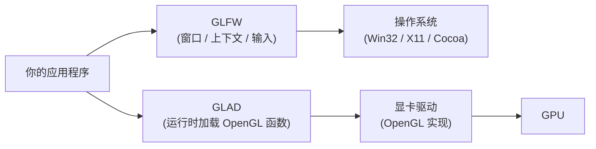
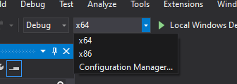
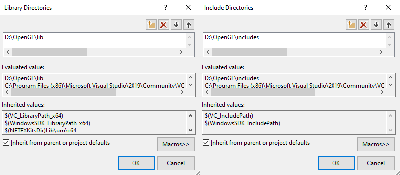
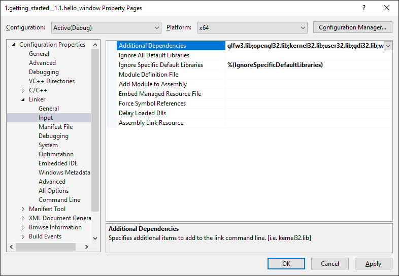

# 创建窗口：准备环境与 OpenGL 上下文

| 项目 | 内容 |
| --- | --- |
| 原文 | [Creating a window](http://learnopengl.com/#!Getting-started/Creating-a-window) |
| 作者 | JoeyDeVries |
| 来源 | LearnOpenGL-CN（本文基于其内容整理修订） |

> **译注：** 注意，由于作者对教程做出了更新，之前本节使用的是 GLEW 库，但现在改为了使用 GLAD 库，关于 GLEW 配置的部分现在已经被修改。本仓库同样采用 GLAD 方案。

在我们画出出色的效果之前，首先要做的就是创建一个 OpenGL 上下文（Context）和一个用于显示的窗口。然而，这些操作在每个系统上都是不一样的，OpenGL 有意将这些操作抽象（Abstract）出去。这意味着我们不得不自己处理创建窗口、定义 OpenGL 上下文以及处理用户输入。

**一句话核心：窗口、上下文和输入属于操作系统层，OpenGL 规范明确不管这些；GLFW 这类库的作用，就是替你把"每个平台都不一样"的部分统一封装起来。**

### 职责边界：谁负责什么

这里的"抽象出去"不是指"OpenGL 定义了一个窗口接口但不实现"，而是更彻底：**OpenGL 规范本身就不负责窗口创建、上下文创建和用户输入，它把这些事情排除在自身职责范围之外。**

| 组件 | 职责 | 属于 |
| --- | --- | --- |
| OpenGL | 规定图形渲染函数的行为（规范） | 一份文档 |
| 显卡驱动 | 实现 OpenGL 规范（真正的机器码） | 操作系统层 |
| GLFW | 创建窗口、创建 OpenGL 上下文、处理输入 | 第三方 C 库 |
| 应用程序 | 调用以上 API 完成渲染 | 你的代码 |

窗口是操作系统相关的资源：Windows 上有 Win32/WGL，Linux 上有 X11/Wayland 与 GLX/EGL，macOS 上有 Cocoa/NSOpenGLContext。如果 OpenGL 自己定义 `glCreateWindow`，就必须逐一考虑这些平台差异。OpenGL 的设计选择是：**平台相关问题一概不管，只规定跨平台的图形渲染接口。**

幸运的是，有一些库已经提供了我们所需的功能，其中一部分是特别针对 OpenGL 的。这些库节省了我们书写操作系统相关代码的时间，提供给我们一个窗口和一个 OpenGL 上下文用来渲染。最流行的几个库有 GLUT、SDL、SFML 和 GLFW。在教程里我们将使用 **GLFW**。你可以随意选用其他类似的库，大多数库的配置方法和 GLFW 差不多。



## GLFW

**一句话核心：GLFW 是一个专门面向 OpenGL 的 C 语言库，提供创建窗口、创建 OpenGL 上下文和处理输入这三项最小能力。**

GLFW 是一个专门针对 OpenGL 的 C 语言库，它提供了一些渲染物体所需的最低限度的接口。它允许用户创建 OpenGL 上下文、定义窗口参数以及处理用户输入，对我们来说这就够了。

本节和下一节的目标是把 GLFW 环境配好、能够跑起来，并保证它正确创建了 OpenGL 上下文并显示出一个简单的窗口来让我们随意使用。这篇教程会一步步教你如何获取、编译、链接 GLFW 库。我们使用的是 Microsoft Visual Studio 2019 IDE（操作过程在更新的 Visual Studio 上都是相同的）。如果你用的不是 Visual Studio（或者用的是它的旧版本）请不要担心，大多数 IDE 上的操作都是类似的。

## 构建 GLFW

GLFW 可以从它官方网站的[下载页](http://www.glfw.org/download.html)上获取。GLFW 已提供为 Visual Studio（2012 到 2019 都有）预编译好的二进制版本和相应的头文件，但是为了完整性我们将从编译源代码开始。所以我们需要下载**源代码包**。

> **注意：** 本教程中，我们将采用 64 位构建所有的库。因此如果您使用的是预编译的二进制文件，请确保你下载的是 64 位的二进制文件。

下载源码包之后，将其解压并打开。我们只需要里面的这些内容：

- 编译生成的库
- **include** 文件夹

从源代码编译库可以保证生成的库完全适合你的操作系统和 CPU，而预编译的二进制文件则并非总是提供（有时候，即便提供了预编译的二进制文件，也可能不适用于您的系统）。开放源代码所产生的问题在于：并不是每个人都用相同的 IDE 或者构建系统来搞开发，因而提供的项目/解决方案文件可能和一些人的 IDE 不兼容。所以人们必须使用给定的 .c/.cpp 和 .h/.hpp 文件来自己建立项目/解决方案，这是一项很枯燥的工作。但因此也诞生了一个叫做 CMake 的工具。

### CMake

**一句话核心：CMake 是工程文件生成工具——你用一份 CMake 脚本描述"这个工程需要哪些源文件、链接哪些库"，它帮你生成对应 IDE/构建系统的工程文件。**

CMake 是一个工程文件生成工具。用户可以使用预定义好的 CMake 脚本，根据自己的选择（像是 Visual Studio、Code::Blocks、Eclipse）生成不同 IDE 的工程文件。这允许我们从 GLFW 源码创建一个 Visual Studio 2019 工程文件，之后进行编译。首先，我们需要从[这里](http://www.cmake.org/cmake/resources/software.html)下载安装 CMake。

当 CMake 安装成功后，你可以选择从命令行或者 GUI 启动 CMake，由于我们不想让事情变得太过复杂，我们选择用 GUI。CMake 需要一个源代码目录和一个存放编译结果的目标文件目录。源代码目录我们选择 GLFW 的源代码的根目录，然后我们新建一个 *build* 文件夹，选中作为目标目录。


在设置完源代码目录和目标目录之后，点击 **Configure（设置）** 按钮，让 CMake 读取设置和源代码。我们接下来需要选择工程的生成器，由于我们使用的是 Visual Studio 2019，我们选择 **Visual Studio 16** 选项（因为 Visual Studio 2019 的内部版本号是 16）。CMake 会显示可选的编译选项用来配置最终生成的库。这里我们使用默认设置，并再次点击 **Configure（设置）** 按钮保存设置。保存之后，点击 **Generate（生成）** 按钮，生成的工程文件会在你的 **build** 文件夹中。

### 编译

在 **build** 文件夹里可以找到 **GLFW.sln** 文件，用 Visual Studio 2019 打开。因为 CMake 已经配置好了项目，并按照默认配置将其编译为 64 位的库，所以我们直接点击 **Build Solution（生成解决方案）** 按钮，然后在 **build/src/Debug** 文件夹内就会出现我们编译出的库文件 **glfw3.lib**。

库生成完毕之后，我们需要让 IDE 知道库和头文件的位置。有两种方法：

1. 找到 IDE 或者编译器的 **/lib** 和 **/include** 文件夹，添加 GLFW 的 **include** 文件夹里的文件到 IDE 的 **/include** 文件夹里去。用类似的方法，将 **glfw3.lib** 添加到 **/lib** 文件夹里去。虽然这样能工作，但这不是推荐的方式，因为这样会让你很难去管理库和 include 文件，而且重新安装 IDE 或编译器可能会导致这些文件丢失。
2. 推荐的方式是建立一个新的目录包含所有的第三方库文件和头文件，并且在你的 IDE 或编译器中指定这些文件夹。我个人会使用一个单独的文件夹，里面包含 **Libs** 和 **Include** 文件夹，在这里存放 OpenGL 工程用到的所有第三方库和头文件。这样我的所有第三方库都在同一个位置（并且可以共享至多台电脑）。然而这要求你每次新建一个工程时都需要告诉 IDE/编译器在哪能找到这些目录。

完成上面步骤后，我们就可以使用 GLFW 创建我们的第一个 OpenGL 工程了！

### 本仓库的做法：用 Conan 2 统一管理第三方库

上面这套"下载源码 → 用 CMake 生成工程 → 手动配置 include/lib 路径 → 手动写链接器依赖"的流程，是 LearnOpenGL 原教程基于 Visual Studio 手工配置的路线。本仓库把它换成了 **Conan 2 + CMake Presets** 的自动化路线，原理完全一致，只是把"手工下载和链接"这一步交给了工具：

- **Conan 2 负责下载并构建第三方库**。本仓库根目录的 `conanfile.py` 声明了四个依赖：`glfw/3.4`、`glad/0.1.36`、`glm/1.0.1`、`stb/cci.20240531`。执行 `conan install` 后，Conan 会通过 CMakeDeps 生成 `find_package` 可以直接找到的 `*-config.cmake` 文件，并提供 CMakeToolchain（编译参数）。
- **CMake Presets 负责配置与构建**。项目根目录的 `CMakePresets.json` 定义了多种工具链的 preset（MinGW GCC、MSYS2 Clang、MSVC、clang-cl 等，各有 Debug/Release）。`CMakeUserPresets.json`（已被 gitignore）由 `conan install` 自动生成，负责把 Conan 生成的 `conan_toolchain.cmake` 接入 CMake 配置流程——你不需要手动修改它。
- **链接依赖的声明集中在 CMakeLists.txt**。每个示例的 `CMakeLists.txt` 里用 `target_link_libraries(<target> PRIVATE glad::glad glfw glm::glm-header-only)` 一句话声明链接目标，链接器需要的库文件由 Conan 生成的配置自动提供，不再需要像原教程那样手工添加 `glfw3.lib` 和 `opengl32.lib`。

以默认的 MinGW GCC Debug preset 为例，完整的构建命令只有三步：

```powershell
conan install . -of build/mingw-gcc-debug -pr:h conan/profiles/mingw-gcc -pr:b conan/profiles/mingw-gcc -s build_type=Debug --build=missing
cmake --preset mingw-gcc-debug
cmake --build --preset mingw-gcc-debug
```

不同工具链对应的 preset 名称和完整的构建矩阵，请直接查阅仓库内的 `docs/build.md`，这里不再重复罗列。无论用哪个 preset，理解本章内容时都可以把 `conan install` 对应原教程的"下载并编译 GLFW 源码"，把 `cmake configure + build` 对应原教程的"用 CMake 生成 VS 工程并编译"。

## 我们的第一个工程

首先，打开 Visual Studio，创建一个新的项目。如果 VS 提供了多个选项，选择 Visual C++，然后选择 **Empty Project（空项目）**（别忘了给你的项目起一个合适的名字）。由于我们将在 64 位模式中执行所有操作，而新项目默认是 32 位的，因此我们需要将 Debug 旁边顶部的下拉列表从 x86 更改为 x64：



现在我们终于有一个空的工作空间了，开始创建我们第一个 OpenGL 程序吧！

## 链接

**一句话核心：链接（Link）是把"你写的代码"和"库里的代码"拼装成最终可执行文件的一步；编译报错与链接报错是两类不同的问题，`undefined reference` 几乎都是链接器找不到对应库。**

为了使我们的程序使用 GLFW，我们需要把 GLFW 库**链接**（Link）进工程。这可以通过在链接器的设置里指定我们要使用 **glfw3.lib** 来完成，但是由于我们将第三方库放在另外的目录中，我们的工程还不知道在哪寻找这个文件。于是我们首先需要将我们放第三方库的目录添加进设置。

要添加这些目录（需要 VS 搜索库和 include 文件的地方），我们首先进入 Project Properties（工程属性，在解决方案窗口里右键项目），然后选择 **VC++ Directories（VC++ 目录）** 选项卡（如下图）。在下面的两栏添加目录：


这里你可以把自己的目录加进去，让工程知道到哪去搜索。你需要手动把目录加在后面，也可以点击需要的位置字符串，选择 **\<Edit..\>** 选项，之后会出现类似下面这幅图的界面，图是选择 **Include Directories（包含目录）** 时的界面：



这里可以添加任意多个目录，IDE 会从这些目录里寻找头文件。所以只要你将 GLFW 的 **Include** 文件夹加进路径中，你就可以使用 `<GLFW/glfw3.h>` 来引用头文件。库文件夹也是一样的。

现在 VS 可以找到所需的所有文件了。最后需要在 **Linker（链接器）** 选项卡里的 **Input（输入）** 选项卡里添加 **glfw3.lib** 这个文件：



要链接一个库我们必须告诉链接器它的文件名。库名字是 **glfw3.lib**，我们把它加到 **Additional Dependencies（附加依赖项）** 字段中（手动或者使用 **\<Edit..\>** 选项都可以）。这样 GLFW 在编译的时候就会被链接进来了。除了 GLFW 之外，你还需要添加一个链接条目链接到 OpenGL 的库，但是这个库可能因为系统的不同而有一些差别。

### Windows 上的 OpenGL 库

如果你是 Windows 平台，**opengl32.lib** 已经包含在 Microsoft SDK 里了，它在 Visual Studio 安装的时候就默认安装了。由于这篇教程用的是 VS 编译器，并且是在 Windows 操作系统上，我们只需将 **opengl32.lib** 添加进链接器设置里就行了。值得注意的是，OpenGL 库 64 位版本的文件名仍然是 **opengl32.lib**（和 32 位版本一样），虽然很奇怪但确实如此。

### Linux 上的 OpenGL 库

在 Linux 下你需要链接 **libGL.so** 库文件，这需要添加 `-lGL` 到你的链接器设置中。如果找不到这个库你可能需要安装 Mesa、NVIDIA 或 AMD 的开发包，这部分因平台而异（而且我也不是很熟悉 Linux）就不仔细讲解了。

接下来，如果你已经添加 GLFW 和 OpenGL 库到链接器设置中，你可以用如下方式添加 GLFW 头文件：

```c++
#include <GLFW/glfw3.h>
```

> **重要：** 对于用 GCC 编译的 Linux 用户，建议使用这个命令行选项 `-lglfw3 -lGL -lX11 -lpthread -lXrandr -lXi -ldl`。没有正确链接相应的库会产生 *undefined reference*（未定义的引用）这个错误。

GLFW 的安装与配置就到此为止。

## GLAD

**一句话核心：OpenGL 函数地址由显卡驱动在运行时提供，编译期根本不知道它们在哪；GLAD 是一个"批量替你查询函数地址并保存为函数指针"的加载器。**

到这里还没有结束，我们仍然还有一件事要做。因为 OpenGL 只是一个标准/规范，具体的实现是由驱动开发商针对特定显卡实现的。由于 OpenGL 驱动版本众多，它大多数函数的位置都无法在编译时确定下来，需要在运行时查询。所以任务就落在了开发者身上：开发者需要在运行时获取函数地址并将其保存在一个函数指针中供以后使用。取得地址的方法[因平台而异](https://www.khronos.org/opengl/wiki/Load_OpenGL_Functions)，在 Windows 上会是类似这样：

```c++
// 定义函数原型
typedef void (*GL_GENBUFFERS)(GLsizei, GLuint*);
// 找到正确的函数并赋值给函数指针
GL_GENBUFFERS glGenBuffers = (GL_GENBUFFERS)wglGetProcAddress("glGenBuffers");
// 现在函数可以被正常调用了
GLuint buffer{};
glGenBuffers(1, &buffer);
```

你可以看到代码非常复杂，而且很繁琐，我们需要对每个可能使用的函数都重复这个过程。幸运的是，有些库能简化此过程，其中 **GLAD** 是目前最新、也是最流行的库。

### 分层解释：为什么函数地址必须运行时查询

这里用一张图把"规范 → 实现 → 加载"的关系串起来：

```text
规范文档             显卡驱动               你的程序
glGenBuffers         NVIDIA: 0x7FFA...      glGenBuffers 只是声明
应该做什么    ──▶    AMD:   0x6AB2...  ──▶  实际地址要运行时查询
                     Intel:  0x3D19...     ↓
                                           GLAD 用 glfwGetProcAddress
                                           把真实地址填入函数指针
```

- **编译期**：编译器只知道 `glGenBuffers` 的类型（参数和返回值），不知道它的地址——因为地址取决于你机器上的显卡驱动。
- **运行期**：上下文创建之后，通过 `wglGetProcAddress`（Windows）/`glXGetProcAddress`（Linux）向驱动查询真实地址。
- **GLAD**：把上面这套繁琐的查询过程自动化。调用一次 `gladLoadGLLoader(...)` 之后，所有的 `gl*` 函数指针都被填好了。

> **常见误解：** 有人以为 `#include <glad/glad.h>` 之后，`glGenBuffers` 的实现就来自头文件。其实头文件只告诉编译器函数的类型（参数、返回值），函数本体位于显卡驱动中；`gladLoadGLLoader` 运行之后，函数指针才真正指向驱动里的实现。你可以把 GLAD 理解为"批量替你做 `GetProcAddress` 的 OpenGL 函数加载器"。

### 配置 GLAD

GLAD 是一个[开源](https://github.com/Dav1dde/glad)的库，它能解决我们上面提到的那个繁琐的问题。GLAD 的配置与大多数的开源库有些许的不同：GLAD 使用了一个[在线服务](http://glad.dav1d.de/)，在这里我们能够告诉 GLAD 需要定义的 OpenGL 版本，并且根据这个版本加载所有相关的 OpenGL 函数。

打开 GLAD 的[在线服务](http://glad.dav1d.de/)，将语言（Language）设置为 **C/C++**，在 API 选项中，选择 **3.3** 以上的 OpenGL（gl）版本（我们的教程中将使用 3.3 版本，但更新的版本也能用）。之后将模式（Profile）设置为 **Core**，并且保证选中了 **生成加载器**（Generate a loader）选项。现在可以先（暂时）忽略扩展（Extensions）中的内容。都选择完之后，点击 **生成**（Generate）按钮来生成库文件。

GLAD 现在应该提供给你了一个 zip 压缩文件，包含两个头文件目录，和一个 **glad.c** 文件。将两个头文件目录（**glad** 和 **KHR**）复制到你的 **Include** 文件夹中（或者增加一个额外的项目指向这些目录），并添加 **glad.c** 文件到你的工程中。

> 在本仓库中这一步同样由 Conan 代劳：`glad/0.1.36` 这个包会提供 `glad/glad.h` 头文件，并预先配置好与 OpenGL 3.3 Core 对应的加载器，你只需要在 CMakeLists.txt 里链接 `glad::glad` 目标即可。

经过前面的这些步骤之后，你就应该可以将以下的指令加到你的文件顶部了：

```c++
#include <glad/glad.h>
```

点击编译按钮应该不会给你提示任何的错误，到这里我们就已经准备好继续学习下一节，去真正使用 GLFW 和 GLAD 来设置 OpenGL 上下文并创建一个窗口了。记得确保你的头文件和库文件的目录设置正确，以及链接器里引用的库文件名正确。如果仍然遇到错误，可以先看一下评论有没有人遇到类似的问题，请参考额外资源中的例子或者在评论区提问。

## 附加资源

- [GLFW: Window Guide](http://www.glfw.org/docs/latest/window_guide.html)：GLFW 官方的配置 GLFW 窗口的指南。
- [Building applications](http://www.opengl-tutorial.org/miscellaneous/building-your-own-c-application/)：提供了很多编译或链接相关的信息和一大列错误及对应的解决方案。
- [GLFW with Code::Blocks](http://wiki.codeblocks.org/index.php?title=Using_GLFW_with_Code::Blocks)：使用 Code::Blocks IDE 编译 GLFW。
- [Running CMake](http://www.cmake.org/runningcmake/)：简要的介绍如何在 Windows 和 Linux 上使用 CMake。
- [Writing a build system under Linux](http://learnopengl.com/demo/autotools_tutorial.txt)：Wouter Verholst 写的一个 autotools 的教程，讲的是如何在 Linux 上编写构建系统，尤其是针对这些教程。
- [Polytonic/Glitter](https://github.com/Polytonic/Glitter)：一个简单的样板项目，它已经提前配置了所有相关的库；如果你想要很方便地搞到一个 LearnOpenGL 教程的范例工程，这也是很不错的。

## 本章整体回顾

这一节解决的是"程序跑起来之前"的所有问题。回顾全章，你其实搭建了这样一条链路：

```text
conan install (下载 / 构建 glfw、glad、glm、stb)
      ↓
cmake --preset (配置：生成工程文件，找到所有库)
      ↓
cmake --build  (编译 + 链接：把代码和库拼成可执行文件)
      ↓
main.cpp       (include glad/glfw3.h，创建窗口与上下文)
```

原教程手工完成的"下载 GLFW 源码 → CMake 生成 VS 工程 → 配置 include/lib 目录 → 链接器添加 glfw3.lib 和 opengl32.lib → 用 GLAD 在线服务生成加载器"，在本仓库中全部由 Conan 2 和 CMake Presets 接管。理解本章的意义在于：**你知道每一步在做什么、为什么需要它**，这样无论工具如何自动化，你都能定位问题——比如 `undefined reference` 是链接问题，`Failed to initialize GLAD` 是运行时加载问题。

下一节，我们将第一次真正写出完整的程序：初始化 GLFW、创建窗口与上下文、初始化 GLAD，并跑起渲染循环。

---

下一节：[你好，窗口](03_hello_window.md)
