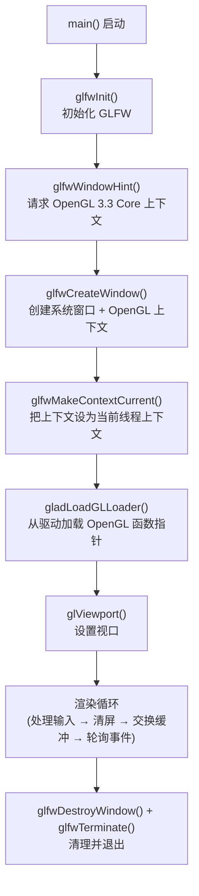
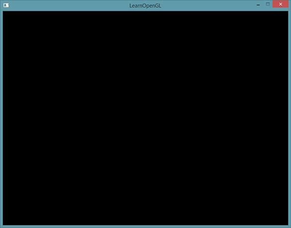
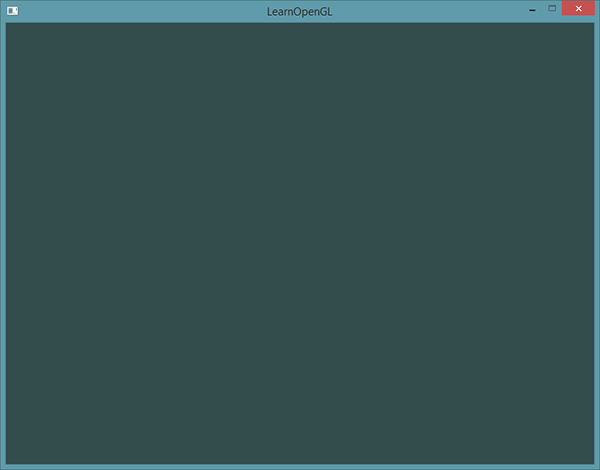

# 你好，窗口

| 项目 | 内容 |
| --- | --- |
| 原文 | [Hello Window](http://learnopengl.com/#!Getting-started/Hello-Window) |
| 作者 | JoeyDeVries |
| 来源 | LearnOpenGL-CN（本文基于其内容整理修订） |
| 本仓库示例 | `apps/01_getting_started/01_hello_window/` |

上一节我们把环境准备好之后，这一节要第一次真正写出一个完整的 OpenGL 程序：初始化 GLFW，创建窗口和 OpenGL 上下文，用 GLAD 加载函数，然后跑起渲染循环。本仓库的示例程序位于 `apps/01_getting_started/01_hello_window/main.cpp`，下面我们逐段讲解它的实际代码。

**一句话核心：一个 OpenGL 窗口程序的生命周期是固定的六步——初始化 GLFW → 配置上下文请求 → 创建窗口 → 设为当前上下文 → 加载 GLAD → 进入渲染循环；本节的代码就是这条链路的最小实现。**

先看整个程序的完整结构，心里有个全景：



## 包含头文件

仓库示例 `main.cpp` 的开头是这样包含头文件的：

```c++
#include <cstdlib>
#include <iostream>

#include <glad/glad.h>

#include <GLFW/glfw3.h>
```

> **注意：** 请确认是在包含 GLFW 的头文件之前包含了 GLAD 的头文件。GLAD 的头文件包含了正确的 OpenGL 头文件（例如 `GL/gl.h`），所以需要在其它依赖于 OpenGL 的头文件之前包含 GLAD。本仓库所有示例都严格遵守这个顺序：标准库 → 空行 → `<glad/glad.h>` → 空行 → `<GLFW/glfw3.h>`。

前两个是标准库头文件：`<cstdlib>` 提供 `EXIT_SUCCESS`/`EXIT_FAILURE`，`<iostream>` 提供 `std::cerr`（错误输出）。本仓库所有示例都用 `std::cerr` 打印错误信息，而不是像原教程那样用 `std::cout`。

## 窗口常量与辅助函数

接着，示例在匿名命名空间（`namespace { ... }`）里先声明三个窗口常量：

```c++
namespace {

constexpr int window_width{800};

constexpr int window_height{600};

constexpr const char* window_title{"OpenGL Lab - Hello Window"};
```

> 注意这里刻意把 `window_width`/`window_height` 定义为 `constexpr` 常量，并用花括号初始化（`{}`）——这是本仓库统一的 C++23 风格。这样做的原因有二：一是"魔法数字"有了名字，阅读代码的人一眼就知道 800 和 600 是窗口尺寸；二是后面 `glfwCreateWindow`、`glViewport` 以及 `glfwSetWindowShouldClose` 之外的多处调用都能复用这两个常量，改窗口大小时只需改一处。

这个示例**还没有任何着色器与几何体**，匿名命名空间里只有两个函数：视口回调与输入处理。

```c++
void framebuffer_size_callback(GLFWwindow*, int width, int height) {
    // OpenGL: glViewport 设置“标准化设备坐标 -> 帧缓冲像素”的映射区域。
    // 这里从左下角 (0, 0) 开始，覆盖整个 GLFW 报告的帧缓冲。
    glViewport(0, 0, width, height);
}

void process_input(GLFWwindow* window) {
    if (glfwGetKey(window, GLFW_KEY_ESCAPE) == GLFW_PRESS) {
        glfwSetWindowShouldClose(window, GLFW_TRUE);
    }
}

}  // namespace
```

这两个函数的具体作用，我们分别在"视口"和"输入"小节详细解释。先记住它们在 `main` 之前定义、放在匿名命名空间里即可——匿名命名空间的符号只在当前翻译单元可见，这正好配合本仓库"每个示例自包含一个 `main.cpp`"的教学设计。

## main 函数：初始化 GLFW 与上下文请求

```c++
int main() {
    if (glfwInit() != GLFW_TRUE) {
        std::cerr << "Failed to initialize GLFW\n";
        return EXIT_FAILURE;
    }
```

首先，我们在 `main` 函数中调用 `glfwInit` 函数来初始化 GLFW。注意本仓库的写法：`glfwInit` 的返回值与 `GLFW_TRUE` 比较，失败时打印错误并返回 `EXIT_FAILURE`——而不是像原教程那样忽略返回值。**任何初始化函数都可能有返回值表示失败，检查它是好习惯**。

初始化成功后，我们使用 `glfwWindowHint` 函数来配置 GLFW，告诉它"下一次创建窗口时，我要一个什么样的 OpenGL 上下文"：

```c++
    // GLFW/OpenGL: window hint 会影响“下一次”创建窗口时请求的 OpenGL 上下文。
    // 这里请求 OpenGL 3.3，是 LearnOpenGL 常用的入门版本。
    glfwWindowHint(GLFW_CONTEXT_VERSION_MAJOR, 3);
    glfwWindowHint(GLFW_CONTEXT_VERSION_MINOR, 3);

    // OpenGL: Core Profile 会移除旧版固定管线 API，强制使用现代 OpenGL 路线。
    glfwWindowHint(GLFW_OPENGL_PROFILE, GLFW_OPENGL_CORE_PROFILE);

#if defined(__APPLE__)
    // OpenGL/macOS: macOS 创建 Core Profile 上下文时要求开启 forward-compatible。
    glfwWindowHint(GLFW_OPENGL_FORWARD_COMPAT, GL_TRUE);
#endif
```

`glfwWindowHint` 函数的第一个参数代表选项的名称，我们可以从很多以 `GLFW_` 开头的枚举值中选择；第二个参数接受一个整型，用来设置这个选项的值。该函数的所有的选项以及对应的值都可以在 [GLFW's window handling](http://www.glfw.org/docs/latest/window.html#window_hints) 这篇文档中找到。

由于本站的教程都是基于 OpenGL 3.3 版本展开讨论的，所以我们需要告诉 GLFW 我们要使用的 OpenGL 版本是 3.3，这样 GLFW 会在创建 OpenGL 上下文时做出适当的调整。这也可以确保用户在没有适当的 OpenGL 版本支持的情况下无法运行。我们将主版本号（Major）和次版本号（Minor）都设为 3。我们同样明确告诉 GLFW 我们使用的是核心模式（Core-profile）。明确告诉 GLFW 我们需要使用核心模式意味着我们只能使用 OpenGL 功能的一个子集（没有我们已不再需要的向后兼容特性）。

> **注意（macOS）：** 如果使用的是 macOS 系统，还需要加上 `glfwWindowHint(GLFW_OPENGL_FORWARD_COMPAT, GL_TRUE);` 这行代码（上面的 `#if defined(__APPLE__)` 块里就是），这些配置才能起作用。

> **重要：** 请确认您的系统支持 OpenGL 3.3 或更高版本，否则此应用有可能会崩溃或者出现不可预知的错误。如果想要查看 OpenGL 版本的话，在 Linux 上运行 **glxinfo**，或者在 Windows 上使用其它的工具（例如 [OpenGL Extension Viewer](http://download.cnet.com/OpenGL-Extensions-Viewer/3000-18487_4-34442.html)）。如果你的 OpenGL 版本低于 3.3，检查一下显卡是否支持 OpenGL 3.3+（不支持的话你的显卡真的太老了），并更新你的驱动程序，有必要的话请更新显卡。

## 创建窗口对象

接下来我们创建一个窗口对象。这个窗口对象存放了所有和窗口相关的数据，而且会被 GLFW 的其他函数频繁地用到：

```c++
    GLFWwindow* window =
        glfwCreateWindow(window_width, window_height, window_title, nullptr, nullptr);
    if (window == nullptr) {
        std::cerr << "Failed to create GLFW window\n";
        glfwTerminate();
        return EXIT_FAILURE;
    }
```

`glfwCreateWindow` 函数需要窗口的宽和高作为它的前两个参数。第三个参数表示这个窗口的名称（标题），这里我们使用 `window_title` 常量（值为 `"OpenGL Lab - Hello Window"`），当然你也可以使用你喜欢的名称。最后两个参数分别是监视器（monitor）和共享上下文（share），本示例用 `nullptr` 表示"普通窗口、不共享资源"。

这个函数将会返回一个 `GLFWwindow` 对象（实际是一个指针），我们会在其它的 GLFW 操作中使用到。注意本仓库对返回值做了空指针检查：失败时打印错误、调用 `glfwTerminate` 清理、返回 `EXIT_FAILURE`。原教程里用的是 `NULL`，本仓库统一使用 C++ 的 `nullptr`。

创建完窗口，紧接着的两行是本节最容易忽略、也最关键的"接线"：

```c++
    // OpenGL: 大多数 OpenGL API 都作用于“当前上下文”。
    // 在调用 GLAD 或任何 gl* 函数之前，必须先把窗口的上下文设为当前上下文。
    glfwMakeContextCurrent(window);
    glfwSetFramebufferSizeCallback(window, framebuffer_size_callback);
```

**一句话核心：`glfwMakeContextCurrent` 把"窗口的 OpenGL 上下文"和"当前线程"绑定，此后该线程上的所有 OpenGL 调用都作用于这个上下文；不调用它，后续任何 `gl*` 函数都无处安放。**

- `glfwMakeContextCurrent(window)`：通知 GLFW 将我们窗口的上下文设置为当前线程的主上下文。
- `glfwSetFramebufferSizeCallback(window, framebuffer_size_callback)`：注册"帧缓冲尺寸变化"回调——窗口每次被缩放时，GLFW 都会调用我们之前在匿名命名空间里写的 `framebuffer_size_callback`，把新的宽高传进去更新视口。

## 初始化 GLAD

在之前的教程中已经提到过：GLAD 是用来管理 OpenGL 函数指针的，所以在调用任何 OpenGL 的函数之前我们需要初始化 GLAD：

```c++
    // GLAD/OpenGL: OpenGL 函数地址由显卡驱动在运行时提供。
    // GLAD 需要借助 glfwGetProcAddress，在当前上下文存在后加载这些函数指针。
    if (gladLoadGLLoader(reinterpret_cast<GLADloadproc>(glfwGetProcAddress)) == 0) {
        std::cerr << "Failed to initialize GLAD\n";
        glfwDestroyWindow(window);
        glfwTerminate();
        return EXIT_FAILURE;
    }
```

**一句话核心：`gladLoadGLLoader` 做的事情是"向驱动要地址"——它把 `glfwGetProcAddress`（GLFW 提供的、能查询系统相关函数地址的函数）作为回调传给 GLAD，GLAD 用它批量填充所有 `gl*` 函数指针。**

我们给 GLAD 传入了用来加载系统相关的 OpenGL 函数指针地址的函数。GLFW 给我们的是 `glfwGetProcAddress`，它根据我们编译的系统定义了正确的函数。本仓库的写法比原教程多一个 `reinterpret_cast<GLADloadproc>`，因为 `glfwGetProcAddress` 的函数签名与 GLAD 期望的加载器签名不完全一致，需要显式转换。这行代码之后，`glClear`、`glViewport` 等函数指针才真正可用。

> **重要顺序：** 为什么 GLAD 必须在 `glfwMakeContextCurrent` 之后初始化？因为查询函数地址需要"当前上下文"存在——没有上下文，驱动没有可查询的对象，`glfwGetProcAddress` 也无从谈起。上下文创建 → 设为当前 → 再加载函数，这个顺序不能颠倒。

## 视口

```c++
    // OpenGL: 初始视口不会由 GLFW 自动设置。这里先覆盖整个初始窗口尺寸；
    // 后续窗口尺寸变化再由 framebuffer_size_callback 负责同步。
    glViewport(0, 0, window_width, window_height);
```

**一句话核心：视口（Viewport）定义"标准化设备坐标（-1 到 1）映射到帧缓冲的哪一块像素区域"；`glViewport` 不是设置窗口大小，而是设置 OpenGL 输出到哪、输出多大。**

`glViewport` 函数前两个参数控制渲染区域左下角的位置，第三个和第四个参数控制渲染区域的宽度和高度（像素）。这里我们把视口设为整个初始窗口尺寸（`window_width` × `window_height`），也就是 OpenGL 渲染结果铺满整个窗口。

我们实际上也可以将视口的维度设置为比窗口的维度小，这样子之后所有的 OpenGL 渲染将会在一个更小的窗口中显示，这样子的话我们也可以将一些其它元素显示在 OpenGL 视口之外。

> **重要：** OpenGL 幕后使用 `glViewport` 中定义的位置和宽高进行 2D 坐标的转换，将 OpenGL 中的位置坐标转换为你的屏幕坐标。例如，OpenGL 中的坐标 (-0.5, 0.5) 有可能（最终）被映射为屏幕中的坐标 (200, 450)。注意，处理过的 OpenGL 坐标范围只为 -1 到 1，因此我们事实上将 (-1 到 1) 范围内的坐标映射到 (0, 800) 和 (0, 600)。

然而，当用户改变窗口的大小的时候，视口也应该被调整。这就是我们在创建窗口后注册的 `framebuffer_size_callback` 回调的用武之地：

```c++
void framebuffer_size_callback(GLFWwindow*, int width, int height) {
    glViewport(0, 0, width, height);
}
```

这个回调函数需要一个 `GLFWwindow` 作为它的第一个参数（本仓库示例没用到，所以省略了参数名），以及两个整数表示窗口的新维度。每当窗口改变大小，GLFW 会调用这个函数并填充相应的参数供你处理。当窗口被第一次显示的时候 `framebuffer_size_callback` 也会被调用。对于视网膜（Retina）显示屏，`width` 和 `height` 都会明显比原输入值更高一点——因为帧缓冲尺寸和窗口尺寸是两回事。

> **常见误解：** 有人以为 `glViewport` 是"设置窗口大小"，或者"设置 OpenGL 画布大小"。准确地说：窗口大小由 GLFW/操作系统决定；帧缓冲尺寸由窗口系统报告（可能不等于窗口尺寸，尤其在高 DPI 屏幕上）；`glViewport` 决定的是"渲染结果映射到帧缓冲的哪块矩形"。三者是不同层面的东西。

我们还可以将我们的函数注册到其它很多的回调函数中。比如说，我们可以创建一个回调函数来处理手柄输入变化、处理错误消息等。我们会在创建窗口之后、渲染循环初始化之前注册这些回调函数。

## 渲染循环

我们可不希望只绘制一个图像之后我们的应用程序就立即退出并关闭窗口。我们希望程序在我们主动关闭它之前不断绘制图像并能够接受用户输入。因此，我们需要在程序中添加一个 while 循环，我们可以把它称之为**渲染循环**（Render Loop），它能在我们让 GLFW 退出前一直保持运行。本仓库示例的渲染循环如下：

```c++
    while (glfwWindowShouldClose(window) == GLFW_FALSE) {
        process_input(window);

        // OpenGL: glClearColor 只是在 OpenGL 状态机中设置“清屏颜色”，
        // 并不会立即绘制；真正写入颜色缓冲的是下面的 glClear。
        glClearColor(0.10F, 0.14F, 0.18F, 1.0F);

        // OpenGL: GL_COLOR_BUFFER_BIT 表示清空颜色缓冲，也就是当前帧要显示
        // 到窗口中的颜色图像。这里会用 glClearColor 设置的颜色填满它。
        glClear(GL_COLOR_BUFFER_BIT);

        // GLFW/OpenGL: 默认使用双缓冲。OpenGL 先画到后台缓冲，swap 后才显示到屏幕，
        // 这样可以避免用户看到半帧内容或闪烁。
        glfwSwapBuffers(window);

        // GLFW: 处理系统窗口事件，并触发尺寸变化、键鼠输入等回调。
        glfwPollEvents();
    }
```

**一句话核心：渲染循环的每一次迭代就是一帧——处理输入 → 清屏 → 绘制 → 交换缓冲 → 轮询事件；只要窗口没有被要求关闭，这个循环就永不停歇。**

先解释循环条件与三个关键调用：

- `glfwWindowShouldClose(window)` 函数在我们每次循环的开始前检查一次 GLFW 是否被要求退出，如果是的话，该函数返回 `true`（本仓库写成与 `GLFW_FALSE` 比较，语义更明确），渲染循环将停止运行，之后我们就可以关闭应用程序。
- `process_input(window)` 处理当前帧的输入，我们马上会讲。
- `glfwClearColor` + `glClear`：清屏，详见下文。
- `glfwSwapBuffers(window)` 函数会交换颜色缓冲（它是一个储存着 GLFW 窗口每一个像素颜色值的大缓冲），它在这一迭代中被用来绘制，并且将会作为输出显示在屏幕上。
- `glfwPollEvents(window)` 函数检查有没有触发什么事件（比如键盘输入、鼠标移动等）、更新窗口状态，并调用对应的回调函数（可以通过回调方法手动设置）。

注意本仓库把 `glfwPollEvents` 放在循环末尾（先 swap 再 poll），而原教程的另一个版本是先 poll 再 swap——顺序不影响正确性，`glfwPollEvents` 的职责只是"把系统事件收进来、触发回调"，渲染结果要等下一次 swap 才上屏。

每一帧的流程可以用下图概括：

```text
┌────────────────────────────────────────────────┐
│                  渲染循环 (每帧)                  │
│                                                │
│  ① process_input      检查 Esc，请求关闭窗口     │
│  ② glClearColor       设置清屏颜色 (状态设置)    │
│  ③ glClear            清空颜色缓冲 (状态使用)    │
│  ④ glfwSwapBuffers    交换前后缓冲，显示这一帧   │
│  ⑤ glfwPollEvents     处理系统事件，调用回调     │
└────────────────────────────────────────────────┘
```

> **重要：** **双缓冲（Double Buffer）**
>
> 应用程序使用单缓冲绘图时可能会存在图像闪烁的问题。这是因为生成的图像不是一下子被绘制出来的，而是按照从左到右、由上而下逐像素地绘制而成的。最终图像不是在瞬间显示给用户，而是通过一步一步生成的，这会导致渲染的结果很不真实。为了规避这些问题，我们应用双缓冲渲染窗口应用程序。**前**缓冲保存着最终输出的图像，它会在屏幕上显示；而所有的渲染指令都会在**后**缓冲上绘制。当所有的渲染指令执行完毕后，我们**交换**（Swap）前缓冲和后缓冲，这样图像就立即呈现出来，之前提到的不真实感就消除了。

### 输入：process_input

我们同样也希望能够在 GLFW 中实现一些输入控制，这可以通过使用 GLFW 的几个输入函数来完成。我们将会使用 GLFW 的 `glfwGetKey` 函数，它需要一个窗口以及一个按键作为输入。这个函数将会返回这个按键是否正在被按下。本仓库示例把输入逻辑放在匿名命名空间里的 `processInput` 函数中，让所有的输入代码保持整洁：

```c++
void process_input(GLFWwindow* window) {
    if (glfwGetKey(window, GLFW_KEY_ESCAPE) == GLFW_PRESS) {
        glfwSetWindowShouldClose(window, GLFW_TRUE);
    }
}
```

这里我们检查用户是否按下了退出键（Esc）（如果没有按下，`glfwGetKey` 将会返回 `GLFW_RELEASE`）。如果用户的确按下了退出键，我们将通过使用 `glfwSetWindowShouldClose` 把 `WindowShouldClose` 属性设置为 `GLFW_TRUE` 来请求关闭 GLFW——注意函数名是 `glfwSetWindowShouldClose`（原教程一处笔误写成了 `glfwSetwindowShouldClose`，这里已修正）。下一次 while 循环的条件检测将会失败，程序将关闭。

这就给我们一个非常简单的方式来检测特定的键是否被按下，并在每一帧做出处理。注意 `glfwSetWindowShouldClose` 并不会立刻销毁窗口，它只是设置窗口状态；窗口是在循环退出后由 `glfwDestroyWindow` 真正销毁的。

### 渲染：用颜色清空屏幕

我们要把所有的渲染（Rendering）操作放到渲染循环中，因为我们想让这些渲染指令在每次渲染循环迭代的时候都能被执行。本示例还没有任何几何体，所以"渲染"退化为最基础的一步——清屏。为了测试一切都正常工作，我们使用一个自定义的颜色清空屏幕：

```c++
        glClearColor(0.10F, 0.14F, 0.18F, 1.0F);
        glClear(GL_COLOR_BUFFER_BIT);
```

在每个新的渲染迭代开始的时候我们总是希望清屏，否则我们仍能看见上一次迭代的渲染结果（这可能是你想要的效果，但通常这不是）。我们可以通过调用 `glClear` 函数来清空屏幕的颜色缓冲，它接受一个缓冲位（Buffer Bit）来指定要清空的缓冲，可能的缓冲位有 `GL_COLOR_BUFFER_BIT`、`GL_DEPTH_BUFFER_BIT` 和 `GL_STENCIL_BUFFER_BIT`。由于现在我们只关心颜色值，所以我们只清空颜色缓冲。

注意，除了 `glClear` 之外，我们还调用了 `glClearColor` 来设置清空屏幕所用的颜色。当调用 `glClear` 函数清除颜色缓冲之后，整个颜色缓冲都会被填充为 `glClearColor` 里所设置的颜色。在这里，我们将屏幕设置为了深蓝灰色（值 `0.10, 0.14, 0.18`，其中最后一个分量 1.0 是透明度）。

> **重要：** 你应该能够回忆起来我们在 *OpenGL* 这节教程的内容：`glClearColor` 函数是一个**状态设置**函数，而 `glClear` 函数则是一个**状态使用**的函数，它使用了当前的状态来获取应该清除为的颜色。这正是 OpenGL 状态机模型在第一个真实程序里的体现。

## 清理与退出

当渲染循环结束后我们需要正确释放/删除之前分配的所有资源。本仓库示例在 `main` 函数的最后这样做：

```c++
    glfwDestroyWindow(window);
    glfwTerminate();

    return EXIT_SUCCESS;
}
```

**一句话核心：退出顺序与初始化顺序严格相反——先销毁窗口，再终止 GLFW，最后返回成功状态。**

- `glfwDestroyWindow(window)`：销毁窗口并释放其上下文资源（比原教程多了这一步，更加对称完整）。
- `glfwTerminate()`：终止 GLFW，清理所有剩余的 GLFW 资源。
- `return EXIT_SUCCESS;`：向操作系统报告程序正常结束。

这样便能清理所有的资源并正确地退出应用程序。现在你可以尝试编译并运行你的应用程序了，如果没做错的话，你将会看到如下的输出：



如果你看见了一个非常无聊的深蓝灰色窗口，那么就对了！接下来加上清屏颜色与输入之后的最终效果（下文"渲染"小节对应的完整程序）：



## 本仓库示例

本节的示例程序位于仓库的 `apps/01_getting_started/01_hello_window/` 目录（只有一个 `main.cpp` 和一个 `CMakeLists.txt`）。它完整实现了本章描述的全部内容：GLFW 初始化、窗口与上下文创建、GLAD 加载、视口设置、渲染循环与输入处理。代码刻意把状态都保留在当前翻译单元中，方便初学阶段完整观察"初始化 → 创建上下文 → 加载函数 → 渲染循环 → 释放资源"的顺序；后续章节再逐步提取窗口、Shader、纹理、相机等可复用封装。

### 构建与运行

示例与仓库其他示例一样，使用 Conan 2 + CMake Presets 构建。以默认的 MinGW GCC Debug 工具链为例：

```powershell
conan install . -of build/mingw-gcc-debug -pr:h conan/profiles/mingw-gcc -pr:b conan/profiles/mingw-gcc -s build_type=Debug --build=missing
cmake --preset mingw-gcc-debug
cmake --build --preset mingw-gcc-debug
```

构建完成后运行：

```powershell
.\build\mingw-gcc-debug\apps\01_getting_started\01_hello_window\01_getting_started__01_hello_window.exe
```

> 说明：`conan install` 之后，仓库根目录会生成已被 gitignore 的 `CMakeUserPresets.json`，它是 Conan 自动生成的，负责把 Conan 的 toolchain 接入 CMake 配置流程，不需要手动修改。其他工具链（MSYS2 Clang、MSVC、clang-cl、VS2026）的完整命令见 `docs/build.md`。

### 运行效果与操作

- 窗口标题为 **OpenGL Lab - Hello Window**，初始大小为 800 × 600。
- 窗口显示为深蓝灰色——这正是 `glClearColor` 设置的 `0.10, 0.14, 0.18` 清屏颜色。
- 按 **Esc（退出键）** 退出程序；拖动窗口边缘改变大小时，画面会通过 `framebuffer_size_callback` 随窗口同步缩放。
- 本示例还没有任何着色器与几何体，所以画面里没有任何物体——一个能被清屏颜色填满、能响应 Esc 的窗口，就是"你好，窗口"的全部含义。WASD 移动、鼠标视角、滚轮 FOV 等交互将在后面的相机示例中引入。

## 本章整体回顾

走到这里，入门章节的第一条完整链路已经打通了。把前三节放在一起看：

| 章节 | 解决的问题 | 本节的落点 |
| --- | --- | --- |
| 01 OpenGL | 规范、状态机、对象是什么 | `glClearColor`/`glClear` 的设置与使用 |
| 02 创建窗口 | 环境怎么搭、库从哪里来 | Conan 装好 GLFW/GLAD，链接目标就绪 |
| 03 你好，窗口 | 程序怎么真正跑起来 | 六步初始化 + 渲染循环 + Esc 退出 |

本节代码中的每个名字都属于一个明确的职责方：**GLFW** 负责窗口、上下文、输入和事件（`glfw*`）；**GLAD** 负责把规范变成可调用函数（`gladLoadGLLoader`）；**OpenGL** 负责渲染状态与绘制（`gl*`）；**你的程序**负责把它们按正确的顺序串起来。记住这个职责划分，后面加入三角形、着色器、纹理时，你就知道每个新概念该安放在这条链路的哪个位置了。

下一节我们将创建第一个真正的 OpenGL 对象——顶点缓冲（VBO）和顶点数组对象（VAO），并绘制出第一个三角形。

---

下一节：[你好，三角形](04_hello_triangle.md)
