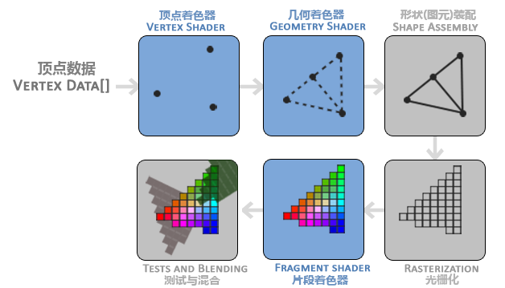
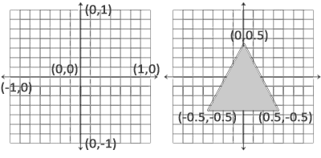
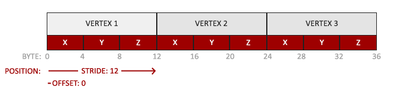
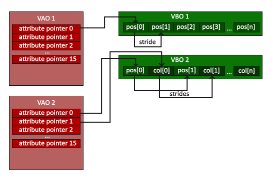
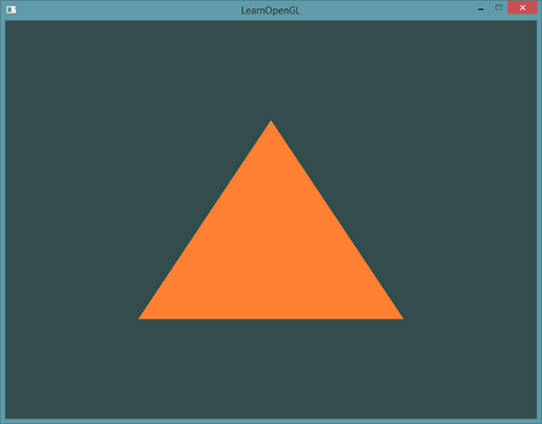
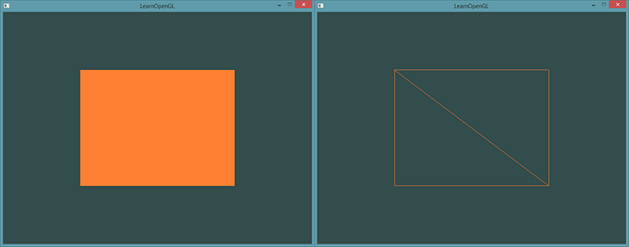

# 你好，三角形

| 项目 | 内容 |
| --- | --- |
| 原文 | [Hello Triangle](http://learnopengl.com/#!Getting-started/Hello-Triangle) |
| 作者 | JoeyDeVries |
| 来源 | LearnOpenGL-CN（本文基于其内容整理修订） |
| 本仓库示例 | `apps/01_getting_started/02_hello_triangle/` |

> **译注：**
>
> 在学习本节之前，建议先把下面三个单词记下来：
>
> - 顶点数组对象：Vertex Array Object，**VAO**
> - 顶点缓冲对象：Vertex Buffer Object，**VBO**
> - 元素缓冲对象：Element Buffer Object，**EBO**，又称索引缓冲对象（Index Buffer Object，IBO）
>
> 原文在指代这三个对象时，可能使用中文全称，也可能直接使用英文缩写，两者指的是同一个东西。中文全称之间没有英文那样的分词间隔，阅读时请留意。

**一句话核心：** 本节的目标只有一个——把第一个三角形画到屏幕上。为此我们需要理解 OpenGL 图形渲染管线的完整流程，并亲手配置顶点缓冲对象（VBO）、顶点数组对象（VAO）和着色器程序（Shader Program）这三样最基础的东西。

在 OpenGL 中，任何事物都在 3D 空间中，而屏幕和窗口却是 2D 像素数组，这导致 OpenGL 的大部分工作都是把 3D 坐标转变为适应你屏幕的 2D 像素。3D 坐标转为 2D 坐标的处理过程由 OpenGL 的**图形渲染管线**（Graphics Pipeline）管理。图形渲染管线可以划分为两个主要部分：第一部分把你的 3D 坐标转换为 2D 坐标，第二部分把 2D 坐标转变为实际的有颜色的像素。本教程会简单讨论图形渲染管线，以及如何利用它创建一些漂亮的像素。

> **重要：**
>
> 2D 坐标和像素是不同的：2D 坐标精确表示一个点在 2D 空间中的位置，而 2D 像素是这个位置的近似值，像素的精度受到屏幕/窗口分辨率的限制。

## 图形渲染管线

**一句话核心：** 图形渲染管线是「顶点数据 → 最终像素」的一整套流水线，其中顶点着色器和片段着色器两个阶段允许我们注入自定义程序（着色器），其余阶段由 GPU 固定完成。

图形渲染管线接受一组 3D 坐标，然后把它们转变为屏幕上的有色 2D 像素输出。管线可以划分为几个阶段，每个阶段把前一个阶段的输出作为输入。所有阶段都是高度专门化的（每个阶段都有特定的函数），并且很容易并行执行。正是由于它们具有并行执行的特性，当今大多数显卡都有成千上万个小处理核心，它们在 GPU 上为每一个管线阶段运行各自的小程序，从而快速处理你的数据。这些小程序叫做**着色器**（Shader）。

有些着色器可以由开发者配置，因为允许用自己写的着色器代替默认的，所以能够更细致地控制图形渲染管线中的特定部分。因为它们运行在 GPU 上，所以节省了宝贵的 CPU 时间。OpenGL 着色器用**OpenGL 着色器语言**（OpenGL Shading Language，**GLSL**）写成，我们会在下一节花更多时间研究它。

下图是图形渲染管线每个阶段的抽象展示。注意蓝色部分代表我们可以注入自定义着色器的部分：



> **职责边界：** 这张图很容易让人误以为「整个管线都是 OpenGL 负责的」，实际上各方分工不同：
>
> - **OpenGL 规范**规定管线有哪些阶段、每个阶段何时执行、输入输出是什么；
> - **显卡驱动**把规范翻译成 GPU 上的真实硬件指令，并编译我们写的 GLSL 着色器；
> - **应用程序（我们）**负责提供顶点数据、编写顶点/片段着色器、调用绘制命令；
> - 几何着色器等可选阶段使用 GPU 的默认实现，我们通常不用管。

下面用一张全景图把这节内容先立起来，后面的小节会逐个拆解：


首先，我们以数组的形式传递 3 个 3D 坐标作为图形渲染管线的输入，用来表示一个三角形，这个数组叫做**顶点数据**（Vertex Data）；顶点数据是一系列顶点的集合。一个**顶点**（Vertex）是一个 3D 坐标的数据集合，顶点数据用**顶点属性**（Vertex Attribute）表示，它可以包含任何我们想用的数据。简单起见，本节假定每个顶点只由一个 3D 位置和若干颜色值组成。

> **重要：**
>
> 为了让 OpenGL 知道这些坐标和颜色值构成的是什么，你需要指定这些数据所表示的渲染类型：是渲染成一系列的点、一系列三角形，还是仅仅一条长长的线？这些提示叫做**图元**（Primitive），任何一次绘制指令的调用都会把图元类型传给 OpenGL。常见的有 `GL_POINTS`、`GL_TRIANGLES`、`GL_LINE_STRIP`。

图形渲染管线的第一个部分是**顶点着色器**（Vertex Shader），它把一个单独的顶点作为输入。顶点着色器的主要目的有两个：把 3D 坐标转换为另一种 3D 坐标，以及允许我们对顶点属性进行一些基本处理。

顶点着色器阶段的输出可以选择性地传递给**几何着色器**（Geometry Shader）。几何着色器把一组顶点（已经形成图元）作为输入，并且能够通过发出新的顶点来形成新的（或其他）图元，从而生成其他形状。

**图元装配**（Primitive Assembly）阶段把顶点着色器（或几何着色器）输出的所有顶点作为输入（如果是 `GL_POINTS`，那么就是一个顶点），并把所有顶点装配成指定图元的形状；本节例子中是一个三角形。（原教程此处写「两个三角形」，是承接它上一段几何着色器「生成第二个三角形」的说法；中文版省略了那句后，这里与实际例子矛盾，故订正为「一个三角形」。）

图元装配阶段的输出会被传入**光栅化阶段**（Rasterization Stage），这里它把图元映射为最终屏幕上相应的像素，生成供片段着色器（Fragment Shader）使用的片段（Fragment）。在片段着色器运行之前还会执行**裁剪**（Clipping）：它发生在顶点着色器之后、光栅化之前，把超出裁剪体积（视锥体）的图元部分切掉，只保留可见区域生成片段，从而提升执行效率。（严格说，裁剪作用在**图元**上——被裁掉的部分根本不会生成片段，原教程「丢弃超出视图范围的所有像素」是粗略的说法。）

> **重要：**
>
> OpenGL 中的一个片段是 OpenGL 渲染一个像素所需的所有数据。

**片段着色器**的主要目的是计算一个像素的最终颜色，这也是所有 OpenGL 高级效果产生的地方。通常，片段着色器包含 3D 场景的数据（比如光照、阴影、光的颜色等等），这些数据可以用来计算最终像素的颜色。

在所有对应颜色值确定以后，最终的对象会被传到最后一个阶段：**深度/模板测试与混合**。混合真正发生之前，OpenGL 先用**深度测试**（和**模板测试**（Stencil），后面会讲）判断这个片段是在其它物体的前面还是后面，决定是否应该丢弃；通过测试的片段才进入**混合**（Blending）阶段，它检查 **alpha** 值（alpha 值定义了一个物体的透明度），并把新片段颜色与帧缓冲中已有的颜色**混合**（Blend）。（严格说，深度/模板测试是独立于混合的固定功能测试、发生在混合之前，原教程把它们笼统归在一个「Alpha 测试和混合」阶段里。）所以，即使在片段着色器中计算出了一个像素输出的颜色，在渲染多个三角形的时候最后的像素颜色也可能完全不同。

可以看到，图形渲染管线非常复杂，包含很多可配置的部分。然而，对于大多数场合，我们只需要配置顶点着色器和片段着色器就行了。几何着色器是可选的，通常使用它默认的着色器就可以了。

> **常见误解：** 有人以为「现代 OpenGL 自带默认着色器，不写也能画」。实际上在现代 OpenGL 中，我们**必须**定义至少一个顶点着色器和一个片段着色器（GPU 中没有默认的顶点/片段着色器）。这也是为什么刚学现代 OpenGL 时感觉很难——在你能够渲染出自己的第一个三角形之前，已经需要了解一大堆知识了。本节结束时你渲染出三角形的时候，也会了解到非常多的图形编程知识。

## 顶点输入

**一句话核心：** 顶点数据先以 `float` 数组的形式存在 CPU 侧，再通过顶点缓冲对象（VBO）一次性上传到 GPU 显存，之后 GPU 才能访问它。

开始绘制图形之前，我们需要先给 OpenGL 输入一些顶点数据。OpenGL 是一个 3D 图形库，所以我们在 OpenGL 中指定的所有坐标都是 3D 坐标（x、y 和 z）。OpenGL 不是简单地把**所有的** 3D 坐标变换为屏幕上的 2D 像素；OpenGL 仅当 3D 坐标在 3 个轴（x、y 和 z）上 -1.0 到 1.0 的范围内时才处理它。所有在这个范围内的坐标叫做**标准化设备坐标**（Normalized Device Coordinates，NDC），此范围内的坐标最终显示在屏幕上（在这个范围以外的坐标则不会显示）。

由于我们希望渲染一个三角形，一共要指定三个顶点，每个顶点都有一个 3D 位置。它们以标准化设备坐标的形式（OpenGL 的可见区域）定义。由于 OpenGL 是在 3D 空间中工作的，而我们渲染的是一个 2D 三角形，因此把每个顶点的 z 坐标都设置为 0.0，这样三角形每一点的深度都是一样的，看上去就像是 2D 的。

> **重要：**
>
> **标准化设备坐标（NDC）**
>
> 一旦顶点坐标在顶点着色器中处理过，它们就应该是标准化设备坐标了：一个 x、y 和 z 值都在 -1.0 到 1.0 之间的小空间。任何落在范围外的坐标都会被丢弃/裁剪，不会显示在屏幕上。下图是我们定义的位于标准化设备坐标中的三角形（忽略 z 轴）：
>
> 
>
> 与通常的屏幕坐标不同，NDC 的 y 轴正方向向上，(0, 0) 是这个坐标空间的中心，而不是左上角。最终你希望所有（变换过的）坐标都落在这个坐标空间中，否则它们就不可见了。
>
> 通过 `glViewport` 函数提供的数据进行**视口变换**（Viewport Transform），标准化设备坐标会变换为**屏幕空间坐标**（Screen-space Coordinates），所得的屏幕空间坐标又会被变换为片段输入到片段着色器中。

定义好顶点数据以后，我们要把它作为输入发送给图形渲染管线的第一个处理阶段：顶点着色器。OpenGL 会在 GPU 上创建内存用于储存顶点数据，还要配置 OpenGL 如何解释这些内存，并且指定如何发送给显卡。顶点着色器接着会处理内存中指定数量的顶点。

我们通过**顶点缓冲对象**（Vertex Buffer Objects，VBO）管理这个内存，它会在 GPU 内存（通常被称为显存）中储存大量顶点。使用这些缓冲对象的好处是我们可以一次性地发送一大批数据到显卡上，而不是每个顶点发送一次。从 CPU 把数据发送到显卡相对较慢，所以只要可能我们都要尽量一次性发送尽可能多的数据。当数据发送至显卡的内存中后，顶点着色器几乎能立即访问顶点，这是个非常快的过程。

### 本仓库示例中的 VBO 创建

顶点缓冲对象是我们在本教程中遇到的第一个 OpenGL 对象。和其他 OpenGL 对象一样，这个缓冲有一个独一无二的 ID，用 `glGenBuffers` 函数生成，再用 `glBindBuffer` 绑定到目标上，之后所有针对该目标的缓冲调用都会作用于当前绑定的缓冲。仓库示例 `apps/01_getting_started/02_hello_triangle/main.cpp` 中的做法如下（注意本仓库采用 C++23 风格：`snake_case` 命名、花括号初始化、`F`/`U` 字面量后缀、`nullptr` 代替 `NULL`）：

```c++
constexpr std::array<float, 9> vertices{
    -0.5F, -0.5F, 0.0F,
    0.5F, -0.5F, 0.0F,
    0.0F, 0.5F, 0.0F,
};

GLuint vertex_array_object{0};
GLuint vertex_buffer_object{0};

// OpenGL: VAO 记录“如何解释顶点缓冲”的状态，后续绘制只需重新绑定 VAO。
glGenVertexArrays(1, &vertex_array_object);

// OpenGL: VBO 是 GPU 侧缓冲区，本例用它保存三角形的三个顶点坐标。
glGenBuffers(1, &vertex_buffer_object);

glBindVertexArray(vertex_array_object);

glBindBuffer(GL_ARRAY_BUFFER, vertex_buffer_object);
glBufferData(
    GL_ARRAY_BUFFER,
    static_cast<GLsizeiptr>(vertices.size() * sizeof(float)),
    vertices.data(),
    GL_STATIC_DRAW);
```

这里的 `glBufferData` 是专门用来把用户定义的数据复制到当前绑定缓冲的函数：

- 第一个参数是目标缓冲的类型：顶点缓冲对象当前绑定到 `GL_ARRAY_BUFFER` 目标上。
- 第二个参数指定传输数据的大小（以字节为单位）；用 `vertices.size() * sizeof(float)` 计算总字节数，比原教程的 `sizeof(vertices)` 写法更符合 C++ 的习惯。
- 第三个参数是实际数据：`vertices.data()` 返回 `std::array` 的首元素指针。
- 第四个参数指定我们希望显卡如何管理给定的数据，有三种形式：

| 使用类型 | 含义 |
| --- | --- |
| `GL_STATIC_DRAW` | 数据只设置一次，之后使用很多次 |
| `GL_DYNAMIC_DRAW` | 数据会被反复修改，使用很多次 |

> **订正：** 早期版本的教程（以及多数中文译本，如 learnopengl-cn.github.io）把 `GL_STREAM_DRAW` 描述为"数据每次绘制时都会改变"——这与 OpenGL 规范相悖。规范的语义是"数据只设置一次、最多使用几次"（STREAM 指一次性写入、短暂使用的数据流，比如每帧重新生成的粒子位置）；"每次绘制都改变"的数据应使用 `GL_DYNAMIC_DRAW`（反复修改、使用很多次）。本表三行均按规范表述。

三角形的位置数据不会改变，每次渲染调用时都保持原样，所以它的使用类型最好是 `GL_STATIC_DRAW`。如果某个缓冲中的数据将被频繁修改，则使用 `GL_DYNAMIC_DRAW`，这样会提示显卡把数据放在适合高速写入的内存区域（注意：这些只是给驱动的性能提示，驱动不保证一定照做）。

> **进阶（缓冲使用提示与重新分配）：** **`GL_STATIC_DRAW`/`GL_DYNAMIC_DRAW` 只是给驱动的性能提示，不是硬性限制**：
>
> - 它们告诉驱动「数据会被修改多少次、使用多少次」，驱动据此决定把缓冲放在显存还是更适合高速写入的内存；标错不会报错，只是性能可能不理想。
> - 顶点数据通常「上传一次、使用很多次」，所以本节用 `GL_STATIC_DRAW`；如果每帧都要更新（比如粒子位置），就用 `GL_DYNAMIC_DRAW`。
> - 更新已有缓冲不要用 `glBufferData`——它会**重新分配**整块存储、作废旧数据；应改用 `glBufferSubData` 只覆盖部分字节，也可以先 `glBufferData` 重新分配再写入，让驱动丢弃旧存储，避免与新数据竞争。
> - 本示例三角形永远静止，数据只在初始化时上传一次，连 `glBufferSubData` 都用不上。

现在我们已经把顶点数据储存在显卡的内存中，用 VBO 这个顶点缓冲对象管理。下面创建一个顶点着色器和一个片段着色器来真正处理这些数据。

## 顶点着色器

**一句话核心：** 顶点着色器是管线的第一个可编程阶段，逐顶点执行：读入一个顶点的属性（这里是位置 `a_pos`），输出该顶点变换后的位置 `gl_Position`。

顶点着色器是几个可编程着色器中的一个。如果打算做渲染的话，现代 OpenGL 要求我们至少设置一个顶点着色器和一个片段着色器。我们需要做的第一件事是用 GLSL 编写顶点着色器，然后编译它，这样我们才能在程序中使用它。

仓库示例把两个着色器的源码用 C++ 原始字符串字面量内嵌在 `main.cpp` 顶部的匿名命名空间中，顶点着色器如下（GLSL 属性前缀 `a_` 是仓库约定）：

```c++
constexpr const char* vertex_shader_source{R"glsl(
#version 330 core
layout (location = 0) in vec3 a_pos;

void main()
{
    gl_Position = vec4(a_pos, 1.0);
}
)glsl"};
```

可以看到，GLSL 看起来很像 C 语言。每个着色器都起始于一个版本声明：`#version 330 core` 表示使用 OpenGL 3.3 对应的 GLSL 330 版本，并明确使用核心模式（Core Profile）。

接下来用 `in` 关键字声明顶点着色器的输入顶点属性。现在我们只关心位置数据，所以只需要一个顶点属性。GLSL 有包含 1 到 4 个 `float` 分量的向量数据类型，分量的数量可以从后缀数字看出来。由于每个顶点都有一个 3D 坐标，我们创建一个 `vec3` 输入变量 `a_pos`，并通过 `layout (location = 0)` 设定输入变量的位置值（Location）。后面你会看到为什么需要这个位置值。

为了设置顶点着色器的输出，我们必须把位置数据赋值给预定义的 `gl_Position` 变量，它在幕后是 `vec4` 类型。在 `main` 函数最后，`gl_Position` 被设置的值会成为该顶点着色器的输出。由于输入是 3 分量的向量，必须把它转换为 4 分量：把 `vec3` 数据作为 `vec4` 构造器的参数，同时把 `w` 分量设置为 `1.0`（关于 `w` 分量和透视除法，后面的教程会详细讨论）。

> **重要：**
>
> **向量（Vector）**
>
> 图形编程中我们经常使用向量这个数学概念，因为它简明地表达了任意空间中的位置和方向，并且有非常有用的数学属性。GLSL 中一个向量最多有 4 个分量，每个分量值都代表空间中的一个坐标，可以通过 `vec.x`、`vec.y`、`vec.z` 和 `vec.w` 获取。注意 `vec.w` 分量不是用来表达空间中的位置的（我们处理的是 3D 不是 4D），而是用在所谓透视除法（Perspective Division）上，后面的教程会详细讨论。

这个顶点着色器可能是我们能想到的最简单的顶点着色器了，因为我们对输入数据什么都没处理就把它传到了着色器的输出。在真实的程序里输入数据通常都不是标准化设备坐标，所以我们首先必须把它们转换至 OpenGL 的可视区域内——这正是后面「变换」与「坐标系」两节要解决的事情。

## 编译着色器

**一句话核心：** 着色器源码只是字符串，必须由显卡驱动在运行时编译成 GPU 机器码；`compile_shader` 这个辅助函数把「创建 → 传源码 → 编译 → 查错」四步封装成一次调用。

为了让 OpenGL 能够使用着色器，我们必须在运行时动态编译它的源码。编译的第一步是创建着色器对象，注意还是用 ID 来引用：用 `glCreateShader` 创建，把着色器类型（`GL_VERTEX_SHADER` 或 `GL_FRAGMENT_SHADER`）作为参数传入；然后用 `glShaderSource` 把源码字符串附加到着色器对象上；最后用 `glCompileShader` 编译它。

编译很可能失败，所以我们应当检测编译是否成功，并读取错误日志。仓库示例把「编译 + 查错 + 失败清理」封装在匿名命名空间的 `compile_shader` 辅助函数里：

```c++
GLuint compile_shader(GLenum shader_type, const char* source) {
    // OpenGL: glCreateShader 只创建一个“着色器对象”句柄，还没有源码和机器码。
    const GLuint shader{glCreateShader(shader_type)};

    // OpenGL: glShaderSource 把 CPU 侧字符串交给驱动；真正编译发生在 glCompileShader。
    glShaderSource(shader, 1, &source, nullptr);
    glCompileShader(shader);

    GLint success{GL_FALSE};
    glGetShaderiv(shader, GL_COMPILE_STATUS, &success);
    if (success == GL_TRUE) {
        return shader;
    }

    std::array<char, 1024> info_log{};
    glGetShaderInfoLog(shader, static_cast<GLsizei>(info_log.size()), nullptr, info_log.data());
    std::cerr << "Failed to compile shader:\n" << info_log.data() << '\n';
    glDeleteShader(shader);
    return 0U;
}
```

> **分层解释：** 这里的「编译」和你平时用编译器编译 C++ 不完全一样。GLSL 源码 → GPU 机器码这一过程由**显卡驱动**实现：驱动内含一个 GLSL 编译器，`glCompileShader` 就是触发它的入口。OpenGL 规范只规定「必须提供编译接口和错误查询接口」，不规定编译器的实现细节。因此同一段 GLSL 在不同厂商驱动上的报错信息可能不同，但接口行为是一致的。

`glGetShaderiv(shader, GL_COMPILE_STATUS, &success)` 查询编译状态：如果 `success` 不是 `GL_TRUE`，就用 `glGetShaderInfoLog` 取回错误消息（存放在栈上的 `std::array<char, 1024> info_log` 中），打印后 `glDeleteShader` 清理对象并返回 `0U`；调用方据此提前退出，避免带着坏着色器继续运行。

## 片段着色器

**一句话核心：** 片段着色器逐片段（大致可理解为逐像素）执行，计算每个片段的最终颜色；本节只输出一个固定颜色。

片段着色器是第二个也是最后一个我们打算创建的用于渲染三角形的着色器，它计算像素最后的颜色输出。为了让事情更简单，我们的片段着色器将一直输出一种橙红色。仓库示例的片段着色器源码同样内嵌在匿名命名空间中：

```c++
constexpr const char* fragment_shader_source{R"glsl(
#version 330 core
out vec4 frag_color;

void main()
{
    frag_color = vec4(1.0, 0.45, 0.20, 1.0);
}
)glsl"};
```

片段着色器只需要一个输出变量，这个变量是一个 4 分量向量，表示最终的输出颜色，我们应该自己计算出来。声明输出变量使用 `out` 关键字，这里命名为 `frag_color`。下面把一个 alpha 值为 1.0（1.0 代表完全不透明）的橙红色 `vec4` 赋值给颜色输出。

> **重要：**
>
> 在计算机图形中，颜色被表示为 4 个元素的数组：红色、绿色、蓝色和 alpha（透明度）分量，通常缩写为 RGBA。在 OpenGL 或 GLSL 中定义颜色时，把每个分量的强度设置在 0.0 到 1.0 之间。比如红色设为 1.0、绿色设为 1.0，两者混合就会得到黄色。三种颜色分量的不同调配可以生成超过 1600 万种不同的颜色！

编译片段着色器的过程与顶点着色器类似，只不过使用 `GL_FRAGMENT_SHADER` 常量作为着色器类型，`compile_shader` 辅助函数对两个阶段都适用。

## 着色器程序

**一句话核心：** 单独的着色器对象不能直接使用，必须把顶点着色器和片段着色器**链接**成一个着色器程序（Shader Program），绘制时激活程序，两个阶段才会一起执行。

着色器程序对象是多个着色器合并之后、最终链接完成的版本。如果要使用刚才编译的着色器，我们必须把它们**链接**为一个着色器程序对象，然后在渲染对象的时候激活它。已激活着色器程序的着色器将在我们发送渲染调用的时候被使用。链接着色器至一个程序时，程序会把每个着色器的输出链接到下一个着色器的输入；当输出和输入不匹配的时候，你会得到一个链接错误。

仓库示例把「编译两个阶段 → 创建程序 → 附加 → 链接 → 查错 → 删除着色器对象」封装成 `create_shader_program`：

```c++
GLuint create_shader_program() {
    const GLuint vertex_shader{compile_shader(GL_VERTEX_SHADER, vertex_shader_source)};
    if (vertex_shader == 0U) {
        return 0U;
    }

    const GLuint fragment_shader{compile_shader(GL_FRAGMENT_SHADER, fragment_shader_source)};
    if (fragment_shader == 0U) {
        glDeleteShader(vertex_shader);
        return 0U;
    }

    // OpenGL: Program 是多个 shader stage 链接后的可执行 GPU 程序。
    const GLuint shader_program{glCreateProgram()};
    glAttachShader(shader_program, vertex_shader);
    glAttachShader(shader_program, fragment_shader);
    glLinkProgram(shader_program);

    glDeleteShader(vertex_shader);
    glDeleteShader(fragment_shader);

    GLint success{GL_FALSE};
    glGetProgramiv(shader_program, GL_LINK_STATUS, &success);
    if (success == GL_TRUE) {
        return shader_program;
    }

    std::array<char, 1024> info_log{};
    glGetProgramInfoLog(
        shader_program, static_cast<GLsizei>(info_log.size()), nullptr, info_log.data());
    std::cerr << "Failed to link shader program:\n" << info_log.data() << '\n';
    glDeleteProgram(shader_program);
    return 0U;
}
```

> **重要：**
>
> 就像着色器的编译一样，链接也可能失败，我们可以检测链接是否成功并获取日志。与编译不同，链接使用 `glGetProgramiv(shaderProgram, GL_LINK_STATUS, &success)` 查询状态、用 `glGetProgramInfoLog` 取日志，而不是 `glGetShaderiv`/`glGetShaderInfoLog`。上面示例中的错误处理正是这样做的。

注意两个细节：其一，`glAttachShader` 之后、链接完成之后，单独的着色器对象已经不再需要，可以立刻 `glDeleteShader` 删除——程序内部已经保留了链接所需的执行结果；其二，拿到程序对象之后，用 `glUseProgram(shaderProgram)` 激活它，之后的每个着色器调用和渲染调用都会使用这个程序对象。

## 链接顶点属性

**一句话核心：** VBO 里的顶点数据只是一串字节，`glVertexAttribPointer` 负责告诉 OpenGL「第 N 个顶点属性从缓冲区哪里开始、每个分量多大、每隔多少字节取下一个」，`glEnableVertexAttribArray` 再启用它。

现在，我们已经把输入顶点数据发送给了 GPU，并指示了 GPU 如何在顶点和片段着色器中处理它。但 OpenGL 还不知道该如何解释内存中的顶点数据，以及如何把顶点数据链接到顶点着色器的属性上。我们需要告诉 OpenGL 怎么做。

我们的顶点缓冲数据会被解析为下面这样子：



- 位置数据被储存为 32 位（4 字节）浮点值。
- 每个位置包含 3 个这样的值。
- 在这 3 个值之间没有空隙（或其他值），几个值在数组中**紧密排列**（Tightly Packed）。
- 数据中第一个值在缓冲开始的位置。

有了这些信息，就可以用 `glVertexAttribPointer` 告诉 OpenGL 该如何解析顶点数据（应用到逐个顶点属性上）。仓库示例中的写法如下（`location = 0` 对应顶点着色器里的 `a_pos`）：

```c++
constexpr GLsizei vertex_stride{3 * static_cast<GLsizei>(sizeof(float))};

// OpenGL: location = 0 对应顶点着色器里的 a_pos。
// 每个顶点由 3 个 float 组成，不需要归一化，数据从当前绑定的 GL_ARRAY_BUFFER 读取。
glVertexAttribPointer(0, 3, GL_FLOAT, GL_FALSE, vertex_stride, nullptr);
glEnableVertexAttribArray(0);
```

`glVertexAttribPointer` 的参数非常多，逐一介绍：

- 第一个参数指定要配置的顶点属性。还记得顶点着色器中 `layout (location = 0)` 定义的 `a_pos` 吗？它把顶点属性的位置值设置为 `0`。因为我们希望把数据传递到这个顶点属性中，所以这里传入 `0`。
- 第二个参数指定顶点属性的大小。顶点属性是一个 `vec3`，由 3 个值组成，所以大小是 3。
- 第三个参数指定数据的类型，这里是 `GL_FLOAT`（GLSL 中 `vec*` 都是由浮点数值组成的）。
- 下个参数定义我们是否希望数据被标准化（Normalize）。如果输入的是整型数据（int、byte 等）且这里设为 `GL_TRUE`，整数在转换为 float 时会被归一化到 0（有符号类型为 -1）到 1 之间；对 float 数据没有影响。我们输入的是 float，所以把它设置为 `GL_FALSE`。
- 第五个参数叫做**步长**（Stride），它告诉 OpenGL 在连续的顶点属性组之间的间隔。由于下一个组的位置数据在 3 个 `float` 之后，步长设置为 `3 * sizeof(float)`。注意，由于我们知道这个数组是紧密排列的（两个顶点属性之间没有空隙），也可以设置为 0 来让 OpenGL 自行决定步长（只有数据紧密排列时才可用）。一旦有更多的顶点属性，就必须更小心地定义每个顶点属性之间的间隔——下一节「着色器」会看到具体例子。
- 最后一个参数的类型是 `void*`，表示位置数据在缓冲中起始位置的**偏移量**（Offset）。由于位置数据在数组开头，这里是 `nullptr`（即 0）。后面章节会有非零偏移的例子。

> **重要：**
>
> 每个顶点属性从一个 VBO 管理的内存中获得数据，而具体是从哪个 VBO（程序中可以有多个 VBO）获取，由调用 `glVertexAttribPointer` 时绑定到 `GL_ARRAY_BUFFER` 的 VBO 决定。由于调用前绑定的是先前定义的 VBO 对象，顶点属性 `0` 现在会链接到它的顶点数据。

配置完解析方式后，用 `glEnableVertexAttribArray`（以顶点属性位置值作为参数）启用顶点属性——顶点属性默认是禁用的。

> **常见误解：** 有人以为 `glVertexAttribPointer` 会把数据「复制」到某个地方，所以之后修改 `vertices` 数组会影响绘制。实际上它只是登记「如何解释」的元数据，数据本体已经在 `glBufferData` 时驻留在 GPU 显存里了。VAO 记录的正是这些解释规则。

## 顶点数组对象

**一句话核心：** VAO 是「顶点属性配置」的收纳盒：把 `glEnableVertexAttribArray`、`glVertexAttribPointer` 以及关联的 VBO 绑定全部存进一个对象，之后每次绘制只需绑定 VAO，一次配置、反复使用。

每次绘制一个物体时都重复「绑定缓冲、配置属性指针」这一过程，看起来不多，但如果有超过 5 个顶点属性、上百个不同物体呢？绑定正确的缓冲对象、为每个物体配置所有顶点属性，很快就会变成一件麻烦事。有没有方法把所有这些状态配置储存在一个对象中，并且通过绑定这个对象来恢复状态呢？

**顶点数组对象**（Vertex Array Object，VAO）可以像顶点缓冲对象那样被绑定，任何随后的顶点属性调用都会储存在这个 VAO 中。这样当配置顶点属性指针时，只需要执行一次，之后再绘制物体时只需绑定相应的 VAO 就行了。这使在不同顶点数据和属性配置之间切换变得非常简单。

> **注意：**
>
> OpenGL 的核心模式**要求**我们使用 VAO，所以它才知道该如何处理顶点输入。如果绑定 VAO 失败，OpenGL 会拒绝绘制任何东西。

一个顶点数组对象会储存以下内容：

- `glEnableVertexAttribArray` 和 `glDisableVertexAttribArray` 的调用。
- 通过 `glVertexAttribPointer` 设置的顶点属性配置。
- 通过 `glVertexAttribPointer` 调用与顶点属性关联的顶点缓冲对象。



创建一个 VAO 和创建一个 VBO 很类似（`glGenVertexArrays`），然后绑定它（`glBindVertexArray`）。绑定之后，再绑定和配置对应的 VBO 与属性指针，这些配置就会记录进 VAO；绘制时只需在绘制前绑定对应的 VAO。仓库示例中「生成 VBO → 绑定 VAO → 绑定 VBO → 上传数据 → 配置属性 → 解绑」的完整初始化如下：

```c++
GLuint vertex_array_object{0};
GLuint vertex_buffer_object{0};

// OpenGL: VAO 记录“如何解释顶点缓冲”的状态，后续绘制只需重新绑定 VAO。
glGenVertexArrays(1, &vertex_array_object);

// OpenGL: VBO 是 GPU 侧缓冲区，本例用它保存三角形的三个顶点坐标。
glGenBuffers(1, &vertex_buffer_object);

glBindVertexArray(vertex_array_object);
glBindBuffer(GL_ARRAY_BUFFER, vertex_buffer_object);
glBufferData(
    GL_ARRAY_BUFFER,
    static_cast<GLsizeiptr>(vertices.size() * sizeof(float)),
    vertices.data(),
    GL_STATIC_DRAW);

constexpr GLsizei vertex_stride{3 * static_cast<GLsizei>(sizeof(float))};

// OpenGL: location = 0 对应顶点着色器里的 a_pos。
// 每个顶点由 3 个 float 组成，不需要归一化，数据从当前绑定的 GL_ARRAY_BUFFER 读取。
glVertexAttribPointer(0, 3, GL_FLOAT, GL_FALSE, vertex_stride, nullptr);
glEnableVertexAttribArray(0);

glBindBuffer(GL_ARRAY_BUFFER, 0);
glBindVertexArray(0);
```

注意顺序：先绑定 VAO，再绑定 VBO 并上传数据，然后配置属性指针并启用，最后把 `GL_ARRAY_BUFFER` 和 VAO 都解绑（`glBindBuffer(GL_ARRAY_BUFFER, 0)`、`glBindVertexArray(0)`）。所有顶点属性配置都已记录在 VAO 中，之后的绘制循环只需要重新绑定 VAO 即可。

> **进阶（VAO 到底保存了什么）：** **VAO 保存的是「顶点属性指针状态」的完整快照，而不是顶点数据本身**：
>
> - `glVertexAttribPointer` 调用时会把当时的 `GL_ARRAY_BUFFER` 绑定一并记进 VAO——「属性 0 从哪个 VBO 读数据」在那一刻就定死了，之后换绑别的 VBO 也不会改变它的数据来源。
> - VAO 还记录每个属性的启用/禁用状态（`glEnableVertexAttribArray`/`glDisableVertexAttribArray`）、属性格式（分量数、类型、步长、偏移、归一化），以及绑定到 `GL_ELEMENT_ARRAY_BUFFER` 的 EBO。
> - 核心模式下绘制前必须绑定 VAO：不绑定就调用 `glDrawArrays`/`glDrawElements` 会报 `GL_INVALID_OPERATION`（不同驱动也可能表现为直接不绘制）。
> - 本仓库在初始化阶段一次性配好 VAO，渲染循环里只靠 `glBindVertexArray(vertex_array_object)` 一行恢复全部状态；「练习」第 2 题让两个三角形各用一套 VAO/VBO，正是为了体会「绑定哪个 VAO 就按哪套配置绘制」。

## 我们一直期待的三角形

**一句话核心：** `glDrawArrays` 是真正的「开火」命令——它读取当前 VAO 记录的顶点配置和 VBO 里的数据，把顶点送入管线，绘出图元。

要想绘制我们想要的物体，OpenGL 提供 `glDrawArrays` 函数，它使用当前激活的着色器、之前定义的顶点属性配置，以及 VBO 的顶点数据（通过 VAO 间接绑定）来绘制图元。仓库示例的渲染循环（渲染循环是每帧都执行的，包括输入处理、清屏、绘制、交换缓冲）：

```c++
while (glfwWindowShouldClose(window) == GLFW_FALSE) {
    process_input(window);

    glClearColor(0.10F, 0.12F, 0.16F, 1.0F);
    glClear(GL_COLOR_BUFFER_BIT);

    // OpenGL: glUseProgram 让后续 draw call 使用这个已链接的 GPU 程序。
    glUseProgram(shader_program);
    glBindVertexArray(vertex_array_object);

    // OpenGL: 当前 VAO 中有 3 个顶点，GL_TRIANGLES 表示每 3 个顶点组成一个三角形。
    glDrawArrays(GL_TRIANGLES, 0, 3);

    glfwSwapBuffers(window);
    glfwPollEvents();
}
```

`glDrawArrays` 函数第一个参数是我们打算绘制的 OpenGL 图元类型。由于我们希望绘制的是一个三角形，这里传 `GL_TRIANGLES`。第二个参数指定顶点数组的起始索引，这里填 `0`。最后一个参数指定我们打算绘制多少个顶点，这里是 `3`（只从数据中渲染一个三角形，它只有 3 个顶点长）。

> **分层解释：** 请把渲染循环里的两个函数区分开——`glClearColor` 是**状态设置**，它只是把「清屏颜色」写进 OpenGL 的状态机，本身不产生任何像素；`glClear(GL_COLOR_BUFFER_BIT)` 才是**状态使用**，它按照当前状态机里的清屏颜色实际填充帧缓冲。这个「先设置状态、后触发操作」的模式贯穿整个 OpenGL，后面所有的绘制调用都遵循它。

现在尝试编译代码，如果弹出了任何错误，回头检查代码。如果编译通过，你应该看到下面的结果：



如果你的输出和这个看起来不一样，你可能做错了什么，去查看一下源码，检查是否遗漏了什么东西。

## 元素缓冲对象

**一句话核心：** 绘制矩形等形状时，相邻三角形会共享顶点；元素缓冲对象（EBO）让我们只储存一次顶点、用索引数组描述绘制顺序，避免重复顶点带来的浪费。

在渲染顶点这一话题上我们还有最后一个需要讨论的东西——元素缓冲对象（Element Buffer Object，EBO），也叫索引缓冲对象（Index Buffer Object，IBO）。解释元素缓冲对象的工作方式最好举个例子：假设我们不再绘制一个三角形而是绘制一个矩形。我们可以绘制两个三角形来组成一个矩形（OpenGL 主要处理三角形）。如果不用索引，需要指定 6 个顶点，其中「右下角」和「左上角」会被重复指定两次！一个矩形只有 4 个而不是 6 个顶点，这样就产生 50% 的额外开销。当模型包含上千个三角形时，这个问题会更糟糕。

更好的解决方案是只储存不同的顶点，并设定绘制这些顶点的顺序：只需要储存 4 个顶点就能绘制矩形，之后指定绘制顺序即可。元素缓冲对象正是这样工作的：EBO 是一个缓冲区，像 VBO 一样储存 OpenGL 用来决定要绘制哪些顶点的索引。这种**索引绘制**（Indexed Drawing）就是问题的解决方案。

仓库中的 `apps/01_getting_started/04_textures/main.cpp` 示例（下一节「纹理」的主角）展示了 EBO 的完整用法：先定义 4 个不重复的顶点和 6 个索引（两个三角形），再把索引上传到绑定在 `GL_ELEMENT_ARRAY_BUFFER` 目标上的 EBO：

```c++
constexpr std::array<unsigned int, 6> indices{
    0U, 1U, 3U,
    1U, 2U, 3U,
};
```

```c++
// OpenGL: EBO 保存顶点索引，让两个三角形可以复用矩形的四个顶点。
glBindBuffer(GL_ELEMENT_ARRAY_BUFFER, element_buffer_object);
glBufferData(
    GL_ELEMENT_ARRAY_BUFFER,
    static_cast<GLsizeiptr>(indices.size() * sizeof(unsigned int)),
    indices.data(),
    GL_STATIC_DRAW);
```

最后把 `glDrawArrays` 换成 `glDrawElements`，它会使用当前绑定到 `GL_ELEMENT_ARRAY_BUFFER` 目标的 EBO 中的索引进行绘制：

```c++
// OpenGL: 索引绘制会读取当前 VAO 记录的 GL_ELEMENT_ARRAY_BUFFER。
glDrawElements(
    GL_TRIANGLES, static_cast<GLsizei>(indices.size()), GL_UNSIGNED_INT, nullptr);
```

`glDrawElements` 第一个参数指定绘制模式，和 `glDrawArrays` 一样；第二个参数是要绘制的顶点个数，这里用 `indices.size()`（即 6）；第三个参数是索引的类型，这里是 `GL_UNSIGNED_INT`；最后一个参数可以指定 EBO 中的偏移量，这里填 `nullptr`（即 0）。

> **注意：**
>
> 当目标是 `GL_ELEMENT_ARRAY_BUFFER` 时，VAO 会储存 `glBindBuffer` 的调用，也就是说 EBO 的绑定关系也记在 VAO 里。同样，它也记录解绑调用——所以确保不要在解绑 VAO 之前解绑索引缓冲，否则 VAO 里就没有这个 EBO 配置了。

> **进阶（glDrawArrays vs glDrawElements）：** **两者都按「当前 VAO 记录的配置」取数，区别只在顶点怎么来**：
>
> - `glDrawArrays` 按「起始顶点 + 顶点个数」从顶点属性缓冲里顺序取顶点：相邻三角形共享的顶点要重复储存，网格越复杂浪费越多。
> - `glDrawElements` 额外读取索引缓冲（EBO）：顶点只存一份，绘制顺序由索引决定，共用顶点零重复。
> - 性能上两者都很快，但索引绘制能让 GPU 的顶点缓存复用已处理过的顶点，实际项目中复杂网格几乎都用 `glDrawElements`。
> - 本仓库三角形用 `glDrawArrays(GL_TRIANGLES, 0, 3)`，矩形（`04_textures` 示例）改用 `glDrawElements`——4 个顶点被 6 个索引复用，正好对应本节的 EBO 讲解。

运行上面的索引绘制程序，会得到下面的图片：左侧是普通的填充模式，右侧是使用**线框模式**（Wireframe Mode）绘制的，可以清楚看到矩形确实由两个三角形组成：



> **重要：**
>
> **线框模式（Wireframe Mode）**
>
> 用 `glPolygonMode(GL_FRONT_AND_BACK, GL_LINE)` 配置 OpenGL 如何绘制图元：第一个参数表示应用到所有三角形的正面和背面，第二个参数告诉 OpenGL 用线来绘制。之后的绘制调用会一直以线框模式绘制三角形，直到用 `glPolygonMode(GL_FRONT_AND_BACK, GL_FILL)` 将其设置回默认模式。

如果你像我一样成功绘制出了这个三角形或矩形，那么恭喜你，你成功通过了现代 OpenGL 最难的部分之一：绘制你自己的第一个三角形。这部分很难，因为在绘制第一个三角形之前你需要了解很多知识。幸运的是我们现在已经越过了这个障碍，接下来的教程会比较容易理解一些。

## 附加资源

- [antongerdelan.net/hellotriangle](http://antongerdelan.net/opengl/hellotriangle.html)：Anton Gerdelan 的渲染第一个三角形教程。
- [open.gl/drawing](https://open.gl/drawing)：Alexander Overvoorde 的渲染第一个三角形教程。
- [antongerdelan.net/vertexbuffers](http://antongerdelan.net/opengl/vertexbuffers.html)：顶点缓冲对象的一些深入探讨。
- [调试](https://learnopengl.com/#!In-Practice/Debugging)：本节涉及很多步骤，如果卡住了，阅读调试教程（读到调试输出部分即可）非常值得。

## 练习

为了更好掌握上述概念，这里有一些练习，建议在继续下一节之前完成：

1. 添加更多顶点到数据中，使用 `glDrawArrays`，尝试绘制两个彼此相连的三角形。
2. 创建相同的两个三角形，但对它们的数据使用不同的 VAO 和 VBO。
3. 创建两个着色器程序，第二个程序使用一个不同的片段着色器（比如输出黄色）；再次绘制这两个三角形，让其中一个输出为黄色。

## 本仓库示例

本节对应的仓库示例位于 `apps/01_getting_started/02_hello_triangle/`，只有一个 `main.cpp` 文件。它与本节的讲解一一对应：

- 文件顶部的匿名命名空间中内嵌了两个 GLSL 源码常量 `vertex_shader_source`、`fragment_shader_source`，以及三个辅助函数：
  - `framebuffer_size_callback`：窗口尺寸变化时同步视口；
  - `process_input`：每帧查询键盘，检测到 Esc 时请求关闭窗口；
  - `compile_shader`：编译单个 GLSL 着色器并查错；
  - `create_shader_program`：编译两个阶段并链接成着色器程序。
- `main()` 中的流程为：初始化 GLFW → 创建窗口与 OpenGL 上下文 → 初始化 GLAD → 创建着色器程序 → 生成 VAO/VBO 并上传顶点 → 进入渲染循环（`glDrawArrays` 绘制三角形）→ 退出时删除资源。

构建并运行（以 MinGW GCC Debug preset 为例，需要先确保 `ucrt64/bin` 在 PATH 中）：

```powershell
conan install . -of build/mingw-gcc-debug -pr:h conan/profiles/mingw-gcc -pr:b conan/profiles/mingw-gcc -s build_type=Debug --build=missing
cmake --preset mingw-gcc-debug
cmake --build --preset mingw-gcc-debug
```

```powershell
.\build\mingw-gcc-debug\apps\01_getting_started\02_hello_triangle\01_getting_started__02_hello_triangle.exe
```

运行时交互：按 Esc（退出键）退出程序。本示例还没有相机控制，WASD/鼠标/滚轮等交互从后面的示例逐步引入。

## 本章整体回顾

把本节放在整个「入门」章节的学习路径里看：


- 前几节解决了「怎么把窗口和 OpenGL 上下文建起来、怎么画一个纯色窗口」——那是**环境问题**；
- 本节解决「怎么把数据变成图形」——这是**数据与管线问题**：VBO 装数据、VAO 记配置、着色器程序描述怎么处理、`glDrawArrays`/`glDrawElements` 触发绘制；
- 之后的「着色器」节会把注意力从「搭建」转向「编程」：学会用 GLSL 控制颜色、在着色器之间传数据；「纹理」节则给几何体穿上图片的外衣。

本节最关键的心智模型是：**OpenGL 是一个巨大的状态机**。我们做的每一件事（绑定缓冲、绑定 VAO、激活程序、设置清屏颜色）都是在改状态，而 `glDrawArrays`/`glClear` 这类调用才是真正按当前状态「执行」。理解了这一点，后面所有章节都只是在往状态机里加入更多种类的状态（深度测试、纹理单元、变换矩阵……）。

下一节我们将深入 GLSL，学习如何编写更灵活的着色器，并在着色器之间传递数据。

[下一节：着色器](05_shaders.md)
