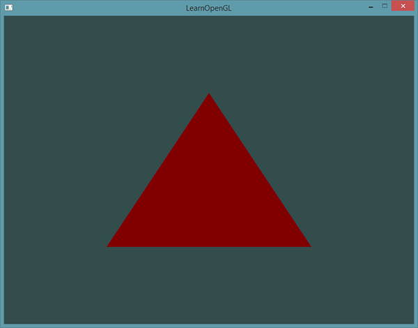
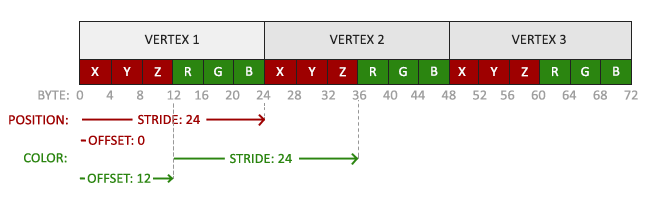
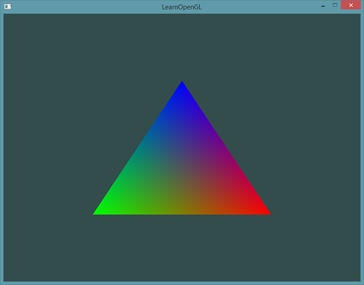

# 着色器

| 项目 | 内容 |
| --- | --- |
| 原文 | [Shaders](http://learnopengl.com/#!Getting-started/Shaders) |
| 作者 | JoeyDeVries |
| 来源 | LearnOpenGL-CN（本文基于其内容整理修订） |
| 本仓库示例 | `apps/01_getting_started/03_shaders/` |

在「你好，三角形」教程中提到，着色器（Shader）是运行在 GPU 上的小程序。这些小程序为图形渲染管线的某个特定部分而运行。从基本意义上来说，着色器只是一种把输入转化为输出的程序。着色器也是非常独立的程序，因为它们之间不能相互通信；它们之间唯一的沟通只能通过输入和输出。

前面的教程里我们简要触及了一点着色器的皮毛，并了解了如何恰当地使用它们。现在我们会用一种更加广泛的形式详细解释着色器，特别是 OpenGL 着色器语言（GLSL）。

**一句话核心：** 着色器是「运行在 GPU 上的小型程序」：输入数据，经过程序内部处理，输出数据；同一个着色器会在 GPU 的成千上万个核心上并行执行，分别处理不同的顶点或片段。

## GLSL

**一句话核心：** GLSL 是一种为图形计算定制的类 C 语言，着色器以 `#version` 开头，由输入变量、输出变量、uniform 和 `main` 函数组成。

着色器使用一种叫 GLSL 的类 C 语言写成。GLSL 是为图形计算量身定制的，包含一些针对向量和矩阵操作的有用特性。

着色器的开头总是要声明版本，接着是输入和输出变量、uniform 和 `main` 函数。每个着色器的入口点都是 `main` 函数，在这个函数中我们处理所有的输入变量，并将结果输出到输出变量中。如果你不知道什么是 uniform 也不用担心，我们后面会进行讲解。

一个典型的着色器有下面的结构：

```glsl
#version version_number
in type in_variable_name;
in type in_variable_name;

out type out_variable_name;

uniform type uniform_name;

void main()
{
  // 处理输入并进行一些图形操作
  ...
  // 输出处理过的结果到输出变量
  out_variable_name = weird_stuff_we_processed;
}
```

当我们特别谈论到顶点着色器的时候，每个输入变量也叫**顶点属性**（Vertex Attribute）。我们能声明的顶点属性是有上限的，它一般由硬件决定。OpenGL 确保至少有 16 个包含 4 分量的顶点属性可用，但是有些硬件或许允许更多的顶点属性，你可以查询 `GL_MAX_VERTEX_ATTRIBS` 来获取具体的上限：

```c++
int nrAttributes;
glGetIntegerv(GL_MAX_VERTEX_ATTRIBS, &nrAttributes);
std::cout << "Maximum nr of vertex attributes supported: " << nrAttributes << std::endl;
```

通常情况下它至少会返回 16 个，大部分情况下是够用了。

> **职责边界：** 顶点属性的上限不是 OpenGL 规范写死的数字，而是**硬件能力**。OpenGL 规范只保证「至少 16 个」，具体数值由显卡驱动通过 `glGetIntegerv` 上报。这也是 OpenGL「规范 + 驱动实现」分层的一个典型例子：程序只调用查询接口，具体能力查询由驱动回答。

## 数据类型

和其他编程语言一样，GLSL 有数据类型可以指定变量的种类。GLSL 包含 C 等其它语言大部分的默认基础数据类型：`int`、`float`、`double`、`uint` 和 `bool`。GLSL 也有两种容器类型，它们会在这个教程中使用很多，分别是向量（Vector）和矩阵（Matrix），其中矩阵我们会在之后的教程里再讨论。

### 向量

**一句话核心：** 向量是 GLSL 最重要的数据类型——一个容器装下 2 到 4 个同类型分量，可以用 `.x/.y/.z/.w`、`.r/.g/.b/.a` 或 `.s/.t/.p/.q` 三种方式访问。

GLSL 中的向量是一个可以包含 2、3 或 4 个分量的容器，分量的类型可以是前面默认基础类型的任意一个。它们可以是下面的形式（`n` 代表分量的数量）：

| 类型 | 含义 |
| --- | --- |
| `vecn` | 包含 `n` 个 float 分量的默认向量 |
| `bvecn` | 包含 `n` 个 bool 分量的向量 |
| `ivecn` | 包含 `n` 个 int 分量的向量 |
| `uvecn` | 包含 `n` 个 unsigned int 分量的向量 |
| `dvecn` | 包含 `n` 个 double 分量的向量 |

大多数时候我们使用 `vecn`，因为 float 足够满足大多数要求了。

一个向量的分量可以通过 `vec.x` 这种方式获取，`x` 指这个向量的第一个分量。你可以分别使用 `.x`、`.y`、`.z` 和 `.w` 来获取第 1、2、3、4 个分量。GLSL 也允许你对颜色使用 `rgba`，或是对纹理坐标使用 `stpq` 访问相同的分量。

向量这一数据类型也允许一些有趣而灵活的分量选择方式，叫做**重组**（Swizzling）。重组允许这样的语法：

```glsl
vec2 someVec;
vec4 differentVec = someVec.xyxx;
vec3 anotherVec = differentVec.zyw;
vec4 otherVec = someVec.xxxx + anotherVec.yxzy;
```

你可以用上面 4 个字母做任意组合（最多 4 个）来创建一个新的（同类型）向量，只要原向量包含这些分量即可；例如，你不允许在一个 `vec2` 向量中去获取 `.z` 分量。我们也可以把一个向量作为参数传给不同的向量构造函数，以减少所需参数的数量：

```glsl
vec2 vect = vec2(0.5, 0.7);
vec4 result = vec4(vect, 0.0, 0.0);
vec4 otherResult = vec4(result.xyz, 1.0);
```

向量是一种灵活的数据类型，我们可以把它用在各种输入和输出上。学完教程你会看到很多新颖的管理向量的例子。

## 输入与输出

**一句话核心：** 着色器之间用 `in`/`out` 传递数据：发送方声明 `out`，接收方声明同名同类型的 `in`，链接程序时 OpenGL 会把它们连起来；顶点着色器还有特殊的 `layout (location = N)` 输入约定，用来对接 CPU 侧的顶点数据。

虽然着色器是各自独立的小程序，但它们都是一个整体的一部分。出于这样的原因，我们希望每个着色器都有输入和输出，这样才能进行数据交流和传递。GLSL 定义了 `in` 和 `out` 关键字专门来实现这个目的。每个着色器使用这两个关键字设定输入和输出，只要一个输出变量与下一个着色器阶段的输入匹配，它就会传递下去。但在顶点和片段着色器中会有点不同。

顶点着色器应该接收的是一种特殊形式的输入，否则就会效率低下。顶点着色器的输入特殊在，它从顶点数据中直接接收输入。为了定义顶点数据该如何管理，我们使用 `location` 这一元数据指定输入变量，这样我们才可以在 CPU 上配置顶点属性。我们已经在前面的教程看过这个了：`layout (location = 0)`。顶点着色器需要为它的输入提供一个额外的 `layout` 标识，这样我们才能把它链接到顶点数据。

> **重要：**
>
> 你也可以忽略 `layout (location = 0)` 标识符，通过在 OpenGL 代码中使用 `glGetAttribLocation` 查询属性位置值（Location），但是我更喜欢在着色器中设置它们，这样会更容易理解而且节省你（和 OpenGL）的工作量。

另一个例外是片段着色器：它需要一个 `vec4` 颜色输出变量，因为片段着色器需要生成一个最终输出的颜色。如果你在片段着色器中没有定义输出颜色，那些片段的颜色缓冲输出是**未定义**的（通常意味着 OpenGL 会把它渲染成黑色或白色）。

所以，如果我们打算从一个着色器向另一个着色器发送数据，必须在发送方着色器中声明一个输出，在接收方着色器中声明一个类似的输入。当类型和名字都一样的时候，OpenGL 就会把两个变量链接到一起，它们之间就能发送数据了（这是在链接程序对象时完成的）。为了展示这是如何工作的，我们会稍微改动一下之前教程里的那个着色器，让顶点着色器为片段着色器决定颜色。

**顶点着色器**——仓库示例 `apps/01_getting_started/03_shaders/main.cpp` 里的顶点着色器内嵌在匿名命名空间中，它有两个输入属性：位置 `a_pos`（location 0）和颜色 `a_color`（location 1），并通过 `out vec3 vertex_color` 把颜色传给片段着色器：

```glsl
constexpr const char* vertex_shader_source{R"glsl(
#version 330 core
layout (location = 0) in vec3 a_pos;
layout (location = 1) in vec3 a_color;

out vec3 vertex_color;

void main()
{
    gl_Position = vec4(a_pos, 1.0);
    vertex_color = a_color;
}
)glsl"};
```

**片段着色器**——片段着色器用 `in vec3 vertex_color` 接收同名同类型的输入变量，再把它作为最终的输出颜色：

```glsl
constexpr const char* fragment_shader_source{R"glsl(
#version 330 core
in vec3 vertex_color;
out vec4 frag_color;

void main()
{
    frag_color = vec4(vertex_color, 1.0);
}
)glsl"};
```

你可以看到在顶点着色器中声明了一个 `vertex_color` 变量作为 `vec3` 输出，并在片段着色器中声明了一个类似的 `vertex_color`。由于它们名字相同且类型相同（`vec3`），片段着色器中的 `vertex_color` 就和顶点着色器中的 `vertex_color` 链接了。由于我们在顶点着色器中将颜色设置为顶点数据里读到的颜色，最终的片段也会是那个颜色。下面的图片展示了输出结果：



完成了！我们成功地从顶点着色器向片段着色器发送数据。让我们更上一层楼，看看能否从应用程序中直接给片段着色器发送一个颜色！

## Uniform

**一句话核心：** uniform 是「程序全局变量」：从 CPU 侧设置、在整个着色器程序的所有阶段可见、值一直保留直到被重新设置；但 uniform 是按「绘制调用」固定的，不能逐顶点变化。

**Uniform** 是另一种从我们的应用程序在 CPU 上传递数据到 GPU 上的着色器的方式，但 uniform 和顶点属性有些不同。首先，uniform 是**全局的**（Global）。全局意味着 uniform 变量归属于所在的着色器程序对象（在同一个程序内唯一），并且它可以被该程序任意阶段的任意着色器访问。第二，无论你把 uniform 值设置成什么，uniform 会一直保存它们的数据，直到它们被重置或更新。

要在 GLSL 中声明 uniform，我们只需在着色器中使用 `uniform` 关键字，并带上类型和名称。从那时起，我们就可以在着色器中使用新声明的 uniform。比如我们可以声明一个 `uniform vec4 ourColor;`，然后把片段着色器的输出颜色设置为 uniform 值的内容。因为 uniform 是全局变量，我们可以在任何着色器中定义它们，而无需通过顶点着色器作为中介。

> **注意：**
>
> 如果你声明了一个 uniform 却在 GLSL 代码中没用过，编译器会静默移除这个变量，导致最后编译出的版本中并不会包含它，这可能导致几个非常麻烦的错误，记住这点！

这个 uniform 现在还是空的；我们还没有给它添加任何数据。我们首先需要找到着色器中 uniform 属性的索引/位置值。当我们得到 uniform 的索引/位置值后，就可以更新它的值了。可以用 `glGetUniformLocation(shaderProgram, "ourColor")` 查询 uniform 的位置值；如果返回 `-1` 就代表没有找到这个位置值。最后，用 `glUniform4f` 函数设置 uniform 值。注意，查询 uniform 地址不要求你之前使用过着色器程序，但是更新一个 uniform 之前你**必须**先使用程序（调用 `glUseProgram`），因为它是在当前激活的着色器程序中设置 uniform 的。

> **重要：**
>
> 因为 OpenGL 在其核心是一个 C 库，所以它不支持类型重载，在函数参数不同的时候就要为其定义新的函数；`glUniform` 是一个典型例子。这个函数有一个特定的后缀，标识设定的 uniform 的类型。可能的后缀有：

| 后缀 | 含义 |
| --- | --- |
| `f` | 函数需要一个 float 作为它的值 |
| `i` | 函数需要一个 int 作为它的值 |
| `ui` | 函数需要一个 unsigned int 作为它的值 |
| `3f` | 函数需要 3 个 float 作为它的值 |
| `fv` | 函数需要一个 float 向量/数组作为它的值 |

每当你打算配置一个 OpenGL 的选项时就可以简单地根据这些规则选择适合你的数据类型的重载函数。如果希望分别设定 uniform 的 4 个 float 值，就用 `glUniform4f` 传递数据（也可以使用 `fv` 版本）。

uniform 对于设置一个在渲染迭代中会改变的属性是非常有用的工具，它也是一个在程序和着色器间数据交互的很好工具。但假如我们打算为每个顶点设置一个颜色的时候该怎么办？这种情况下，我们就不得不声明和顶点数目一样多的 uniform 了——这显然不现实。在这一问题上更好的解决方案是在顶点属性中包含更多的数据，这是我们接下来要做的事情。

> **常见误解：** 有人以为 uniform 可以「逐顶点」变化。实际上 uniform 在一次绘制调用（`glDrawArrays`/`glDrawElements`）期间对所有的顶点和片段都是同一个值——它服务于「整个物体共享」的数据（颜色、时间、变换矩阵等）。需要逐顶点变化的数据必须走顶点属性；需要逐片段变化的数据由 GPU 自动插值产生（见下文「片段插值」）。

> **进阶（uniform 位置缓存）：** **`glGetUniformLocation` 应该在初始化阶段查询一次并缓存，而不是每帧重复查询**：
>
> - 查询 uniform 位置需要驱动在程序里按名字查找，逐帧查询浪费 CPU 时间；标准做法是 `glUseProgram` 之后、渲染循环之前查一次，存进 `GLint` 变量。
> - 返回 `-1` 不是「位置是 0」，而是「没找到」——最常见的原因是编译器把没被使用的 uniform 优化掉了，所以教程才反复提醒「别声明用不到的 uniform」；代码里必须显式检查 `-1`。
> - uniform 位置在程序**重新链接**后可能变化，链接一次、缓存一次即可；改过 GLSL 源码并重新链接后要重新查询。
> - 本仓库 06 纹理示例正是这个模式：初始化阶段缓存 `texture1` 的位置并做 `-1` 检查，渲染循环里直接 `glUniform1i(texture_uniform, 0)`。

## 更多属性！

**一句话核心：** 把颜色放进顶点数据：每个顶点现在携带「位置 + 颜色」两组属性，顶点着色器读出颜色后传给片段着色器，GPU 在光栅化阶段对颜色做插值，三角形表面就出现平滑渐变。

在前面的教程中，我们了解了如何填充 VBO、配置顶点属性指针以及如何把它们都储存到一个 VAO 里。这次，我们同样打算把颜色数据加进顶点数据中。我们将把颜色数据添加为 3 个 float 值到 `vertices` 数组中，把三角形的三个角分别指定为红、绿、蓝三种颜色。仓库示例的顶点数据是位置和颜色交替排列的（交错布局）：

```c++
constexpr std::array<float, 18> vertices{
    // 位置坐标            // 顶点颜色
    -0.5F, -0.5F, 0.0F, 1.0F, 0.15F, 0.15F,
    0.5F, -0.5F, 0.0F, 0.15F, 0.90F, 0.35F,
    0.0F, 0.5F, 0.0F, 0.20F, 0.45F, 1.0F,
};
```

由于现在有更多的数据要发送到顶点着色器，我们有必要去调整顶点着色器，使它能够接收颜色值作为一个顶点属性输入。注意我们用 `layout` 标识符把 `a_color` 属性的位置值设置为 1（见前面内嵌的 `vertex_shader_source`）：`layout (location = 1) in vec3 a_color;`，然后在 `main` 中 `vertex_color = a_color;` 把它传给片段着色器。

由于我们不再使用 uniform 来传递片段的颜色，现在使用 `vertex_color` 输出变量，片段着色器改为 `frag_color = vec4(vertex_color, 1.0);`（见前面内嵌的 `fragment_shader_source`）。

因为我们添加了另一个顶点属性，并且更新了 VBO 的内存，就必须重新配置顶点属性指针。更新后的 VBO 内存中的数据现在看起来像这样：



知道了现在的布局，就可以用 `glVertexAttribPointer` 更新顶点格式。仓库示例中的配置如下：

```c++
constexpr GLsizei vertex_stride{6 * static_cast<GLsizei>(sizeof(float))};
constexpr auto color_offset{3 * sizeof(float)};

// OpenGL: attribute 0 解释顶点位置，layout(location = 0) 与这里的 index 必须一致。
glVertexAttribPointer(0, 3, GL_FLOAT, GL_FALSE, vertex_stride, nullptr);
glEnableVertexAttribArray(0);

// OpenGL: attribute 1 解释顶点颜色，偏移 3 个 float 后读取同一份 VBO 中的数据。
glVertexAttribPointer(
    1, 3, GL_FLOAT, GL_FALSE, vertex_stride, reinterpret_cast<const void*>(color_offset));
glEnableVertexAttribArray(1);
```

`glVertexAttribPointer` 函数的前几个参数比较明了。这次我们配置属性位置值为 1 的顶点属性：颜色值有 3 个 float 那么大，我们不标准化这些值。

由于我们现在有两个顶点属性，不得不重新计算**步长**值。为获得数据队列中下一个属性值（比如位置向量的下一个 `x` 分量）我们必须向右移动 6 个 float，其中 3 个是位置值，另外 3 个是颜色值。这使步长值为 6 乘以 float 的字节数（= 24 字节）。仓库代码用 `constexpr GLsizei vertex_stride{6 * static_cast<GLsizei>(sizeof(float))};` 表达这一点。

同样，这次我们必须指定一个偏移量。对于每个顶点来说，位置顶点属性在前，所以它的偏移量是 0；颜色属性紧随位置数据之后，所以偏移量是 `3 * sizeof(float)`，用字节来计算就是 12 字节。仓库代码用 `constexpr auto color_offset{3 * sizeof(float)};` 定义它，并强制转换成 `const void*` 传给 `glVertexAttribPointer`。

运行程序你应该会看到如下结果：



这个图片可能不是你所期望的那种——因为我们只提供了 3 个颜色，而不是现在看到的平滑渐变。这是在片段着色器中进行的所谓**片段插值**（Fragment Interpolation）的结果。当渲染一个三角形时，光栅化（Rasterization）阶段通常会造成比原指定顶点更多的片段。光栅会根据每个片段在三角形形状上所处的相对位置决定这些片段的位置。

**一句话核心：** 片段插值：光栅化把三角形打散成成千上万个片段，每个片段拿到的是三个顶点属性按自身位置加权平均的结果——所以三个角给出三种颜色，中间就自然形成渐变。

基于这些位置，它会**插值**（Interpolate）所有片段着色器的输入变量。比如说，我们有一个线段，上面的端点是绿色的，下面的端点是蓝色的。如果一个片段着色器在线段的 70% 的位置运行，它的颜色输入属性就会是一个绿色和蓝色的线性结合；更精确地说就是 30% 蓝 + 70% 绿。

这正是在这个三角形中发生了什么。我们有 3 个顶点和相应的 3 个颜色，从三角形的像素来看它可能包含 50000 左右的片段，片段着色器为这些像素插值颜色。如果你仔细看这些颜色就应该能明白：红首先变成紫再变为蓝。片段插值会被应用到片段着色器的所有输入属性上。

> **分层解释：** 「插值」不是片段着色器自己写的代码，而是**光栅化阶段的硬件行为**：光栅化器为每个片段计算好所有 `in` 变量的插值结果，片段着色器只是「读到什么用什么」。所以你在片段着色器里看到的 `vertex_color`，对每个片段都已经是被插值过的颜色。这也解释了为什么「逐顶点数据 → 平滑渐变」不需要写任何插值代码。

> **进阶（透视校正插值）：** **光栅化阶段的插值不是屏幕空间的简单线性插值，而是「透视校正」的插值**：
>
> - 屏幕上的三角形是 3D 三角形投影的结果：如果按屏幕坐标直接线性插值顶点属性，颜色和纹理会在近处被拉伸、远处被压缩，产生「纹理游泳」之类的伪影。
> - 正确做法是在**透视除法**（除以 `w`）之前对「属性 / w」做线性插值，再除以插值后的「1 / w」——这就是透视校正插值，由光栅化硬件完成，着色器里不用写任何代码。
> - 这也解释了 04 节把 `gl_Position` 的 `w` 分量设为 1.0 的意义：`w` 正是参与这一步的。
> - 本节三角形是纯 2D 的（所有 `w` 都是 1），两种插值结果相同，看不出差别；等「坐标系」章节引入投影矩阵后，这个区别才会真正显现。

## 我们自己的着色器类（仓库做法：匿名命名空间辅助函数）

编写、编译、管理着色器是件麻烦事。原教程在这部分的最后会写一个 Shader 类，从硬盘读取着色器文件、编译并链接它们、并对它们进行错误检测。这是一个很好的工程实践——**把重复的样板代码封装起来**。

仓库示例采用了更贴合「入门教学」的另一种封装方式：不在示例间共享代码，而是把 `compile_shader` 和 `create_shader_program` 两个辅助函数复制到每个 `main.cpp` 的匿名命名空间里。这是刻意的教学方式：每个示例自包含，读者打开任意一个 `main.cpp` 都能看到完整的上下文，不必跳转到别的文件。

以 `apps/01_getting_started/03_shaders/main.cpp` 为例，匿名命名空间里有：

- `compile_shader(GLenum shader_type, const char* source)`：创建着色器对象、传入源码、编译、查询 `GL_COMPILE_STATUS`，失败时打印驱动日志并返回 `0U`；
- `create_shader_program()`：依次编译顶点和片段阶段，创建程序、附加、链接，查询 `GL_LINK_STATUS`，失败时打印日志并返回 `0U`；成功后立刻删除两个着色器对象。

这样 `main()` 里只需要一行：

```c++
const GLuint shader_program{create_shader_program()};
if (shader_program == 0U) {
    glfwDestroyWindow(window);
    glfwTerminate();
    return EXIT_FAILURE;
}
```

> **职责边界：** 两种封装方式体现了同样的分层思想——**把「和驱动打交道」的细节和「业务逻辑」分开**。原教程的 Shader 类把「读文件 + 编译 + 链接 + 查错 + uniform 工具函数」全部收进一个类；仓库示例则用命名空间内的自由函数承担同样的职责。两者没有本质区别，区别只是代码组织方式。

## 练习

1. 修改顶点着色器让三角形上下颠倒。
2. 使用 uniform 定义一个水平偏移量，在顶点着色器中使用这个偏移量把三角形移动到屏幕右侧。
3. 使用 `out` 关键字把顶点位置输出到片段着色器，并将片段的颜色设置为与顶点位置相等（来看看连顶点位置值都在三角形中被插值的结果）。做完这些后，尝试回答下面的问题：为什么三角形的左下角是黑的？

## 本仓库示例

本节对应的仓库示例位于 `apps/01_getting_started/03_shaders/`，只有一个 `main.cpp` 文件。它与本节的讲解一一对应：

- 匿名命名空间内嵌 `vertex_shader_source`（`a_pos` + `a_color` 两个属性，`out vec3 vertex_color`）和 `fragment_shader_source`（`in vec3 vertex_color`，`out vec4 frag_color`）。
- 顶点数据是「位置 + 颜色」交错排列的 6 个 float 一组（`std::array<float, 18>`），三个顶点的颜色分别是红、绿、蓝。
- 两个顶点属性分别用 `glVertexAttribPointer(0, ...)` 和 `glVertexAttribPointer(1, ...)` 配置，步长 `6 * sizeof(float)`，颜色属性偏移 `3 * sizeof(float)`。
- 渲染循环中不设置任何 uniform：颜色完全由顶点数据经 GPU 插值产生，`glDrawArrays(GL_TRIANGLES, 0, 3)` 绘制一个渐变三角形。
- 辅助函数 `compile_shader` / `create_shader_program`、输入处理 `process_input`（Esc 退出）、视口回调 `framebuffer_size_callback` 与上一节示例完全一致。

构建并运行（以 MinGW GCC Debug preset 为例，需要先确保 `ucrt64/bin` 在 PATH 中）：

```powershell
conan install . -of build/mingw-gcc-debug -pr:h conan/profiles/mingw-gcc -pr:b conan/profiles/mingw-gcc -s build_type=Debug --build=missing
cmake --preset mingw-gcc-debug
cmake --build --preset mingw-gcc-debug
```

```powershell
.\build\mingw-gcc-debug\apps\01_getting_started\03_shaders\01_getting_started__03_shaders.exe
```

运行时交互：按 Esc（退出键）退出程序。窗口里是一个红、绿、蓝三色平滑渐变的三角形。

## 本章整体回顾

把本节放在整个「入门」章节的学习路径里看：


- 上一节我们第一次配置了 VBO、VAO 和着色器程序，但着色器只是「照着抄」；本节真正理解了 GLSL 的结构：版本声明、`in`/`out`、uniform、`main`。
- 本节最重要的两个新概念：一是**着色器间数据传递**（`out` 变量 → 下一个阶段的 `in` 变量，靠同名同类型在链接时对接）；二是**片段插值**——正是它让「3 个顶点颜色」变成「表面平滑渐变」。
- 同时我们学会了在顶点数据里塞进更多属性（位置 + 颜色），并相应地调整步长和偏移量——这是后面「纹理坐标」等更多属性的模板。
- 下一节「纹理」会把「更多属性」的套路再推进一步：给每个顶点加上纹理坐标，让片段着色器从图片上采样颜色。纹理坐标同样是逐顶点数据，同样会被 GPU 插值——你会发现插值这个概念在纹理里起着核心作用。

[下一节：纹理](06_textures.md)
