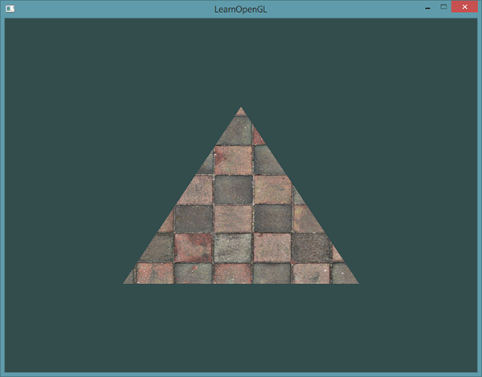
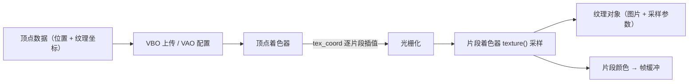
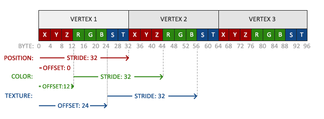
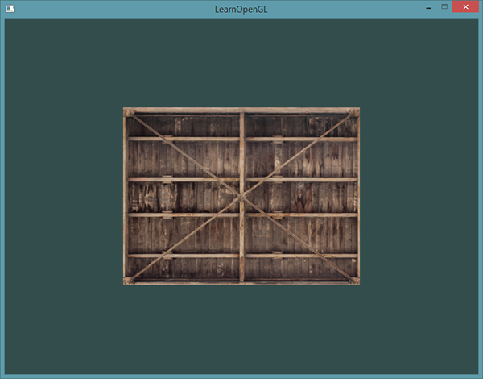
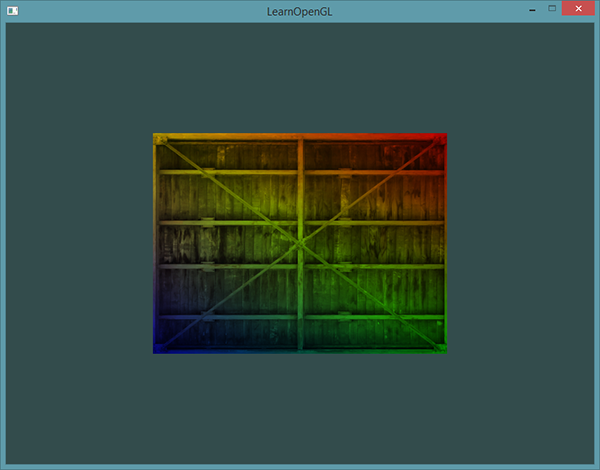
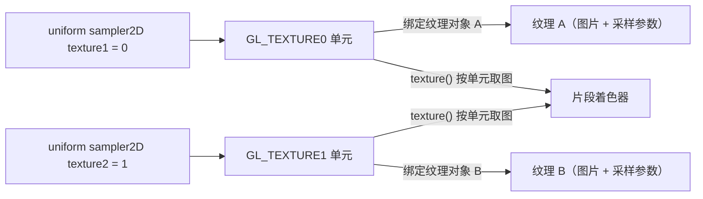
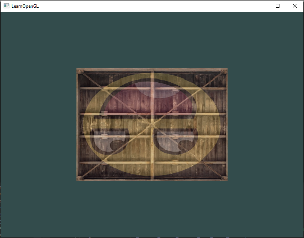
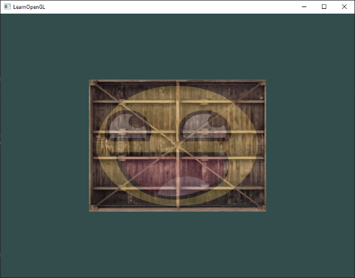
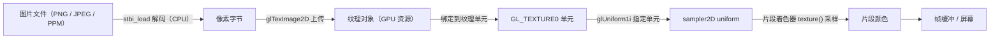

# 纹理

| 项目 | 内容 |
| --- | --- |
| 原文 | [Textures](http://learnopengl.com/#!Getting-started/Textures) |
| 作者 | JoeyDeVries |
| 来源 | LearnOpenGL-CN（本文基于其内容整理修订） |
| 本仓库示例 | `apps/01_getting_started/04_textures/` |

> **注意：**
>
> 原教程早期版本使用 SOIL 库加载图片，现已改为使用 `stb_image.h`。本文以 `stb_image.h` 为准；SOIL 配置相关的历史内容已被原站存档，有需要可自行查阅。

在前面的教程中，我们学会了两种给物体上色的方式：顶点颜色（逐顶点数据 + GPU 插值）和 uniform（整个物体共享）。它们各有局限。先说顶点颜色：想为物体增加细节，就需要足够多的顶点来承载足够多的颜色——每多一分细节，模型就要多出大量顶点，每个顶点又都要多带一份颜色属性，既浪费内存，也让建模变得繁琐。而 uniform 一个绘制调用只有一份值，根本表达不了表面上的变化。

**一句话核心：** 纹理（Texture）是一张图片；把图片「贴」到几何体表面上，就能用一张高分辨率图片换取极其丰富的表面细节，而完全不需要增加顶点——这是本节最重要的思路转变：**细节来自图片（数据），而不是顶点（几何）**。

艺术家和程序员更喜欢使用**纹理**（Texture）。纹理是一个 2D 图片（也有 1D 和 3D 的纹理），用来给物体添加细节；你可以把纹理想象成一张绘有砖块的纸，无缝折叠贴合到 3D 的房子上，房子看上去就有了砖墙外表。因为一张图片里可以塞进非常多的细节，物体可以做到非常精细，却不必指定任何额外的顶点。

> **重要：**
>
> 除了图像以外，纹理还可以用来存储大量数据，这些数据可以发送到着色器上使用（后面章节会遇到的深度、法线等就属于这一类），但这超出了本节的主题。现在先把它当成「图片」理解即可。

下图是上一节的三角形贴上[砖墙](../img/01/06/wall.jpg)图片后的样子：



## 纹理坐标与采样

**一句话核心：** 纹理坐标是 0 到 1 之间的一对浮点数，描述「顶点在图片上的位置」：图片左下角是 (0, 0)，右上角是 (1, 1)；越界与缩放时的取色行为由纹理参数决定。

要把纹理映射（Map）到三角形上，需要指定每个顶点对应纹理图片的哪个部分。每个顶点因此关联一个**纹理坐标**（Texture Coordinate），它标明该从纹理图像的哪个位置**采样**（Sample）——即取哪个位置的像素颜色。顶点之间的其他片段，则由 GPU 在光栅化阶段做**片段插值**（Fragment Interpolation）自动生成。这与上一节颜色属性的插值机制完全相同。

纹理坐标在 x 和 y 轴上的范围是 0 到 1（2D 纹理）。用纹理坐标获取纹理颜色的过程叫做**采样**。纹理坐标起始于 (0, 0)，即图片的左下角；终止于 (1, 1)，即图片的右上角。下图展示了纹理坐标如何映射到三角形上：


我们为三角形指定了 3 个纹理坐标：左下角顶点对应图片左下角 (0, 0)，右下角顶点对应 (1, 0)，顶部顶点对应图片上边中点 (0.5, 1.0)。顶点着色器接收这三个纹理坐标并传给片段着色器，GPU 为每个片段插值出对应的纹理坐标，再据此采样：

```c++
float texCoords[] = {
    0.0f, 0.0f, // 左下角
    1.0f, 0.0f, // 右下角
    0.5f, 1.0f  // 上中
};
```

> **职责边界：** 「采样」发生在 GPU 上、由片段着色器中的 `texture()` 函数触发，但它到底怎么取颜色，取决于纹理对象上的参数（环绕方式、过滤方式）——这些参数由我们在 CPU 侧通过 `glTexParameter*` 设置。一句话：**CPU 设置纹理参数（状态设置），GPU 采样时使用这些参数（状态使用）**。这也是 OpenGL「状态机」模型的又一次体现。

「纹理坐标 → 采样 → 颜色」是本节的主线，先看全景，后面的小节再逐个拆解：



链路中的每一环都对应一个待回答的问题：坐标越界怎么办（环绕方式）、图片缩放怎么办（过滤）、图片从哪来（加载）、怎么进 GPU（生成纹理）、一个着色器能用几张图（纹理单元）。下面依次展开。

## 纹理环绕方式

**一句话核心：** 纹理坐标超出 0~1 范围时，OpenGL 默认重复图片；环绕方式（Wrapping）决定越界坐标的取色策略——重复、镜像、拉伸边缘或填充自定义颜色。

纹理坐标通常落在 (0, 0) 到 (1, 1) 之间，那超出范围会怎样？OpenGL 默认重复整个纹理图像（相当于忽略浮点纹理坐标的整数部分），但规范还提供了更多选择：

| 环绕方式 | 描述 |
| --- | --- |
| `GL_REPEAT` | 默认行为。重复纹理图像。 |
| `GL_MIRRORED_REPEAT` | 与 `GL_REPEAT` 相同，但每次重复时图像镜像放置。 |
| `GL_CLAMP_TO_EDGE` | 纹理坐标被约束在 0 到 1 之间，超出的部分重复边缘像素，产生边缘被拉伸的效果。 |
| `GL_CLAMP_TO_BORDER` | 超出的坐标使用用户指定的边缘颜色。 |

坐标越界时，每个选项的视觉效果各不相同：


每个选项都可以用 `glTexParameter*` 函数按坐标轴单独设置（`s`、`t` 分别对应 2D 纹理的 x、y 轴；3D 纹理还有 `r` 轴）：

```c++
glTexParameteri(GL_TEXTURE_2D, GL_TEXTURE_WRAP_S, GL_MIRRORED_REPEAT);
glTexParameteri(GL_TEXTURE_2D, GL_TEXTURE_WRAP_T, GL_MIRRORED_REPEAT);
```

第一个参数是纹理目标（Target），2D 纹理用 `GL_TEXTURE_2D`；第二个参数指定要配置的选项和坐标轴，这里是 `WRAP`（环绕）选项的 `S`、`T` 轴；第三个参数是环绕方式本身。这个调用修改的是**当前绑定**到 `GL_TEXTURE_2D` 目标的纹理对象——所以 `glTexParameter*` 必须出现在 `glBindTexture` 之后。

如果选 `GL_CLAMP_TO_BORDER`，还需要指定边缘颜色。这要用 `glTexParameterfv` 的 `fv` 后缀形式（`f` 表示 float、`v` 表示数组），配合 `GL_TEXTURE_BORDER_COLOR` 选项：

```c++
float borderColor[] = { 1.0f, 1.0f, 0.0f, 1.0f };
glTexParameterfv(GL_TEXTURE_2D, GL_TEXTURE_BORDER_COLOR, borderColor);
```

> **常见误解：** 有人以为环绕方式会「自动裁剪」顶点或坐标。
> **纠正：** 环绕方式只影响采样阶段对**越界纹理坐标**的处理，不影响几何，也不影响顶点着色器。另外要注意：本节仓库示例的纹理坐标恰好全部落在 0~1 内，`GL_REPEAT` 不会产生可见效果——要真正看到环绕方式的差异，需要像「练习」里那样把坐标扩展到 0~2 甚至更大。

## 纹理过滤

**一句话核心：** 纹理坐标是任意浮点数，而图片像素是离散的；纹理过滤决定「坐标落在像素之间时怎么取色」——`GL_NEAREST` 取最近像素（像素感、锯齿感），`GL_LINEAR` 对周围像素加权平均（平滑、模糊）。

纹理坐标不依赖分辨率，可以是任意浮点值，所以 OpenGL 必须知道如何把**纹理像素**（Texture Pixel，也叫 Texel）映射到纹理坐标上。可以把 Texel 理解为「把图片不断放大后看到的那个最小色块」，注意它与纹理坐标是两回事：纹理坐标是你给模型顶点设置的那个数组，OpenGL 按它去纹理图像上查找、采样 Texel 的颜色。物体很大而纹理分辨率很低时，这个选择尤为关键。纹理过滤有许多选项，本节只讨论最重要的两种：`GL_NEAREST` 和 `GL_LINEAR`。

`GL_NEAREST`（也叫**邻近过滤**，Nearest Neighbor Filtering）是 OpenGL 默认的过滤方式：选择中心点离纹理坐标最近的纹理像素。下图中加号是纹理坐标，左上角纹理像素的中心离它最近，于是它的颜色被选为样本颜色：


`GL_LINEAR`（也叫**线性过滤**，(Bi)linear Filtering）基于纹理坐标附近的多个纹理像素计算插值，近似出它们之间的颜色：纹理像素中心离纹理坐标越近，贡献越大。下图的样本颜色是邻近像素的混合色：


两种方式的视觉效果差别很大。在一张大物体上贴低分辨率纹理（纹理被放大，每个纹理像素都看得见）：


`GL_NEAREST` 产生颗粒状图案，能清晰看到组成纹理的单个像素；`GL_LINEAR` 产生更平滑的图案，很难看出单个纹理像素。`GL_LINEAR` 输出更真实，但有些开发者追求 8-bit 像素风格，会特意选用 `GL_NEAREST`。

放大（Magnify）和缩小（Minify）时都可以分别设置过滤方式，例如缩小时用邻近过滤、放大时用线性过滤，还是通过 `glTexParameter*` 设置：

```c++
glTexParameteri(GL_TEXTURE_2D, GL_TEXTURE_MIN_FILTER, GL_NEAREST);
glTexParameteri(GL_TEXTURE_2D, GL_TEXTURE_MAG_FILTER, GL_LINEAR);
```

### 多级渐远纹理

**一句话核心：** 远处物体只占几个片段，却要在一张巨大的纹理里「大海捞针」式地取一个颜色，既失真又费带宽；多级渐远纹理（Mipmap）预先生成一组逐级缩小一半的纹理图，采样时按距离自动选择最合适的级别。

想象一个摆满上千个物体的大房间，每个物体都有纹理。远处的物体与近处物体使用同样高的分辨率：远处物体可能只产生很少的片段，OpenGL 需要为一个跨越纹理很大范围的片段只拾取一个颜色——这对远处的物体既不真实，又白白浪费显存和带宽。

OpenGL 用**多级渐远纹理**（Mipmap）解决这个问题：一系列纹理图像，后一张是前一张的 1/2。当观察距离超过某个阈值，OpenGL 会切换到最适合当前距离的级别。距离远时分辨率低也不容易被注意到，而且性能更好：


手工为每一级生成图像太麻烦，幸好 OpenGL 提供 `glGenerateMipmap` 函数：创建纹理后调用一次，OpenGL 自动生成全部级别。后面会看到它的用法。

切换 mipmap 级别时，OpenGL 会在两个级别之间产生生硬的边界。和普通过滤一样，级别切换也可以用 `NEAREST`/`LINEAR` 控制，把 `GL_TEXTURE_MIN_FILTER` 设为下面四种选项之一：

| 过滤方式 | 描述 |
| --- | --- |
| `GL_NEAREST_MIPMAP_NEAREST` | 使用最邻近的 mipmap 级别，用邻近过滤采样 |
| `GL_LINEAR_MIPMAP_NEAREST` | 使用最邻近的 mipmap 级别，用线性过滤采样 |
| `GL_NEAREST_MIPMAP_LINEAR` | 在两个最匹配的 mipmap 级别间线性插值，用邻近过滤采样 |
| `GL_LINEAR_MIPMAP_LINEAR` | 在两个邻近的 mipmap 级别间线性插值，并用线性过滤采样 |

```c++
glTexParameteri(GL_TEXTURE_2D, GL_TEXTURE_MIN_FILTER, GL_LINEAR_MIPMAP_LINEAR);
glTexParameteri(GL_TEXTURE_2D, GL_TEXTURE_MAG_FILTER, GL_LINEAR);
```

> **常见误解：** 把放大过滤也设成 mipmap 选项。
> **纠正：** 这是经典错误——mipmap 只在纹理被**缩小**时使用，放大时根本不会用到。把 `GL_TEXTURE_MAG_FILTER` 设为 `GL_LINEAR_MIPMAP_LINEAR` 等选项不但没有效果，还会产生 `GL_INVALID_ENUM` 错误。本节仓库示例的做法是：min filter 用 `GL_LINEAR_MIPMAP_LINEAR`（缩小 + 级别间插值，质量最好），mag filter 用 `GL_LINEAR`（放大时线性过滤）。

## 加载与创建纹理

**一句话核心：** 图片文件格式五花八门，而 OpenGL 不负责解码图片——解码是应用层的活；与其为每种格式手写解码器，不如引入一个成熟的图像加载库（本仓库用 `stb_image.h`）。

使用纹理之前，第一件事是把图片加载到应用中。图片格式众多，每种都有自己的数据结构和排列方式。一个方案是选定一种格式（比如 `.png`）自己写图像加载器，把图像解析成字节序列。这不算难，但很麻烦，而且每支持一种格式就要再写一个加载器。

更好的方案是使用一个支持多种流行格式的图像加载库。本节（以及本仓库）使用 `stb_image.h`。

> **职责边界：** 图像解码（PNG/JPEG 解压、格式转换）发生在 **CPU 侧**，属于应用层工作，与 OpenGL 无关。OpenGL 只负责接收「解码后的像素字节」并上传到 GPU。`stb_image.h` 是解码器，`glTexImage2D` 才是上传器——两者职责完全不同，别混为一谈。

## stb_image.h

**一句话核心：** `stb_image.h` 是 Sean Barrett 写的单头文件图像加载库，支持大多数流行格式；只需在一个 `.cpp` 里定义 `STB_IMAGE_IMPLEMENTATION`，头文件就会展开出完整的实现代码。

`stb_image.h` 是 [Sean Barrett](https://github.com/nothings) 编写的非常流行的单头文件图像加载库，能加载大多数流行格式，整合到工程中也非常简单。把 `stb_image.h` 下载下来、以同名加入工程，再新建一个 C++ 文件写入：

```c++
#define STB_IMAGE_IMPLEMENTATION
#include "stb_image.h"
```

通过定义 `STB_IMAGE_IMPLEMENTATION`，预处理器会修改头文件，使其只包含相关的函数定义源码——相当于把这个头文件变成了一份 `.cpp`。之后在程序中包含 `stb_image.h` 即可正常调用。本仓库示例在 `main.cpp` 顶部同样如此（`stb::stb` 由 Conan 提供，include 顺序遵循仓库约定）：

```c++
#define STB_IMAGE_IMPLEMENTATION
#include <stb_image.h>
```

用 `stb_image.h` 加载图片，调用它的 `stbi_load` 函数（下面以原教程的[木箱](../img/01/06/container.jpg)图片为例）：

```c++
int width, height, nrChannels;
unsigned char *data = stbi_load("container.jpg", &width, &height, &nrChannels, 0);
```

第一个参数是图片文件路径；第二、三、四个参数是三个 `int` 指针，`stb_image` 会把图像的**宽度**、**高度**和**颜色通道个数**填进去——之后生成纹理时需要用到宽度和高度。

> **分层解释：** 加载流程是「文件 → 解码 → 内存字节 → GPU」：`stbi_load` 把磁盘上的图片文件解码成一段紧凑的像素字节流（每像素若干字节），`glTexImage2D` 再把这段字节上传到显存。图像解码完全在 CPU 上完成，GPU 拿到的是「裸像素」。这正是「规范 → 驱动 → 运行时」分层的一个侧面：OpenGL 规范不关心图片格式，只规定「给我字节和格式描述，我来存储」。

## 生成纹理

**一句话核心：** 纹理和 VBO、VAO 一样是 OpenGL 对象，以 ID 引用，生命周期固定：`glGenTextures` 创建 → `glBindTexture` 绑定 → `glTexParameter*` 配置参数 → `glTexImage2D` 上传像素 → `glGenerateMipmap` 生成多级渐远纹理。

和之前的 OpenGL 对象一样，纹理也是用 ID 引用的：

```c++
unsigned int texture;
glGenTextures(1, &texture);
```

`glGenTextures` 第一个参数是生成的纹理数量，第二个参数是存放 ID 的 `unsigned int` 数组（这里只有一个）。和其他对象一样，必须**绑定**之后，后续纹理指令才会作用于当前绑定的纹理：

```c++
glBindTexture(GL_TEXTURE_2D, texture);
```

现在可以上传图片数据生成纹理了，核心调用是 `glTexImage2D`：

```c++
glTexImage2D(GL_TEXTURE_2D, 0, GL_RGB, width, height, 0, GL_RGB, GL_UNSIGNED_BYTE, data);
glGenerateMipmap(GL_TEXTURE_2D);
```

函数很长，逐个参数讲解：

- 第一个参数：纹理目标（Target）。`GL_TEXTURE_2D` 表示作用于当前绑定到该目标的纹理对象（绑定在 `GL_TEXTURE_1D`/`GL_TEXTURE_3D` 的纹理不受影响）。
- 第二个参数：mipmap 级别。手动逐级设置时使用，这里填 0，即基本级别（Base-level）。
- 第三个参数：告诉 OpenGL 希望把纹理存储为**内部格式**。图像只有 RGB 值，所以存为 `GL_RGB`。
- 第四、五个参数：最终纹理的宽度和高度，来自加载图片时得到的变量。
- 第六个参数：历史遗留，应始终为 0。
- 第七、八个参数：**源图**的格式和数据类型。源图是 RGB、以字节（unsigned byte）存储，对应传入 `GL_RGB`、`GL_UNSIGNED_BYTE`。
- 最后一个参数：真正的图像数据。

调用 `glTexImage2D` 时，当前绑定的纹理对象被附加上纹理图像。不过此时只加载了基本级别；要使用 mipmap，要么手动逐级上传（不断递增第二个参数），要么直接调用 `glGenerateMipmap`，让 OpenGL 为当前绑定的纹理自动生成全部级别。

上传完成后，释放图像内存是个好习惯——`stbi_load` 分配的内存必须由 `stbi_image_free` 释放：

```c++
stbi_image_free(data);
```

> **分层解释：** 这里能看到一条清晰的「设置 vs 使用」分界线：`glGenTextures`/`glBindTexture`/`glTexParameter*`/`glTexImage2D`/`glGenerateMipmap` 都是**状态设置**（描述「纹理长什么样、怎么采样」），直到绘制时片段着色器里的 `texture()` 才是**状态使用**（真正读取图片）。纹理对象本身是 GPU 资源，由驱动管理，我们手里只有它的 ID。

### 本仓库示例：create_texture

本仓库示例把「加载 + 创建」封装进匿名命名空间的 `create_texture()`。它首先用编译期宏 `OPENGL_LAB_ASSET_ROOT`（CMake 通过 `target_compile_definitions` 配置为指向 `assets/` 的绝对路径）经 `std::filesystem` 拼接出纹理路径——示例使用的纹理是 `assets/textures/checker.ppm`（棋盘格）：

```c++
std::string texture_path() {
    std::filesystem::path path{OPENGL_LAB_ASSET_ROOT};
    path /= "textures";
    path /= "checker.ppm";
    return path.generic_string();
}
```

文件顶部有回退宏，未定义 `OPENGL_LAB_ASSET_ROOT` 时退回 `"."`（当前目录），保证代码在任意构建配置下都能编译。

`stbi_load` 返回的内存用 RAII 管理，避免早返回时忘记释放（这正是上一小节 `stbi_image_free` 的工程化包装）：

```c++
struct stbi_image_deleter {
    void operator()(stbi_uc* data) const noexcept {
        stbi_image_free(data);
    }
};

using stbi_image_ptr = std::unique_ptr<stbi_uc, stbi_image_deleter>;
```

创建纹理的完整实现（来自 `apps/01_getting_started/04_textures/main.cpp`，逐行对应上文概念）：

```c++
GLuint create_texture() {
    const std::string path{texture_path()};

    int width{0};
    int height{0};
    int channel_count{0};

    // stb_image: OpenGL 纹理坐标原点通常按左下角理解，图片文件常按左上角存储。
    // 翻转 Y 轴后，纹理坐标 (0, 0) 会更符合 OpenGL 入门教程的图示。
    stbi_set_flip_vertically_on_load(1);
    stbi_image_ptr image_data{
        stbi_load(path.c_str(), &width, &height, &channel_count, 0),
    };

    if (image_data == nullptr) {
        std::cerr << "Failed to load texture: " << path << '\n';
        return 0U;
    }

    GLenum format{GL_RGB};
    if (channel_count == 1) {
        format = GL_RED;
    } else if (channel_count == 4) {
        format = GL_RGBA;
    }

    GLuint texture{0};
    glGenTextures(1, &texture);

    // OpenGL: 纹理对象的参数和像素数据都写入当前绑定到 GL_TEXTURE_2D 的对象。
    glBindTexture(GL_TEXTURE_2D, texture);

    // OpenGL: wrap 参数决定纹理坐标超出 0..1 时如何取样。
    glTexParameteri(GL_TEXTURE_2D, GL_TEXTURE_WRAP_S, GL_REPEAT);
    glTexParameteri(GL_TEXTURE_2D, GL_TEXTURE_WRAP_T, GL_REPEAT);

    // OpenGL: filter 参数决定纹理放大/缩小时如何从相邻像素插值。
    glTexParameteri(GL_TEXTURE_2D, GL_TEXTURE_MIN_FILTER, GL_LINEAR_MIPMAP_LINEAR);
    glTexParameteri(GL_TEXTURE_2D, GL_TEXTURE_MAG_FILTER, GL_LINEAR);

    // OpenGL: glTexImage2D 把 CPU 内存中的像素上传到 GPU 纹理存储。
    glTexImage2D(
        GL_TEXTURE_2D,
        0,
        static_cast<GLint>(format),
        width,
        height,
        0,
        format,
        GL_UNSIGNED_BYTE,
        image_data.get());

    // OpenGL: mipmap 是一组逐级缩小的纹理图，远处采样更稳定，也匹配上面的 min filter。
    glGenerateMipmap(GL_TEXTURE_2D);

    return texture;
}
```

几个细节值得注意：

- 通道数由 `stbi_load` 返回，按 1/3/4 通道自动选择 `GL_RED`/`GL_RGB`/`GL_RGBA`——这是「根据图片实际情况生成纹理」的通用写法。
- `stbi_set_flip_vertically_on_load(1)` 让 stb_image 在加载时翻转 Y 轴，解决「图片原点在左上、OpenGL 纹理坐标原点在左下」导致的上下颠倒问题（「纹理单元」一节还会详细解释）。
- 纹理加载失败时打印完整路径并返回 `0U`，由 `main()` 统一报错退出——错误路径不泄漏资源。

> **注意：**
>
> `glTexImage2D` 的第三个参数（内部格式）和第七个参数（源图格式）在这里都写成同一个 `format`，恰好因为示例图片是 RGB/RGBA 且直接存储；两者其实可以不同（例如源图 RGB、内部格式 `GL_RGBA` 由驱动负责转换）。现在先按「一致」理解即可。

## 应用纹理

**一句话核心：** 应用纹理 = 三步：顶点数据里加纹理坐标（新顶点属性）→ 顶点着色器把坐标传给片段着色器 → 片段着色器用 `sampler2D` 采样并输出颜色。

本节仓库示例用 `glDrawElements` 绘制一个矩形（EBO 在「你好，三角形」一节介绍过）。要让 OpenGL 知道如何采样纹理，必须先更新顶点数据、加入纹理坐标。仓库示例的顶点数据是「位置（3 float）+ 纹理坐标（2 float）」共 5 个 float 一组（原教程还额外带颜色，仓库示例为了聚焦纹理而省略了颜色）：

```c++
constexpr std::array<float, 20> vertices{
    // 位置坐标             // 纹理坐标
    0.5F, 0.5F, 0.0F, 1.0F, 1.0F,
    0.5F, -0.5F, 0.0F, 1.0F, 0.0F,
    -0.5F, -0.5F, 0.0F, 0.0F, 0.0F,
    -0.5F, 0.5F, 0.0F, 0.0F, 1.0F,
};
```

注意纹理坐标的取法：矩形的四个角分别对应图片的右上、右下、左下、左上，这样整张棋盘图正好覆盖矩形。由于新增了顶点属性，必须告诉 OpenGL 新的顶点格式：属性 0 是位置、属性 1 是纹理坐标，步长 `5 * sizeof(float)`，纹理坐标偏移 `3 * sizeof(float)`：

```c++
constexpr GLsizei vertex_stride{5 * static_cast<GLsizei>(sizeof(float))};
constexpr auto texture_coord_offset{3 * sizeof(float)};

glVertexAttribPointer(0, 3, GL_FLOAT, GL_FALSE, vertex_stride, nullptr);
glEnableVertexAttribArray(0);

// OpenGL: attribute 1 是 vec2 纹理坐标，它告诉片段着色器从图片的哪个位置采样。
glVertexAttribPointer(
    1,
    2,
    GL_FLOAT,
    GL_FALSE,
    vertex_stride,
    reinterpret_cast<const void*>(texture_coord_offset));
glEnableVertexAttribArray(1);
```

原教程的顶点格式是「位置 + 颜色 + 纹理坐标」8 个 float 一组，下图展示了这种更复杂的布局（步长 8 个 float、纹理坐标偏移 6 个 float）：



理解上图之后再看仓库示例就很简单了——它只是把 8 个 float 简化成 5 个 float，原理完全相同：每个属性都要告诉 OpenGL「数据从哪开始、每个分量多大、每步跨多远」。

接下来调整顶点着色器，接收纹理坐标属性并传给片段着色器（仓库示例内嵌在 `main.cpp` 匿名命名空间，`a_` 前缀命名遵循仓库规范）：

```glsl
constexpr const char* vertex_shader_source{R"glsl(
#version 330 core
layout (location = 0) in vec3 a_pos;
layout (location = 1) in vec2 a_tex_coord;

out vec2 tex_coord;

void main()
{
    gl_Position = vec4(a_pos, 1.0);
    tex_coord = a_tex_coord;
}
)glsl"};
```

片段着色器接收 `tex_coord` 并采样。这里引入一个新的 GLSL 数据类型：**采样器**（Sampler）——供纹理对象使用的内建类型，后缀表示纹理类型（`sampler1D`、`sampler3D`，这里用 `sampler2D`）。把 `sampler2D` 声明为 uniform，就能在片段着色器里使用纹理：

```glsl
constexpr const char* fragment_shader_source{R"glsl(
#version 330 core
in vec2 tex_coord;
out vec4 frag_color;

uniform sampler2D texture1;

void main()
{
    frag_color = texture(texture1, tex_coord);
}
)glsl"};
```

GLSL 内建的 `texture` 函数负责采样：第一个参数是纹理采样器，第二个参数是纹理坐标。它会按照纹理对象上设置的参数（环绕、过滤、mipmap）取回颜色。片段着色器的输出，就是（插值后的）纹理坐标对应的（过滤后的）颜色。

> **常见误解：** 有人以为 `sampler2D` uniform 存的是纹理对象 ID 或图片内容。
> **纠正：** 采样器 uniform 存的是一个**纹理单元编号**（整数），真正的纹理对象绑定在对应的纹理单元上（见下一节）。这也是「明明声明了 uniform，却不用 `glUniform4f` 之类传颜色」的原因——传给采样器的是单元编号。

绘制前把纹理绑定到当前激活的纹理单元，绘制命令就会自动使用它（原教程写法，纹理单元 0 默认激活）：

```c++
glBindTexture(GL_TEXTURE_2D, texture);
glBindVertexArray(VAO);
glDrawElements(GL_TRIANGLES, 6, GL_UNSIGNED_INT, 0);
```

如果一切正确，你会看到下图（原教程使用木箱纹理；本仓库示例是棋盘格纹理）：



> **注意：**
>
> 如果你的纹理全黑或全白，多半在某个环节出了错：检查着色器日志、顶点属性配置（步长/偏移）以及纹理加载路径。也可以继续跟完本节代码——有些驱动必须为每个采样器显式指定纹理单元（下一节的内容），否则采样结果就是黑的。

原教程还演示了把纹理颜色与顶点颜色相乘混合：

```c++
FragColor = texture(ourTexture, TexCoord) * vec4(ourColor, 1.0);
```

效果是顶点颜色与纹理颜色的混合色：



（原教程打趣说，这箱子喜欢跳 70 年代的迪斯科。）仓库示例省略了颜色属性，但理解这个乘法很容易：`vec4` 分量逐项相乘，相当于给纹理「染色」。

## 纹理单元

**一句话核心：** 一个着色器里可以同时用多张纹理；做法是把每张纹理绑定到不同的纹理单元（Texture Unit），再用 `glUniform1i` 告诉每个采样器「你对应几号单元」——采样器存的是单元编号，不是纹理对象。

你可能会奇怪：`sampler2D` 明明是 uniform，我们却不用 `glUniform*` 给它传颜色值。用 `glUniform1i` 可以给纹理采样器分配一个位置值，从而在一个片段着色器里使用多个纹理。这个位置值通常称为**纹理单元**（Texture Unit）。纹理的默认单元是 0，它也是默认激活的单元——所以前面的例子不分配位置值也能工作。

纹理单元的意义在于：**一次绘制可以使用多个纹理**。先把采样器与单元对应起来，再把纹理绑定到对应单元，绘制时每个采样器各取所需。`glBindTexture` 绑定的是「当前激活的纹理单元」：

```c++
glActiveTexture(GL_TEXTURE0); // 在绑定纹理之前先激活纹理单元
glBindTexture(GL_TEXTURE_2D, texture);
```

激活单元之后，接下来的 `glBindTexture` 调用把纹理绑定到当前激活的单元。`GL_TEXTURE0` 默认总是被激活，所以只有一个纹理时可以不调用 `glActiveTexture`——但显式写出来更清晰，本仓库示例就选择了显式写法。

> **重要：**
>
> OpenGL 至少保证 16 个纹理单元可用（`GL_TEXTURE0` 到 `GL_TEXTURE15`）。这些常量按顺序定义，因此可以用 `GL_TEXTURE0 + 8` 得到 `GL_TEXTURE8`，在需要循环处理多个纹理单元时很有用。

仓库示例在初始化阶段（`glUseProgram` 之后）查询并缓存采样器位置，先检查是否为 `-1`（uniform 不存在），再用 `glUniform1i` 把 `texture1` 指向 0 号单元：

```c++
glUseProgram(shader_program);
const GLint texture_uniform{glGetUniformLocation(shader_program, "texture1")};
if (texture_uniform == -1) {
    std::cerr << "Failed to find sampler uniform: texture1\n";
    ...
}

// OpenGL: sampler2D uniform 保存的是纹理单元编号，不是 texture object handle。
glUniform1i(texture_uniform, 0);
```

渲染循环里激活 0 号单元、绑定纹理，再照常绘制（注意：`glUniform1i` 只需设置一次，循环内每次重新绑定纹理是因为绑定状态会被后续操作覆盖，显式写出是教学上的稳妥做法）：

```c++
// OpenGL: 激活 0 号纹理单元，再把本例 texture 绑定给这个单元。
glActiveTexture(GL_TEXTURE0);
glBindTexture(GL_TEXTURE_2D, texture);

glUseProgram(shader_program);
glBindVertexArray(vertex_array_object);

// OpenGL: 索引绘制会读取当前 VAO 记录的 GL_ELEMENT_ARRAY_BUFFER。
glDrawElements(
    GL_TRIANGLES, static_cast<GLsizei>(indices.size()), GL_UNSIGNED_INT, nullptr);
```

采样器与纹理单元的对应关系可以用一张全景图概括：



**关键在两级间接**：uniform 存单元编号（整数）→ 单元上绑着纹理对象 → 纹理对象里才是图片和采样参数。`glUniform1i` 设置一次即可；而绑定（`glActiveTexture` + `glBindTexture`）在需要换图或每次绘制前重新执行。

原教程随后加载了第二张纹理（[你学习 OpenGL 时的表情](../img/01/06/awesomeface.png)，一张带 alpha 通道的 PNG），并在片段着色器里用 `mix` 函数混合两张图：

```c++
#version 330 core
...

uniform sampler2D texture1;
uniform sampler2D texture2;

void main()
{
    FragColor = mix(texture(texture1, TexCoord), texture(texture2, TexCoord), 0.2);
}
```

GLSL 内建的 `mix` 函数对前两个参数按第三个参数做线性插值：`0.0` 完全取第一个输入，`1.0` 完全取第二个输入，`0.2` 表示 80% 的第一张图 + 20% 的第二张图。

> **注意：**
>
> 加载带 alpha 通道的 PNG 时，`glTexImage2D` 的格式参数必须用 `GL_RGBA` 而不是 `GL_RGB`，否则 OpenGL 无法正确解析像素数据。本仓库示例按 `stbi_load` 返回的通道数自动选择（见 `create_texture`），所以两种图片都能正确处理。

两张纹理分别绑定到 0、1 号单元，两个采样器各指一个单元，绘制时同时生效：

```c++
glActiveTexture(GL_TEXTURE0);
glBindTexture(GL_TEXTURE_2D, texture1);
glActiveTexture(GL_TEXTURE1);
glBindTexture(GL_TEXTURE_2D, texture2);

glBindVertexArray(VAO);
glDrawElements(GL_TRIANGLES, 6, GL_UNSIGNED_INT, 0);
```

还要用 `glUniform1i` 告诉 OpenGL 每个采样器属于哪个纹理单元，只需设置一次，放在渲染循环之前：

```c++
ourShader.use(); // 不要忘记在设置 uniform 之前激活着色器程序！
glUniform1i(glGetUniformLocation(ourShader.ID, "texture1"), 0); // 手动设置
ourShader.setInt("texture2", 1); // 或者使用着色器类封装
```

结果：



你可能注意到图片上下颠倒了！原因是 OpenGL 约定 y 轴 `0.0` 坐标在图片底部，而图片文件的 y 轴 `0.0` 坐标通常在顶部。幸运的是 `stb_image.h` 可以在加载时翻转 y 轴，只需在加载任何图像前调用一次：

```c++
stbi_set_flip_vertically_on_load(true);
```

本仓库示例在 `create_texture()` 里就是这么做的（`stbi_set_flip_vertically_on_load(1)`），所以运行示例不会出现上下颠倒。翻转之后的效果：



## 练习

为了熟练使用纹理，建议在继续之前完成这些练习（参考解答见原文）：

- 修改片段着色器，**只**让笑脸图案朝另一个方向看。
- 尝试不同的纹理环绕方式：把纹理坐标范围设成 `0.0f` 到 `2.0f`，看看能否在箱子角落摆出 4 个笑脸（参考结果：[textures_exercise2.png](../img/01/06/textures_exercise2.png)）。记得再试试其它环绕方式。
- 修改纹理坐标，只显示纹理图像的中间一部分，并尝试用 `GL_NEAREST` 过滤让单个像素显示得更清晰。
- 用 uniform 作为 `mix` 函数的第三个参数，用上、下方向键实时改变两张纹理的可见度。

## 本仓库示例

示例目录：`apps/01_getting_started/04_textures/`

仓库示例与本节讲解的对应关系：

- 匿名命名空间内嵌 `vertex_shader_source`（`a_pos` + `a_tex_coord`，`out vec2 tex_coord`）和 `fragment_shader_source`（`in vec2 tex_coord`，`uniform sampler2D texture1`，`texture()` 采样）。
- 顶点数据是「位置 + 纹理坐标」5 个 float 一组（`std::array<float, 20>`），经 EBO 索引绘制矩形；步长 `5 * sizeof(float)`，纹理坐标偏移 `3 * sizeof(float)`。
- `texture_path()` 用 `OPENGL_LAB_ASSET_ROOT` + `std::filesystem` 定位 `assets/textures/checker.ppm`；`create_texture()` 用 `stbi_image_ptr` RAII 管理像素内存，按通道数自动选择格式，wrap 用 `GL_REPEAT`，min/mag filter 用 `GL_LINEAR_MIPMAP_LINEAR`/`GL_LINEAR`，加载时翻转 Y 轴。
- 初始化阶段缓存 `texture1` 的 uniform 位置并做 `-1` 检查，`glUniform1i(texture_uniform, 0)` 指定 0 号纹理单元；渲染循环里 `glActiveTexture(GL_TEXTURE0)` + `glBindTexture` 后 `glDrawElements` 绘制。
- 辅助函数 `compile_shader`/`create_shader_program`、`process_input`（Esc 退出）、`framebuffer_size_callback`（窗口缩放时同步视口）与之前示例一致。
- 与上一节相比，绘制命令从 `glDrawArrays` 换成了索引绘制 `glDrawElements`，顶点数据由 EBO 的 6 个索引复用 4 个顶点。

构建（默认 MinGW GCC Debug，需 MSYS2 UCRT64 在 PATH 中）：

```powershell
conan install . -of build/mingw-gcc-debug -pr:h conan/profiles/mingw-gcc -pr:b conan/profiles/mingw-gcc -s build_type=Debug --build=missing
cmake --preset mingw-gcc-debug
cmake --build --preset mingw-gcc-debug
```

运行：

```powershell
.\build\mingw-gcc-debug\apps\01_getting_started\04_textures\01_getting_started__04_textures.exe
```

运行时交互：按 **Esc**（退出键）退出程序。窗口可缩放，缩放时 `framebuffer_size_callback` 会同步更新视口。窗口里是一个铺满棋盘格纹理的矩形；纹理从源码树的 `assets/textures/checker.ppm` 加载，如果移动了仓库目录，请重新 configure/build，让 `OPENGL_LAB_ASSET_ROOT` 更新为新路径。

## 本章整体回顾

把本节放在整个「入门」章节的学习路径里看，纹理采样是一条完整的链路：



- **局部（数据）**：纹理坐标是逐顶点的第二个属性，和颜色属性一样会被 GPU 插值——上一节「片段插值」的概念在这里直接复用：三角形上任意片段的纹理坐标，都是三个顶点纹理坐标的加权平均。
- **局部（对象）**：纹理是标准的 OpenGL 对象生命周期：创建 → 绑定 → 配置参数（wrap/filter/mipmap）→ 上传数据 → 使用 → 删除；`GL_REPEAT`、`GL_LINEAR`、`GL_LINEAR_MIPMAP_LINEAR` 等参数决定采样行为。
- **局部（分层）**：图片解码（stb_image，CPU）与纹理上传（OpenGL，GPU）是两个职责；uniform 存纹理单元编号，单元上绑纹理对象——两级间接让一个着色器可以同时使用多张纹理。
- **整体（状态机）**：本节再次验证 OpenGL 的状态机模型——`glActiveTexture`/`glBindTexture`/`glUniform1i` 都是改状态，`glDrawElements` 按当前状态执行采样和绘制。
- **整体（本章）**：从「你好，三角形」的纯几何，到「着色器」的可编程颜色，再到本节「用图片替代手工颜色」——表面细节开始变得廉价而丰富；下一节「变换」将让这块贴着纹理的矩形动起来，首次引入矩阵。

[下一节：变换](07_transformations.md)
