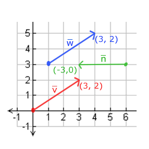
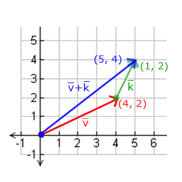
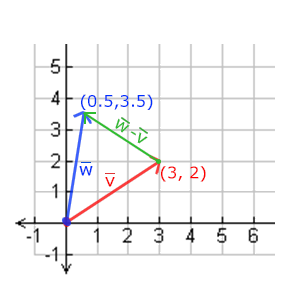
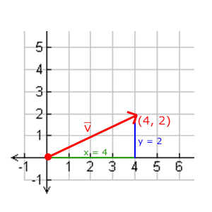
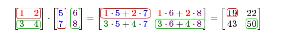
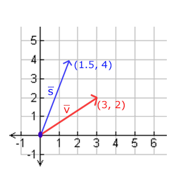
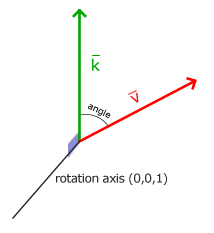
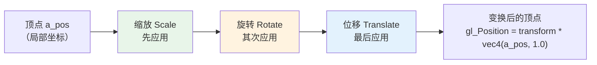
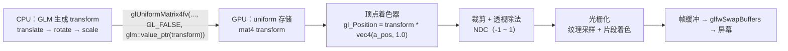
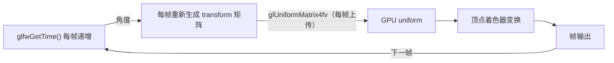

# 变换

| 项目 | 内容 |
| --- | --- |
| 原文 | [Transformations](http://learnopengl.com/#!Getting-started/Transformations) |
| 作者 | JoeyDeVries |
| 来源 | LearnOpenGL-CN（本文基于其内容整理修订） |
| 本仓库示例 | [`apps/01_getting_started/05_transformations/`](../../apps/01_getting_started/05_transformations/) |

到目前为止，我们已经知道如何创建一个物体、给它着色、为它贴上纹理，但所有物体都还是**静态**的。我们可以尝试在每一帧修改顶点数据并重新配置缓冲区来让它们移动，但这既繁琐又消耗处理时间。更好的方案是：使用（多个）**矩阵**（Matrix）对象来**变换**（Transform）一个物体，让同一份顶点数据在 GPU 上被整体搬动、旋转和缩放。

**一句话核心：** 变换的本质是「矩阵 × 向量」——把位移、旋转、缩放全部编码进一个 4×4 矩阵，在顶点着色器里用这个矩阵左乘顶点坐标，即可让同一份顶点数据产生千变万化的位置与姿态，而无需重新上传任何顶点。

在深入矩阵之前，我们需要先补一点数学基础：向量。这一节的目标是让你拥有后续学习所需的最基础的数学背景；如果觉得困难，尽量先理解，日后需要时再回头复习。

# 向量

**一句话核心：** 向量是一个有**方向**和**大小**（长度）的量，它描述的是「怎么走」而不是「在哪」——同一个向量可以平移到空间中的任何位置，其值不变。

向量最基本的定义就是一个方向。更正式地说，向量有一个**方向**（Direction）和**大小**（Magnitude，也叫强度或长度）。你可以把向量想象成藏宝图上的指示：「向左走 10 步，向北走 3 步，然后向右走 5 步」；「左」是方向，「10 步」是向量的长度。这个指示一共包含 3 个向量。向量可以是任意维度（Dimension）的，但我们通常只使用 2 至 4 维：2 维向量表示一个平面上的方向（想象 2D 图像），3 维向量表示 3D 世界中的方向。下面你会看到 3 个向量，每个向量在 2D 图像中都用一个箭头 (x, y) 表示——你可以把 2D 向量当作 z 坐标为 0 的 3D 向量。由于向量表示的是方向，起始于何处并不会改变它的值，下图中的向量 \(\color{red}{\bar{v}}\) 和 \(\color{blue}{\bar{w}}\) 虽然起点不同，却是相等的：



数学家喜欢在字母上方加一横表示向量，例如 \(\bar{v}\)。在公式中它们通常是这样的：

$$
\bar{v} = \begin{pmatrix} \color{red}x \\ \color{green}y \\ \color{blue}z \end{pmatrix}
$$

为了便于想象，我们通常把向量的起点放在原点 (0, 0, 0)，让它指向某个点，此时它称为**位置向量**（Position Vector）。例如位置向量 (3, 5) 的起点是 (0, 0)，指向 (3, 5)。这样，向量既可以表示方向，也可以表示位置。

和普通数字一样，向量也有多种运算（其中一些你可能已经见过）。

## 向量与标量运算

**标量**（Scalar）只是一个数字（或者说是仅有一个分量的向量）。把一个向量加/减/乘/除一个标量，就是对向量的每个分量分别做同样的运算。例如加法：

$$
\begin{pmatrix} \color{red}1 \\ \color{green}2 \\ \color{blue}3 \end{pmatrix} + x = \begin{pmatrix} \color{red}1 + x \\ \color{green}2 + x \\ \color{blue}3 + x \end{pmatrix}
$$

其中的运算可以是 +、−、· 或 ÷。注意 − 和 ÷ 不能颠倒（不能标量 −/÷ 向量），因为颠倒的运算是没有定义的。

> **注意：** 数学上并没有「向量与标量相加」这个运算，但很多线性代数库都支持它（例如我们使用的 GLM）。如果你用过 numpy，可以把它理解为 Broadcasting。

## 向量取反

对一个向量取反（Negate）会将其方向逆转：指向东北的向量取反后指向西南。做法是在每个分量前加负号（或者说用 −1 数乘该向量）：

$$
-\bar{v} = -\begin{pmatrix} \color{red}{v_x} \\ \color{blue}{v_y} \\ \color{green}{v_z} \end{pmatrix} = \begin{pmatrix} -\color{red}{v_x} \\ -\color{blue}{v_y} \\ -\color{green}{v_z} \end{pmatrix}
$$

## 向量加减

向量的加法是**分量的**（Component-wise）相加：把两个向量的对应分量逐一相加。

$$
\bar{v} = \begin{pmatrix} \color{red}1 \\ \color{green}2 \\ \color{blue}3 \end{pmatrix},\ \bar{k} = \begin{pmatrix} \color{red}4 \\ \color{green}5 \\ \color{blue}6 \end{pmatrix} \rightarrow \bar{v} + \bar{k} = \begin{pmatrix} \color{red}1 + \color{red}4 \\ \color{green}2 + \color{green}5 \\ \color{blue}3 + \color{blue}6 \end{pmatrix} = \begin{pmatrix} \color{red}5 \\ \color{green}7 \\ \color{blue}9 \end{pmatrix}
$$

向量 v = (4, 2) 和 k = (1, 2) 的加法可以直观地表示为：



减法等于加上第二个向量的相反向量。两个向量相减得到的是它们指向位置的**差**，这在获取两点之间的方向时非常有用：



## 长度

我们使用**勾股定理**（Pythagoras Theorem）计算向量的长度。把向量的 x 与 y 分量画出来，向量会和 x、y 分量构成一个直角三角形：



已知两条直角边（x 和 y），斜边 \(\color{red}{\bar{v}}\) 的长度可以直接由勾股定理算出：

$$
||\color{red}{\bar{v}}|| = \sqrt{\color{green}x^2 + \color{blue}y^2}
$$

\(||\color{red}{\bar{v}}||\) 表示向量 \(\color{red}{\bar{v}}\) 的长度；加上 \(z^2\) 即可拓展到三维空间。例如向量 (4, 2) 的长度为 \(\sqrt{16 + 4} = \sqrt{20} \approx 4.47\)。

有一种特殊的向量叫**单位向量**（Unit Vector），它的长度恰好是 1。用向量的长度去除它的每个分量，就得到单位向量 \(\hat{n}\)：

$$
\hat{n} = \frac{\bar{v}}{||\bar{v}||}
$$

这个过程叫做向量的**标准化**（Normalizing）。单位向量只在方向有意义、长度无关紧要的场合非常有用（改变长度不会改变方向），后面相机章节的「方向向量必须归一化」就用到了它。

## 向量相乘

两个向量相乘是个特例：普通乘法对向量没有定义，但存在两种特定的乘法——**点乘**（Dot Product）\(\bar{v} \cdot \bar{k}\) 和**叉乘**（Cross Product）\(\bar{v} \times \bar{k}\)。

### 点乘

两个向量的点乘等于它们长度的乘积再乘以夹角余弦：

$$
\bar{v} \cdot \bar{k} = ||\bar{v}|| \cdot ||\bar{k}|| \cdot \cos \theta
$$

如果 \(\bar{v}\) 和 \(\bar{k}\) 都是单位向量，公式简化为：

$$
\bar{v} \cdot \bar{k} = \cos \theta
$$

于是点乘**只**由两个向量的夹角决定：90° 的余弦是 0，0° 的余弦是 1。用点乘可以很容易地测试两个向量是否**正交**（Orthogonal，互为**直角**）或平行。

> **重要：** 对非单位向量，用点乘结果除以两向量长度之积即可得到夹角余弦值，即 \(\cos \theta = \dfrac{\bar{v} \cdot \bar{k}}{||\bar{v}|| \cdot ||\bar{k}||}\)。

点乘的具体计算是把对应分量逐个相乘再求和：

$$
\begin{pmatrix} \color{red}{0.6} \\ -\color{green}{0.8} \\ \color{blue}0 \end{pmatrix} \cdot \begin{pmatrix} \color{red}0 \\ \color{green}1 \\ \color{blue}0 \end{pmatrix} = (\color{red}{0.6} \times \color{red}0) + (-\color{green}{0.8} \times \color{green}1) + (\color{blue}0 \times \color{blue}0) = -0.8
$$

两个单位向量间的夹角用反余弦函数 \(cos^{-1}\) 计算，结果是 143.1°。点乘在计算光照时非常有用（下一章会频繁使用）。

### 叉乘

叉乘只在 3D 空间中有定义，它接受两个不平行的向量，生成一个**同时正交于这两个向量**的第三个向量：


叉乘公式如下（两个正交向量 A 和 B）：

$$
\begin{pmatrix} \color{red}{A_{x}} \\ \color{green}{A_{y}} \\ \color{blue}{A_{z}} \end{pmatrix} \times \begin{pmatrix} \color{red}{B_{x}} \\ \color{green}{B_{y}} \\ \color{blue}{B_{z}} \end{pmatrix} = \begin{pmatrix} \color{green}{A_{y}} \cdot \color{blue}{B_{z}} - \color{blue}{A_{z}} \cdot \color{green}{B_{y}} \\ \color{blue}{A_{z}} \cdot \color{red}{B_{x}} - \color{red}{A_{x}} \cdot \color{blue}{B_{z}} \\ \color{red}{A_{x}} \cdot \color{green}{B_{y}} - \color{green}{A_{y}} \cdot \color{red}{B_{x}} \end{pmatrix}
$$

> **局部→整体：** 你可能觉得这个公式毫无头绪，但没关系——本节的向量运算不会手算。它们的价值在于为后面的「整体」提供词汇：点乘用于判断夹角（光照、视线），叉乘用于从已知向量构造正交轴（摄像机的右轴、上轴）。这些运算全部由 GLM 在 CPU 侧完成，你只需要理解「叉乘能造出一个垂直向量」这个结论。

# 矩阵

**一句话核心：** 矩阵是一个矩形的数字阵列，它有自己的一套运算规则；把变换编码进矩阵后，一次矩阵乘法就能完成原本需要多次手工计算的坐标变换。

矩阵就是矩形的数字、符号或表达式数组，其中每一项叫做矩阵的**元素**（Element）。下面是一个 2×3 矩阵的例子：

$$
\begin{bmatrix} 1 & 2 & 3 \\ 4 & 5 & 6 \end{bmatrix}
$$

矩阵通过 (i, j) 索引，i 是行，j 是列，所以上面的矩阵叫 2×3 矩阵（3 列 2 行），也叫做矩阵的**维度**（Dimension）。这与索引 2D 图像时的 (x, y) 相反：元素 4 的索引是 (2, 1)（第二行，第一列）。

## 矩阵的加减

矩阵与标量的加减定义如下（标量作用于每一个元素）：

$$
\begin{bmatrix} 1 & 2 \\ 3 & 4 \end{bmatrix} + \color{green}3 = \begin{bmatrix} 4 & 5 \\ 6 & 7 \end{bmatrix}
$$

> **注意：** 数学上并没有矩阵与标量相加减的运算，但很多线性代数库（包括 GLM）支持这种写法。

矩阵与矩阵的加减是**对应元素**的加减，因此只有同维度的矩阵才能加减。例如两个 2×2 矩阵相加：

$$
\begin{bmatrix} \color{red}1 & \color{red}2 \\ \color{green}3 & \color{green}4 \end{bmatrix} + \begin{bmatrix} \color{red}5 & \color{red}6 \\ \color{green}7 & \color{green}8 \end{bmatrix} = \begin{bmatrix} \color{red}6 & \color{red}8 \\ \color{green}{10} & \color{green}{12} \end{bmatrix}
$$

## 矩阵的数乘

矩阵与标量相乘同样是每个元素分别乘以该标量。这也是「标量」（Scalar）名称的由来——它用自身的值**缩放**（Scale）矩阵的所有元素：

$$
\color{green}2 \cdot \begin{bmatrix} 1 & 2 \\ 3 & 4 \end{bmatrix} = \begin{bmatrix} 2 & 4 \\ 6 & 8 \end{bmatrix}
$$

## 矩阵相乘

矩阵乘法并不复杂，但的确很难让人适应，并且有两条限制：

1. 只有当**左侧矩阵的列数等于右侧矩阵的行数**时，两个矩阵才能相乘。
2. 矩阵相乘**不遵守交换律**（Commutative），即 \(A \cdot B \neq B \cdot A\)。

两个 2×2 矩阵相乘的例子：

$$
\begin{bmatrix} \color{red}1 & \color{red}2 \\ \color{green}3 & \color{green}4 \end{bmatrix} \cdot \begin{bmatrix} \color{blue}5 & \color{purple}6 \\ \color{blue}7 & \color{purple}8 \end{bmatrix} = \begin{bmatrix} 19 & 22 \\ 43 & 50 \end{bmatrix}
$$

矩阵乘法是一系列乘法和加法的组合，它使用左侧矩阵的**行**和右侧矩阵的**列**：



取左侧矩阵的行和右侧矩阵的列，二者决定结果矩阵对应位置的值：结果矩阵第 i 行第 j 列的元素 = 左矩阵第 i 行的每个元素与右矩阵第 j 列的对应元素相乘后求和。结果矩阵的维度是 (n, m)，n 等于左侧矩阵的行数，m 等于右侧矩阵的列数——这也解释了为什么左矩阵列数必须等于右矩阵行数。

> **常见误解：** 矩阵乘法顺序无关紧要，先乘后乘都一样。
> **纠正：** 顺序至关重要。矩阵乘法不满足交换律，\(M_{rotate} \cdot M_{translate}\) 与 \(M_{translate} \cdot M_{rotate}\) 是两个完全不同的变换结果。后面「矩阵的组合」一节会详细说明，这也是图形学新手最常见的错误来源之一。

## 矩阵与向量相乘

向量其实就是一个 **N×1** 矩阵（N 个分量、1 列）。一个 **M×N** 矩阵与 **N×1** 向量相乘是合法的（矩阵列数等于向量行数），结果是一个 **M×1** 向量。这正是变换的核心：把有趣的 2D/3D 变换放进一个矩阵，用它乘以向量即可**变换**这个向量。

在 OpenGL 中，我们通常使用 **4×4** 的变换矩阵，因为大部分向量都是 4 分量的（xyz + 齐次坐标 w，见下文「位移」）。

### 单位矩阵

**一句话核心：** 单位矩阵是对角线为 1、其余为 0 的 N×N 矩阵，它乘任何向量都得到原向量——它是所有变换矩阵的「起点」。

$$
\begin{bmatrix} \color{red}1 & \color{red}0 & \color{red}0 & \color{red}0 \\ \color{green}0 & \color{green}1 & \color{green}0 & \color{green}0 \\ \color{blue}0 & \color{blue}0 & \color{blue}1 & \color{blue}0 \\ \color{purple}0 & \color{purple}0 & \color{purple}0 & \color{purple}1 \end{bmatrix} \cdot \begin{bmatrix} 1 \\ 2 \\ 3 \\ 4 \end{bmatrix} = \begin{bmatrix} 1 \\ 2 \\ 3 \\ 4 \end{bmatrix}
$$

> **重要：** 一个「不变换」的矩阵有什么用？单位矩阵通常是生成其他变换矩阵的起点——GLM 的 `glm::translate`、`glm::rotate`、`glm::scale` 都会把一个初始矩阵与对应的变换矩阵相乘，代码里我们显式用 `glm::mat4{1.0F}` 构造单位矩阵作为这个起点。

### 缩放

**一句话核心：** 缩放矩阵的对角线元素就是各轴的缩放因子，它只改变向量的长度、不改变方向。

对一个向量缩放（Scaling）就是改变它的长度而保持方向。把缩放变量表示为 \((\color{red}{S_1}, \color{green}{S_2}, \color{blue}{S_3})\)，缩放矩阵为：

$$
\begin{bmatrix} \color{red}{S_1} & \color{red}0 & \color{red}0 & \color{red}0 \\ \color{green}0 & \color{green}{S_2} & \color{green}0 & \color{green}0 \\ \color{blue}0 & \color{blue}0 & \color{blue}{S_3} & \color{blue}0 \\ \color{purple}0 & \color{purple}0 & \color{purple}0 & \color{purple}1 \end{bmatrix} \cdot \begin{pmatrix} x \\ y \\ z \\ 1 \end{pmatrix} = \begin{pmatrix} \color{red}{S_1} \cdot x \\ \color{green}{S_2} \cdot y \\ \color{blue}{S_3} \cdot z \\ 1 \end{pmatrix}
$$

每个对角线元素与向量的对应元素相乘：把 1 换成 3，向量就放大 3 倍。注意 w 分量保持 1——在 3D 空间中缩放 w 分量无意义，w 另有用途。如果各轴缩放因子不同（例如把向量 (3, 2) 沿 x 轴缩放 0.5、沿 y 轴缩放 2 倍），称为**不均匀**（Non-uniform）缩放；各轴因子相同则称为**均匀缩放**（Uniform Scale）：



### 位移

**一句话核心：** 位移（Translation）矩阵把位移量放在第四列的前三行；它之所以能「移动」向量，靠的是齐次坐标 w——这也是我们坚持使用 4×4 矩阵的原因。

位移是在原始向量的基础上加上另一个向量，从而获得一个新位置。位移矩阵定义为：

$$
\begin{bmatrix} \color{red}1 & \color{red}0 & \color{red}0 & \color{red}{T_x} \\ \color{green}0 & \color{green}1 & \color{green}0 & \color{green}{T_y} \\ \color{blue}0 & \color{blue}0 & \color{blue}1 & \color{blue}{T_z} \\ \color{purple}0 & \color{purple}0 & \color{purple}0 & \color{purple}1 \end{bmatrix} \cdot \begin{pmatrix} x \\ y \\ z \\ 1 \end{pmatrix} = \begin{pmatrix} x + \color{red}{T_x} \\ y + \color{green}{T_y} \\ z + \color{blue}{T_z} \\ 1 \end{pmatrix}
$$

> **重要：齐次坐标（Homogeneous Coordinates）**
>
> 向量的 w 分量也叫**齐次坐标**。要从齐次向量得到 3D 向量，把 x、y、z 分别除以 w。通常 w = 1.0，所以我们很少注意它。使用齐次坐标有两点好处：它允许我们对 3D 向量进行位移（3×3 矩阵放不下位移量）；下一章我们还会用 w 值制造透视效果。
>
> 如果齐次坐标为 0，该向量是**方向向量**（Direction Vector）——w = 0 的向量不能被位移（这也正是「方向不能平移」的数学表达）。

有了位移矩阵，我们就可以在 3 个方向 (x, y, z) 上移动物体了，它是变换工具箱中非常有用的一员。

### 旋转

**一句话核心：** 旋转矩阵用角度和旋转轴描述转动；OpenGL 相关 API 一律使用**弧度制**角度，所以代码里常见 `glm::radians(...)` 转换。

2D/3D 中的旋转用**角**（Angle）表示，可以是角度制或弧度制：周角是 360° 或 \(2\pi\) 弧度。转半圈是 180°，向右转 1/5 圈是 72°。下图中的 2D 向量 \(\color{red}{\bar{v}}\) 由 \(\color{green}{\bar{k}}\) 向右旋转 72° 得到：



在 2D 平面中旋转相当于绕 z 轴旋转（把 2D 向量放进 3D 空间，旋转轴就是 z 轴）。在 3D 空间中旋转则需要定义一个角**和**一个**旋转轴**（Rotation Axis）——物体会沿给定的旋转轴旋转特定角度。

> **重要：** 大多数旋转函数需要弧度制，转换公式：
> - 弧度转角度：`角度 = 弧度 * (180.0f / PI)`
> - 角度转弧度：`弧度 = 角度 * (PI / 180.0f)`
>
> `PI` 约等于 3.14159265359。GLM 的 `glm::radians(degrees)` 正是完成角度转弧度的工具。

在 3D 空间中旋转需要定义一个角**和**一个**旋转轴**（Rotation Axis）。旋转矩阵在 3D 空间中沿每个单位轴有不同的定义，旋转角度用 \(\theta\) 表示。沿 x 轴旋转：

$$
\begin{bmatrix} \color{red}1 & \color{red}0 & \color{red}0 & \color{red}0 \\ \color{green}0 & \color{green}{\cos \theta} & - \color{green}{\sin \theta} & \color{green}0 \\ \color{blue}0 & \color{blue}{\sin \theta} & \color{blue}{\cos \theta} & \color{blue}0 \\ \color{purple}0 & \color{purple}0 & \color{purple}0 & \color{purple}1 \end{bmatrix} \cdot \begin{pmatrix} x \\ y \\ z \\ 1 \end{pmatrix} = \begin{pmatrix} x \\ \color{green}{\cos \theta} \cdot y - \color{green}{\sin \theta} \cdot z \\ \color{blue}{\sin \theta} \cdot y + \color{blue}{\cos \theta} \cdot z \\ 1 \end{pmatrix}
$$

沿 y 轴旋转：

$$
\begin{bmatrix} \color{red}{\cos \theta} & \color{red}0 & \color{red}{\sin \theta} & \color{red}0 \\ \color{green}0 & \color{green}1 & \color{green}0 & \color{green}0 \\ - \color{blue}{\sin \theta} & \color{blue}0 & \color{blue}{\cos \theta} & \color{blue}0 \\ \color{purple}0 & \color{purple}0 & \color{purple}0 & \color{purple}1 \end{bmatrix} \cdot \begin{pmatrix} x \\ y \\ z \\ 1 \end{pmatrix} = \begin{pmatrix} \color{red}{\cos \theta} \cdot x + \color{red}{\sin \theta} \cdot z \\ y \\ - \color{blue}{\sin \theta} \cdot x + \color{blue}{\cos \theta} \cdot z \\ 1 \end{pmatrix}
$$

沿 z 轴旋转（本仓库示例的矩形就是绕 z 轴旋转）：

$$
\begin{bmatrix} \color{red}{\cos \theta} & - \color{red}{\sin \theta} & \color{red}0 & \color{red}0 \\ \color{green}{\sin \theta} & \color{green}{\cos \theta} & \color{green}0 & \color{green}0 \\ \color{blue}0 & \color{blue}0 & \color{blue}1 & \color{blue}0 \\ \color{purple}0 & \color{purple}0 & \color{purple}0 & \color{purple}1 \end{bmatrix} \cdot \begin{pmatrix} x \\ y \\ z \\ 1 \end{pmatrix} = \begin{pmatrix} \color{red}{\cos \theta} \cdot x - \color{red}{\sin \theta} \cdot y \\ \color{green}{\sin \theta} \cdot x + \color{green}{\cos \theta} \cdot y \\ z \\ 1 \end{pmatrix}
$$

利用旋转矩阵可以把任意位置向量沿一个单位旋转轴旋转，也可以复合多个矩阵（例如先沿 x 轴旋转再沿 y 轴旋转）。但复合旋转很快会带来一个问题——**万向节死锁**（Gimbal Lock）。更稳妥的模型是沿任意轴（例如单位向量 \((0.662, 0.2, 0.7222)\)）一次性旋转，对应的旋转矩阵如下（\((\color{red}{R_x}, \color{green}{R_y}, \color{blue}{R_z})\) 代表任意旋转轴）：

$$
\begin{bmatrix} \cos \theta + \color{red}{R_x}^2(1 - \cos \theta) & \color{red}{R_x}\color{green}{R_y}(1 - \cos \theta) - \color{blue}{R_z} \sin \theta & \color{red}{R_x}\color{blue}{R_z}(1 - \cos \theta) + \color{green}{R_y} \sin \theta & 0 \\ \color{green}{R_y}\color{red}{R_x} (1 - \cos \theta) + \color{blue}{R_z} \sin \theta & \cos \theta + \color{green}{R_y}^2(1 - \cos \theta) & \color{green}{R_y}\color{blue}{R_z}(1 - \cos \theta) - \color{red}{R_x} \sin \theta & 0 \\ \color{blue}{R_z}\color{red}{R_x}(1 - \cos \theta) - \color{green}{R_y} \sin \theta & \color{blue}{R_z}\color{green}{R_y}(1 - \cos \theta) + \color{red}{R_x} \sin \theta & \cos \theta + \color{blue}{R_z}^2(1 - \cos \theta) & 0 \\ 0 & 0 & 0 & 1 \end{bmatrix}
$$

> **译注：** 即使这种矩阵也不能完全避免万向节死锁（尽管能极大地减少）。真正的解决方案是使用**四元数**（Quaternion），它不仅更安全而且计算更高效，可能在后面的教程中讨论。本仓库的示例和后续相机章节仍使用欧拉角 + 旋转矩阵的简化方案，理解其局限即可。

### 矩阵的组合

**一句话核心：** 矩阵乘法可以把多个变换合并成一个矩阵；由于乘法从右向左生效，**代码里的书写顺序与实际的变换顺序相反**。

使用矩阵进行变换的真正力量在于：根据矩阵乘法法则，我们可以把多个变换**组合**进一个矩阵。假设要把顶点 (x, y, z) 先缩放 2 倍、再位移 (1, 2, 3) 个单位：

$$
Trans \cdot Scale = \begin{bmatrix} \color{red}1 & \color{red}0 & \color{red}0 & \color{red}1 \\ \color{green}0 & \color{green}1 & \color{green}0 & \color{green}2 \\ \color{blue}0 & \color{blue}0 & \color{blue}1 & \color{blue}3 \\ \color{purple}0 & \color{purple}0 & \color{purple}0 & \color{purple}1 \end{bmatrix} \cdot \begin{bmatrix} \color{red}2 & \color{red}0 & \color{red}0 & \color{red}0 \\ \color{green}0 & \color{green}2 & \color{green}0 & \color{green}0 \\ \color{blue}0 & \color{blue}0 & \color{blue}2 & \color{blue}0 \\ \color{purple}0 & \color{purple}0 & \color{purple}0 & \color{purple}1 \end{bmatrix} = \begin{bmatrix} \color{red}2 & \color{red}0 & \color{red}0 & \color{red}1 \\ \color{green}0 & \color{green}2 & \color{green}0 & \color{green}2 \\ \color{blue}0 & \color{blue}0 & \color{blue}2 & \color{blue}3 \\ \color{purple}0 & \color{purple}0 & \color{purple}0 & \color{purple}1 \end{bmatrix}
$$

注意书写顺序：**先写位移再写缩放**。矩阵乘法不满足交换律，顺序很重要——最右边的矩阵最先与向量相乘，所以应该**从右向左读**。建议的组合顺序是：**先缩放，再旋转，最后位移**，否则变换会互相影响。例如先位移再缩放，位移量也会被同样缩放（向某方向移动 2 米，这 2 米可能被缩成 1 米）。用最终的组合矩阵左乘向量：

$$
\begin{bmatrix} \color{red}2 & \color{red}0 & \color{red}0 & \color{red}1 \\ \color{green}0 & \color{green}2 & \color{green}0 & \color{green}2 \\ \color{blue}0 & \color{blue}0 & \color{blue}2 & \color{blue}3 \\ \color{purple}0 & \color{purple}0 & \color{purple}0 & \color{purple}1 \end{bmatrix} \cdot \begin{bmatrix} x \\ y \\ z \\ 1 \end{bmatrix} = \begin{bmatrix} 2x + 1 \\ 2y + 2 \\ 2z + 3 \\ 1 \end{bmatrix}
$$

向量先被缩放 2 倍，再位移了 (1, 2, 3) 个单位。下面的全景图展示了这个「从右向左」的生效顺序，请与代码书写顺序对照：



> **常见误解：** 代码里先写 `glm::translate` 就是先位移。
> **纠正：** GLM 的每个变换函数都把「新矩阵 × 传入矩阵」的结果赋回，因此矩阵乘法从右向左生效——写在**最下面**的变换最先应用。本仓库示例中代码依次是 translate → rotate → scale，实际作用顺序却是 scale → rotate → translate（旋转发生在物体局部坐标系内，位移用世界坐标移动整个物体）。

# 实践

理论讲完了，是时候把知识用起来。OpenGL 本身没有任何矩阵和向量知识，我们必须自己提供数学库。幸运的是，有一个易于使用、专为 OpenGL 量身定做的数学库——GLM。

**一句话核心：** GLM（OpenGL Mathematics）是一个**只有头文件**的库——包含头文件即可使用，无需链接和编译，所有矩阵/向量运算都在 CPU 侧完成。


GLM 可以在它的[网站](https://glm.g-truc.net/0.9.8/index.html)下载，把头文件根目录复制到 include 文件夹即可使用。

> **注意：** GLM 从 0.9.9 版本起，默认把矩阵类型初始化为**零矩阵**（所有元素为 0），而不是单位矩阵。因此所有矩阵初始化都应写成 `glm::mat4 mat{1.0F}`（本仓库示例正是如此）。

> **分层解释：** 矩阵数学横跨 CPU 与 GPU 两层，职责不同：
> - **应用程序 + GLM（CPU）**：负责生成矩阵数值。GLM 只是普通 C++ 库，运算结果是一块内存里的 16 个 float。
> - **OpenGL API + 显卡驱动**：负责把矩阵从 CPU 传送到 GPU（`glUniformMatrix4fv`），并保证 GLSL 里的 `mat4` uniform 拿到这份数据。
> - **顶点着色器（GPU）**：负责实际执行「矩阵 × 向量」——每个顶点都乘一次，这是并行发生在 GPU 上的。
>
> 这种「CPU 算矩阵、GPU 乘矩阵」的分工，是图形程序中数据流的核心模式，请务必记住。

本仓库示例 `05_transformations` 使用的 GLM 头文件与常规一致：

```c++
#include <glm/glm.hpp>
#include <glm/gtc/matrix_transform.hpp>
#include <glm/gtc/type_ptr.hpp>
```

第一个头文件提供核心向量/矩阵类型，`matrix_transform.hpp` 提供 `translate`/`rotate`/`scale`/`perspective`/`lookAt` 等变换函数，`type_ptr.hpp` 提供 `glm::value_ptr` 用于把矩阵转换为 OpenGL 需要的裸数据指针。

## 让着色器接收矩阵

我们要修改顶点着色器，让它接收一个 `mat4` 类型的 uniform，并把矩阵乘到顶点位置上。本仓库示例的顶点着色器内嵌在 `main.cpp` 匿名命名空间的 `vertex_shader_source` 常量中（原始字符串 `R"glsl(...)glsl"`，无需外部文件）：

```glsl
#version 330 core
layout (location = 0) in vec3 a_pos;
layout (location = 1) in vec2 a_tex_coord;

out vec2 tex_coord;

uniform mat4 transform;

void main()
{
    gl_Position = transform * vec4(a_pos, 1.0);
    tex_coord = a_tex_coord;
}
```

> **注意：** GLSL 也有 `mat2` 和 `mat3` 类型，前面讨论的所有数学运算（标量-矩阵相乘、矩阵-向量相乘、矩阵-矩阵相乘）都适用于矩阵类型。这里把 `a_pos`（vec3）补成 vec4，w 取 1.0——只有 w = 1 的齐次坐标才能被位移。

片段着色器与纹理章节完全一致，`frag_color = texture(texture1, tex_coord);` 负责采样纹理，不参与矩阵运算。

## 上传矩阵到 GPU

光在着色器里声明 uniform 还不够，我们必须在 CPU 侧把矩阵数据发送过去。本仓库示例在初始化阶段缓存了 uniform 位置（`main()` 中 `glUseProgram(shader_program)` 之后）：

```c++
    const GLint texture_uniform{glGetUniformLocation(shader_program, "texture1")};
    const GLint transform_uniform{glGetUniformLocation(shader_program, "transform")};
```

在渲染循环中，每帧生成新的变换矩阵并上传：

```c++
        // GLM/OpenGL: GLM 默认使用列主序矩阵，glm::value_ptr 可以直接交给 OpenGL。
        // 下面写法的实际作用顺序是 scale -> rotate -> translate，因为矩阵乘法从右向左生效。
        glm::mat4 transform{1.0F};
        transform = glm::translate(transform, glm::vec3{0.35F, -0.20F, 0.0F});
        transform = glm::rotate(
            transform, static_cast<float>(glfwGetTime()), glm::vec3{0.0F, 0.0F, 1.0F});
        transform = glm::scale(transform, glm::vec3{0.75F, 0.75F, 1.0F});

        // OpenGL: glUniformMatrix4fv 把 4x4 矩阵写入当前 program 的 transform uniform。
        glUniformMatrix4fv(transform_uniform, 1, GL_FALSE, glm::value_ptr(transform));
```

逐行拆解这段代码：

- `glm::mat4 transform{1.0F};` —— 从单位矩阵出发（0.9.9+ 必须显式初始化）。
- `glm::translate(transform, glm::vec3{0.35F, -0.20F, 0.0F})` —— 把矩形向右下角移动：x 方向 +0.35，y 方向 −0.20（NDC 中 y 向上为正）。
- `glm::rotate(transform, static_cast<float>(glfwGetTime()), glm::vec3{0.0F, 0.0F, 1.0F})` —— 绕 z 轴旋转，角度取当前时间（秒）。`glfwGetTime()` 返回程序启动以来的秒数，随时间单调增长，于是旋转角度每帧增大，形成持续旋转的动画。注意 GLM 需要弧度制，这里 `glfwGetTime()` 本身就是弧度值。
- `glm::scale(transform, glm::vec3{0.75F, 0.75F, 1.0F})` —— 长宽缩放到原来的 0.75 倍，z 方向不变（矩形是 2D 的）。
- `glUniformMatrix4fv(transform_uniform, 1, GL_FALSE, glm::value_ptr(transform))` —— 参数依次是 uniform 位置、矩阵个数（1）、是否转置（`GL_FALSE`，因为 GLM 默认**列主序**布局，与 OpenGL 一致，无需转置）、矩阵数据指针（`glm::value_ptr` 负责把 GLM 矩阵转换为 float 数组）。

> **常见误解：** `glUniformMatrix4fv` 第三个参数传 `GL_TRUE` 更「通用」。
> **纠正：** OpenGL 约定矩阵为**列主序**（Column-major Ordering）存储，GLM 的默认布局恰好也是列主序，所以这里必须传 `GL_FALSE`。传 `GL_TRUE` 会让 OpenGL 转置矩阵，得到错误的变换结果。

至此，CPU 每帧生成矩阵 → 上传 → 顶点着色器对所有顶点统一应用。完整链路如下：



整个过程每一帧重复一次；顶点数据（VBO/VAO）从头到尾**没有重新上传过**。这正是矩阵变换的价值：无限多种变换可以组合成唯一一个矩阵，重复使用；着色器中使用矩阵省去了重新定义顶点数据的功夫，也节省了处理时间（重新上传数据是非常慢的过程）。

## 动画与结果

运行示例后，你会看到一个带棋盘纹理的矩形：它先被缩放到 0.75 倍，绕 z 轴持续旋转，同时被位移到窗口右下角：


[演示视频](../img/01/07/transformations.mp4)

> **局部→整体：** 注意「位移到右下角」发生在旋转**之后**（矩阵从右向左生效）。如果调换顺序——先位移再旋转——矩形会以世界原点为中心画圈，而不是在右下角原地自转。这就是变换顺序的意义。建议亲手把代码中的 translate 与 rotate 调换顺序运行一次，观察差异。

## 为什么每帧都要重新创建矩阵？

**一句话核心：** 动画 = 每帧用新参数重新生成变换矩阵；这是「CPU 算、GPU 用」数据流的必然结果——矩阵是**每帧的输入**，顶点数据是**不变的资产**。

上一节的示例把变换矩阵放在初始化阶段声明一次就够了，而本节必须在渲染循环的每次迭代中重新创建它，因为旋转角度取自 `glfwGetTime()`、每帧都在变化：



> **常见误解：** 每帧上传矩阵很浪费，应该把矩阵「固化」进顶点数据。
> **纠正：** 重新上传一个 4×4 矩阵（16 个 float）的成本远低于重新上传全部顶点数据。矩阵把「变换」从顶点数据中剥离出来：顶点只定义几何形状（一次上传），变换定义姿态（每帧更新）。如果场景里有 100 个物体，那就是每帧上传 100 个矩阵、复用 100 份顶点数据——这是实时图形的基本工作方式。

## 练习

- 使用应用在箱子上的最后一个变换，尝试改为先旋转、后位移。看看发生了什么，试着想想为什么会发生这样的事情（参考解答见原文链接）。
- 尝试用 `glDrawElements` 画出第二个箱子，**只**使用变换把它摆放在窗口左上角，并让它不断缩放（而不是旋转）。`sin` 函数在这里会很有用（注意 `sin` 取负值会导致物体翻转）。

## 拓展阅读

- [线性代数的本质](https://www.youtube.com/playlist?list=PLZHQObOWTQDPD3MizzM2xVFitgF8hE_ab)：Grant Sanderson 制作的视频教程系列，讨论变换和线性代数内在的数学本质（有中文字幕版本）。

## 本仓库示例

示例目录：`apps/01_getting_started/05_transformations/`

构建（默认 MinGW GCC Debug，需 MSYS2 UCRT64 在 PATH 中）：

```powershell
conan install . -of build/mingw-gcc-debug -pr:h conan/profiles/mingw-gcc -pr:b conan/profiles/mingw-gcc -s build_type=Debug --build=missing
cmake --preset mingw-gcc-debug
cmake --build --preset mingw-gcc-debug
```

运行：

```powershell
.\build\mingw-gcc-debug\apps\01_getting_started\05_transformations\01_getting_started__05_transformations.exe
```

运行时交互：按 **Esc**（退出键）退出程序；场景为自动播放的动画——带棋盘纹理的矩形持续绕 z 轴旋转并停靠在窗口右下角，无需其他输入。窗口大小固定为 800×600，纹理从 `assets/textures/checker.ppm` 加载。

## 本章整体回顾

本节完成了从「静态几何」到「动态变换」的关键一跃：

- **局部（数学工具）**：向量（方向/大小、加减、点乘/叉乘）与矩阵（缩放/位移/旋转、列主序、组合顺序）是图形学的通用语言。
- **局部（库）**：GLM 以头文件形式提供全部数学实现，`glm::mat4{1.0F}` 是每个变换矩阵的起点。
- **整体（数据流）**：CPU 每帧用 GLM 生成变换矩阵 → `glUniformMatrix4fv` 上传 → 顶点着色器用 `transform * vec4(a_pos, 1.0)` 变换每个顶点 → 光栅化显示。顶点数据本身从未改动。

这正是本章学习路径的关键一环：上一节我们学会了用纹理给物体「穿衣服」，本节让物体「动起来」；而下一节将回答一个更根本的问题——**变换发生在哪个坐标系里**。一个顶点从建模到屏幕要经过局部、世界、观察、裁剪、屏幕五个空间，这正是下一节「坐标系统」的内容。

下一节：[坐标系统](08_coordinate_systems.md)
