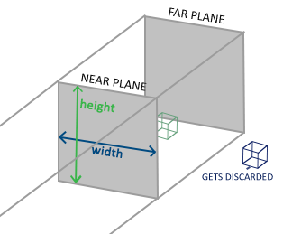
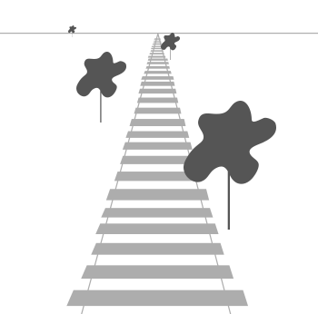
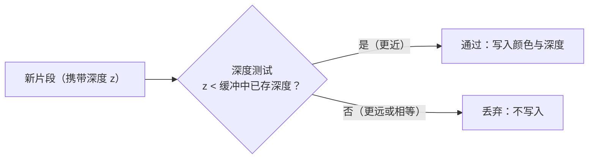
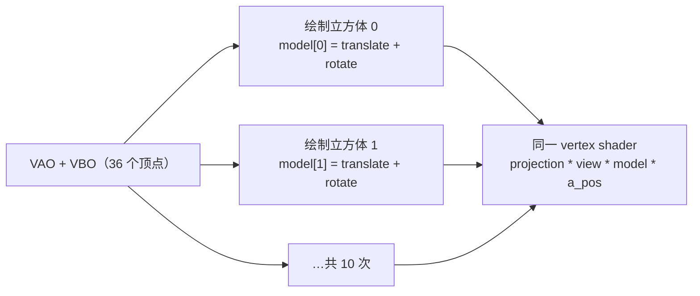
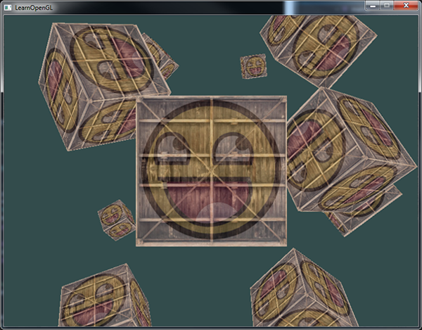

# 坐标系统

| 项目 | 内容 |
| --- | --- |
| 原文 | [Coordinate Systems](http://learnopengl.com/#!Getting-started/Coordinate-Systems) |
| 作者 | JoeyDeVries |
| 来源 | LearnOpenGL-CN（本文基于其内容整理修订） |
| 本仓库示例 | [`apps/01_getting_started/06_coordinate_systems/`](../../apps/01_getting_started/06_coordinate_systems/) |

上一节我们学会了用矩阵变换顶点。但变换**发生在哪个坐标系里**？OpenGL 期望在顶点着色器运行结束后，所有可见顶点的 x、y、z 坐标都落在 **-1.0 到 1.0** 之间——这个范围叫**标准化设备坐标**（Normalized Device Coordinate, NDC），超出范围的顶点不可见。（严格地说，顶点着色器输出的是裁剪坐标，OpenGL 会在其后自动执行裁剪与透视除法，最终才得到 NDC；详见下文「裁剪空间」。）我们通常会自己设定一个更方便的坐标范围，再在顶点着色器中把它们变换为 NDC，交给光栅器（Rasterizer）转换为屏幕上的二维坐标或像素。

**一句话核心：** 顶点从建模到屏幕要依次穿过**局部 → 世界 → 观察 → 裁剪 → 屏幕**五个坐标空间；每一步由一个矩阵负责（模型、观察、投影），这正是上一节「矩阵」知识的用武之地。

将坐标变换为 NDC、再转化为屏幕坐标的过程通常是分步进行的，像流水线一样。在流水线中，顶点在最终转化为屏幕坐标之前会经过多个**过渡**坐标系（Intermediate Coordinate System）。好处在于：在特定的坐标系统中，某些操作更方便——例如在局部空间修改物体、在世界空间摆放多个物体、在观察空间模拟相机。对我们比较重要的共有 5 个坐标系统：

- 局部空间（Local Space，也叫物体空间 Object Space）
- 世界空间（World Space）
- 观察空间（View Space，也叫视觉空间 Eye Space）
- 裁剪空间（Clip Space）
- 屏幕空间（Screen Space）

## 概述

为了把坐标从一个坐标系变换到另一个，我们需要几个变换矩阵，最重要的是**模型**（Model）、**观察**（View）、**投影**（Projection）三个矩阵。顶点坐标起始于**局部空间**（称为**局部坐标** Local Coordinate），依次变为**世界坐标**（World Coordinate）、**观察坐标**（View Coordinate）、**裁剪坐标**（Clip Coordinate），最后以**屏幕坐标**（Screen Coordinate）结束。下图展示了整个流程：


1. 局部坐标是对象相对于局部原点的坐标，也是物体起始的坐标。
2. 下一步把局部坐标变换为世界坐标：世界坐标相对于世界的全局原点，物体将和其他物体一起在世界中摆放。
3. 再把世界坐标变换为观察坐标：每个坐标都从摄像机/观察者的角度观察。
4. 坐标到达观察空间后，投影到裁剪坐标：裁剪坐标被处理到 -1.0 ~ 1.0 范围内，并判断哪些顶点会出现在屏幕上。
5. 最后，通过**视口变换**（Viewport Transform）把裁剪坐标变换为屏幕坐标：视口变换把 -1.0 ~ 1.0 范围的坐标映射到 `glViewport` 函数定义的像素范围，结果交给光栅器转化为片段。

每个空间都有其不可替代的用途，但也可以定义一个直接从局部到裁剪的矩阵——那会失去全部灵活性。分步变换的「全景链路」如下：


## 局部空间

**一句话核心：** 局部空间是物体「出生」时的坐标系——所有顶点都相对物体自身原点定义，与它最终被放在哪里无关。

局部空间指物体所在的坐标空间，即对象最开始所在的地方。想象在建模软件（比如 Blender）中创建了一个立方体，它的原点可能位于 (0, 0, 0)，即便它最后在程序中处于完全不同的位置；甚至所有模型都以 (0, 0, 0) 为初始位置，最终却出现在世界的不同角落。本仓库示例的立方体顶点定义在 -0.5 到 0.5 的范围内、(0, 0, 0) 是它的原点——这些就是局部坐标。

## 世界空间

**一句话核心：** 世界空间是物体在全局场景中的位置；把局部坐标搬进世界空间靠的是**模型矩阵**（Model Matrix）。

如果所有物体都导入程序却不做处理，它们会挤在世界原点 (0, 0, 0) 上。我们想为每个物体定义一个位置，把它们分散摆放在更大的世界中。模型矩阵通过对物体进行位移、缩放、旋转，把它放到本应该在的位置和朝向。你可以把上一节把箱子到处摆放用的那个变换矩阵看作一个模型矩阵——它把箱子的局部坐标变换到场景/世界中的不同位置。

## 观察空间

**一句话核心：** 观察空间（也叫摄像机空间、视觉空间）是世界坐标经过观察矩阵变换后、从相机视角看到的空间——「移动相机」等价于「反向移动整个世界」。

观察空间经常被称作 OpenGL 的**摄像机**（Camera）。观察矩阵（View Matrix）由一系列位移和旋转组合而成，把世界坐标变换到观察空间。下一节我们会深入讨论如何构造观察矩阵来模拟摄像机。

## 裁剪空间

**一句话核心：** 顶点着色器的输出必须是裁剪坐标——超出裁剪体积的顶点被丢弃，留在内部的顶点再经透视除法变成 NDC。

在顶点着色器运行的最后，OpenGL 期望所有坐标落在特定范围内（裁剪体积：\(-w \le x, y, z \le w\)），范围之外的点会被**裁剪掉**（Clipped），剩余坐标变成屏幕上可见的片段——这就是**裁剪空间**（Clip Space）名字的由来。把可见坐标直接指定在 -1.0 ~ 1.0 并不直观，所以我们指定自己的坐标集（例如每维 -1000 ~ 1000），再由**投影矩阵**（Projection Matrix）把它变换回 NDC。范围外的坐标（比如 (1250, 500, 750) 的 x 超出范围）会被裁剪掉。

> **重要：** 如果只是图元（Primitive，如三角形）的**一部分**超出裁剪体积，OpenGL 会重新构建这个三角形为一个或多个三角形，使其适合裁剪范围。

投影矩阵创建的**观察箱**（Viewing Box）称为**平截头体**（Frustum），平截头体内的坐标最终会出现在屏幕上。一旦所有顶点被变换到裁剪空间，最后一步操作——**透视除法**（Perspective Division）就会执行：把位置向量的 x、y、z 分量分别除以齐次 w 分量，把 4D 裁剪坐标变成 3D NDC。这一步在每次顶点着色器运行的最后自动完成。之后坐标经 `glViewport` 映射到屏幕空间，变成片段。

> **进阶（透视除法与齐次裁剪）：** 顶点着色器输出的其实是 4D 裁剪坐标，可见性判断发生在透视除法**之前**：
>
> - 裁剪体积是 \(-w \le x, y, z \le w\)：坐标落在此范围外的顶点/图元被裁剪，而不是等除以 w 之后才判断——这正是「裁剪空间」名字的由来。
> - 透视投影矩阵会把 w 分量设为观察空间深度的相反数（\(w = -z_{view}\)），所以「离相机越远 w 越大」；除以 w 之后，x、y 的缩放恰好产生近大远小。
> - 顺带解开一个伏笔：z 除以 w 后落在 [-1, 1]，再映射到 [0, 1] 就是深度缓冲存储的值——这正是本文章节「深度精度近高远低」的根源。GLSL 里 `gl_Position` 是 vec4，就是为了同时携带这 4 个分量。

投影矩阵有两种形式，每种定义不同的平截头体：**正射投影**和**透视投影**。

### 正射投影

**一句话核心：** 正射投影定义一个长方体视锥，内部坐标被平直地映射到 NDC——没有近大远小，适合 2D 渲染和工程制图。

正射投影矩阵定义一个类似立方体的平截头箱，宽、高、**近**（Near）平面和**远**（Far）平面之外的坐标都会被裁剪：



正射平截头体把所有内部坐标直接映射为 NDC——每个向量的 w 分量保持不变（等于 1.0），所以透视除法不会改变坐标。用 GLM 创建正射投影矩阵：调用 `glm::ortho(left, right, bottom, top, near, far)`，前两个参数是平截头体的左右坐标，第三、四个参数是底部和顶部坐标，由此确定近/远平面的大小；第五、六个参数是近/远平面的距离。由于没有透视，远处物体不会显得更小，视觉上不太真实——所以需要透视投影。

### 透视投影

**一句话核心：** 透视投影模拟「近大远小」：离观察者越远的顶点 w 分量越大，透视除法后坐标越小。

生活中离你越远的东西看起来越小，这个效果叫**透视**（Perspective）——看一条无限长的高速公路时，两条铁轨在远处似乎相交：



透视投影矩阵在把平截头体范围映射到裁剪空间的同时，**修改每个顶点的 w 值**，让离观察者越远的顶点 w 分量越大。变换到裁剪空间的坐标都落在 -w 到 w 之间（超出则被裁剪）。随后透视除法把每个分量除以 w：

$$
out = \begin{pmatrix} x / w \\ y / w \\ z / w \end{pmatrix}
$$

这就是 w 分量重要的另一个原因——它帮我们实现透视投影。GLM 创建透视投影矩阵，本仓库示例渲染循环中的调用如下（参数逐一对应 fov、宽高比、near、far）：

```c++
        const glm::mat4 projection{glm::perspective(
            glm::radians(45.0F),
            static_cast<float>(window_width) / static_cast<float>(window_height),
            0.1F,
            100.0F)};
```

第一个参数是 **fov**（**视野**，Field of View），设置观察空间的大小：真实感效果通常取 45.0f，想做出《毁灭战士》式的效果可以取更大值。第二个参数是宽高比（视口宽 ÷ 高）。第三、四个参数是平截头体的近、远平面，通常取 0.1f 和 100.0f。透视平截头体像一个不均匀的箱子：


> **重要：** 如果把透视矩阵的 near 值设得太大（如 10.0f），OpenGL 会把靠近摄像机的坐标（0.0f ~ 10.0f 之间）全部裁剪掉——你在游戏中见过的「太靠近物体时视线穿过去」就是这个效果。

正射投影下每个顶点直接映射到裁剪空间，w 保持 1，透视除法不起作用；透视投影下远处的顶点更小。下图是 Blender 中两种投影的对比：


## 把它们都组合到一起

为上述每一步创建变换矩阵后，一个顶点坐标按以下过程变换到裁剪坐标：

$$
V_{clip} = M_{projection} \cdot M_{view} \cdot M_{model} \cdot V_{local}
$$

注意矩阵运算的顺序是**相反的**（从右往左读：先 model、再 view、最后 projection）。最终的顶点应赋值给顶点着色器的 `gl_Position`，OpenGL 会自动执行透视除法和裁剪。

> **重要：然后呢？**
>
> 顶点着色器的输出要求所有顶点都在裁剪空间内——这正是我们刚用变换矩阵做的事。OpenGL 随后对裁剪坐标执行透视除法得到 NDC，再用 `glViewport` 的参数把 NDC 映射到屏幕坐标（本例是 800×600 的窗口），每个坐标关联一个屏幕上的点。这个过程叫视口变换。

> **进阶（NDC 到屏幕坐标：视口变换公式）：** 视口变换是「NDC → 像素」的最后一步，`glViewport` 的参数直接决定了映射公式：
>
> - 设视口为 `glViewport(x, y, width, height)`，NDC 点 \((x_n, y_n)\) 映射为屏幕坐标 \(((x_n + 1) \cdot width / 2 + x,\ (y_n + 1) \cdot height / 2 + y)\)——NDC 的 (-1, -1) 落在视口左下角，(1, 1) 落在右上角。
> - 因此当视口宽高比与投影矩阵的 aspect 参数不一致时，画面会被拉伸；本仓库窗口固定为 800×600，两者始终一致。
> - 窗口被缩放时，`framebuffer_size_callback` 重新调用 `glViewport` 正是在更新这组映射；而投影矩阵的宽高比需要单独重新计算（示例窗口固定，所以两者都不变）。

这一章主题较难理解，如果还不确定每个空间的作用也不必担心——接下来看实际代码，之后也会有更多例子。

# 进入 3D

既然知道了如何把 3D 坐标变换为 2D 坐标，是时候使用真正的 3D 物体了。本仓库示例 `06_coordinate_systems` 把上一节的平面矩形升级为 36 个顶点的纹理立方体，并首次启用深度测试。先看顶点着色器（内嵌于 `main.cpp` 的 `vertex_shader_source`）：

```glsl
#version 330 core
layout (location = 0) in vec3 a_pos;
layout (location = 1) in vec2 a_tex_coord;

out vec2 tex_coord;

uniform mat4 model;
uniform mat4 view;
uniform mat4 projection;

void main()
{
    gl_Position = projection * view * model * vec4(a_pos, 1.0);
    tex_coord = a_tex_coord;
}
```

这行 `gl_Position = projection * view * model * vec4(a_pos, 1.0);` 就是上一节公式的代码形态——从右往左依次是模型、观察、投影。三个 uniform 在初始化阶段缓存（`model_uniform`、`view_uniform`、`projection_uniform`），每帧重新上传。

## 模型矩阵：把物体放进世界

**一句话核心：** 模型矩阵对每个物体独立——把它的局部坐标搬到世界坐标；10 个立方体共享同一份顶点数据，只靠不同的 model 矩阵区分。

立方体的顶点数据是 180 个 float（36 个顶点 × 位置 3 + 纹理坐标 2），6 个面每面由 2 个三角形组成，顶点按「每面 6 个顶点」展开存储（无需 EBO，直接用 `glDrawArrays(GL_TRIANGLES, 0, 36)` 绘制）：

```c++
    constexpr std::array<float, 180> vertices{
        -0.5F, -0.5F, -0.5F, 0.0F, 0.0F,
        0.5F, -0.5F, -0.5F, 1.0F, 0.0F,
        0.5F, 0.5F, -0.5F, 1.0F, 1.0F,
        0.5F, 0.5F, -0.5F, 1.0F, 1.0F,
        -0.5F, 0.5F, -0.5F, 0.0F, 1.0F,
        -0.5F, -0.5F, -0.5F, 0.0F, 0.0F,

        -0.5F, -0.5F, 0.5F, 0.0F, 0.0F,
        0.5F, -0.5F, 0.5F, 1.0F, 0.0F,
        0.5F, 0.5F, 0.5F, 1.0F, 1.0F,
        0.5F, 0.5F, 0.5F, 1.0F, 1.0F,
        -0.5F, 0.5F, 0.5F, 0.0F, 1.0F,
        -0.5F, -0.5F, 0.5F, 0.0F, 0.0F,

        -0.5F, 0.5F, 0.5F, 1.0F, 0.0F,
        -0.5F, 0.5F, -0.5F, 1.0F, 1.0F,
        -0.5F, -0.5F, -0.5F, 0.0F, 1.0F,
        -0.5F, -0.5F, -0.5F, 0.0F, 1.0F,
        -0.5F, -0.5F, 0.5F, 0.0F, 0.0F,
        -0.5F, 0.5F, 0.5F, 1.0F, 0.0F,

        0.5F, 0.5F, 0.5F, 1.0F, 0.0F,
        0.5F, 0.5F, -0.5F, 1.0F, 1.0F,
        0.5F, -0.5F, -0.5F, 0.0F, 1.0F,
        0.5F, -0.5F, -0.5F, 0.0F, 1.0F,
        0.5F, -0.5F, 0.5F, 0.0F, 0.0F,
        0.5F, 0.5F, 0.5F, 1.0F, 0.0F,

        -0.5F, -0.5F, -0.5F, 0.0F, 1.0F,
        0.5F, -0.5F, -0.5F, 1.0F, 1.0F,
        0.5F, -0.5F, 0.5F, 1.0F, 0.0F,
        0.5F, -0.5F, 0.5F, 1.0F, 0.0F,
        -0.5F, -0.5F, 0.5F, 0.0F, 0.0F,
        -0.5F, -0.5F, -0.5F, 0.0F, 1.0F,

        -0.5F, 0.5F, -0.5F, 0.0F, 1.0F,
        0.5F, 0.5F, -0.5F, 1.0F, 1.0F,
        0.5F, 0.5F, 0.5F, 1.0F, 0.0F,
        0.5F, 0.5F, 0.5F, 1.0F, 0.0F,
        -0.5F, 0.5F, 0.5F, 0.0F, 0.0F,
        -0.5F, 0.5F, -0.5F, 0.0F, 1.0F,
    };
```

注意每个面的纹理坐标从 (0, 0) 覆盖到 (1, 1)，让棋盘纹理完整贴满该面；相邻面的共享顶点按面展开重复存储，这是「以空间换简单」的典型做法。

10 个立方体的世界位置存放在 `cube_positions` 数组中：

```c++
    constexpr std::array<glm::vec3, 10> cube_positions{
        glm::vec3{0.0F, 0.0F, 0.0F},
        glm::vec3{2.0F, 5.0F, -15.0F},
        glm::vec3{-1.5F, -2.2F, -2.5F},
        glm::vec3{-3.8F, -2.0F, -12.3F},
        glm::vec3{2.4F, -0.4F, -3.5F},
        glm::vec3{-1.7F, 3.0F, -7.5F},
        glm::vec3{1.3F, -2.0F, -2.5F},
        glm::vec3{1.5F, 2.0F, -2.5F},
        glm::vec3{1.5F, 0.2F, -1.5F},
        glm::vec3{-1.3F, 1.0F, -1.5F},
    };
```

## 观察矩阵：把相机放到场景中

**一句话核心：** 观察矩阵「移动的是整个世界而不是相机」——向后移动相机等价于把场景向相反方向移动。

在场景中移动相机，关键想法是：

- **将摄像机向后移动，和将整个场景向前移动是一样的。**

OpenGL 是**右手坐标系**（Right-handed System）：正 x 轴在右手边，正 y 轴朝上，正 z 轴朝向你。要获得「往后退」的感觉，就把场景沿 z 轴负方向平移。本仓库示例的观察矩阵在渲染循环中每帧构造：

```c++
        const glm::mat4 view{glm::lookAt(
            glm::vec3{0.0F, 0.0F, 3.0F},
            glm::vec3{0.0F, 0.0F, 0.0F},
            glm::vec3{0.0F, 1.0F, 0.0F})};
```

> **重要：右手坐标系**
>
> 为了理解为什么叫「右手」坐标系，按如下步骤做：沿正 y 轴方向伸出右臂，手指向上；大拇指指向右方，食指指向上方，中指弯曲 90 度指向自己。如果动作正确，大拇指指向正 x 轴、食指指向正 y 轴、中指指向正 z 轴：
>
> 
>
> 用左臂做同样的动作，z 轴方向相反——那是左手坐标系，被 DirectX 广泛使用。注意：在 NDC 中 OpenGL 实际上使用左手坐标系（投影矩阵交换了左右手）。

## 投影矩阵：把 3D 视锥投影到裁剪空间

**一句话核心：** 投影矩阵定义「看得见的世界」——视锥内保留、视锥外裁剪，同时为透视除法准备好 w 值。

本示例采用上文透视投影小节的调用：fov 45°、宽高比 800/600、近平面 0.1、远平面 100。三个矩阵每帧都通过 `glUniformMatrix4fv` 上传：

```c++
        glUniformMatrix4fv(view_uniform, 1, GL_FALSE, glm::value_ptr(view));
        glUniformMatrix4fv(projection_uniform, 1, GL_FALSE, glm::value_ptr(projection));
```

结果：10 个立方体散布在场景中、各自绕轴缓慢旋转，离我们有一段距离，并有明显的透视效果（近大远小）。

> **职责边界：** 两个「窗口相关」的 API 经常被混淆，它们的职责完全不同：
> - **投影矩阵（顶点着色器内生效）**：决定「透视还是正射、fov 多大、近远平面在哪」——即 3D 世界如何被压缩进裁剪空间。
> - **`glViewport`（光栅化前生效）**：决定「裁剪空间坐标映射到窗口的哪块像素区域」——它只做 2D 窗口像素映射，不做任何投影。
>
> 本仓库示例的 `framebuffer_size_callback` 中注释写得很清楚：`投影矩阵控制透视效果，glViewport 控制裁剪空间到窗口像素的映射`。窗口 resize 时只需重设 glViewport，投影矩阵的宽高比参数则要单独更新（示例窗口固定，所以两者都不变）。

## 深度测试：让遮挡正确

**一句话核心：** 没有深度测试时，GPU 按提交顺序绘制三角形，后面的三角形会覆盖前面的——无论谁更近；深度测试用每个片段的深度值决定谁该被看见。

OpenGL 是一个三角形一个三角形地绘制立方体的，后绘制的三角形会覆盖先绘制的像素——即使它本应在后面。之前我们看到的「说不出的奇怪」立方体正是这个原因。幸运的是，OpenGL 在**Z 缓冲**（Z-buffer，也叫**深度缓冲** Depth Buffer）中存储深度信息：每个片段携带 z 值，写入颜色前先与缓冲中的深度比较，若在更远处则丢弃，否则覆盖。这个过程叫**深度测试**（Depth Testing），默认关闭，必须显式开启（本示例在 `main()` 初始化阶段）：

```c++
    // OpenGL: 深度测试会用深度缓冲记录离相机最近的片段，避免后面的面覆盖前面的面。
    glEnable(GL_DEPTH_TEST);
```

开启深度测试后，每帧还要清除深度缓冲，否则上一帧的深度信息残留：

```c++
        glClearColor(0.06F, 0.08F, 0.12F, 1.0F);
        glClear(GL_COLOR_BUFFER_BIT | GL_DEPTH_BUFFER_BIT);
```

> **分层解释：** 深度缓冲的分配由谁负责？
> - **GLFW（窗口库）**：创建窗口的默认帧缓冲时一并分配颜色缓冲和深度缓冲。
> - **OpenGL 状态机**：`glEnable(GL_DEPTH_TEST)` 开启深度测试开关；`glClear(GL_DEPTH_BUFFER_BIT)` 清空缓冲。
> - **显卡驱动**：实际执行逐片段的深度比较与写入。
>
> 深度测试的决策流程：



> **注意：** 深度缓冲的精度不是均匀的——深度值经过透视除法后，**离相机近的区间分到的精度高、远的区间精度低**（近大远小压缩所致）。这会在远距离物体上引起深度值相近、互相闪烁的「深度冲突」（Z-fighting）。缓解手段包括：缩小近/远平面距离差、提高深度缓冲位宽、使用更高精度的深度算法——但理解其根源（透视除法后的非线性分布）更为重要。

## 渲染 10 个立方体

10 个立方体外观相同，只是世界位置与旋转不同。图形布局已定义好，渲染更多物体时**不需要改变缓冲数组和属性数组**——只需在绘制每个立方体前更新 model 矩阵。渲染循环中的小循环：

```c++
        for (std::size_t index{0}; index < cube_positions.size(); ++index) {
            glm::mat4 model{1.0F};
            model = glm::translate(model, cube_positions[index]);
            const float angle{20.0F * static_cast<float>(index)};
            model = glm::rotate(
                model,
                glm::radians(angle) + static_cast<float>(glfwGetTime()) * 0.25F,
                glm::vec3{1.0F, 0.3F, 0.5F});

            // OpenGL: 每个立方体只改变 model uniform，VAO/VBO 和纹理都可以复用。
            glUniformMatrix4fv(model_uniform, 1, GL_FALSE, glm::value_ptr(model));
            glDrawArrays(GL_TRIANGLES, 0, 36);
        }
```

每个立方体：先位移到 `cube_positions[index]`，再绕 (1.0, 0.3, 0.5) 轴旋转——基准角度 `20.0F * index` 让各立方体姿态不同，`glfwGetTime() * 0.25F` 让所有立方体随时间缓慢旋转。10 次 `glDrawArrays(GL_TRIANGLES, 0, 36)` 复用同一个 VAO/VBO/纹理，只改一个 uniform：



最终看到 10 个不断旋转、彼此遮挡正确的纹理立方体：



[查看无深度测试的对比视频](../img/01/08/coordinate_system_no_depth.mp4) · [查看开启深度测试后的视频](../img/01/08/coordinate_system_depth.mp4)

> **局部→整体：** 对照全景图回顾这一帧发生了什么：顶点从局部坐标出发 → model 矩阵把它放进世界（10 个立方体 = 10 个 model）→ view 矩阵让世界处于相机视角（固定观察点 (0,0,3) 看向原点）→ projection 矩阵投影到裁剪空间 → 透视除法 → 深度测试决定遮挡 → 屏幕。前四步都在顶点着色器内完成，深度测试发生在光栅化阶段。

## 练习

- 对 GLM 的 `projection` 函数中的 FoV 和 aspect-ratio 参数做实验，看它们如何影响透视平截头体。
- 把观察矩阵在各个方向上位移，观察场景如何变化。可以把观察矩阵当作摄像机对象来理解。
- 使用模型矩阵只让索引为 3 的倍数的箱子旋转（以及第 1 个箱子），其余保持静止（参考解答见原文链接）。

## 本仓库示例

示例目录：`apps/01_getting_started/06_coordinate_systems/`

构建（默认 MinGW GCC Debug，需 MSYS2 UCRT64 在 PATH 中）：

```powershell
conan install . -of build/mingw-gcc-debug -pr:h conan/profiles/mingw-gcc -pr:b conan/profiles/mingw-gcc -s build_type=Debug --build=missing
cmake --preset mingw-gcc-debug
cmake --build --preset mingw-gcc-debug
```

运行：

```powershell
.\build\mingw-gcc-debug\apps\01_getting_started\06_coordinate_systems\01_getting_started__06_coordinate_systems.exe
```

运行时交互：按 **Esc**（退出键）退出程序；场景为自动动画——10 个纹理立方体在固定视角（相机静止于 (0, 0, 3) 看向原点）下各自缓慢旋转，深度测试保证前后遮挡正确。窗口大小固定为 800×600，纹理从 `assets/textures/checker.ppm` 加载。

## 本章整体回顾

本节把上一节的「单个变换矩阵」扩展为「三级变换管线」：

- **局部（五个空间）**：局部、世界、观察、裁剪、屏幕——每个空间解决一个具体问题：建模、摆放、取景、裁剪、显示。
- **局部（三个矩阵）**：model 矩阵（物体位置/姿态）、view 矩阵（相机）、projection 矩阵（视锥 + 透视），三者相乘得到最终的 MVP 矩阵，在顶点着色器中对每个顶点执行一次。
- **整体（新增机制）**：深度测试解决了 3D 物体相互遮挡的问题——GLFW 分配深度缓冲、`glEnable(GL_DEPTH_TEST)` 开启、每帧 `glClear` 清除。

注意一个明显的「缺口」：view 矩阵目前是写死的 `lookAt((0,0,3), (0,0,0), up)`，相机一动不动。下一节「摄像机」将填上这个缺口——用键盘 WASD 移动、鼠标转动视角、滚轮缩放视野，让 view 矩阵由交互状态驱动，形成完整的第一人称漫游体验。

下一节：[摄像机](09_camera.md)
