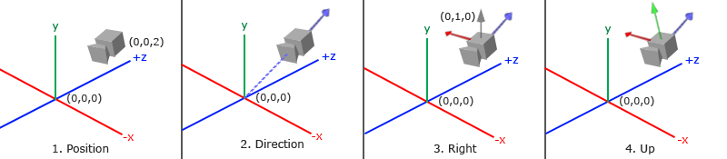
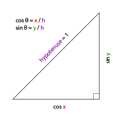
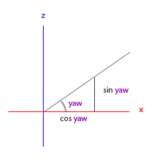
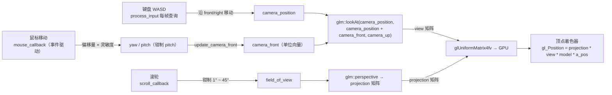

# 摄像机

| 项目 | 内容 |
| --- | --- |
| 原文 | [Camera](http://learnopengl.com/#!Getting-started/Camera) |
| 作者 | JoeyDeVries |
| 来源 | LearnOpenGL-CN（本文基于其内容整理修订） |
| 本仓库示例 | [`apps/01_getting_started/07_camera/`](../../apps/01_getting_started/07_camera/) |

上一节我们讨论了观察矩阵，并用一个固定位置的 `glm::lookAt` 把世界放到了相机视角。但 OpenGL 本身**没有摄像机**（Camera）的概念——我们只是把场景中的所有物体往相反方向移动，从而模拟出「**我们**在移动」的感觉。

**一句话核心：** 摄像机不是 OpenGL 实体，而是三个向量（位置、朝向、上方向）加一个 `lookAt` 函数：只要每帧根据输入更新这些向量、重新生成 view 矩阵，就得到了一个可自由移动的第一人称摄像机。

> **职责边界：** 「摄像机」涉及三层分工，理解后代码结构一目了然：
> - **OpenGL 规范**：完全没有摄像机的概念，也不提供任何相机 API——它只认 view 矩阵（观察空间变换）。
> - **GLFW**：只负责报告输入事件（键盘状态查询、鼠标移动/滚轮回调），不知道也不关心相机。
> - **应用程序（你 + GLM）**：负责一切相机逻辑——保存位置/朝向/角度状态、把输入换算成状态更新、用 `glm::lookAt` 生成 view 矩阵。这正是本仓库示例把相机状态放在匿名命名空间顶部的原因。

本节我们会在 3D 场景中配置一个 FPS 风格的摄像机，支持键盘移动、鼠标转视角、滚轮缩放，最终完成一个可交互的漫游体验。

## 摄像机/观察空间

当我们讨论摄像机/观察空间（Camera/View Space）时，是在讨论「以摄像机的视角作为场景原点」时所有顶点的坐标：观察矩阵把世界坐标变换为相对于摄像机位置与方向的观察坐标。要定义一个摄像机，需要它在世界空间中的**位置**、**观察方向**、一个指向它**右侧**的向量，以及一个指向它**上方**的向量——这实际上创建了一个以摄像机位置为原点、三个单位轴互相垂直的坐标系：



### 1. 摄像机位置

**一句话核心：** 摄像机位置就是世界空间中一个指向相机位置的向量。

本仓库示例在 `main.cpp` 匿名命名空间的顶部保存相机状态——因为 GLFW 的回调是 C 风格函数，必须通过文件内（namespace 内）状态访问相机参数：

```c++
// Camera: GLFW 的键鼠回调是 C 风格函数，因此这里用少量 namespace 内状态保存相机参数。
glm::vec3 camera_position{0.0F, 0.0F, 3.0F};
glm::vec3 camera_front{0.0F, 0.0F, -1.0F};
glm::vec3 camera_up{0.0F, 1.0F, 0.0F};
```

> **重要：** 不要忘记正 z 轴是从屏幕指向你的。如果希望摄像机向后移动，就沿 z 轴的正方向移动——这正是 `camera_position{0.0F, 0.0F, 3.0F}` 把相机放在 z = +3 处的原因：相机位于原点「前方」3 个单位，看向原点。

### 2. 摄像机方向

下一个需要的向量是摄像机的方向——它指向哪里。这里我们用 `camera_front`（指向 z 轴负方向）表示相机**看向的方向**，而不是用「从目标指向相机」的反向向量。这样 `glm::lookAt` 可以直接用 `camera_position + camera_front` 作为观察目标点。

### 3. 右轴与上轴

**一句话核心：** 右轴 = 上向量 × 方向向量（叉乘）；上轴 = 方向向量 × 右轴。叉乘能从两个已知向量构造出第三个互相垂直的向量——这就是上一节数学知识的第一次实战。

- **右向量**（Right Vector，摄像机空间 x 轴正方向）：用方向向量和上向量做叉乘得到（即下文 `process_input` 里的 `glm::cross(camera_front, camera_up)`；顺序颠倒会得到指向负 x 轴的向量）。两个向量叉乘的结果同时垂直于两者，于是得到指向 x 轴正方向的向量。
- **上向量**（Up Vector，摄像机空间 y 轴正方向）：把右向量和方向向量再叉乘一次。上向量并不需要与「世界上方」完全一致——摄像机倾斜时它随之倾斜，这正是第一人称相机该有的行为。

在线性代数中，这个用三个正交轴构造坐标空间的过程叫做[格拉姆—施密特正交化](http://en.wikipedia.org/wiki/Gram%E2%80%93Schmidt_process)（Gram-Schmidt Process）。本仓库没有单独保存 `camera_right`，而是在每帧需要时现场计算（见下文 `process_input`）。

## Look At

**一句话核心：** LookAt 矩阵 = 「旋转部分（三个正交轴）」 × 「平移部分（−摄像机位置）」——它把世界平移/旋转到以摄像机为原点的坐标系；GLM 的 `glm::lookAt` 一行即可完成。

使用矩阵的好处之一是：如果用 3 个互相垂直的轴定义了一个坐标空间，就可以用这 3 个轴外加一个平移向量创建矩阵，用它乘以任何向量即可变换到那个坐标空间。这正是 LookAt 矩阵：

$$
LookAt = \begin{bmatrix} \color{red}{R_x} & \color{red}{R_y} & \color{red}{R_z} & 0 \\ \color{green}{U_x} & \color{green}{U_y} & \color{green}{U_z} & 0 \\ \color{blue}{D_x} & \color{blue}{D_y} & \color{blue}{D_z} & 0 \\ 0 & 0 & 0 & 1 \end{bmatrix} \cdot \begin{bmatrix} 1 & 0 & 0 & -\color{purple}{P_x} \\ 0 & 1 & 0 & -\color{purple}{P_y} \\ 0 & 0 & 1 & -\color{purple}{P_z} \\ 0 & 0 & 0 & 1 \end{bmatrix}
$$

其中 \(\color{red}R\) 是右向量、\(\color{green}U\) 是上向量、\(\color{blue}D\) 是方向向量、\(\color{purple}P\) 是摄像机位置。位置取反是因为我们最终要把世界平移到与我们自身移动的**相反方向**。把这个矩阵作为观察矩阵，就能高效地把所有世界坐标变换到观察空间。

GLM 已经提供完整实现，只需提供位置、目标和上向量：

```c++
        // GLM: lookAt 根据相机位置、观察目标点和上方向生成 view 矩阵。
        const glm::mat4 view{glm::lookAt(
            camera_position, camera_position + camera_front, camera_up)};
```

观察目标点是 `camera_position + camera_front`——无论相机怎么移动和转动，它都注视着前方 `camera_front` 方向。这是本示例渲染循环中每帧重新生成的 view 矩阵（原始教程还演示过让相机绕场景画圆的版本：以半径为 radius 的圆上的点 `(sin(t)·radius, 0, cos(t)·radius)` 作为相机位置、注视点固定在原点，摄像机就会绕着场景转动；[演示视频](../img/01/09/camera_circle.mp4)）。

## 自由移动

让摄像机绕着场景转很有趣，但自己控制摄像机更有趣。我们的目标是：按下 WASD 键时更新 `camera_position` 向量。本仓库示例的 `process_input` 函数（与前面章节相同的函数名，位于匿名命名空间）：

```c++
void process_input(GLFWwindow* window) {
    if (glfwGetKey(window, GLFW_KEY_ESCAPE) == GLFW_PRESS) {
        glfwSetWindowShouldClose(window, GLFW_TRUE);
    }

    const float camera_speed{camera_speed_units_per_second * delta_time};
    const glm::vec3 camera_right{glm::normalize(glm::cross(camera_front, camera_up))};

    if (glfwGetKey(window, GLFW_KEY_W) == GLFW_PRESS) {
        camera_position += camera_speed * camera_front;
    }
    if (glfwGetKey(window, GLFW_KEY_S) == GLFW_PRESS) {
        camera_position -= camera_speed * camera_front;
    }
    if (glfwGetKey(window, GLFW_KEY_A) == GLFW_PRESS) {
        camera_position -= camera_speed * camera_right;
    }
    if (glfwGetKey(window, GLFW_KEY_D) == GLFW_PRESS) {
        camera_position += camera_speed * camera_right;
    }
}
```

逐行拆解：

- **W/S**：沿 `camera_front` 前进/后退（加/减方向向量）。
- **A/D**：沿 `camera_right` 横移（Strafe）。右向量每帧现场用叉乘计算：`glm::normalize(glm::cross(camera_front, camera_up))`。
- 速度：`camera_speed_units_per_second` 是常量 2.50（单位/秒），乘以 `delta_time` 后变成与帧率无关的位移量。

> **重要：** 右向量必须**标准化**。如果不标准化，叉乘结果的长度会随 `camera_front` 变化——相机的朝向不同，移动速度就不同；标准化后移动速度恒定。同理，`camera_front` 本身也始终是单位向量（`update_camera_front` 中归一化），这正是上一节「单位向量」的用武之地。

## 移动速度与 delta_time

**一句话核心：** 固定速度乘以**时间差**（delta_time）后，移动速度与帧率无关——快电脑和慢电脑上的移动体验一致。

目前移动速度是常量，但不同电脑的帧率不同：每秒绘制更多帧 = 更频繁地调用 `process_input`，移动就更快。发布程序时，必须保证所有硬件上的移动速度一致。图形程序通常跟踪**时间差**（Deltatime）变量，它存储渲染上一帧所用的时间，把所有速度都乘以它：delta_time 大说明上一帧耗时多，这一帧需要移动更多来补偿。

本仓库示例的相机状态里有 `delta_time` 和 `last_frame_time` 两个全局变量，渲染循环每帧开头更新：

```c++
        const float current_frame_time{static_cast<float>(glfwGetTime())};
        delta_time = current_frame_time - last_frame_time;
        last_frame_time = current_frame_time;
```

> **常见误解：** `glfwGetTime()` 返回的是一帧的时间。
> **纠正：** `glfwGetTime()` 返回程序启动以来的累计秒数。当前帧时刻减去上一帧时刻才是这一帧的耗时（delta_time）。把「当前时刻」存进 `last_frame_time`，下一帧再减，循环往复。

至此，我们有了一个在任何系统上移动速度都一致的摄像机系统（[演示视频](../img/01/09/camera_smooth.mp4)）。

> **进阶（帧率无关运动：固定时间步长）：** delta_time 让速度与帧率无关，但它让每帧的位移量随帧耗时抖动；需要稳定、可复现逻辑的场合（物理引擎、网络同步、回放）常用**固定时间步长**（Fixed Timestep）：
>
> - 思路：把逻辑固定在离散的 1/60 秒步长上，渲染帧只负责累加已流逝的时间，够一个步长就补执行一步——逻辑永远以相同节奏前进，与渲染帧率完全解耦。
> - 与 delta_time 的区别：delta_time 每帧都变（帧率高则单步位移小、帧率低则大），固定步长则恒定。前者适合相机这类「视觉速度」控制，后者适合碰撞检测这类「一步跨过就不安全」的模拟。
> - 本仓库的相机只用 delta_time 就够了；若你在示例中加入物体运动与碰撞，建议把模拟放进固定步长循环，避免低帧率时物体一帧「穿墙而过」。

## 视角移动

只用键盘移动没什么意思——不能转向，移动很受限制。是时候加入鼠标了。

**一句话核心：** 鼠标水平移动改变**偏航角**（yaw），竖直移动改变**俯仰角**（pitch）；把两个角度换算成方向向量，就实现了「转头」。

### 欧拉角

**欧拉角**（Euler Angle）是可以表示 3D 空间中任何旋转的 3 个值：**俯仰角**（Pitch）、**偏航角**（Yaw）和**滚转角**（Roll）：


俯仰角描述我们如何往上/往下看，偏航角描述往左/往右看的程度，滚转角描述「翻滚」摄像机（通常在太空飞船摄像机中使用）。对本仓库的 FPS 摄像机，我们只关心俯仰角和偏航角。

给定俯仰角 \(\theta\) 和偏航角 \(\phi\)，把它们转换为 3D 方向向量需要一点三角学。首先，把斜边长度定义为 1，则邻边是 \(\cos x\)、对边是 \(\sin y\)：



由此，俯仰角决定 y 分量（向上看多少）和 x/z 方向的长度（从三角形可知 x、z 分量都含 \(\cos(pitch)\)）：


偏航角则决定 x、z 分量如何在水平面分配：



综合两者得到方向向量：

$$
direction.x = \cos(pitch) \cdot \cos(yaw), \quad direction.y = \sin(pitch), \quad direction.z = \cos(pitch) \cdot \sin(yaw)
$$

本仓库示例把这段计算封装在 `update_camera_front()` 中（注意 yaw 的初始值是 −90°，这样相机初始朝向 z 轴负方向，与 `camera_front{0,0,-1}` 一致）：

```c++
void update_camera_front() {
    const glm::vec3 front{
        glm::cos(glm::radians(yaw)) * glm::cos(glm::radians(pitch)),
        glm::sin(glm::radians(pitch)),
        glm::sin(glm::radians(yaw)) * glm::cos(glm::radians(pitch)),
    };
    camera_front = glm::normalize(front);
}
```

> **职责边界：** 角度 → 向量的数学由**应用程序**（GLM）在 CPU 完成；`glm::radians` 把角度转弧度，`glm::normalize` 保证结果为单位向量。OpenGL/GPU 不参与「算方向」，只消费最终的 view 矩阵。

## 鼠标输入

**一句话核心：** 鼠标回调的职责是「算出偏移 → 更新 yaw/pitch → 钳制 pitch → 重算 camera_front」，与渲染循环解耦——GLFW 在事件轮询时自动调用回调。

首先告诉 GLFW 隐藏并**捕捉**（Capture）光标：窗口获得焦点后，光标被隐藏并停留在窗口中心附近，适合 FPS 摄像机。注册回调（`main()` 中 `glfwMakeContextCurrent` 之后）：

```c++
    glfwSetCursorPosCallback(window, mouse_callback);
    glfwSetScrollCallback(window, scroll_callback);

    // GLFW: 禁用系统鼠标光标后，鼠标移动会持续报告给窗口，适合第一人称相机。
    glfwSetInputMode(window, GLFW_CURSOR, GLFW_CURSOR_DISABLED);
```

鼠标移动时，GLFW 会调用 `mouse_callback`（每次 `glfwPollEvents` 处理事件时触发）。本仓库的回调实现：

```c++
void mouse_callback(GLFWwindow*, double x_position, double y_position) {
    const float current_x{static_cast<float>(x_position)};
    const float current_y{static_cast<float>(y_position)};

    if (first_mouse) {
        last_mouse_x = current_x;
        last_mouse_y = current_y;
        first_mouse = false;
    }

    float x_offset{current_x - last_mouse_x};
    float y_offset{last_mouse_y - current_y};
    last_mouse_x = current_x;
    last_mouse_y = current_y;

    x_offset *= mouse_sensitivity;
    y_offset *= mouse_sensitivity;

    yaw += x_offset;
    pitch += y_offset;

    // Camera: pitch 限制在 (-89, 89)，避免相机正上/正下时 right/up 向量退化。
    if (pitch > 89.0F) {
        pitch = 89.0F;
    }
    if (pitch < -89.0F) {
        pitch = -89.0F;
    }

    update_camera_front();
}
```

关键细节：

1. **首次进入窗口的跳变**：窗口刚获得焦点时，回调收到的鼠标位置可能是屏幕边缘，产生巨大偏移导致视角「跳一下」。`first_mouse` 标志解决这个问题：第一次回调只记录初始位置、不更新角度。
2. **y 轴方向相反**：`y_offset = last_mouse_y - current_y`——屏幕坐标 y 向下增大，而相机 pitch 向上为正，所以要取反。
3. **灵敏度**：`mouse_sensitivity` 是常量 0.10F（定义于文件顶部），把像素偏移量缩放到合适的角度增量。
4. **pitch 钳制在 (−89°, 89°)**：超过 90° 视角会翻转，且相机正上/正下时右向量退化（叉乘结果趋近零向量）。限制在 89° 内保证用户只能看到天空或脚下。yaw 不加限制——用户应当可以无限水平旋转。

## 缩放

**一句话核心：** 滚轮改变 fov，fov 改变透视投影矩阵——fov 变小 = 视野收窄 = 放大。

视野（Field of View, fov）定义了我们能看到场景中多大的范围。fov 变小时，投影出的空间减小，产生放大（Zoom In）的感觉。滚轮回调：

```c++
void scroll_callback(GLFWwindow*, double, double y_offset) {
    field_of_view -= static_cast<float>(y_offset);
    if (field_of_view < 1.0F) {
        field_of_view = 1.0F;
    }
    if (field_of_view > 45.0F) {
        field_of_view = 45.0F;
    }
}
```

滚动滚轮时，`y_offset` 是竖直滚动量（向上为正），更新全局变量 `field_of_view` 并钳制在 1.0° 到 45.0°（45° 是默认视野，1° 是最强放大）。随后渲染循环用它生成投影矩阵：

```c++
        const glm::mat4 projection{glm::perspective(
            glm::radians(field_of_view),
            static_cast<float>(window_width) / static_cast<float>(window_height),
            0.1F,
            100.0F)};
```

至此，一个完整的交互摄像机系统就位了（[演示视频](../img/01/09/camera_mouse.mp4)）。把整帧的输入 → 状态 → 矩阵 → GPU 链路画成全景图：



> **局部→整体：** 三个输入源（键盘、鼠标、滚轮）分别驱动三个状态（位置、角度、fov），三个状态分别决定 view 矩阵的两要素（位置 + 朝向）和 projection 矩阵的 fov——最终全部汇入顶点着色器的那一行乘法。输入与渲染之间唯一的桥梁就是每帧重新生成矩阵并上传，这正是整个章节一直在练习的「数据流」模式。

## 摄像机类的取舍

原始教程在完成交互摄像机后，会把相机抽象成一个 `Camera` 类（头文件），供后续所有章节复用。一个典型的摄像机类会封装：

- **状态**：位置、前向、上向、yaw/pitch、fov、灵敏度等私有成员；
- **行为**：`process_keyboard`（WASD + delta_time）、`process_mouse_movement`（偏移量 → 角度 → 前向）、`process_mouse_scroll`（fov 钳制）、`get_view_matrix`（返回 `lookAt` 结果）等公开接口。

同时要记住 FPS 摄像机系统的局限：不允许俯仰角超过 90°，使用固定的上向量 (0, 1, 0)，在需要考虑滚转角的场合（如飞行模拟）不能直接使用；欧拉角方案本身仍可能引入[万向节死锁](http://en.wikipedia.org/wiki/Gimbal_lock)问题，更稳妥的相机系统基于四元数（Quaternion）。

本仓库刻意保持**单文件**结构：相机状态、`update_camera_front`、`process_input`、两个回调全部放在 `main.cpp` 的匿名命名空间内，方便观察「输入状态 → 相机向量 → view 矩阵 → GPU uniform」的完整数据流。理解本节的数据流后，再阅读任何版本的 `Camera` 类都会一目了然——类只是把本节的状态与函数换个容器装起来而已。

> **进阶（欧拉角与万向锁，为什么游戏常用四元数）：** 只用 yaw/pitch/roll 三个角度描述旋转，在特定姿态下会丢失一个旋转自由度——这就是**万向锁**（Gimbal Lock）：
>
> - 当 pitch 转到 ±90° 时，yaw 与 roll 的旋转轴在空间中对齐，两个角度只能描述同一个方向的转动，某个轴上的转动变得不可达；这也是本节把 pitch 钳制在 ±89° 的原因之一。
> - 因此游戏引擎普遍用**四元数**（Quaternion）表示旋转：四个分量、天然无万向锁、两个姿态之间可平滑插值（slerp），而且比 4×4 矩阵更省内存。GLM 的 `glm::quat` 与 `glm::rotate(quat, ...)` 可以无缝替换本节的角度方案。
> - 本仓库出于教学保持「欧拉角 + 旋转矩阵」的简单路线，理解其局限即可；后续章节（如光照）不依赖旋转的具体表示方式，可以放心继续。

## 练习

- 尝试把摄像机改成**真正的** FPS 摄像机（不能随意飞行，只能停留在 xz 平面上）：把 `camera_position` 的 y 分量固定在地面高度即可（参考解答见原文链接）。
- 尝试自己实现一个 `lookAt` 函数：手动构造上面讨论的观察矩阵（右轴/上轴/方向轴 + 位置平移），替换 GLM 的 `glm::lookAt`，验证效果一致（参考解答见原文链接）。

## 本仓库示例

示例目录：`apps/01_getting_started/07_camera/`

构建（默认 MinGW GCC Debug，需 MSYS2 UCRT64 在 PATH 中）：

```powershell
conan install . -of build/mingw-gcc-debug -pr:h conan/profiles/mingw-gcc -pr:b conan/profiles/mingw-gcc -s build_type=Debug --build=missing
cmake --preset mingw-gcc-debug
cmake --build --preset mingw-gcc-debug
```

运行：

```powershell
.\build\mingw-gcc-debug\apps\01_getting_started\07_camera\01_getting_started__07_camera.exe
```

运行时交互：按 **Esc**（退出键）退出程序；**W/A/S/D** 前后左右移动相机，**鼠标**移动转动视角（光标被捕获隐藏），**滚轮**在 1°~45° 间缩放视野（FOV）。场景为 10 个带棋盘纹理的旋转立方体，深度测试开启。窗口大小固定为 800×600，纹理从 `assets/textures/checker.ppm` 加载。

## 本章整体回顾

本节完成了 Getting Started 章节的最后一块拼图——交互：

- **局部（三个向量）**：位置 `camera_position`、朝向 `camera_front`、上方向 `camera_up` 定义了相机坐标系。
- **局部（两个角度）**：yaw/pitch 欧拉角通过 `update_camera_front` 换算为单位方向向量；鼠标偏移量、灵敏度、pitch 钳制、首次进入修正，每个细节都在解决一个真实问题。
- **局部（一个速度）**：delta_time 让移动速度与帧率解耦。
- **整体（数据流）**：键盘/鼠标/滚轮 → 相机状态 → 每帧重新生成 view/projection 矩阵 → `glUniformMatrix4fv` 上传 → 顶点着色器应用——至此，「窗口 + 三角形 + 着色器 + 纹理 + 变换 + 坐标系统 + 相机」七个环节全部打通，你已经具备写出一个可漫游 3D 场景的全部知识。

下一节将回顾整个 Getting Started 章节的学习路径，并给出完整的术语表，帮你把零散的知识点串成体系。

下一节：[复习](10_review.md)
