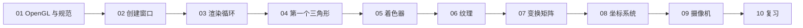

# 复习

| 项目 | 内容 |
| --- | --- |
| 原文 | [Review](https://learnopengl.com/#!Getting-started/Review) |
| 作者 | JoeyDeVries |
| 来源 | LearnOpenGL-CN（本文基于其内容整理修订） |

恭喜你完成了 Getting Started 章节的学习。至此你应该已经能够：创建窗口与 OpenGL 上下文，编写并编译着色器，通过缓冲对象或 uniform 发送数据，绘制物体，使用纹理，理解向量与矩阵，并综合以上知识创建可自由漫游的 3D 场景。

**一句话核心：** 本章是一条从「空窗口」到「可交互 3D 场景」的完整链路——前六节逐个解决「把东西画出来」，后三节解决「把画布变成世界」；现在该把零散知识点串成体系了。

最后这几节我们学了很多内容。你可以尝试在教程基础上改动程序、动手实验，有自己的想法并解决问题。一旦你确信自己真正熟悉了讨论过的所有内容，就可以进入下一章（光照）的学习。

## 章节学习路径总览

整个 Getting Started 章节按依赖关系层层递进，每一节都建立在前一节的基础上：



逐环节回顾如下。

### 第一阶段：认识 OpenGL（[01 OpenGL](01_opengl.md)）

OpenGL 是一份**规范**而不是实现：它定义函数布局与行为，实际工作由显卡驱动完成；GLAD 负责在运行时加载函数指针。这解释了为什么「规范 → 驱动实现 → 运行时加载」三者必须分清——也是后续所有 gl* 调用能工作的前提。

### 第二阶段：窗口与上下文（[02 创建窗口](02_creating_a_window.md)、[03 Hello Window](03_hello_window.md)）

窗口、OpenGL 上下文与用户输入不属于 OpenGL 的职责范围，由 GLFW 处理；`glfwMakeContextCurrent` 把上下文绑定到当前线程，之后 GLAD 才能加载函数。渲染循环（process input → clear → draw → swap buffers → poll events）与双缓冲机制让画面以稳定节奏一帧帧呈现。

### 第三阶段：第一个三角形（[04 Hello Triangle](04_hello_triangle.md)）

顶点数据经 **VBO** 上传显存，**VAO** 记录顶点属性布局，**EBO** 用索引复用顶点；顶点着色器输出裁剪坐标（随后经透视除法得到 NDC），光栅化阶段把图元变成片段。这是「现代 OpenGL 核心管线」的第一次完整亮相。

### 第四阶段：着色器（[05 Shaders](05_shaders.md)）

着色器是运行在 GPU 上的小程序。GLSL 的类型系统、`in`/`out` 变量插值、**uniform** 的「一次设置、全局生效」特性，让 CPU 与 GPU 之间有了灵活的通信通道——颜色渐变、随时间变化的效果都由此而来。

### 第五阶段：纹理（[06 Textures](06_textures.md)）

纹理用图像代替逐顶点颜色，为物体提供细节。纹理坐标采样、环绕/过滤模式、多级渐远纹理（Mipmap）、纹理单元与多纹理，加上 stb_image 的加载流程，构成完整的贴图管线。

### 第六阶段：变换（[07 Transformations](07_transformations.md)）

**向量**与**矩阵**是图形学的数学语言：GLM 在 CPU 生成矩阵，`glUniformMatrix4fv` 上传，顶点着色器用 `transform * vec4(a_pos, 1.0)` 统一变换所有顶点。矩阵组合从右向左生效——「先缩放、再旋转、最后位移」是铁律。

### 第七阶段：坐标系统（[08 Coordinate Systems](08_coordinate_systems.md)）

顶点依次穿过**局部 → 世界 → 观察 → 裁剪 → 屏幕**五个空间，由 model/view/projection 三个矩阵驱动；透视除法、平截头体裁剪、深度测试让 3D 场景真正立体。10 个立方体共享一份顶点数据、只改 model 矩阵——复用与批处理的精髓。

### 第八阶段：摄像机（[09 Camera](09_camera.md)）

OpenGL 没有摄像机，摄像机只是三个向量加一个 `lookAt` 函数。键盘 WASD + delta_time 提供匀速移动，鼠标偏移驱动 yaw/pitch 欧拉角，滚轮钳制 fov 实现缩放——输入状态到 view/projection 矩阵的数据流就此打通。

## 一个贯穿始终的主线：渲染循环

无论哪一节，程序骨架都是同一个渲染循环。用本仓库的现代 C++23 风格写出来是这样（省略资源创建细节）：

```c++
while (glfwWindowShouldClose(window) == GLFW_FALSE) {
    process_input(window);

    glClearColor(0.05F, 0.07F, 0.11F, 1.0F);
    glClear(GL_COLOR_BUFFER_BIT | GL_DEPTH_BUFFER_BIT);

    glUseProgram(shader_program);
    // 设置 uniform（矩阵、纹理单元…）
    glBindVertexArray(vertex_array_object);
    glDrawArrays(GL_TRIANGLES, 0, 36);

    glfwSwapBuffers(window);
    glfwPollEvents();
}
```

> **常见误解：** 每个新示例都是全新的代码。
> **纠正：** 从 04 到 09，所有示例共享同一套骨架（helpers 复制在各文件匿名命名空间是刻意的教学方式）。新增的只是：uniform 矩阵、深度测试、纹理单元、相机状态与回调。抓住骨架，读任何示例都毫不费力。

## 词汇表

- **OpenGL**：定义了函数布局和输出的图形 API 正式规范。
- **GLAD**：扩展加载库，用来加载并设置所有 OpenGL 函数指针，让我们能够使用所有（现代）OpenGL 函数。
- **视口（Viewport）**：我们需要渲染的窗口区域。
- **图形管线（Graphics Pipeline）**：一个顶点在被渲染为像素之前经过的全部过程。
- **着色器（Shader）**：运行在显卡上的小型程序。图形管线的很多阶段都可以使用自定义着色器代替原有功能。
- **标准化设备坐标（Normalized Device Coordinates, NDC）**：顶点经裁剪与透视除法后所在的坐标系。NDC 下所有位置在 -1.0 ~ 1.0 的顶点可见，其余被丢弃。
- **顶点缓冲对象（Vertex Buffer Object）**：在显存上分配内存并存储所有顶点数据、供显卡使用的缓冲对象。
- **顶点数组对象（Vertex Array Object）**：存储缓冲区与顶点属性布局状态。
- **元素缓冲对象（Element Buffer Object，EBO）/ 索引缓冲对象（Index Buffer Object，IBO）**：存储元素索引、供索引化绘制使用的缓冲对象。
- **Uniform**：一种特殊类型的 GLSL 变量。它在一个着色器程序中是全局的（每个着色器阶段都能访问），并且只需被设置一次。
- **纹理（Texture）**：包裹物体的特殊类型图像，为物体提供精细的视觉效果。
- **纹理环绕（Texture Wrapping）**：当纹理坐标超出 (0, 1) 范围时，指定 OpenGL 如何采样纹理的模式。
- **纹理过滤（Texture Filtering）**：当有多种纹素可选时，指定 OpenGL 如何采样纹理的模式（通常在纹理被放大时发生）。
- **多级渐远纹理（Mipmaps）**：存储的纹理缩小版本，根据距观察者的距离选用合适大小。
- **stb_image.h**：图像加载库。
- **纹理单元（Texture Units）**：通过把多个纹理分别绑定到不同的纹理单元，允许在一个着色器程序中同时使用多个纹理。
- **向量（Vector）**：定义了空间中方向和/或位置的数学实体。
- **矩阵（Matrix）**：矩形的数学表达式阵列。
- **GLM**：为 OpenGL 打造的数学库。
- **局部空间（Local Space）**：物体的初始空间，所有坐标相对物体原点。
- **世界空间（World Space）**：所有坐标相对全局原点。
- **观察空间（View Space）**：所有坐标从摄像机视角观察。
- **裁剪空间（Clip Space）**：应用投影后的空间，是顶点着色器输出的最终坐标空间；OpenGL 负责处理剩下的裁剪与透视除法。
- **屏幕空间（Screen Space）**：所有坐标由屏幕视角观察，范围是 0 到屏幕宽/高。
- **LookAt 矩阵**：一种特殊类型的观察矩阵，创建了一个坐标系，其中所有坐标都根据「从一个位置看向目标」的用户视角旋转或平移。
- **欧拉角（Euler Angles）**：偏航角（Yaw）、俯仰角（Pitch）与滚转角（Roll）三个值，允许我们通过三个角度构造任何 3D 方向。

## 下一步：光照

Getting Started 章节的画面里，物体颜色来自纹理与顶点属性——没有任何「光」。下一章「光照」（Lighting）将引入光源、法线、Phong 光照模型，让物体根据光源方向呈现明暗与高光。向量点乘（判断夹角）、矩阵变换（法线变换）、着色器 uniform（光源参数）这些本章的工具都会立刻派上用场。

> **进阶（光照管线前瞻：逐顶点还是逐片段）：** 进入光照章节前，值得先想清楚一个问题——光照计算放在哪个着色器阶段：
>
> - **顶点着色器**逐顶点执行：先把光照算在顶点上，再由光栅化插值到每个片段——顶点少时很便宜，但大三角形内部的明暗过渡会失真（Gouraud 着色）。
> - **片段着色器**逐片段执行：每个像素独立计算光照，效果细腻（Phong 着色），代价是计算量随像素数增长；现代 GPU 上通常是首选。
> - 无论选哪种，「点乘判断夹角、矩阵变换、uniform 光源参数」都是同一套工具，而 05 节学的 `in`/`out` 插值机制正是把顶点数据平滑送到片段着色器的桥梁——光照章节会反复用到它。

## 本章整体回顾

- **局部（七个能力）**：窗口/上下文、三角形、着色器、纹理、变换、坐标系统、摄像机——每个能力解决一个问题，都有对应的仓库示例（`apps/01_getting_started/01_hello_window` 到 `07_camera`）。
- **整体（一条链路）**：所有能力最终汇成同一个数据流——CPU 顶点数据 → VBO/VAO → 顶点着色器（MVP 矩阵变换）→ 光栅化（裁剪、深度测试）→ 片段着色器（纹理采样）→ 帧缓冲 → 窗口；输入（键盘/鼠标/滚轮）通过每帧状态更新驱动这条链路。
- **再看「局部→整体」**：学数学时（07）你看到的向量、矩阵只是公式；学坐标系统时（08）它们变成 model/view/projection；学摄像机时（09）它们被输入驱动。同一套知识，在越来越大的图景里反复出现——这就是图形学的学习方式：**先掌握精确的小概念，再不断把它们放进更大的流程中**。

恭喜完成本章！去实验、去破坏、去重建，然后带着这套「数据流思维」进入光照章节吧。

下一章：02 Lighting（光照章节，教程待更新）
