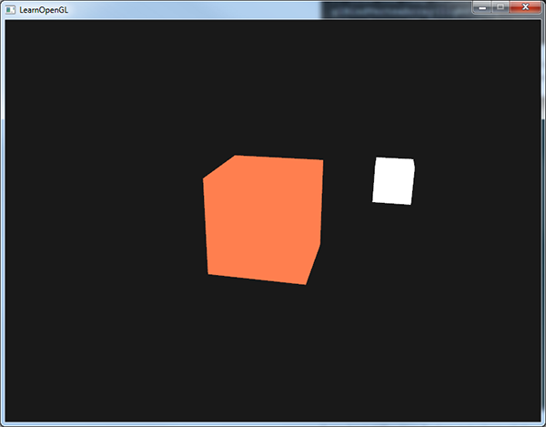
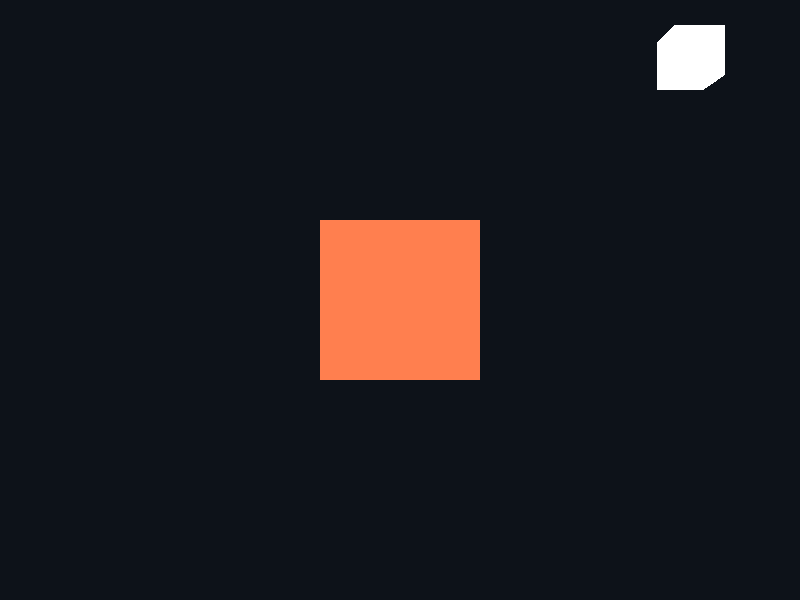
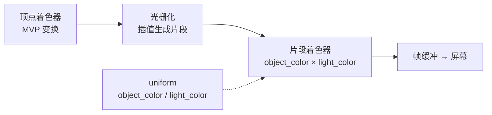

# 颜色

| 项目 | 内容 |
| --- | --- |
| 原文 | [Colors](http://learnopengl.com/#!Lighting/Colors) |
| 作者 | JoeyDeVries |
| 来源 | LearnOpenGL-CN（本文基于其内容整理修订） |
| 本仓库示例 | [`apps/02_lighting/01_colors/`](../../apps/02_lighting/01_colors/) |

在前面的教程中我们已经简要提到过该如何在 OpenGL 中使用颜色（Color），但我们至今所接触到的都是很浅层的知识。本节我们将会更深入地讨论什么是颜色，并且还会为接下来的光照（Lighting）教程创建一个场景。

**一句话核心：** 在图形学的简化模型里，**最终颜色 = 光源颜色 × 物体颜色**（逐分量相乘）——相乘不是随意规定，而是「物体吸收一部分光、反射剩余部分」这一物理事实的直接近似。

## 现实中的光与颜色

现实世界中有无数种颜色，每一个物体都有它们自己的颜色。我们需要使用（有限的）数值来模拟真实世界中（无限）的颜色，所以并不是所有现实世界中的颜色都可以用数值来表示。然而我们仍能通过数值表现出非常多的颜色，甚至你可能都不会注意到与现实的颜色有任何差异。颜色可以数字化地由红色（Red）、绿色（Green）和蓝色（Blue）三个分量组成，它们通常被缩写为 RGB。仅仅用这三个值就可以组合出任意一种颜色。原文用 `glm::vec3(1.0f, 0.5f, 0.31f)` 表示一种**珊瑚红**（Coral）颜色，本仓库示例把它写作常量 `glm::vec3{1.0F, 0.50F, 0.31F}`。

我们在现实生活中看到某一物体的颜色并不是这个物体真正拥有的颜色，而是它所**反射的**（Reflected）颜色。换句话说，那些不能被物体所**吸收**（Absorb）的颜色（被拒绝的颜色）就是我们能够感知到的物体的颜色。例如，太阳发出的可见白光其实是由许多不同的颜色组合而成的（如下图所示）。如果我们将白光照在一个蓝色的玩具上，这个蓝色的玩具会吸收白光中除了蓝色以外的所有颜色的光，不被吸收的蓝色光被反射到我们的眼中，让这个玩具看起来是蓝色的。下图显示的是一个珊瑚红的玩具，它以不同强度反射了多个颜色。


你可以看到，白色的阳光实际上是所有可见颜色的集合，物体吸收了其中的大部分颜色。它仅反射了代表物体颜色的部分，被反射颜色的组合就是我们所感知到的颜色（此例中为珊瑚红）。

> **重要：** 从技术上来说，情况会更复杂一些，但我们将在 PBR 章节中进一步探讨。

这些颜色反射的定律被直接地运用在图形领域。当我们在 OpenGL 中创建一个光源时，我们希望给光源一个颜色。在上面一段中我们有一个白色的太阳，所以我们也将光源设置为白色。当我们把光源的颜色与物体的颜色值相乘，所得到的就是这个物体所反射的颜色（也就是我们所感知到的颜色）。让我们再次审视我们的玩具（这一次它还是珊瑚红），看看如何在图形学中计算出它的反射颜色——将两个颜色向量逐分量相乘，结果就是最终的颜色向量：

| 光源颜色 | 物体颜色（反射率） | 相乘结果 |
| --- | --- | --- |
| `(1.0, 1.0, 1.0)` 白 | `(1.0, 0.5, 0.31)` 珊瑚红 | `(1.0, 0.50, 0.31)` 珊瑚红 |
| `(0.0, 1.0, 0.0)` 绿 | `(1.0, 0.5, 0.31)` 珊瑚红 | `(0.0, 0.50, 0.0)` 深绿 |
| `(0.33, 0.42, 0.18)` 深橄榄绿 | `(1.0, 0.5, 0.31)` 珊瑚红 | `(0.33, 0.21, 0.10)` 暗橄榄色 |

可以看到，白色光源下物体呈现自身颜色；换成绿色光源后，并没有红色和蓝色的光让玩具来吸收或反射——玩具吸收了光线中一半的绿色值，仍然反射了另一半，于是看上去是**深绿色**的；珊瑚红的玩具「突然变成」了深绿色物体。而使用深橄榄绿色的光源时，物体显出意想不到的暗橄榄色。有创意地利用颜色，能获得许多有趣的效果。

> **常见误解：** 物体的颜色和光的颜色「叠加」（相加）得到最终颜色。
> **纠正：** 是**相乘**。相加意味着「光越强、物体反射出越多不属于它的颜色」——红色物体在绿光下会反射出绿色，这在物理上不成立。红色物体（反射率 `(1, 0, 0)`）在纯绿光 `(0, 1, 0)` 下**应该是黑的**：`(1,0,0) · (0,1,0) = (0,0,0)`，绿色分量全被吸收、没有红光可反射。相乘恰好表达了这种「吸收」。

## 创建一个光照场景

在接下来的教程中，我们将会广泛地使用颜色来模拟现实世界中的光照效果，创造出一些有趣的视觉效果。由于我们现在将会使用光源了，我们希望将它们显示为可见的物体，并在场景中至少加入一个物体来测试模拟光照的效果。

首先我们需要一个物体来作为**被照亮**（lit）的对象，我们将使用前面教程中那个著名的立方体箱子。我们还需要一个物体来代表光源在 3D 场景中的位置。简单起见，我们依然使用一个立方体来代表光源——我们已拥有立方体的顶点数据。

填写顶点缓冲对象（VBO）、设定顶点属性指针这些步骤对你来说应该已经很容易了，所以我们不再赘述。如果你仍然觉得困难，建议复习[之前的教程](../01_getting_started/04_hello_triangle.md)。

我们首先需要一个顶点着色器来绘制箱子。与之前的顶点着色器相比，容器的顶点位置处理保持不变（这一次我们不需要纹理坐标了）。本仓库示例的顶点着色器（两个着色器程序共用同一份，逐字取自示例 `main.cpp`）：

```glsl
#version 330 core
layout (location = 0) in vec3 a_pos;

uniform mat4 model;
uniform mat4 view;
uniform mat4 projection;

void main()
{
    gl_Position = projection * view * model * vec4(a_pos, 1.0);
}
```

因为我们还要创建一个表示灯（光源）的立方体，所以我们还要为这个灯创建一个专门的 VAO。当然我们也可以让这个灯和其它物体使用同一个 VAO，简单地对它的 model（模型）矩阵做一些变换就好了，然而接下来的教程中我们会频繁地对顶点数据和属性指针做出修改，我们并不想让这些修改影响到灯（我们只关心灯的顶点位置），因此有必要为灯创建一个新的 VAO（逐字取自示例）：

```c++
    // OpenGL: 光源小立方体复用同一个 VBO，只是绑定到另一个 VAO，方便独立绘制。
    glBindVertexArray(light_vertex_array_object);
    glVertexAttribPointer(0, 3, GL_FLOAT, GL_FALSE, 3 * static_cast<GLsizei>(sizeof(float)), nullptr);
    glEnableVertexAttribArray(0);
```

灯立方体复用箱子的 VBO——数据已在 GPU 内存中，不需要再传一份，只需要另一个 VAO 记录「只取前三个 float 作为位置」的属性布局。

现在我们已经创建了表示灯和被照亮的物体箱子，只需要再定义一个片段着色器（逐字取自示例）：

```glsl
#version 330 core
out vec4 frag_color;

uniform vec3 object_color;
uniform vec3 light_color;

void main()
{
    frag_color = vec4(object_color * light_color, 1.0);
}
```

这个片段着色器从 uniform 变量中接受物体的颜色和光源的颜色。正如本节一开始所讨论的那样，我们将光源的颜色和物体（反射的）颜色相乘。我们把物体的颜色设置为之前提到的珊瑚红色，并把光源设置为白色（本仓库示例在匿名命名空间中以常量定义，逐字取自示例）：

```c++
constexpr glm::vec3 light_position{1.2F, 1.0F, 2.0F};
constexpr glm::vec3 object_color{1.0F, 0.50F, 0.31F};
constexpr glm::vec3 light_color{1.0F, 1.0F, 1.0F};
```

要注意的是，当我们修改顶点或者片段着色器后，灯的位置或颜色也会随之改变，这并不是我们想要的效果。我们不希望灯的颜色在接下来的教程中因光照计算的结果而受到影响，而是希望它能够与其它的计算分离——灯应该一直保持明亮，不受其它颜色变化的影响（这样它才更像一个真实的光源）。

为了实现这个目标，我们需要为灯的绘制创建另外一套着色器，从而保证它在其它光照着色器发生改变的时候不受影响。顶点着色器与上面那份是一样的，可以直接复用；灯的片段着色器则输出 `light_color`，保证灯的颜色一直发亮（逐字取自示例）：

```glsl
#version 330 core
out vec4 frag_color;
uniform vec3 light_color;

void main()
{
    frag_color = vec4(light_color, 1.0);
}
```

当我们想要绘制物体的时候，使用光照着色器绘制箱子；当想要绘制灯的时候，就使用灯的着色器。在之后的教程里我们会逐步更新这个光照着色器，慢慢实现更真实的效果。

使用这个灯立方体的主要目的是让我们知道光源在场景中的具体位置。我们通常在场景中定义一个光源的位置，但这只是一个位置，它并没有视觉意义。为了显示真正的灯，我们将表示光源的立方体绘制在与光源相同的位置，并将它缩小一点，让它不那么显眼（渲染循环中，逐字取自示例）：

```c++
        glm::mat4 light_model{1.0F};
        light_model = glm::translate(light_model, light_position);
        light_model = glm::scale(light_model, glm::vec3{0.20F});
```

如果一切顺利，原文教程的运行效果如下图所示：



本仓库示例的运行效果（白光源 + 珊瑚红箱子 + 光源标记立方体）：



> **分层解释：** 这一步分别由谁负责？
> - **应用程序（本示例）**：决定光源颜色、物体颜色，把它们作为 uniform 上传；为灯维护独立的 VAO 与着色器程序。
> - **OpenGL 管线**：光栅化插值后，片段着色器对每个像素执行一次乘法。
> - **物理世界**：真实的「吸收-反射」发生在连续光谱上，RGB 三分量相乘只是它的高度简化——但对入门渲染已经足够逼真。

## 光照在管线中的位置

颜色组合发生在片段着色器——这是整个光照章节的主战场。本节版本的全景链路：



接下来两节会往这个片段着色器里逐步添加：法线与光照方向（漫反射）、视线方向（镜面反射）、材质结构体、贴图、多种光源。**骨架不变，只是着色器内部的计算越来越丰富。**

> **进阶（为什么相乘是吸收的近似）：** 物理上，表面反射由**反射率光谱** $\rho(\lambda)$ 与**入射光谱** $L(\lambda)$ 在每个波长上相乘、再对整个可见光谱积分得到。RGB 渲染把连续光谱压缩成三个分量，把「逐波长相乘再积分」简化为「三个分量各自相乘」——这隐含假设光谱都落在三个很窄的基色上，因此某些组合会失真（例如 RGB 相乘无法表现荧光或彩虹色）。更精确的做法要用光谱渲染，但对实时渲染，RGB 相乘是性能与效果的黄金平衡点。

> **进阶（让光源随时间变色）：** 原文接下来的章节用正弦函数让光源颜色在 RGB 间循环流动，一行动态 uniform 就能验证「光色决定物色」：光源变绿时，珊瑚色物体明显变暗发绿。本仓库示例保持常量白光以便截图对照，把这个效果留作练习（提示：`std::sin(glfwGetTime())` 分别调制 `light_color` 三个分量后再上传 uniform）。

## 练习

- 用 `sin`/`glfwGetTime` 让 `light_color` 随时间在红绿蓝之间渐变，观察立方体颜色如何跟着变化（这正是原文下一节的动效）。
- 把 `light_color` 设为纯绿 `(0, 1, 0)`，验证珊瑚色立方体几乎变黑——解释为什么（对照上面的相乘表格）。
- 把物体换成纯白反射率 `(1, 1, 1)`，观察它在不同光色下的表现：此时物体颜色完全由光源决定。

## 本仓库示例

示例目录：`apps/02_lighting/01_colors/`

构建（默认 MinGW GCC Debug，需 MSYS2 UCRT64 在 PATH 中）：

```powershell
conan install . -of build/mingw-gcc-debug -pr:h conan/profiles/mingw-gcc -pr:b conan/profiles/mingw-gcc -s build_type=Debug --build=missing
cmake --preset mingw-gcc-debug
cmake --build --preset mingw-gcc-debug
```

运行：

```powershell
.\build\mingw-gcc-debug\apps\02_lighting\01_colors\02_lighting__01_colors.exe
```

运行时交互：按 **Esc**（退出键）退出程序。场景为静态画面——珊瑚色立方体（物体）与白色小立方体（光源标记）在固定视角下并排呈现，深度测试保证遮挡正确。

## 本章整体回顾

本节是光照章节的「第一块积木」：

- **局部（一个公式）**：最终颜色 = 光源颜色 × 物体颜色，逐分量相乘；相乘对应「吸收-反射」的物理直觉。
- **局部（一个场景骨架）**：物体 + 光源标记两套着色器、两个 VAO、固定视角——这套骨架会被后续所有光照示例沿用。
- **整体（一个缺口）**：目前光照结果与表面朝向、光源方向完全无关——立方体六个面亮度一样，「看起来是张卡片而不是立方体」。下一节引入**法向量**和**漫反射**，让朝向光源的面亮、背向光源的面暗，物体才会真正「立体」起来。

下一节：[基础光照](02_basic_lighting.md)
