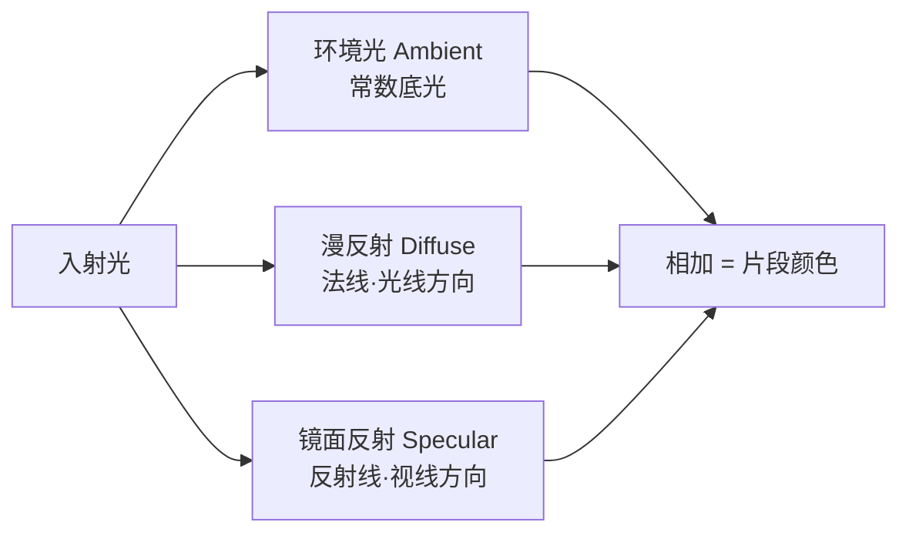
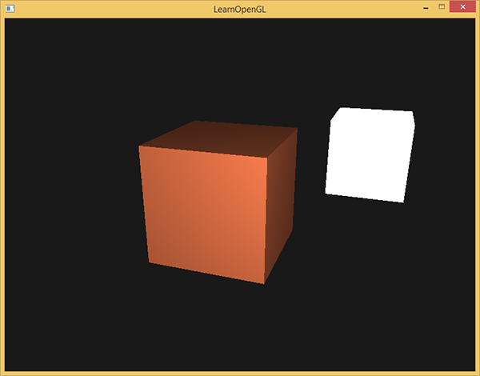
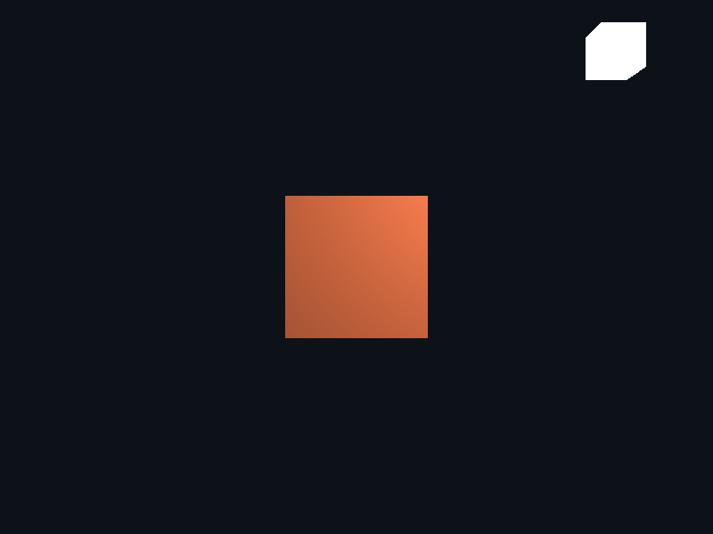
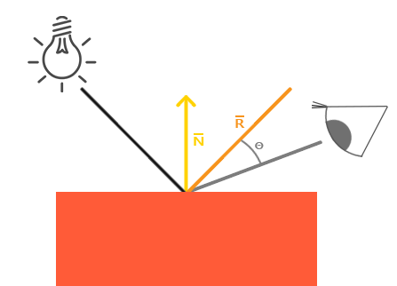
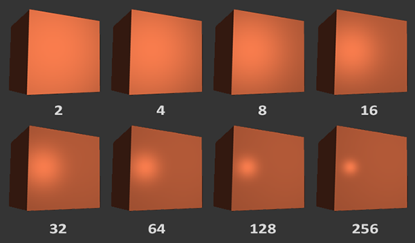
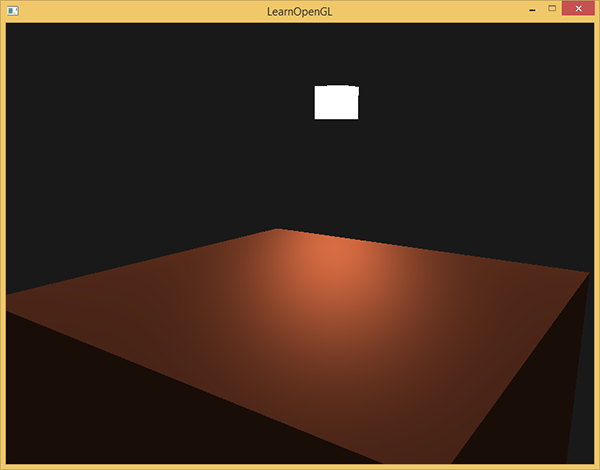

# 基础光照

| 项目 | 内容 |
| --- | --- |
| 原文 | [Basic Lighting](http://learnopengl.com/#!Lighting/Basic-Lighting) |
| 作者 | JoeyDeVries |
| 来源 | LearnOpenGL-CN（本文基于其内容整理修订） |
| 本仓库示例 | [`apps/02_lighting/02_basic_lighting/`](../../apps/02_lighting/02_basic_lighting/) |

现实世界的光照是极其复杂的，而且会受到诸多因素的影响，这是我们有限的计算能力所无法模拟的。因此 OpenGL 的光照使用的是简化的模型，对现实的情况进行近似，这样处理起来会更容易一些，而且看起来也差不多一样。这些光照模型都是基于我们对光的物理特性的理解。其中一个模型被称为**冯氏光照模型**（Phong Lighting Model）。冯氏光照模型的主要结构由 3 个分量组成：环境（Ambient）、漫反射（Diffuse）和镜面（Specular）光照。下面这张图展示了这些光照分量看起来的样子：


- **环境光照**（Ambient Lighting）：即使在黑暗的情况下，世界上通常也仍然有一些光亮（月亮、远处的光），所以物体几乎永远不会是完全黑暗的。为了模拟这个，我们会使用一个环境光照常量，它永远会给物体一些颜色。
- **漫反射光照**（Diffuse Lighting）：模拟光源对物体的方向性影响（Directional Impact）。它是冯氏光照模型中视觉上最显著的分量。物体的某一部分越是正对着光源，它就会越亮。
- **镜面光照**（Specular Lighting）：模拟有光泽物体上面出现的亮点。镜面光照的颜色相比于物体的颜色会更倾向于光的颜色。

> **术语说明：** 原译文将 Phong 译作「风氏」，本仓库统一采用通行译名**冯氏**——该模型以越南裔计算机学家 Bui Tuong Phong 的姓氏音译为准，中文图形学文献普遍写作「冯氏光照模型」。另外注意两个「Phong」的区别：**冯氏光照模型**（三分量经验模型）与**冯氏着色**（逐片段计算，见本节末尾）是两个维度的概念。

**一句话核心：** 冯氏模型把光照拆成三个分量的和——**环境光**（永远有一点底光）+ **漫反射**（表面朝向决定明暗）+ **镜面反射**（表面反光形成的亮点）；三个分量都在片段着色器里逐像素计算。



为了创建有趣的视觉场景，我们希望模拟至少这三种光照分量。我们将以最简单的一个开始：**环境光照**。

> **本仓库示例的取舍：** 本仓库 `02_basic_lighting` 示例完整实现了环境光与漫反射两个分量；镜面光照需要视线方向参与，本仓库把它与材质参数一起放在下一节（`03_materials`）实现——分两步走，每一步都能独立观察效果。

## 环境光照

光通常都不是来自于同一个光源，而是来自于我们周围分散的很多光源，即使它们可能并不是那么显而易见。光的一个属性是，它可以向很多方向发散并反弹，从而能够到达不是非常直接临近的点。所以，光能够在其它的表面上**反射**，对一个物体产生间接的影响。考虑到这种情况的算法叫做**全局光照**（Global Illumination）算法，但是这种算法既开销高昂又极其复杂。

由于我们现在对那种又复杂又开销高昂的算法不是很感兴趣，所以我们将会先使用一个简化的全局照明模型，即**环境光照**。正如你在上一节所学到的，我们使用一个很小的常量（光照）颜色，添加到物体片段的最终颜色中，这样即便场景中没有直接的光源也能看起来存在一些发散的光。

把环境光照添加到场景里非常简单。我们用光的颜色乘以一个很小的常量环境因子，再乘以物体的颜色，然后将最终结果作为片段的颜色。本仓库示例片段着色器中的环境光部分（逐字取自示例 `main.cpp`）：

```glsl
    float ambient_strength = 0.10;
    vec3 ambient = ambient_strength * light_color;
```

如果你现在运行程序，你会注意到冯氏光照的第一个阶段已经应用到你的物体上了。这个物体非常暗，但由于应用了环境光照（注意光源立方体没受影响，是因为我们对它使用了另一个着色器），也不是完全黑的。

## 漫反射光照

环境光照本身不能提供最有趣的结果，但是漫反射光照就能开始对物体产生显著的视觉影响了。漫反射光照使物体上与光线方向越接近的片段能从光源处获得更多的亮度。为了能够更好地理解漫反射光照，请看下图：


图左上方有一个光源，它所发出的光线落在物体的一个片段上。我们需要测量这个光线是以什么角度接触到这个片段的。如果光线垂直于物体表面，这束光对物体的影响会最大化（更亮）。为了测量光线和片段的角度，我们使用一个叫做**法向量**（Normal Vector）的东西，它是垂直于片段表面的一个向量（这里以黄色箭头表示）。这两个向量之间的角度很容易就能够通过点乘计算出来。

你可能记得在[变换](../01_getting_started/07_transformations.md)那一节教程里，我们知道两个单位向量的夹角越小，它们点乘的结果越倾向于 1。当两个向量的夹角为 90 度的时候，点乘会变为 0。这同样适用于角度 $\theta$：$\theta$ 越大，光对片段颜色的影响就应该越小。

> **重要：** 为了（只）得到两个向量夹角的余弦值，我们使用的是单位向量（长度为 1 的向量），所以我们需要确保所有的向量都经过标准化，否则点乘返回的就不仅仅是余弦值了（见[变换](../01_getting_started/07_transformations.md)）。

点乘返回一个标量，我们可以用它计算光线对片段颜色的影响。不同片段朝向光源的方向不同，这些片段被照亮的情况也不同。

所以，计算漫反射光照需要什么？

- **法向量**：一个垂直于顶点表面的向量。
- **定向的光线**：作为光源的位置与片段的位置之间向量差的方向向量。为了计算这个光线，我们需要光的位置向量和片段的位置向量。

### 法向量

法向量是一个垂直于顶点表面的（单位）向量。由于顶点本身并没有表面（它只是空间中一个独立的点），我们利用它周围的顶点来近似这个顶点处的表面。我们能够使用一个小技巧，用叉乘对立方体所有的顶点计算法向量，但是由于 3D 立方体不是一个复杂的形状，所以我们可以简单地把法线数据手工添加到顶点数据中。更新后的顶点数据（36 顶点 ×（位置 3 + 法线 3）= 216 个 float，逐字取自示例 `main.cpp`）：

```c++
    constexpr std::array<float, 216> vertices{
        -0.5F,-0.5F,-0.5F,0.0F,0.0F,-1.0F, 0.5F,-0.5F,-0.5F,0.0F,0.0F,-1.0F, 0.5F,0.5F,-0.5F,0.0F,0.0F,-1.0F,
        0.5F,0.5F,-0.5F,0.0F,0.0F,-1.0F, -0.5F,0.5F,-0.5F,0.0F,0.0F,-1.0F, -0.5F,-0.5F,-0.5F,0.0F,0.0F,-1.0F,
        -0.5F,-0.5F,0.5F,0.0F,0.0F,1.0F, 0.5F,-0.5F,0.5F,0.0F,0.0F,1.0F, 0.5F,0.5F,0.5F,0.0F,0.0F,1.0F,
        0.5F,0.5F,0.5F,0.0F,0.0F,1.0F, -0.5F,0.5F,0.5F,0.0F,0.0F,1.0F, -0.5F,-0.5F,0.5F,0.0F,0.0F,1.0F,
        -0.5F,0.5F,0.5F,-1.0F,0.0F,0.0F, -0.5F,0.5F,-0.5F,-1.0F,0.0F,0.0F, -0.5F,-0.5F,-0.5F,-1.0F,0.0F,0.0F,
        -0.5F,-0.5F,-0.5F,-1.0F,0.0F,0.0F, -0.5F,-0.5F,0.5F,-1.0F,0.0F,0.0F, -0.5F,0.5F,0.5F,-1.0F,0.0F,0.0F,
        0.5F,0.5F,0.5F,1.0F,0.0F,0.0F, 0.5F,0.5F,-0.5F,1.0F,0.0F,0.0F, 0.5F,-0.5F,-0.5F,1.0F,0.0F,0.0F,
        0.5F,-0.5F,-0.5F,1.0F,0.0F,0.0F, 0.5F,-0.5F,0.5F,1.0F,0.0F,0.0F, 0.5F,0.5F,0.5F,1.0F,0.0F,0.0F,
        -0.5F,-0.5F,-0.5F,0.0F,-1.0F,0.0F, 0.5F,-0.5F,-0.5F,0.0F,-1.0F,0.0F, 0.5F,-0.5F,0.5F,0.0F,-1.0F,0.0F,
        0.5F,-0.5F,0.5F,0.0F,-1.0F,0.0F, -0.5F,-0.5F,0.5F,0.0F,-1.0F,0.0F, -0.5F,-0.5F,-0.5F,0.0F,-1.0F,0.0F,
        -0.5F,0.5F,-0.5F,0.0F,1.0F,0.0F, 0.5F,0.5F,-0.5F,0.0F,1.0F,0.0F, 0.5F,0.5F,0.5F,0.0F,1.0F,0.0F,
        0.5F,0.5F,0.5F,0.0F,1.0F,0.0F, -0.5F,0.5F,0.5F,0.0F,1.0F,0.0F, -0.5F,0.5F,-0.5F,0.0F,1.0F,0.0F,
    };
```

试着想象一下，这些法向量真的是垂直于立方体各个平面的表面的（一个立方体由 6 个平面组成）。

> **常见误解：** 立方体 8 个角点只需要 8 个顶点，法线也可以「每面取一个」让 OpenGL 自动用。
> **纠正：** 顶点数组没有「每面」的概念，只有逐顶点的 attribute。立方体的一个角点相邻三个面、对应三个不同法线，无法共用一个顶点记录——所以必须按面展开成 24 个独立顶点（本示例再按三角形展开为 36 个）。**真正决定顶点数量的，往往不是几何形状，而是「位置、法线、纹理坐标的组合有多少种」。**

由于我们向顶点数组添加了额外的数据，所以我们应该更新光照的顶点着色器。同时，灯使用同样的顶点数组作为它的顶点数据，然而灯的着色器并没有使用新添加的法向量——我们不需要更新灯的着色器，但必须修改灯的顶点属性指针的**步长**（stride，示例中为 `6 * sizeof(float)`）来适应新的顶点数组的大小：只取每个顶点的前三个 float（位置），忽略后三个（法线）（逐字取自示例 `main.cpp`）：

```c++
    glBindVertexArray(light_vao);
    glVertexAttribPointer(0, 3, GL_FLOAT, GL_FALSE, stride, nullptr);
    glEnableVertexAttribArray(0);
```

虽然对灯的着色器使用不能完全利用的顶点数据看起来不是那么高效，但这些顶点数据在箱子对象载入后就一直储存在 GPU 的内存里，所以我们并不需要储存新数据到 GPU 内存中。这实际上比给灯专门分配一个新的 VBO 更高效。

所有光照的计算都是在片段着色器里进行，所以我们需要将法向量由顶点着色器传递到片段着色器（顶点着色器完整代码见下文，其中 `normal` 的输出即为此用）。

### 计算漫反射光照

我们现在对每个顶点都有了法向量，但是我们仍然需要光源的位置向量和片段的位置向量。

**光源位置**是一个静态变量，我们可以在片段着色器中把它声明为 uniform，然后在渲染循环中（渲染循环的外面也可以，因为它不会改变）更新它。本仓库示例在匿名命名空间定义 `constexpr glm::vec3 light_position{1.2F, 1.0F, 2.0F};`，每帧用 `glUniform3fv` 上传到 `light_pos`。

**片段位置**则需要在世界空间中获取。我们会在世界空间中进行所有的光照计算，因此我们需要一个在世界空间中的顶点位置。我们可以通过把顶点位置属性乘以模型矩阵（不是观察和投影矩阵）来把它变换到世界空间坐标。这个在顶点着色器中很容易完成，所以我们声明一个输出变量，并计算它的世界空间坐标。本仓库示例的顶点着色器（逐字取自示例）：

```glsl
#version 330 core
layout (location = 0) in vec3 a_pos;
layout (location = 1) in vec3 a_normal;

out vec3 frag_pos;
out vec3 normal;

uniform mat4 model;
uniform mat4 view;
uniform mat4 projection;

void main()
{
    frag_pos = vec3(model * vec4(a_pos, 1.0));
    normal = mat3(transpose(inverse(model))) * a_normal;
    gl_Position = projection * view * vec4(frag_pos, 1.0);
}
```

片段着色器中声明相应的 `in vec3 frag_pos;` 与 `in vec3 normal;`。这两个 in 变量会被光栅化插值——每个片段拿到的是三角形三个顶点世界位置与法线的平滑插值结果。

现在，所有需要的变量都设置好了，我们可以看看片段着色器的完整光照计算（逐字取自示例）：

```glsl
#version 330 core
in vec3 frag_pos;
in vec3 normal;
out vec4 frag_color;

uniform vec3 object_color;
uniform vec3 light_color;
uniform vec3 light_pos;

void main()
{
    float ambient_strength = 0.10;
    vec3 ambient = ambient_strength * light_color;

    vec3 norm = normalize(normal);
    vec3 light_dir = normalize(light_pos - frag_pos);
    float diff = max(dot(norm, light_dir), 0.0);
    vec3 diffuse = diff * light_color;

    vec3 result = (ambient + diffuse) * object_color;
    frag_color = vec4(result, 1.0);
}
```

第一步是计算光源和片段位置之间的方向向量。光的方向向量是光源位置向量与片段位置向量之间的向量差（两个向量相减），我们把它**指向光源**（从片段指向光源）。我们同样希望确保所有相关向量都是单位向量，所以把法线和最终的方向向量都进行标准化：

```glsl
    vec3 norm = normalize(normal);
    vec3 light_dir = normalize(light_pos - frag_pos);
```

> **重要：** 当计算光照时我们通常不关心一个向量的模长或它的位置，我们只关心它们的方向。所以，几乎所有的计算都使用单位向量完成，因为这简化了大部分的计算（比如点乘）。忘记对向量进行标准化是一个十分常见的错误——插值后的法线尤其如此，它几乎必然不再是单位长度。

下一步，我们对 `norm` 和 `light_dir` 向量进行点乘，计算光源对当前片段实际的漫反射影响。结果值再乘以光的颜色，得到漫反射分量。两个向量之间的角度越大，漫反射分量就会越小：

```glsl
    float diff = max(dot(norm, light_dir), 0.0);
    vec3 diffuse = diff * light_color;
```

如果两个向量之间的角度大于 90 度，点乘的结果就会变成负数，这样会导致漫反射分量变为负数。为此，我们使用 `max` 函数返回两个参数之间较大的参数，从而保证漫反射分量不会变成负数。负数颜色的光照是没有定义的，所以最好避免它，除非你是那种古怪的艺术家。

现在我们有了环境光分量和漫反射分量，我们把它们相加，然后把结果乘以物体的颜色，来获得片段最后的输出颜色：

```glsl
    vec3 result = (ambient + diffuse) * object_color;
    frag_color = vec4(result, 1.0);
}
```

如果你的应用（和着色器）编译成功了，你会看到类似的输出：



你可以看到使用了漫反射光照，立方体看起来就真的像个立方体了。尝试在你的脑中想象一下法向量，并在立方体周围移动，注意观察法向量和光的方向向量之间的夹角越大，片段就会越暗。

本仓库示例的运行效果（相机固定于 (0, 0, 5)）：



### 最后一件事：法线矩阵

现在我们已经把法向量从顶点着色器传到了片段着色器。可是，目前片段着色器里的计算都是在世界空间坐标中进行的。所以，我们是不是应该把法向量也转换为世界空间坐标？基本正确，但是这不是简单地把它乘以一个模型矩阵就能搞定的。

首先，法向量只是一个方向向量，不能表达空间中的特定位置。同时，法向量没有齐次坐标（顶点位置中的 w 分量）。这意味着，位移不应该影响到法向量。因此，如果我们打算把法向量乘以一个模型矩阵，我们就要从矩阵中移除位移部分，只选用模型矩阵左上角 3×3 的矩阵（注意，我们也可以把法向量的 w 分量设置为 0，再乘以 4×4 矩阵；这同样可以移除位移）。对于法向量，我们只希望对它实施缩放和旋转变换。

其次，如果模型矩阵执行了**不等比缩放**（Non-uniform Scale），顶点的改变会导致法向量不再垂直于表面了。因此，我们不能用这样的模型矩阵来变换法向量。下面的图展示了应用了不等比缩放的模型矩阵对法向量的影响：


每当我们应用一个不等比缩放时（注意：等比缩放不会破坏法线，因为法线的方向没被改变，仅仅改变了法线的长度，而这很容易通过标准化来修复），法向量就不会再垂直于对应的表面了，这样光照就会被破坏。

修复这个行为的诀窍是使用一个为法向量专门定制的模型矩阵。这个矩阵称之为**法线矩阵**（Normal Matrix），它使用了一些线性代数的操作来移除对法向量错误缩放的影响。法线矩阵被定义为「**模型矩阵左上角 3×3 部分的逆矩阵的转置矩阵**」。真是拗口，如果你不明白这是什么意思，别担心，我们还没有讨论逆矩阵（Inverse Matrix）和转置矩阵（Transpose Matrix）。注意，大部分的资源都会将法线矩阵定义为应用到模型-观察矩阵（Model-view Matrix）上的操作，但是由于我们只在世界空间中进行操作（不是在观察空间），我们只使用模型矩阵。

在顶点着色器中，我们可以使用 `inverse` 和 `transpose` 函数自己生成这个法线矩阵，这两个函数对所有类型矩阵都有效。注意我们还要把被处理过的矩阵强制转换为 3×3 矩阵，来保证它失去了位移属性以及能够乘以 `vec3` 的法向量：

```glsl
    normal = mat3(transpose(inverse(model))) * a_normal;
```

> **注意：** 矩阵求逆对 GPU 来说开销很大，且它必须在场景中的每一个顶点上执行，所以应该尽可能地避免在着色器中进行求逆运算。以学习为目的的话这样做还好，但是对于一个高效的应用来说，最好先在 CPU 上计算出法线矩阵，再通过 uniform 把它传递给着色器（就像模型矩阵一样）。

在漫反射光照部分，光照表现并没有问题，这是因为我们没有对物体进行任何缩放操作，所以我们并不真的需要使用一个法线矩阵，直接用模型矩阵乘以法向量就可以。但是如果你会进行不等比缩放，使用法线矩阵去乘以法向量就是必须的了。

> **进阶（为什么是逆转置）：** 设表面上一点满足切向量 $\mathbf{t}$ 与法线 $\mathbf{n}$ 垂直：$\mathbf{n}^T\mathbf{t} = 0$。顶点经矩阵 $M$ 变换后切向量变为 $M\mathbf{t}$，我们要求的变换后法线 $\mathbf{n}'$ 需满足 $\mathbf{n}'^T M\mathbf{t} = 0$ 对所有切向量成立。取 $\mathbf{n}' = (M^{-1})^T\mathbf{n}$ 代入：$((M^{-1})^T\mathbf{n})^T M\mathbf{t} = \mathbf{n}^T M^{-1} M \mathbf{t} = \mathbf{n}^T\mathbf{t} = 0$，恒成立——所以法线要乘 $M$ 的逆转置。当 $M$ 只含旋转（正交矩阵）时逆转置等于自身，直接乘 model 也对；这也是为什么很多示例「侥幸不出错」的原因。

> **职责边界：** 谁负责法线的正确性？
> - **建模/导出工具**：提供正确的原始法线。
> - **应用程序**：选择合适的变换（法线矩阵）上传；本示例在着色器内计算。
> - **OpenGL/驱动**：只负责执行矩阵乘法与插值——它不知道也不检查你的法线是否垂直于表面。

## 镜面光照

如果你还没被这些光照计算搞得精疲力尽，我们就再把**镜面高光**（Specular Highlight）加进来，这样冯氏光照才算完整。

和漫反射光照一样，镜面光照也决定于光的方向向量和物体的法向量，但它还决定于**观察方向**，例如玩家是从什么方向看向这个片段的。镜面光照取决于表面的反射特性。如果我们把物体表面设想为一面镜子，那么镜面光照最强的地方就是我们看到表面上反射光的地方。你可以在下图中看到效果：



我们通过**沿法向量反射入射光的方向**来计算反射向量，然后计算反射向量与观察方向的角度差，它们之间夹角越小，镜面光的作用就越大。由此产生的效果就是，当我们看向入射光在表面的反射方向时，会看到一点高光。

观察向量是我们计算镜面光照时需要的一个额外变量，我们可以使用观察者的世界空间位置和片段的位置来计算它。之后我们计算出镜面光照强度，用它乘以光源的颜色，并将它与环境光照和漫反射光照部分加和。

> **重要：** 我们选择在世界空间进行光照计算，但大多数人趋向于更偏向在观察空间进行光照计算。在观察空间计算的优势是，观察者的位置总是在 (0, 0, 0)，所以你已经零成本地拿到了观察者的位置。然而，若以学习为目的，在世界空间中计算光照更符合直觉。如果你仍然希望在观察空间计算光照的话，你需要将所有相关的向量也用观察矩阵进行变换（不要忘记也修改法线矩阵）。

（本小节基于原文整理；本仓库把镜面光照与材质参数一起放在下一节实现。）要得到观察者的世界空间坐标，我们直接使用摄像机的位置向量即可（它当然就是那个观察者）。我们需要在片段着色器中添加一个 `view_pos` uniform，并把摄像机的位置向量传给着色器。同时定义一个镜面强度（Specular Intensity）变量，给镜面高光一个中等亮度颜色，让它不要产生过度的影响（原文取 0.5；本仓库下一节用材质结构体的 `material.specular` 承担同样的角色）。

接下来计算视线方向向量和对应的沿法线轴的反射向量：

```glsl
    vec3 view_dir = normalize(view_pos - frag_pos);
    vec3 reflect_dir = reflect(-light_dir, norm);
```

（逐字取自本仓库 `03_materials` 示例的片段着色器。）需要注意的是我们对 `light_dir` 向量进行了取反。`reflect` 函数要求第一个向量是**从**光源指向片段的向量，但 `light_dir` 当前正好相反，是从片段**指向**光源（由先前计算它时减法的顺序决定）。为了保证我们得到正确的反射向量，我们通过对 `light_dir` 向量取反来获得相反的方向。第二个参数要求是一个法向量，所以我们提供的是已标准化的 `norm` 向量。

剩下要做的是计算镜面分量：

```glsl
    float spec = pow(max(dot(view_dir, reflect_dir), 0.0), material.shininess);
    vec3 specular = light.specular * spec * material.specular;
```

（同样取自 `03_materials` 示例。）我们先计算视线方向与反射方向的点乘（并确保它不是负值），然后取它的 `material.shininess` 次幂——原文此处的指数是 32，下一节它作为材质参数 `shininess` 出现。一个物体的**反光度**（Shininess）越高，反射光的能力越强，散射得越少，高光点就会越小。在下面的图片里，你会看到不同反光度的视觉效果影响：



我们不希望镜面成分过于显眼，所以原文把指数保持为 32。剩下的最后一件事情是把它加到环境光分量和漫反射分量里，再用结果乘以物体的颜色——最终效果原文如下图所示：



> **进阶（冯氏着色 vs 高洛德着色）：** 在光照着色器的早期，开发者曾经在**顶点着色器**中实现冯氏光照模型。这样做的优势是，相比片段来说，顶点要少得多，因此（开销大的）光照计算频率会更低。然而，顶点着色器中的最终颜色值仅仅是那个顶点的颜色值，片段的颜色值是由插值光照颜色所得来的。结果就是这种光照看起来不会非常真实，除非使用了大量顶点：
>
> 
>
> 在顶点着色器中实现的冯氏光照模型叫做**高洛德着色**（Gouraud Shading），而不是**冯氏着色**（Phong Shading）。记住，由于插值，这种光照看起来有点逊色；冯氏着色能产生更平滑的光照效果。本仓库所有光照示例都采用冯氏着色（在片段着色器中计算）。

现在你应该能够看到着色器的强大之处了。只用很少的信息，着色器就能计算出光照如何影响到所有物体的片段颜色。下一节中，我们会更深入地研究光照模型，看看我们还能做些什么。

## 练习

- 目前，我们的光源是静止的，你可以尝试使用 `sin` 或 `cos` 函数让光源在场景中来回移动。观察光照随时间的改变能让你更容易理解冯氏光照模型。[参考解答](https://learnopengl.com/code_viewer.php?code=lighting/basic_lighting-exercise1)（本仓库在投光物一节的示例中实现了环绕光源）。
- 尝试使用不同的环境光、漫反射和镜面强度，观察它们是怎么影响光照效果的。同样，尝试实验一下镜面光照的反光度因子。尝试理解为什么某一个值能够有着特定视觉输出。
- 在观察空间（而不是世界空间）中计算冯氏光照：[参考解答](https://learnopengl.com/code_viewer.php?code=lighting/basic_lighting-exercise2)。
- 尝试实现一个高洛德着色（而不是冯氏着色）。如果你做对了的话，立方体的光照应该会[看起来有些奇怪](../img/02/02/basic_lighting_exercise3.png)，尝试推理为什么它会看起来这么奇怪：[参考解答](https://learnopengl.com/code_viewer_gh.php?code=src/2.lighting/2.4.basic_lighting_exercise3/basic_lighting_exercise3.cpp)。
- 预习式实验：在片段着色器里输出 `vec4(norm * 0.5 + 0.5, 1.0)`（法线可视化），检查每个面的法线朝向是否正确——这也是后续模型加载章节排查法线问题的常用手段。

## 本仓库示例

示例目录：`apps/02_lighting/02_basic_lighting/`

构建（默认 MinGW GCC Debug，需 MSYS2 UCRT64 在 PATH 中）：

```powershell
conan install . -of build/mingw-gcc-debug -pr:h conan/profiles/mingw-gcc -pr:b conan/profiles/mingw-gcc -s build_type=Debug --build=missing
cmake --preset mingw-gcc-debug
cmake --build --preset mingw-gcc-debug
```

运行：

```powershell
.\build\mingw-gcc-debug\apps\02_lighting\02_basic_lighting\02_lighting__02_basic_lighting.exe
```

运行时交互：按 **Esc**（退出键）退出程序。场景为静态画面——珊瑚色立方体被右上方的白色光源（小立方体标记）照亮，朝光面亮、背光面只剩环境光。

## 本章整体回顾

本节组装了冯氏光照模型的前两块积木：

- **局部（法向量）**：法向量是表面朝向的单位向量；顶点按「位置 + 法线」交错展开；变换必须用法线矩阵（model 3×3 的逆转置），插值后要重新归一化。
- **局部（两个分量）**：环境光 = 常数底光；漫反射 = `max(dot(n, l), 0)` × 光颜色——兰伯特定律让立方体第一次有了立体感。
- **整体（一条光照数据流）**：`light_pos` uniform → 顶点着色器传 `frag_pos`/`normal` → 插值 → 片段着色器逐像素算 `ambient + diffuse` → 乘物体颜色。镜面反射（第三块积木）已经给出公式，下一节与材质参数一起落地，物体将拥有「高光」。

下一节：[材质](03_materials.md)
