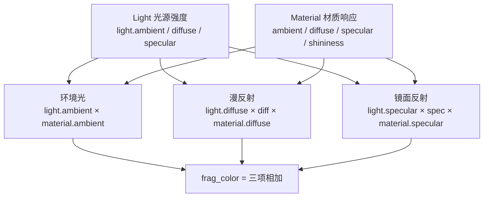
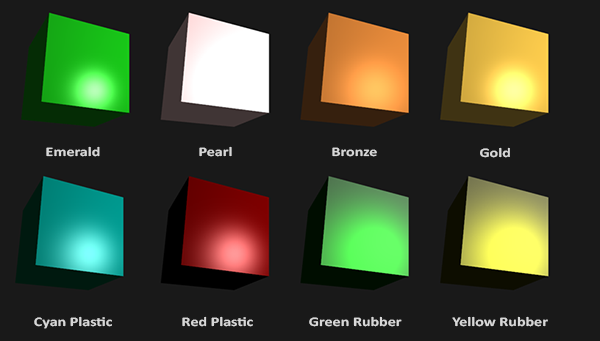
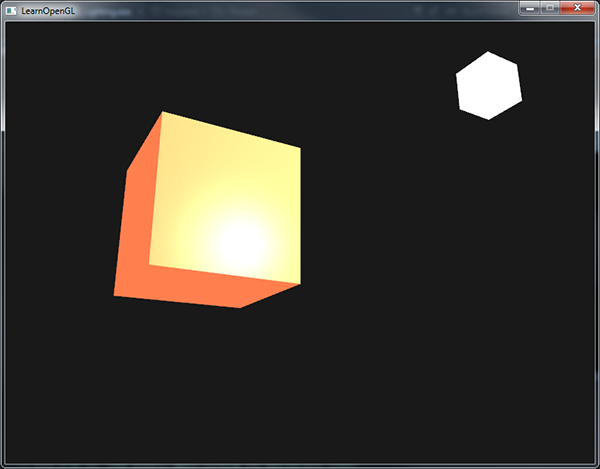
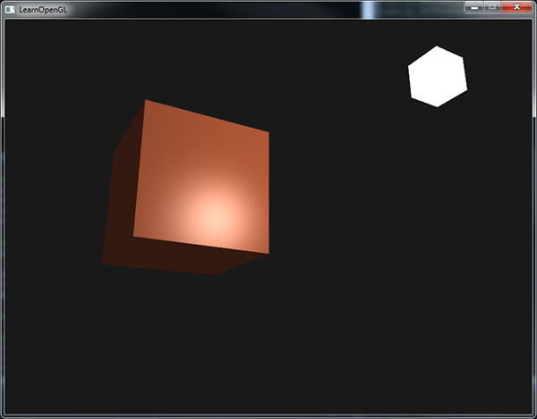
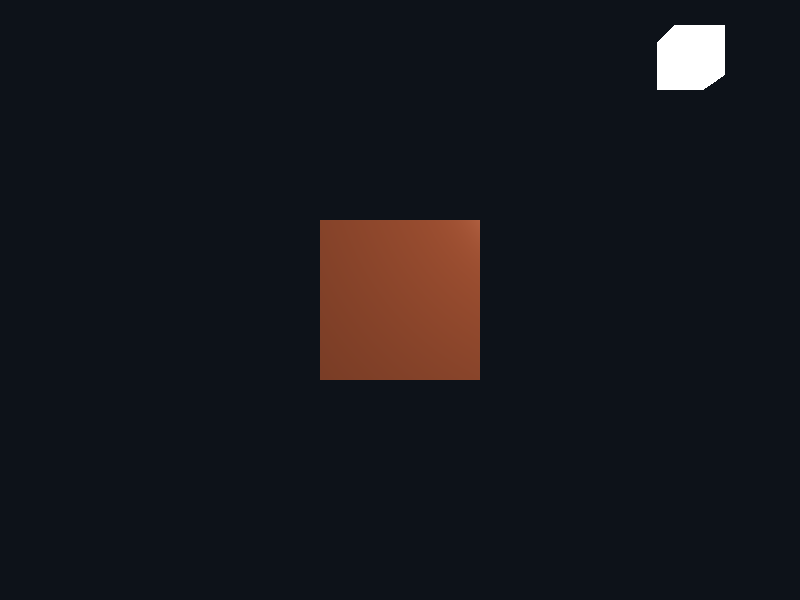

# 材质

| 项目 | 内容 |
| --- | --- |
| 原文 | [Materials](http://learnopengl.com/#!Lighting/Materials) |
| 作者 | JoeyDeVries |
| 来源 | LearnOpenGL-CN（本文基于其内容整理修订） |
| 本仓库示例 | [`apps/02_lighting/03_materials/`](../../apps/02_lighting/03_materials/) |

在现实世界里，每个物体会对光产生不同的反应。比如，钢制物体看起来通常会比陶土花瓶更闪闪发光，一个木头箱子也不会与一个钢制箱子反射同样程度的光。有些物体反射光的时候不会有太多的**散射**（Scatter），因而产生较小的高光点，而有些物体则会散射很多，产生一个有着更大半径的高光点。如果我们想要在 OpenGL 中模拟多种类型的物体，我们必须针对每种表面定义不同的**材质**（Material）属性。

**一句话核心：** 材质 = 物体对环境光、漫反射、镜面反射的三种响应颜色 + 反光度；冯氏光照模型的三个分量各自变成「光的强度 × 材质的响应」，换一组材质参数就能表现完全不同的表面。

在上一节中，我们定义了一个物体和光的颜色，并结合环境光与镜面强度分量，来决定物体的视觉输出。当描述一个表面时，我们可以分别为三个光照分量定义一个**材质颜色**（Material Color）：环境光照（Ambient Lighting）、漫反射光照（Diffuse Lighting）和镜面光照（Specular Lighting）。通过为每个分量指定一个颜色，我们就能够对表面的颜色输出有细粒度的控制了。现在，我们再添加一个**反光度**（Shininess）分量，结合上述的三个颜色，我们就有了全部所需的材质属性了（逐字取自示例 `main.cpp` 的片段着色器）：

```glsl
struct Material {
    vec3 ambient;
    vec3 diffuse;
    vec3 specular;
    float shininess;
};
```

在片段着色器中，我们创建一个**结构体**（Struct）来储存物体的材质属性。我们也可以把它们储存为独立的 uniform 值，但是作为一个结构体来储存会更有条理一些。

如你所见，我们为冯氏光照模型的每个分量都定义一个颜色向量。`ambient` 材质向量定义了在环境光照下这个表面反射的是什么颜色，通常与表面的颜色相同。`diffuse` 材质向量定义了在漫反射光照下表面的颜色——漫反射颜色（和环境光照一样）也被设置为我们期望的物体颜色。`specular` 材质向量设置的是表面上镜面高光的颜色（甚至可能反映一个特定表面的颜色）。最后，`shininess` 影响镜面高光的散射/半径。



有这 4 个元素定义一个物体的材质，我们能够模拟很多现实世界中的材质。[devernay.free.fr](http://devernay.free.fr/cours/opengl/materials.html) 中的一个表格展示了一系列材质属性，它们模拟了现实世界中的真实材质。下图展示了几组现实世界的材质参数值对我们的立方体的影响：



可以看到，通过正确地指定一个物体的材质属性，我们对这个物体的感知也就不同了。效果非常明显，但是要想获得更真实的效果，我们需要以更复杂的形状替换这个立方体——这正是[模型加载](../03_model_loading/01_assimp.md)章节要做的事。

搞清楚一个物体正确的材质设定是个困难的工程，这主要需要实验和丰富的经验。用了不合适的材质而毁了物体的视觉质量是件经常发生的事。让我们试着在着色器中实现这样的一个材质系统。

## 设置材质

我们在片段着色器中创建了一个材质结构体的 uniform，所以下面我们希望修改一下光照的计算来遵从新的材质属性。由于所有材质变量都储存在一个结构体中，我们可以从 uniform 变量 `material` 中访问它们。本仓库示例的片段着色器（完整，逐字取自示例）：

```glsl
#version 330 core
struct Material {
    vec3 ambient;
    vec3 diffuse;
    vec3 specular;
    float shininess;
};

struct Light {
    vec3 position;
    vec3 ambient;
    vec3 diffuse;
    vec3 specular;
};

in vec3 frag_pos;
in vec3 normal;
out vec4 frag_color;

uniform vec3 view_pos;
uniform Material material;
uniform Light light;

void main()
{
    vec3 ambient = light.ambient * material.ambient;

    vec3 norm = normalize(normal);
    vec3 light_dir = normalize(light.position - frag_pos);
    float diff = max(dot(norm, light_dir), 0.0);
    vec3 diffuse = light.diffuse * diff * material.diffuse;

    vec3 view_dir = normalize(view_pos - frag_pos);
    vec3 reflect_dir = reflect(-light_dir, norm);
    float spec = pow(max(dot(view_dir, reflect_dir), 0.0), material.shininess);
    vec3 specular = light.specular * spec * material.specular;

    frag_color = vec4(ambient + diffuse + specular, 1.0);
}
```

可以看到，我们现在在需要的地方访问了材质结构体中的所有属性，并且这次是根据材质的颜色来计算最终的输出颜色的。物体的每个材质属性都乘上了它们各自对应的光照分量——上一节末尾预告的镜面反射（`reflect`、`dot`、`pow` 三步）也在这里完整落地。

我们现在可以通过设置适当的 uniform 来设置应用中物体的材质了。GLSL 中一个结构体在设置 uniform 时并无任何区别，结构体只是充当 uniform 变量们的一个命名空间。所以如果想填充这个结构体的话，我们必须设置每个单独的 uniform，但要以结构体名为前缀（渲染循环中，逐字取自示例 `main.cpp`）：

```c++
        // OpenGL/GLSL: 结构体 uniform 用 "material.diffuse" 这种字段路径逐个设置。
        glUniform3f(glGetUniformLocation(object_program, "material.ambient"), 1.0F, 0.50F, 0.31F);
        glUniform3f(glGetUniformLocation(object_program, "material.diffuse"), 1.0F, 0.50F, 0.31F);
        glUniform3f(glGetUniformLocation(object_program, "material.specular"), 0.50F, 0.50F, 0.50F);
        glUniform1f(glGetUniformLocation(object_program, "material.shininess"), 32.0F);
```

我们将环境光和漫反射分量设置成我们想要让物体所拥有的颜色，而将镜面分量设置为一个中等亮度的颜色，我们不希望镜面分量过于强烈。我们仍将反光度保持为 32。

现在我们能够轻松地在应用中影响物体的材质了。运行程序，你会得到像这样的结果：



不过看起来真的不太对劲？

### 光的属性

这个物体太亮了。物体过亮的原因是环境光、漫反射和镜面光这三个颜色对任何一个光源都**全力反射**。光源对环境光、漫反射和镜面光分量也分别具有不同的强度。前面的章节中，我们通过使用一个强度值改变环境光和镜面光强度的方式解决了这个问题。我们想做类似的事情，但这次是要为每个光照分量分别指定一个强度向量。

如果我们假设 `light_color` 是 `vec3(1.0)`，那么物体的每个材质属性对每一个光照分量都返回了最大的强度。现在，物体的环境光分量完全地影响了立方体的颜色，可是环境光分量实际上不应该对最终的颜色有这么大的影响，所以我们会将光源的环境光强度设置为一个小一点的值，从而限制环境光颜色。

我们可以用同样的方式影响光源的漫反射和镜面光强度。这和我们在上一节中所做的极为相似，你可以认为我们已经创建了一些光照属性来影响各个光照分量。我们希望为光照属性创建类似材质结构体的东西：

```glsl
struct Light {
    vec3 position;
    vec3 ambient;
    vec3 diffuse;
    vec3 specular;
};
```

一个光源对它的 `ambient`、`diffuse` 和 `specular` 光照分量有着不同的强度。环境光照通常被设置为一个比较低的强度，因为我们不希望环境光颜色太过主导。光源的漫反射分量通常被设置为我们希望光所具有的那个颜色，通常是一个比较明亮的白色。镜面光分量通常会保持为 `vec3(1.0)`，以最大强度发光。注意我们也将光源的位置向量加入了结构体。和材质 uniform 一样，我们需要在应用中设置光照强度（渲染循环中，逐字取自示例）：

```c++
        glUniform3fv(glGetUniformLocation(object_program, "light.position"), 1, glm::value_ptr(light_position));
        glUniform3f(glGetUniformLocation(object_program, "light.ambient"), 0.20F, 0.20F, 0.20F);
        glUniform3f(glGetUniformLocation(object_program, "light.diffuse"), 0.50F, 0.50F, 0.50F);
        glUniform3f(glGetUniformLocation(object_program, "light.specular"), 1.0F, 1.0F, 1.0F);
```

现在我们已经调整了光照对物体材质的影响，我们得到了一个与上一节很相似的视觉效果，但这次我们有了对光照和物体材质的完全掌控：



改变物体的视觉效果现在变得相对容易了。让我们做点更有趣的事！

### 不同的光源颜色

到目前为止，我们都只对光源设置了从白到灰到黑范围内的颜色，这样只会改变物体各个分量的强度，而不是它的真正颜色。由于现在能够非常容易地访问光照的属性了，我们可以随着时间改变它们的颜色，从而获得一些非常有意思的效果：

[查看原文的效果视频](../img/02/03/materials.mp4)

你可以看到，不同的光照颜色能够极大地影响物体的最终颜色输出。由于光照颜色能够直接影响物体能够反射的颜色（回想[颜色](01_colors.md)这一节），这对视觉输出有着显著的影响。

我们可以利用 `sin` 和 `glfwGetTime` 函数改变光源的环境光和漫反射颜色，从而很容易地让光源的颜色随着时间变化：用三个不同频率的正弦分别驱动 `light_color` 的 RGB 分量，把结果乘以 0.5 得到漫反射颜色、再乘以 0.2 得到环境光颜色（降低影响），最后分别上传到 `light.diffuse` 与 `light.ambient`。本仓库示例保持常量颜色以便截图对照，把这个动效留作练习。

尝试并实验一些光照和材质值，看看它们是怎样影响视觉输出的。你可以在[这里](https://learnopengl.com/code_viewer_gh.php?code=src/2.lighting/3.1.materials/materials.cpp)找到原文应用的源码。

> **进阶（uniform 结构体的两种设置方式）：** 除了逐字段路径，GLSL 还支持**统一内存布局**（uniform block + `glBufferSubData`）一次性上传整个结构体，但那要引入 UBO（Uniform Buffer Object）和 std140 布局规则（结构体成员要对齐到特定边界），属于进阶话题。对本章的规模，逐字段 `glUniform` 直观够用；每帧反复调用 `glGetUniformLocation` 也可以优化——把 location 缓存在 setup 阶段（`GLint` 变量）是常见的改进，第一章 04-07 示例正是这么做的。

> **常见误解：** 材质的 ambient/diffuse/specular 是三个独立自由的颜色，随手乱填也行。
> **纠正：** 它们有明确的物理分工——ambient/diffuse 描述「表面反射多少入射光」（哑光部分），specular 描述「表面镜面反射多少」（光泽部分）。真实材质两者此消彼长（能量守恒的粗略体现）：反光越强，漫反射通常越弱。全填 (1,1,1) 的材质在亮光下会整体过曝（正是本节开头「物体太亮」的原因——直到我们为光也拆分了强度），这也正是后续 PBR 章节要严格解决的问题。

> **进阶（冯氏模型的边界）：** ambient + diffuse + specular 是 1975 年 Phong 提出的**经验模型**：它不发生真实的能量守恒，也没有区分金属/非金属。Blinn-Phong 用半程向量（halfway vector）替代 reflect，让高光衰减更自然、计算更省；再往后，基于微平面的 Cook-Torrance 模型（PBR）才在现代引擎中取代了冯氏。但三分量「底光 + 明暗 + 高光」的直觉贯穿始终——理解冯氏是读懂 PBR 的前提。

本仓库示例的运行效果（完整冯氏光照：环境底光 + 朝向明暗 + 白色高光斑）：



## 练习

- 你能做到这件事吗：改变光照颜色，同时让光源立方体的颜色跟着改变？（提示：`light_program` 的 `light_color` uniform 与物体着色器的 `light.diffuse` 用同一份正弦驱动的值。）
- 你能像教程一开始那样，通过定义相应的材质来模拟现实世界的物体吗？注意[材质表格](http://devernay.free.fr/cours/opengl/materials.html)中的环境光值与漫反射值不一样，它们没有考虑光照的强度。要想正确地设置它们的值，你需要将所有的光照强度都设置为 `vec3(1.0)`，这样才能得到一致的输出：[参考解答](https://learnopengl.com/code_viewer_gh.php?code=src/2.lighting/3.2.materials_exercise1/materials_exercise1.cpp)——青色塑料（Cyan Plastic）容器。
- 实现上一小节描述的正弦变光效果：`std::sin(time * 2.0F)`、`std::sin(time * 0.7F)`、`std::sin(time * 1.3F)` 分别驱动 RGB。
- 把 `material.specular` 设为 (0,0,0) 再运行，确认高光完全消失——这是验证镜面反射通路的最快方法。

## 本仓库示例

示例目录：`apps/02_lighting/03_materials/`

构建（默认 MinGW GCC Debug，需 MSYS2 UCRT64 在 PATH 中）：

```powershell
conan install . -of build/mingw-gcc-debug -pr:h conan/profiles/mingw-gcc -pr:b conan/profiles/mingw-gcc -s build_type=Debug --build=missing
cmake --preset mingw-gcc-debug
cmake --build --preset mingw-gcc-debug
```

运行：

```powershell
.\build\mingw-gcc-debug\apps\02_lighting\03_materials\02_lighting__03_materials.exe
```

运行时交互：按 **Esc**（退出键）退出程序。场景为静态画面——珊瑚色立方体在右上点光源照射下呈现完整冯氏光照：环境底光、朝向明暗与白色高光斑。

## 本章整体回顾

本节把冯氏光照模型补完并参数化：

- **局部（材质结构体）**：`Material{ambient, diffuse, specular, shininess}` 打包物体表面性质；`Light{position, ambient, diffuse, specular}` 打包光源属性；两者解耦，光与物体各自调节强度。
- **局部（结构体 uniform）**：`glUniform*` 用 `"material.diffuse"` 字段路径逐个设置结构体成员；镜面反射公式 `pow(max(dot(view, reflect), 0), shininess)` 完整落地。
- **整体（新问题）**：每个物体只能有**一种**材质颜色——箱子正面想有图案、侧面想要不同颜色怎么办？答案是让材质的 diffuse/specular 从**纹理**中逐像素采样。下一节「光照贴图」把 `vec3` 换成 `sampler2D`，为模型加载章节的材质系统铺路。

下一节：[光照贴图](04_lighting_maps.md)
