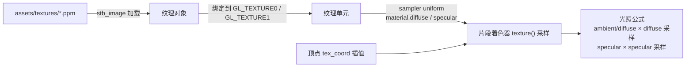
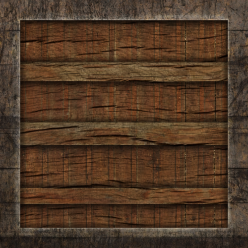
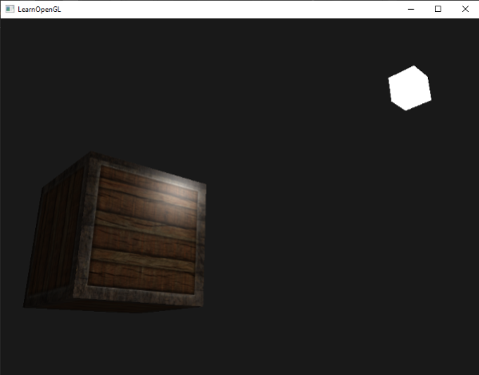
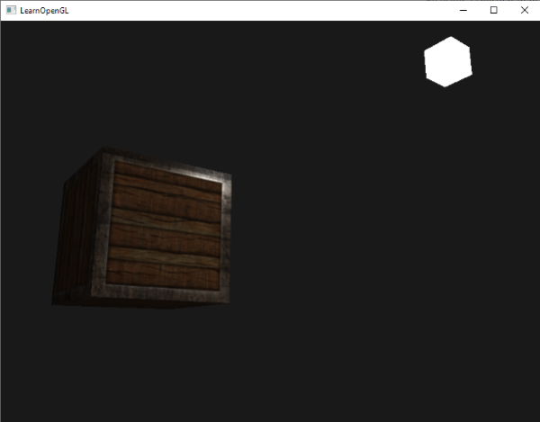
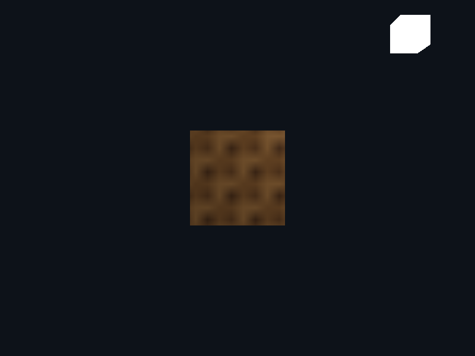

# 光照贴图

| 项目 | 内容 |
| --- | --- |
| 原文 | [Lighting Maps](http://learnopengl.com/#!Lighting/Lighting-maps) |
| 作者 | JoeyDeVries |
| 来源 | LearnOpenGL-CN（本文基于其内容整理修订） |
| 本仓库示例 | [`apps/02_lighting/04_lighting_maps/`](../../apps/02_lighting/04_lighting_maps/) |

在上一节中，我们讨论了让每个物体都拥有自己独特的材质从而对光照做出不同的反应的方法。这样能够很容易在一个光照的场景中给每个物体一个独特的外观，但这仍不能对一个物体的视觉输出提供足够多的灵活性。

在上一节中，我们将整个物体的材质定义为一个整体，但现实世界中的物体通常并不只包含一种材质，而是由多种材质所组成。想想一辆汽车：它的外壳非常有光泽，车窗会部分反射周围的环境，轮胎不会那么有光泽，所以它没有镜面高光，轮毂非常闪亮（如果你洗车了的话）。汽车同样会有漫反射和环境光颜色，它们在整个物体上也不会是一样的。总之，这样的物体在不同的部件上都有不同的材质属性。

所以，上一节中的那个材质系统是肯定不够的，它只是一个最简单的模型，所以我们需要拓展之前的系统，引入**漫反射贴图**和**镜面贴图**（Map）。这允许我们对物体的漫反射分量（以及间接地对环境光分量，它们几乎总是一样的）和镜面分量有着更精确的控制。

**一句话核心：** 把 `Material` 里的 `vec3 diffuse/specular` 换成 `sampler2D`，材质从「一种颜色」变成「一张图」——每个片段按纹理坐标取自己的材质参数，这是后续模型材质系统的直接基础。

贴图材质的数据链路全景：



## 漫反射贴图

我们希望通过某种方式对物体的每个片段单独设置漫反射颜色。有能够让我们根据片段在物体上的位置来获取颜色值的系统吗？

这可能听起来很熟悉，而且事实上这个系统我们已经使用很长时间了。这听起来很像在[纹理](../01_getting_started/06_textures.md)教程中详细讨论过的**纹理**，而这基本就是这样：一个纹理。我们仅仅是对同样的原理使用了不同的名字：其实都是使用一张覆盖物体的图像，让我们能够逐片段索引其独立的颜色值。在光照场景中，它通常叫做一个**漫反射贴图**（Diffuse Map），它是一个表现了物体所有漫反射颜色的纹理图像。

为了演示漫反射贴图，原文使用下面这张有钢边框的木箱图片（本仓库等效资源为 `assets/textures/container_diffuse.ppm`）：



在着色器中使用漫反射贴图的方法和纹理教程中是完全一样的。但这次我们会将纹理储存为 `Material` 结构体中的一个 `sampler2D`。我们将之前定义的 `vec3` 漫反射颜色向量替换为漫反射贴图（逐字取自示例 `main.cpp` 的片段着色器）：

```glsl
struct Material {
    sampler2D diffuse;
    sampler2D specular;
    float shininess;
};
```

> **注意：** `sampler2D` 是所谓的**不透明类型**（Opaque Type），也就是说我们不能将它实例化，只能通过 uniform 来定义它。如果我们使用除 uniform 以外的方法（比如函数的参数）实例化这个结构体，GLSL 会抛出一些奇怪的错误。这同样也适用于任何封装了不透明类型的结构体。

原文在此处移除了环境光材质颜色向量，因为环境光颜色在几乎所有情况下都等于漫反射颜色，所以不需要将它们分开储存——环境光直接乘漫反射采样值即可：

> **重要：** 如果你非常固执，仍想将环境光颜色设置为一个（漫反射值之外）不同的值，你也可以保留这个环境光的 `vec3`，但整个物体仍只能拥有一个环境光颜色。如果想要对不同片段有不同的环境光值，你需要对环境光值单独使用另外一个纹理。

注意我们将在片段着色器中再次需要纹理坐标，所以我们声明一个额外的输入变量。顶点着色器把纹理坐标传递到片段着色器（逐字取自示例）：

```glsl
#version 330 core
layout (location = 0) in vec3 a_pos;
layout (location = 1) in vec3 a_normal;
layout (location = 2) in vec2 a_tex_coord;

out vec3 frag_pos;
out vec3 normal;
out vec2 tex_coord;

uniform mat4 model;
uniform mat4 view;
uniform mat4 projection;

void main()
{
    frag_pos = vec3(model * vec4(a_pos, 1.0));
    normal = mat3(transpose(inverse(model))) * a_normal;
    tex_coord = a_tex_coord;
    gl_Position = projection * view * vec4(frag_pos, 1.0);
}
```

更新后的顶点数据现在包含了顶点位置、法向量和立方体顶点处的纹理坐标（36 顶点 × 8 float = 288 个，与第一章坐标系示例一致）。记得更新 VAO 的顶点属性指针来匹配新的顶点数据（逐字取自示例）：

```c++
    constexpr GLsizei stride{8 * static_cast<GLsizei>(sizeof(float))};
    constexpr auto normal_offset{3 * sizeof(float)};
    constexpr auto texture_offset{6 * sizeof(float)};

    glBindVertexArray(cube_vao);
    // OpenGL: VAO 记录 attribute 格式；这里每个顶点由位置、法线、纹理坐标组成。
    glVertexAttribPointer(0, 3, GL_FLOAT, GL_FALSE, stride, nullptr);
    glEnableVertexAttribArray(0);
    glVertexAttribPointer(1, 3, GL_FLOAT, GL_FALSE, stride,
                          reinterpret_cast<const void*>(normal_offset));
    glEnableVertexAttribArray(1);
    glVertexAttribPointer(2, 2, GL_FLOAT, GL_FALSE, stride,
                          reinterpret_cast<const void*>(texture_offset));
    glEnableVertexAttribArray(2);
```

在绘制箱子之前，我们要将纹理单元编号赋值到 `material.diffuse` 这个 uniform 采样器，并绑定箱子的纹理到这个纹理单元。本仓库示例用第一章的 `create_texture` 从 `assets/textures/` 加载两张 PPM 贴图（逐字取自示例）：

```c++
    const GLuint diffuse_map{create_texture("container_diffuse.ppm")};
    const GLuint specular_map{create_texture("container_specular.ppm")};
```

```c++
    glUseProgram(object_program);
    // OpenGL/GLSL: sampler2D 保存纹理单元编号，0/1 对应下面激活的 GL_TEXTURE0/GL_TEXTURE1。
    glUniform1i(glGetUniformLocation(object_program, "material.diffuse"), 0);
    glUniform1i(glGetUniformLocation(object_program, "material.specular"), 1);
```

渲染循环中每帧激活单元并绑定纹理（与第一章多纹理的套路一致）：

```c++
        // OpenGL: 先激活纹理单元，再把对应 texture object 绑定到该单元的 GL_TEXTURE_2D。
        glActiveTexture(GL_TEXTURE0);
        glBindTexture(GL_TEXTURE_2D, diffuse_map);
        glActiveTexture(GL_TEXTURE1);
        glBindTexture(GL_TEXTURE_2D, specular_map);
```

片段着色器中对漫反射和环境光的采样（完整片段着色器见下方「采样镜面贴图」小节）：

```glsl
    vec3 diffuse_sample = vec3(texture(material.diffuse, tex_coord));
```

> **进阶（vec3(texture(...)) 的取法）：** `texture()` 返回 `vec4`（含 alpha 通道），用 `vec3(...)` 取 RGB 三个分量。环境光也乘漫反射采样值 `light.ambient * diffuse_sample`——底光同样要经过物体颜色的「吸收」，而不是无差别地把所有表面抬亮。三个分量复用同一份采样结果，避免重复采样。

使用了漫反射贴图之后，细节再一次得到惊人的提升。原文的箱子看起来像这样：



## 镜面贴图

你可能会注意到，镜面高光看起来有些奇怪，因为我们的物体大部分都是木头，我们知道木头不应该有这么强的镜面高光的。我们可以将物体的镜面光材质设置为 `vec3(0.0)` 来解决这个问题，但这也意味着箱子钢制的边框将不再能够显示镜面高光了，而我们**知道**钢铁应该有一些镜面高光。所以，我们想要让物体的某些部分以不同的强度显示镜面高光。这个问题看起来和漫反射贴图非常相似——我们可以同样使用一个专门用于镜面高光的纹理贴图。这也就意味着我们需要生成一个黑白的（如果你想的话也可以是彩色的）纹理，来定义物体每部分的镜面光强度。下面是一个**镜面贴图**（Specular Map）的例子（本仓库等效资源为 `assets/textures/container_specular.ppm`）：


镜面高光的强度可以通过图像每个像素的亮度来获取。镜面贴图上的每个像素都可以由一个颜色向量来表示，比如说黑色代表颜色向量 `vec3(0.0)`，灰色代表颜色向量 `vec3(0.5)`。在片段着色器中，我们接下来会采样对应的颜色值并将它乘以光源的镜面强度。一个像素越「白」，乘积就会越大，物体的镜面光分量就会越亮。

由于箱子大部分都由木头组成，而且木头材质应该没有镜面高光，所以镜面贴图的整个木头部分全部都是黑色的。箱子钢制边框的镜面光强度是有细微变化的，钢铁本身会比较容易受到镜面高光的影响，而裂缝则不会。

> **重要：** 从实际角度来说，木头其实也有镜面高光，尽管它的反光度很小（更多的光被散射），影响也比较小，但是为了教学目的，我们可以假设木头不会对镜面光有任何反应。

使用 Photoshop 或 GIMP 之类的工具，将漫反射纹理转换为镜面贴图还是比较容易的：剪切掉一些部分，将图像转换为黑白的，并调整亮度/对比度即可。

### 采样镜面贴图

镜面贴图和其它的纹理非常类似，所以代码也和漫反射贴图的代码很类似。记得要正确地加载图像并生成一个纹理对象。由于我们正在同一个片段着色器中使用另一个纹理采样器，我们必须要对镜面贴图使用一个不同的纹理单元（见[纹理](../01_getting_started/06_textures.md)），所以我们在渲染之前先把它绑定到合适的纹理单元上（即上文渲染循环中的 `GL_TEXTURE1` 绑定）。

片段着色器的材质属性中，镜面分量同样是一个 `sampler2D`（见本节开头的 `Material` 结构体）。最终完整的片段着色器（逐字取自示例）：

```glsl
#version 330 core
struct Material {
    sampler2D diffuse;
    sampler2D specular;
    float shininess;
};

struct Light {
    vec3 position;
    vec3 ambient;
    vec3 diffuse;
    vec3 specular;
};

in vec3 frag_pos;
in vec3 normal;
in vec2 tex_coord;
out vec4 frag_color;

uniform vec3 view_pos;
uniform Material material;
uniform Light light;

void main()
{
    vec3 diffuse_sample = vec3(texture(material.diffuse, tex_coord));
    vec3 specular_sample = vec3(texture(material.specular, tex_coord));

    vec3 ambient = light.ambient * diffuse_sample;

    vec3 norm = normalize(normal);
    vec3 light_dir = normalize(light.position - frag_pos);
    float diff = max(dot(norm, light_dir), 0.0);
    vec3 diffuse = light.diffuse * diff * diffuse_sample;

    vec3 view_dir = normalize(view_pos - frag_pos);
    vec3 reflect_dir = reflect(-light_dir, norm);
    float spec = pow(max(dot(view_dir, reflect_dir), 0.0), material.shininess);
    vec3 specular = light.specular * spec * specular_sample;

    frag_color = vec4(ambient + diffuse + specular, 1.0);
}
```

通过使用镜面贴图我们可以对物体设置大量的细节，比如物体的哪些部分需要有**闪闪发光**的属性，我们甚至可以设置它们对应的强度。镜面贴图能够在漫反射贴图之上给予我们更高一层的控制：



> **重要：** 如果你想另辟蹊径，你也可以在镜面贴图中使用真正的颜色，不仅设置每个片段的镜面光强度，还设置镜面高光的颜色。从现实角度来说，镜面高光的颜色大部分（甚至全部）都是由光源本身所决定的，所以这样并不能生成非常真实的视觉效果（这也是为什么镜面贴图通常是黑白的——我们只关心强度）。

本仓库示例的运行效果（木板面板哑光、边框高光，两种「材质」共存于同一个立方体）：



> **常见误解：** 镜面贴图必须提供，缺了光照就崩。
> **纠正：** 镜面贴图完全可选——如果某物体没有高光需求，绑一张全黑 1×1 纹理（或用纯色 `vec3(0)`）即可，高光项自然归零。本仓库下一章的 Model 加载器就采用这个策略：材质缺贴图时回退到 1×1 纯色纹理，着色器代码无需任何分支。

> **进阶（纹理单元的数量上限）：** sampler uniform 的值是**纹理单元编号**而不是纹理对象句柄——本示例把 `material.diffuse` 设为 0、`material.specular` 设为 1，对应 `GL_TEXTURE0`/`GL_TEXTURE1`。可用的纹理单元数量由实现决定：OpenGL 规范保证片元着色器至少可用的纹理图像单元数为 **16**（`GL_MAX_TEXTURE_IMAGE_UNITS`），所有阶段合计至少 48（`GL_MAX_COMBINED_TEXTURE_IMAGE_UNITS`）；查询上限用 `glGetIntegerv`。超限时就要分批绘制或改用纹理数组/图集。

> **进阶（为什么不用一张贴图存所有材质参数）：** 把 diffuse 的 RGB、specular 的强度、shininess 等打包进一张贴图的各个通道（常见于引擎的 material map：RGB = 反照率，A = 光滑度）能显著减少绑定数量与显存占用，游戏引擎几乎都这么做。教学示例为了直观，一张贴图对应一个语义。下一章 Model 加载器会从模型文件（MTL）自动读取这些贴图路径，参数来源变了，采样逻辑不变。

通过使用漫反射和镜面贴图，我们可以给相对简单的物体添加大量的细节。我们甚至可以使用**法线/凹凸贴图**（Normal/Bump Map）或者**反射贴图**（Reflection Map）给物体添加更多的细节，但这些将会留到之后的教程中。

## 练习

- 调整光源的环境光、漫反射和镜面光向量，看看它们如何影响箱子的视觉输出。
- 调整 `material.shininess`（2 → 256），观察边框高光斑的大小变化。
- 尝试在片段着色器中反转镜面贴图的颜色值，让木头显示镜面高光而钢制边缘不反光（由于钢制边缘中有一些裂缝，边缘仍会显示一些镜面高光，虽然强度会小很多）：[参考解答](https://learnopengl.com/code_viewer.php?code=lighting/lighting_maps-exercise2)。
- 使用漫反射贴图创建一个彩色而不是黑白的镜面贴图，看看结果看起来并不是那么真实了。如果你不会生成的话，可以使用这张[彩色的镜面贴图](../img/02/04/lighting_maps_specular_color.png)：[最终效果](../img/02/04/lighting_maps_exercise3.png)。
- 添加一个叫做**自发光贴图**（Emission Map）的东西，它是一个储存了每个片段的**发光值**（Emission Value）的贴图。发光值是一个物体**自发光**（Emit）时可能显现的颜色，这样的话物体就能够忽略光照条件进行发光（Glow）。游戏中某个物体在发光的时候，你通常看到的就是自发光贴图（比如[机器人的眼](../img/02/04/shaders_enemy.jpg)，或是[箱子上的灯带](../img/02/04/emissive.png)）。将[这个](../img/02/04/matrix.jpg)纹理（作者为 creativesam）作为自发光贴图添加到箱子上，产生这些字母都在发光的效果：[参考解答](https://learnopengl.com/code_viewer_gh.php?code=src/2.lighting/4.4.lighting_maps_exercise4/lighting_maps_exercise4.cpp)，[最终效果](../img/02/04/lighting_maps_exercise4.png)。（原文译作「放射光贴图」，英文 Emission/Transparency Map 语境下更通行的说法是自发光贴图。）

## 本仓库示例

示例目录：`apps/02_lighting/04_lighting_maps/`

构建（默认 MinGW GCC Debug，需 MSYS2 UCRT64 在 PATH 中）：

```powershell
conan install . -of build/mingw-gcc-debug -pr:h conan/profiles/mingw-gcc -pr:b conan/profiles/mingw-gcc -s build_type=Debug --build=missing
cmake --preset mingw-gcc-debug
cmake --build --preset mingw-gcc-debug
```

运行：

```powershell
.\build\mingw-gcc-debug\apps\02_lighting\04_lighting_maps\02_lighting__04_lighting_maps.exe
```

运行时交互：按 **Esc**（退出键）退出程序。场景为静态画面——贴图箱子（`assets/textures/container_diffuse.ppm` + `container_specular.ppm`）在右上点光源照射下：面板有明暗、边框有高光。纹理从 `assets/textures/` 加载。

## 本章整体回顾

本节让材质从「常量」变成「贴图」：

- **局部（两个 sampler）**：`Material.diffuse/specular` 从 `vec3` 升级为 `sampler2D`，逐片段采样；环境光也乘漫反射采样；镜面贴图是灰度图，控制高光的空间分布。
- **局部（顶点布局定型）**：位置 + 法线 + 纹理坐标的 8-float 交错布局（attribute 0/1/2）从本节起固定下来——下一章模型加载的每个 mesh 都沿用这套布局。
- **整体（材质管线全景）**：`assets/textures/*.ppm` → stb_image → 纹理对象 → 纹理单元 0/1 → sampler uniform → 片段着色器按 `tex_coord` 采样 → 光照公式。至此单个点光源 + 贴图材质的渲染链路完整；但光源还是「原地不动、照亮全世界」——下一节「投光物」给光源加上**方向**（定向光）、**距离衰减**（点光源）和**照射锥角**（聚光灯）。

下一节：[投光物](05_light_casters.md)
