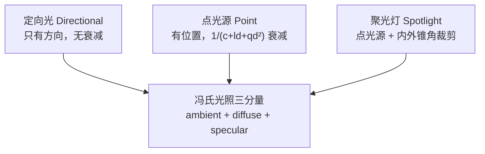
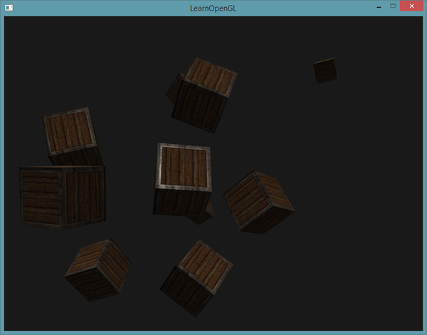
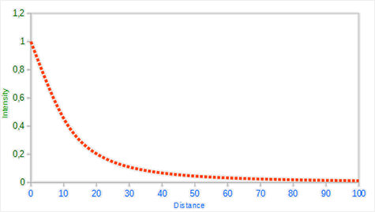
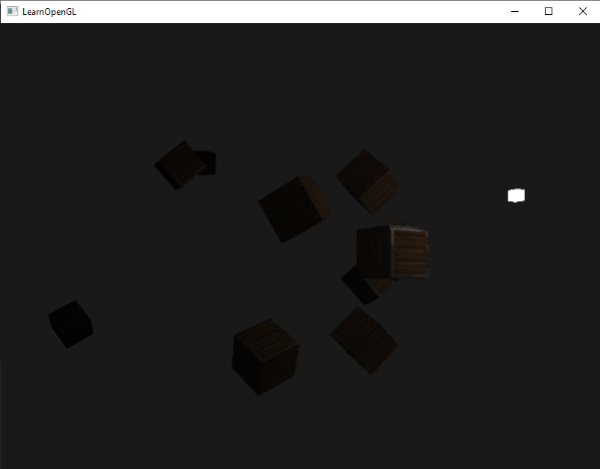
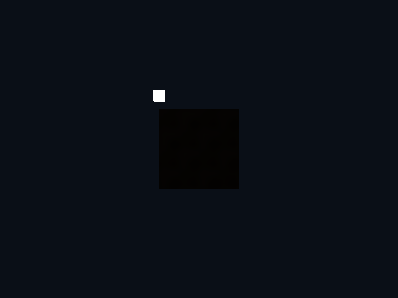
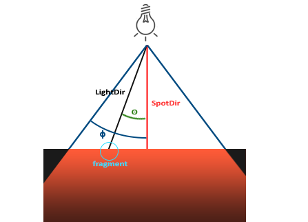
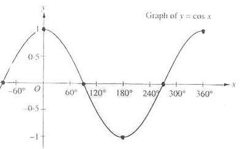
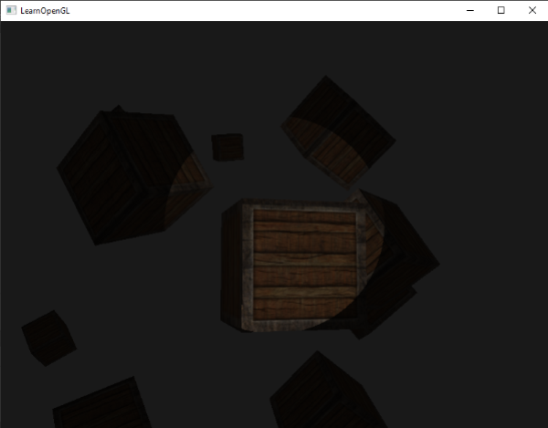

# 投光物

| 项目 | 内容 |
| --- | --- |
| 原文 | [Light casters](http://learnopengl.com/#!Lighting/Light-casters) |
| 作者 | JoeyDeVries |
| 来源 | LearnOpenGL-CN（本文基于其内容整理修订） |
| 本仓库示例 | [`apps/02_lighting/05_light_casters/`](../../apps/02_lighting/05_light_casters/) |

我们目前使用的光照都来自于空间中的一个点。它能给我们不错的效果，但现实世界中，我们有很多种类的光照，每种的表现都不同。将光**投射**（Cast）到物体的光源叫做**投光物**（Light Caster）。在这一节中，我们将会讨论几种不同类型的投光物。学会模拟不同种类的光源是又一个能够进一步丰富场景的工具。

我们首先将会讨论定向光（Directional Light，又称平行光），接下来是点光源（Point Light），它是我们之前学习的光源的拓展，最后我们将会讨论聚光灯（Spotlight）。在下一节中我们将讨论如何将这些不同种类的光照类型整合到一个场景之中。

**一句话核心：** 投光物 = 同一套冯氏光照 + 不同的「到达片段的光强」计算——定向光按方向、点光源按位置 + 衰减、聚光灯按位置 + 锥角；衰减用 $1/(c + ld + qd^2)$ 的二次多项式近似。

> **本仓库示例的取舍：** 本仓库 `05_light_casters` 示例完整实现了**移动点光源 + 距离衰减**；定向光与聚光灯的完整代码在 `06_multiple_lights` 示例中（与本节公式一一对应，下文代码均取自这两个示例）。



## 定向光

当一个光源处于很远的地方时，来自光源的每条光线就会近似于互相平行。不论物体和/或者观察者的位置，看起来好像所有的光都来自于同一个方向。当我们使用一个假设光源处于**无限**远处的模型时，它就被称为**定向光**（Directional Light），因为它的所有光线都有着相同的方向，它与光源的位置是没有关系的。

定向光非常好的一个例子就是太阳。太阳距离我们并不是无限远，但它已经远到在光照计算中可以把它视为无限远了。所以来自太阳的所有光线将被模拟为平行光线，我们可以在下图看到：


因为所有的光线都是平行的，所以物体与光源的相对位置是不重要的，因为对场景中每一个物体光的方向都是一致的。由于光的方向向量保持不变，场景中每个物体的光照计算将会是类似的。

我们可以定义一个光线方向向量而不是位置向量来模拟一个定向光。着色器的计算基本保持不变，但这次我们将直接使用光的 `direction` 向量而不是通过 `position` 来计算 `light_dir` 向量。本仓库 `06_multiple_lights` 示例中的定向光结构体与计算（逐字取自该示例 `main.cpp` 的片段着色器）：

```glsl
struct DirLight {
    vec3 direction;
    vec3 ambient;
    vec3 diffuse;
    vec3 specular;
};
```

```glsl
vec3 calc_dir_light(DirLight light, vec3 norm, vec3 view_dir)
{
    vec3 light_dir = normalize(-light.direction);
```

注意我们首先对 `light.direction` 向量取反。我们目前使用的光照计算需要一个从片段**至**光源的光线方向，但人们更习惯定义定向光为一个**从**光源出发的全局方向（比如「光朝下照」）。所以我们需要对全局光照方向向量取反来改变它的方向，使它成为一个指向光源的方向向量。而且，记得对向量进行标准化——假设输入向量已经是单位向量是很不明智的。

最终的 `light_dir` 向量将和以前一样用在漫反射和镜面光计算中。

为了清楚地展示定向光对多个物体具有相同的影响，原文再次使用了[坐标系统](../01_getting_started/08_coordinate_systems.md)章节最后的那个箱子派对的场景：十个立方体各自拥有不同的模型矩阵，全部被同一个方向的光照亮。本仓库 `06_multiple_lights` 示例正是这个场景，渲染循环中每个立方体的模型矩阵（逐字取自该示例）：

```c++
        for (std::size_t index{0}; index < cube_positions.size(); ++index) {
            glm::mat4 model{1.0F};
            model = glm::translate(model, cube_positions[index]);
            model = glm::rotate(model, glm::radians(20.0F * static_cast<float>(index + 1U)),
                                glm::vec3{1.0F, 0.3F, 0.5F});
            glUniformMatrix4fv(glGetUniformLocation(object_program, "model"), 1, GL_FALSE,
                               glm::value_ptr(model));
            glDrawArrays(GL_TRIANGLES, 0, 36);
        }
```

同时，不要忘记定义光源的方向（注意我们将方向定义为**从**光源出发的方向，你可以很容易看到光的方向朝下；逐字取自 `06_multiple_lights` 示例）：

```c++
        // OpenGL/GLSL: 方向光没有位置，direction 表示所有片段看到的入射方向一致。
        glUniform3f(glGetUniformLocation(object_program, "dir_light.direction"), -0.2F, -1.0F,
                    -0.3F);
```

> **重要：** 我们一直将光的位置和方向向量定义为 `vec3`，但一些人会喜欢将所有的向量都定义为 `vec4`。当我们将位置向量定义为一个 `vec4` 时，很重要的一点是要将 w 分量设置为 1.0，这样变换和投影才能正确应用。然而，当我们定义一个方向向量为 `vec4` 的时候，我们不想让位移有任何的效果（因为它仅仅代表的是方向），所以我们将 w 分量设置为 0.0。方向向量就会像这样来表示：`vec4(0.2f, 1.0f, 3.0f, 0.0f)`。这也可以作为一个快速检测光照类型的工具：检测 w 分量是否等于 1.0，来检测它是否是光的位置向量；w 分量等于 0.0 则是光的方向向量，据此就能调整光照计算。你知道吗：这正是旧 OpenGL（固定函数管线）区分**位置光源**（Positional Light Source）与定向光的方法。

如果你现在编译程序，在场景中自由移动，你就可以看到好像有一个太阳一样的光源对所有的物体投光。原文教程的效果图：



## 点光源

定向光对于照亮整个场景的全局光源是非常棒的，但除了定向光之外我们也需要一些分散在场景中的**点光源**（Point Light）。点光源是处于世界中某一个位置的光源，它会朝着所有方向发光，但光线会随着距离逐渐衰减。想象作为投光物的灯泡和火把，它们都是点光源。


在之前的教程中，我们一直都在使用一个（简化的）点光源。我们在给定位置有一个光源，它会从它的位置开始朝着所有方向发射光线。然而，我们定义的光源**永远不会衰减**，这看起来像是光源的亮度不随距离变化。在大部分的 3D 模拟中，我们都希望模拟的光源仅照亮光源附近的区域而不是整个场景。

如果你将 10 个箱子加入到光照场景中，你会注意到最后面的箱子和在灯面前的箱子以相同的强度被照亮。我们希望在后排的箱子与前排的箱子相比仅仅是被轻微地照亮。

### 衰减

随着光线传播距离的增长逐渐削减光的强度通常叫做**衰减**（Attenuation）。随距离减少光强度的一种方式是使用一个线性方程——这样的方程能够随着距离的增长线性地减少光的强度，从而让远处的物体更暗。然而，这样的线性方程通常会看起来比较假。在现实世界中，灯在近处通常会非常亮，但随着距离的增加，光源的亮度一开始会下降得非常快，但在远处时剩余的光强度就会下降得非常缓慢了。所以，我们需要一个不同的公式来减少光的强度。

幸运的是一些聪明的人已经帮我们解决了这个问题。下面这个公式根据片段距光源的距离计算衰减值，之后我们会将它乘以光的强度向量：

$$
F_{att} = \frac{1.0}{K_c + K_l \cdot d + K_q \cdot d^2}
$$

在这里 $d$ 代表了片段距光源的距离。接下来为了计算衰减值，我们定义 3 个（可配置的）项：**常数项** $K_c$、**一次项** $K_l$ 和**二次项** $K_q$。

- 常数项通常保持为 1.0，它的主要作用是保证分母永远不会比 1 小，否则的话在某些距离上它反而会增加强度，这肯定不是我们想要的效果。
- 一次项会与距离值相乘，以线性的方式减少强度。
- 二次项会与距离的平方相乘，让光源以二次递减的方式减少强度。二次项在距离比较小的时候影响会比一次项小很多，但当距离值比较大的时候它就会比一次项更大了。

由于二次项的存在，光线会在大部分时候以线性的方式衰退，直到距离变得足够大，让二次项超过一次项，光的强度会以更快的速度下降。这样的结果就是，光在近距离时亮度很高，但随着距离变远亮度迅速降低，最后会以更慢的速度减少亮度。下面这张图显示了在 100 的距离内衰减的效果：



你可以看到光在近距离的时候有着最高的强度，但随着距离增长，它的强度明显减弱，并缓慢地在距离大约 100 的时候强度接近 0。这正是我们想要的。

> **进阶（为什么不用物理正确的 1/d²）：** 物理上点光源衰减严格按平方反比，但它有两个不适合实时渲染的特性：**近距离爆炸**（$d \to 0$ 时亮度无界，画面烧成白块）与**远处归零太快**（$d = 10$ 时能量只剩 1%，场景大片死黑）。二次多项式 $c + ld + qd^2$ 的倒数在近距离被 $c$ 托底（亮度封顶）、中远距离由一次项「接力」、远处才交给二次项，整条曲线平滑可控；调三个系数就是在「物理正确」和「画面好看」之间取平衡。现代引擎（PBR 工作流）又会切回带单位标定的平方反比 + 光强参数，那时过曝交给 tone mapping 解决——工具链不同，取舍不同。

### 选择正确的值

那么，该对这三个项设置什么值呢？正确地设定它们的值取决于很多因素：环境、希望光覆盖的距离、光的类型等。在大多数情况下，这都是经验的问题，以及适量的调整。下面这个表格显示了模拟一个（大概）真实的、覆盖特定半径（距离）的光源时，这些项可能取的一些值。第一列指定的是在给定三项值时光所能覆盖的距离。这些值是大多数光源很好的起始点，由 [Ogre3D 的 Wiki](http://www.ogre3d.org/tikiwiki/tiki-index.php?page=-Point+Light+Attenuation) 提供：

| 距离 | 常数项 | 一次项 | 二次项 |
| ---- | ------ | ------ | ------ |
| 7 | 1.0 | 0.7 | 1.8 |
| 13 | 1.0 | 0.35 | 0.44 |
| 20 | 1.0 | 0.22 | 0.20 |
| 32 | 1.0 | 0.14 | 0.07 |
| 50 | 1.0 | 0.09 | 0.032 |
| 65 | 1.0 | 0.07 | 0.017 |
| 100 | 1.0 | 0.045 | 0.0075 |
| 160 | 1.0 | 0.027 | 0.0028 |
| 200 | 1.0 | 0.022 | 0.0019 |
| 325 | 1.0 | 0.014 | 0.0007 |
| 600 | 1.0 | 0.007 | 0.0002 |
| 3250 | 1.0 | 0.0014 | 0.000007 |

你可以看到，常数项 $K_c$ 在所有的情况下都是 1.0。一次项 $K_l$ 为了覆盖更远的距离通常都很小，二次项 $K_q$ 甚至更小。尝试对这些值进行实验，看看它们在你的实现中有什么效果。原文建议 32 到 100 的距离对大多数的光源都足够了。

### 实现衰减

为了实现衰减，在片段着色器中我们还需要三个额外的值：也就是公式中的常数项、一次项和二次项。它们最好储存在之前定义的 `Light` 结构体中。本仓库 `05_light_casters` 示例的 `Light` 结构体（逐字取自该示例 `main.cpp` 的片段着色器；注意这里使用的是点光源的 `position`，不是定向光部分的 `direction`）：

```glsl
struct Light {
    vec3 position;
    vec3 ambient;
    vec3 diffuse;
    vec3 specular;
    float constant;
    float linear;
    float quadratic;
};
```

然后我们在 OpenGL 中设置这些项。本仓库示例希望光源覆盖约 32 单位的范围，所以使用表格中「32」一行的参数（渲染循环中，逐字取自示例）：

```c++
        // OpenGL/GLSL: 衰减系数越大，光照随距离减弱越快；这里采用常见的 32 单位范围参数。
        glUniform1f(glGetUniformLocation(object_program, "light.constant"), 1.0F);
        glUniform1f(glGetUniformLocation(object_program, "light.linear"), 0.14F);
        glUniform1f(glGetUniformLocation(object_program, "light.quadratic"), 0.07F);
```

在片段着色器中实现衰减还是比较直接的：我们根据公式计算衰减值，之后再分别乘以环境光、漫反射和镜面光分量。

我们仍需要公式中距光源的距离，还记得我们是怎么计算一个向量的长度的吗？我们可以通过获取片段和光源之间的向量差，并获取结果向量的长度作为距离项。我们可以使用 GLSL 内建的 `length` 函数来完成这一点（逐字取自示例的片段着色器）：

```glsl
    float distance = length(light.position - frag_pos);
    float attenuation =
        1.0 / (light.constant + light.linear * distance + light.quadratic * distance * distance);
```

接下来，我们将这个衰减值包含到光照计算中，将它分别乘以环境光、漫反射和镜面光颜色：

```glsl
    ambient *= attenuation;
    diffuse *= attenuation;
    specular *= attenuation;
```

> **重要：** 我们可以将环境光分量保持不变，让环境光照不会随着距离减少，但是如果我们使用多于一个的光源，所有的环境光分量将会开始叠加，所以在这种情况下我们也希望衰减环境光照。简单实验一下，看看什么才能在你的环境中效果最好。

为了让衰减效果可见，本仓库示例让点光源绕箱子环绕运动（渲染循环开头，逐字取自示例）：

```c++
        const float time{static_cast<float>(glfwGetTime())};
        const glm::vec3 light_position{
            std::sin(time) * 1.8F,
            1.0F,
            std::cos(time) * 2.0F,
        };
```

每帧把新的 `light_position` 上传给物体着色器，同时用它更新光源标记小立方体的 model 矩阵。运行示例：光源绕箱子环绕，靠近时箱子亮得清晰、高光斑明显，绕到远处时只剩微弱的底光——原文教程的参考效果图与本仓库示例运行效果：





点光源就是一个能够配置位置和衰减的光源。它是我们光照工具箱中的又一个光照类型。

## 聚光灯

我们要讨论的最后一种类型的光是**聚光灯**（Spotlight）。聚光灯是位于环境中某个位置的光源，它只朝一个特定方向而不是所有方向照射光线。这样的结果就是只有在聚光方向的特定半径内的物体才会被照亮，其它的物体都会保持黑暗。聚光灯很好的例子就是路灯或手电筒。

OpenGL 中聚光灯是用一个世界空间位置、一个方向和一个**切光角**（Cutoff Angle）来表示的，切光角指定了聚光的半径（指圆锥的张开角度）。对于每个片段，我们会计算片段是否位于聚光的切光方向之间（也就是在锥形内），如果是的话，我们就相应地照亮片段。下面这张图会让你明白聚光灯是如何工作的：



- `LightDir`：从片段指向光源的向量。
- `SpotDir`：聚光灯所指向的方向。
- `Phi`（$\phi$）：指定了聚光灯半径的切光角。落在这个角度之外的物体都不会被这个聚光灯照亮。
- `Theta`（$\theta$）：`LightDir` 向量和 `SpotDir` 向量之间的夹角。在聚光灯内部的话 $\theta$ 值应该比 $\phi$ 值小。

所以我们要做的就是计算 `LightDir` 向量和 `SpotDir` 向量之间的点积（还记得它会返回两个单位向量夹角的余弦值吗？），并将它与切光角 $\phi$ 的值对比。下面我们将以手电筒的形式创建一个聚光灯。

### 手电筒

手电筒（Flashlight）是一个位于观察者位置的聚光灯，通常它都会瞄准玩家视角的正前方。基本上说，手电筒就是普通的聚光灯，但它的位置和方向会随着玩家的位置和朝向不断更新。

所以，在片段着色器中我们需要的值有聚光灯的位置向量（来计算光的方向向量）、聚光灯的方向向量和一个切光角。我们可以将它们储存在 `Light` 结构体中。本仓库 `06_multiple_lights` 示例的聚光灯结构体（逐字取自该示例）：

```glsl
struct SpotLight {
    vec3 position;
    vec3 direction;
    float cut_off;
    float outer_cut_off;
    vec3 ambient;
    vec3 diffuse;
    vec3 specular;
    float constant;
    float linear;
    float quadratic;
};
```

接下来我们将合适的值传到着色器中（逐字取自 `06_multiple_lights` 示例——手电筒的位置与方向直接取相机状态）：

```c++
        // OpenGL/GLSL: 聚光灯用 cut_off/outer_cut_off 两个余弦值做柔和边缘。
        glUniform3fv(glGetUniformLocation(object_program, "spot_light.position"), 1,
                     glm::value_ptr(view_position));
        glUniform3fv(glGetUniformLocation(object_program, "spot_light.direction"), 1,
                     glm::value_ptr(spot_direction));
        glUniform1f(glGetUniformLocation(object_program, "spot_light.cut_off"),
                    std::cos(glm::radians(12.5F)));
        glUniform1f(glGetUniformLocation(object_program, "spot_light.outer_cut_off"),
                    std::cos(glm::radians(17.5F)));
```

你可以看到，我们并没有给切光角设置一个角度值，反而是用角度值计算了一个**余弦值**，将余弦结果传递到片段着色器中。这样做的原因是：在片段着色器中，我们会计算 `LightDir` 和 `SpotDir` 向量的点积，这个点积返回的将是一个余弦值而不是角度值，所以我们不能直接拿角度值和余弦值进行比较。为了获取角度值我们需要计算点积结果的反余弦（`acos`），这是一个开销很大的计算。所以为了节约性能开销，我们将切光角预先转换为余弦值再传入着色器——两个值现在都是余弦，直接比较即可。

> **常见误解：** `cut_off`/`outer_cut_off` 直接填角度值（比如 12.5 和 17.5）。
> **纠正：** 它们是**余弦值**（`std::cos(glm::radians(12.5F))` ≈ 0.976）。着色器里比较的是 `dot` 的结果（余弦），两边必须是同一个量纲；直接传角度会让光锥大得离谱或整灯不亮。且余弦在 0°~180° 单调递减，比较方向也要反过来：`theta > cut_off` 才是「在锥内」。

> **重要：** 你可能奇怪为什么在 if 条件中使用的是 `>` 符号而不是 `<` 符号——`theta` 不应该比切光角更小才是在聚光灯内部吗？这并没有错，但不要忘了角度值现在都由余弦值来表示。一个 0 度的角度表示的是 1.0 的余弦值，而一个 90 度的角度表示的是 0.0 的余弦值，你可以在下图中看到：
>
> 
>
> 你现在可以看到，余弦值越接近 1.0，它的角度就越小。这也就解释了为什么 `theta` 要比切光值更大。切光值目前设置为 12.5° 的余弦（约 0.976），所以只有 0.976 到 1.0 范围内的 `theta` 值才能保证片段在聚光灯内，从而被照亮。

运行原文程序，你将会看到一个聚光灯，它仅会照亮聚光圆锥内的片段：



但这仍看起来有些假，主要是因为聚光灯有一圈硬边。当一个片段遇到聚光圆锥的边缘时，它会完全变暗，没有一点平滑的过渡。一个真实的聚光灯会在边缘处逐渐减少亮度。

### 平滑/软化边缘

为了创建一种看起来边缘平滑的聚光灯，我们需要模拟聚光灯有一个**内圆锥**（Inner Cone）和一个**外圆锥**（Outer Cone）。我们可以将内圆锥设置为上一部分中的那个圆锥，但我们也需要一个外圆锥，来让光从内圆锥逐渐减暗，直到外圆锥的边界。

为了创建一个外圆锥，我们只需要再定义一个余弦值来代表聚光方向向量和外圆锥向量（等于它的半径）的夹角。然后，如果一个片段处于内外圆锥之间，将会给它计算出一个 0.0 到 1.0 之间的强度值。如果片段在内圆锥之内，它的强度就是 1.0；如果在外圆锥之外，强度值就是 0.0。

我们可以用下面这个公式来计算这个值：

$$
I = \frac{\theta - \gamma}{\epsilon}
$$

这里 $\epsilon$（Epsilon）是内（$\phi$）和外圆锥（$\gamma$）之间的余弦值差（$\epsilon = \phi - \gamma$）。最终的 $I$ 值就是当前片段聚光灯的强度。

很难直观地表现这个公式是怎么工作的，所以我们用一些实例值来看看：

| $\theta$（余弦） | $\theta$（角度） | $\phi$（内切光） | $\phi$（角度） | $\gamma$（外切光） | $\gamma$（角度） | $\epsilon$ | $I$ |
| -- | -- | -- | -- | -- | -- | -- | -- |
| 0.87 | 30° | 0.91 | 25° | 0.82 | 35° | 0.91 − 0.82 = 0.09 | (0.87 − 0.82) / 0.09 = 0.56 |
| 0.90 | 26° | 0.91 | 25° | 0.82 | 35° | 0.09 | (0.90 − 0.82) / 0.09 = 0.89 |
| 0.97 | 14° | 0.91 | 25° | 0.82 | 35° | 0.09 | (0.97 − 0.82) / 0.09 = 1.67 |
| 0.83 | 34° | 0.91 | 25° | 0.82 | 35° | 0.09 | (0.83 − 0.82) / 0.09 = 0.11 |
| 0.64 | 50° | 0.91 | 25° | 0.82 | 35° | 0.09 | (0.64 − 0.82) / 0.09 = −2.0 |
| 0.966 | 15° | 0.9978 | 12.5° | 0.953 | 17.5° | 0.9978 − 0.953 = 0.0448 | (0.966 − 0.953) / 0.0448 = 0.29 |

（译注：$I$ 列的分母为 $\epsilon$、分子为 $\theta - \gamma$。）你可以看到，我们基本是在内外余弦值之间根据 $\theta$ 插值。如果你仍不明白发生了什么，不必担心，只需要记住这个公式就好了，在你更聪明的时候再回来看看。

我们现在有了一个在聚光灯外是负的、在内圆锥内大于 1.0 的、在边缘处于两者之间的强度值了。如果我们正确地**截断**（Clamp）这个值，在片段着色器中就不再需要 `if-else` 了，我们能够使用计算出来的强度值直接乘以光照分量。本仓库 `06_multiple_lights` 示例的实现（逐字取自该示例的 `calc_spot_light` 函数）：

```glsl
    float theta = dot(light_dir, normalize(-light.direction));
    float epsilon = light.cut_off - light.outer_cut_off;
    float intensity = clamp((theta - light.outer_cut_off) / epsilon, 0.0, 1.0);
```

注意我们使用了 `clamp` 函数，它把第一个参数截断在了 0.0 到 1.0 之间，保证强度值不会超出 [0, 1] 区间。之后的漫反射与镜面光乘以这个强度（环境光不乘，让它总是能有一点底光）：

```glsl
    diffuse *= intensity;
    specular *= intensity;
```

下图是原文使用内切光角 12.5°、外切光角 17.5° 的效果：


啊，这样看起来就好多了。稍微对内外切光角实验一下，尝试创建一个更能符合你需求的聚光灯。这样的手电筒/聚光灯类型的灯光非常适合恐怖游戏，结合定向光和点光源，环境就会开始被照亮了。在下一节的教程中，我们将会结合我们至今讨论的所有光照和技巧。

## 练习

- 尝试实验一下上面的所有光照类型和它们的片段着色器。试着对一些向量进行取反，并使用 `<` 来代替 `>`。试着解释不同视觉效果产生的原因。
- 把衰减三系数改为「7 单位」一行（0.7, 1.8），观察光源必须贴得很近才有亮度——小范围灯的典型手感。
- 把光源环绕半径从 1.8/2.0 加大到 4.0/5.0，观察箱子在中途就暗下去——衰减生效的证据。

## 本仓库示例

示例目录：`apps/02_lighting/05_light_casters/`

构建（默认 MinGW GCC Debug，需 MSYS2 UCRT64 在 PATH 中）：

```powershell
conan install . -of build/mingw-gcc-debug -pr:h conan/profiles/mingw-gcc -pr:b conan/profiles/mingw-gcc -s build_type=Debug --build=missing
cmake --preset mingw-gcc-debug
cmake --build --preset mingw-gcc-debug
```

运行：

```powershell
.\build\mingw-gcc-debug\apps\02_lighting\05_light_casters\02_lighting__05_light_casters.exe
```

运行时交互：按 **Esc**（退出键）退出程序。场景为自动动画——点光源（白色小立方体标记）绕贴图箱子环绕，光照随距离衰减呼吸变化。纹理从 `assets/textures/` 加载。

## 本章整体回顾

本节给光源装上了「方向、位置、衰减、锥角」四种个性：

- **局部（三种投光物）**：定向光只有方向（`normalize(-light.direction)`）；点光源有位置 + `1/(c + ld + qd²)` 衰减（三系数按照亮半径查表）；聚光灯再叠加内外锥角余弦的软边裁剪（`clamp` 截断强度，无需 if-else）。
- **局部（动态 uniform）**：光源位置不再写死——每帧由 `glfwGetTime()` 驱动计算并上传，着色器代码零改动。「动画 = 更新 uniform」这个模式从此打通。
- **整体（光照模型定型）**：冯氏三分量 × 材质贴图 × 投光物衰减，单个光源的所有要素齐备。剩下的最后一步是**同时存在多种光源**——下一节把定向光、四个点光源和聚光灯组合进同一个着色器，用 GLSL 函数与 uniform 数组管理它们。

下一节：[多光源](06_multiple_lights.md)
