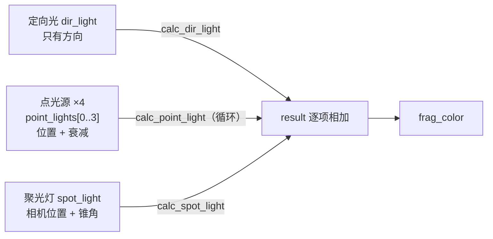
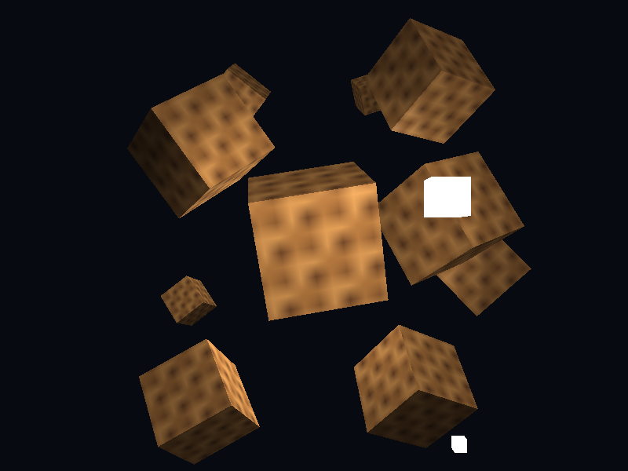
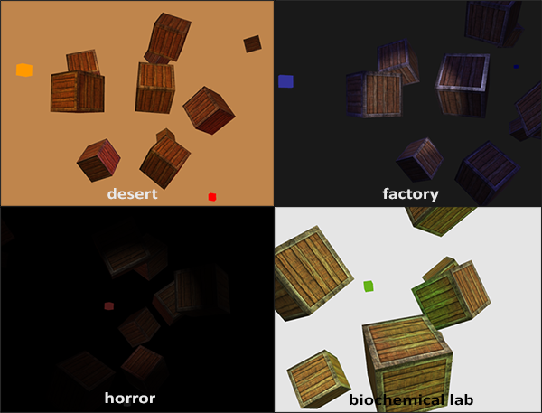

# 多光源

| 项目 | 内容 |
| --- | --- |
| 原文 | [Multiple lights](http://learnopengl.com/#!Lighting/Multiple-lights) |
| 作者 | JoeyDeVries |
| 来源 | LearnOpenGL-CN（本文基于其内容整理修订） |
| 本仓库示例 | [`apps/02_lighting/06_multiple_lights/`](../../apps/02_lighting/06_multiple_lights/) |

我们在前面的教程中已经学习了许多关于 OpenGL 中光照的知识，其中包括冯氏着色（Phong Shading）、材质（Material）、光照贴图（Lighting Map）以及不同种类的投光物（Light Caster）。在这一节中，我们将结合之前学过的所有知识，创建一个包含六个光源的完全照明场景。我们将模拟一个类似太阳的定向光（Directional Light）光源，四个分散在场景中的点光源（Point Light），以及一个手电筒（Flashlight）。

为了在场景中使用多个光源，我们希望将光照计算封装到 GLSL **函数**中。这样做的原因是，每一种光源都需要一种不同的计算方法，而一旦我们想对多个光源进行光照计算时，代码很快就会变得非常复杂。如果我们只在 `main` 函数中进行所有的这些计算，代码很快就会变得难以理解。

GLSL 中的函数和 C 函数很相似，它有一个函数名、一个返回值类型，如果函数不是在 main 函数之前声明的，我们还必须在代码文件顶部声明一个原型。我们对每个光照类型都创建一个不同的函数：定向光、点光源和聚光灯。

**一句话核心：** 多光源 = 每种投光物写一个 `calc_*_light` 函数，各函数返回 RGB 贡献量，**逐项相加**得到最终颜色；同类多盏灯用 `uniform PointLight point_lights[N]` 数组承载，CPU 侧按 `"point_lights[i].position"` 路径逐个上传。

当我们在场景中使用多个光源时，通常使用以下方法：我们需要有一个单独的颜色向量代表片段的输出颜色。对于每一个光源，它对片段的贡献颜色将会加到片段的输出颜色向量上。所以场景中的每个光源都会计算它们各自对片段的影响，并结合为一个最终的输出颜色。大体的结构会是这样（示意伪代码，实际着色器见下文）：

```text
定义一个输出颜色值 output
将定向光的贡献加到输出中       output += calc_dir_light(...)
对所有的点光源做相同的事情     output += calc_point_light(...)   （循环）
也加上其它的光源（比如聚光灯） output += calc_spot_light(...)
```

实际的代码对每一种实现都可能不同，但大体的结构都是差不多的。我们定义了几个函数，用来计算每个光源的影响，并将最终的结果颜色加到输出颜色向量上。例如，如果两个光源都很靠近一个片段，那么它们所结合的贡献将会形成一个比单个光源照亮时更加明亮的片段。



## 定向光

我们需要在片段着色器中定义一个函数来计算定向光对相应片段的贡献：它接受一些参数并计算一个定向光照颜色。

首先，我们需要定义一个定向光源最少所需要的变量。我们可以将这些变量储存在一个叫做 `DirLight` 的结构体中，并将它定义为一个 uniform。需要的变量在上一节中都介绍过（逐字取自示例 `main.cpp` 的片段着色器）：

```glsl
struct DirLight {
    vec3 direction;
    vec3 ambient;
    vec3 diffuse;
    vec3 specular;
};
```

> **重要：** 和 C/C++ 一样，如果我们想调用一个函数（这里是在 `main` 函数中调用），这个函数需要在调用者的行数之前被定义过。本仓库示例将所有 `calc_*_light` 函数定义在 `main` 之前，所以不需要单独的原型声明；如果先写 `main` 再写函数，就需要像 C 语言一样在顶部声明原型。

函数的内容与上一节的定向光计算完全一致（逐字取自示例）：

```glsl
vec3 calc_dir_light(DirLight light, vec3 norm, vec3 view_dir)
{
    vec3 light_dir = normalize(-light.direction);
    float diff = max(dot(norm, light_dir), 0.0);
    vec3 reflect_dir = reflect(-light_dir, norm);
    float spec = pow(max(dot(view_dir, reflect_dir), 0.0), material.shininess);
    vec3 diffuse_sample = vec3(texture(material.diffuse, tex_coord));
    vec3 specular_sample = vec3(texture(material.specular, tex_coord));
    vec3 ambient = light.ambient * diffuse_sample;
    vec3 diffuse = light.diffuse * diff * diffuse_sample;
    vec3 specular = light.specular * spec * specular_sample;
    return ambient + diffuse + specular;
}
```

我们基本上只是从上一节中复制了代码，并使用函数参数的两个向量来计算定向光的贡献向量。最终环境光、漫反射和镜面光的贡献将会合并为单个颜色向量返回。

## 点光源

和定向光一样，我们也希望定义一个用于计算点光源对相应片段的贡献（以及衰减）的函数。同样，我们定义一个包含了点光源所需所有变量的结构体（逐字取自示例）：

```glsl
struct PointLight {
    vec3 position;
    vec3 ambient;
    vec3 diffuse;
    vec3 specular;
    float constant;
    float linear;
    float quadratic;
};
```

原文在此处用预处理指令定义了场景中点光源的数量（`#define NR_POINT_LIGHTS 4`），并据此创建了一个 `PointLight` 结构体的数组。GLSL 中的数组和 C 数组一样，可以使用一对方括号来创建。本仓库示例的写法（逐字取自示例的片段着色器）：

```glsl
#version 330 core
#define POINT_LIGHT_COUNT 4
```

```glsl
uniform PointLight point_lights[POINT_LIGHT_COUNT];
```

> **重要：** 我们也可以定义**一个**大的结构体（而不是为每种类型的光源定义不同的结构体），包含**所有**不同种光照类型所需的变量，并将这个结构体用到所有的函数中，只需要忽略用不到的变量就行了。然而，当前的方法（一种光源一个结构体）会更直观一点，不仅能够节省一些代码，而且由于不是所有光照类型都需要所有的变量，这样也能节省一些内存（以及 uniform 数量）。

点光源函数从参数中获取所需的所有数据，并返回一个代表该点光源对片段的颜色贡献的 `vec3`。我们再一次从之前的教程中「复制粘贴」（逐字取自示例）：

```glsl
vec3 calc_point_light(PointLight light, vec3 norm, vec3 frag_position, vec3 view_dir)
{
    vec3 light_dir = normalize(light.position - frag_position);
    float diff = max(dot(norm, light_dir), 0.0);
    vec3 reflect_dir = reflect(-light_dir, norm);
    float spec = pow(max(dot(view_dir, reflect_dir), 0.0), material.shininess);

    float distance = length(light.position - frag_position);
    float attenuation =
        1.0 / (light.constant + light.linear * distance + light.quadratic * distance * distance);

    vec3 diffuse_sample = vec3(texture(material.diffuse, tex_coord));
    vec3 specular_sample = vec3(texture(material.specular, tex_coord));
    vec3 ambient = light.ambient * diffuse_sample;
    vec3 diffuse = light.diffuse * diff * diffuse_sample;
    vec3 specular = light.specular * spec * specular_sample;
    return (ambient + diffuse + specular) * attenuation;
}
```

将这些功能抽象到这样一个函数中的优点是，我们能够不用重复的代码而很容易地计算多个点光源的光照了。在 `main` 函数中，我们只需要创建一个循环，遍历整个点光源数组，对每个点光源调用 `calc_point_light` 就可以了。

## 合并结果

现在我们已经定义了一个计算定向光的函数和一个计算点光源的函数了，我们可以将它们合并放到 `main` 函数中（逐字取自示例）：

```glsl
void main()
{
    vec3 norm = normalize(normal);
    vec3 view_dir = normalize(view_pos - frag_pos);

    vec3 result = calc_dir_light(dir_light, norm, view_dir);
    for (int i = 0; i < POINT_LIGHT_COUNT; ++i) {
        result += calc_point_light(point_lights[i], norm, frag_pos, view_dir);
    }
    result += calc_spot_light(spot_light, norm, frag_pos, view_dir);

    frag_color = vec4(result, 1.0);
}
```

每个光源类型都将它们的贡献加到了最终的输出颜色上，直到所有的光源都处理完了。最终的颜色包含了场景中所有光源的颜色影响所合并的结果。

> **重要（本仓库对原文的补全）：** 原文将 `CalcSpotLight` 函数留作练习，本仓库示例直接实现了它——内容就是上一节「手电筒」的函数化：计算 `light_dir` 与锥轴的夹角余弦 `theta`、用内外切光角做 `clamp` 软边截断得到 `intensity`，再套用点光源的衰减公式，最后把 `diffuse`/`specular` 乘上 `intensity`。完整代码见 `apps/02_lighting/06_multiple_lights/main.cpp` 的 `calc_spot_light`。

> **注意：** 在这种方法中有很多重复的计算发生在各个光照函数上（例如计算反射向量、漫反射和高光项、以及对材质纹理进行采样），所以这里有优化的空间。

## 设置 uniform 数组

设置定向光结构体的 uniform 应该非常熟悉了，但是你可能会在想我们该如何设置点光源的 uniform 值，因为点光源的 uniform 现在是一个 `PointLight` 的**数组**了。这并不是我们以前讨论过的话题。

很幸运的是，这并不是很复杂。设置一个结构体数组的 uniform 和设置一个结构体的 uniform 是很相似的，但是这一次在访问 uniform 位置的时候，我们需要指明对应的数组下标，比如 `"point_lights[0].position"`。

这意味着我们必须对这四个点光源的每个字段都单独设置 uniform。本仓库示例用一个循环拼接路径来避免逐行手写（渲染循环中，逐字取自示例）：

```c++
        for (std::size_t index{0}; index < point_light_positions.size(); ++index) {
            const std::string base{"point_lights[" + std::to_string(index) + "]."};
            glUniform3fv(glGetUniformLocation(object_program, (base + "position").c_str()), 1,
                         glm::value_ptr(point_light_positions[index]));
            glUniform3f(glGetUniformLocation(object_program, (base + "ambient").c_str()), 0.05F,
                        0.05F, 0.05F);
            glUniform3f(glGetUniformLocation(object_program, (base + "diffuse").c_str()), 0.80F,
                        0.80F, 0.80F);
            glUniform3f(glGetUniformLocation(object_program, (base + "specular").c_str()), 1.0F,
                        1.0F, 1.0F);
            glUniform1f(glGetUniformLocation(object_program, (base + "constant").c_str()), 1.0F);
            glUniform1f(glGetUniformLocation(object_program, (base + "linear").c_str()), 0.09F);
            glUniform1f(glGetUniformLocation(object_program, (base + "quadratic").c_str()), 0.032F);
        }
```

衰减三系数取 (1.0, 0.09, 0.032)——上一节表格中「照亮约 50 单位」的一行，与示例中摆在近处的 10 个立方体规模匹配。

别忘了，我们还需要为每个点光源定义一个位置向量，所以我们让它们在场景中分散一点。本仓库示例定义一个 `std::array` 来包含点光源的位置（逐字取自示例；原文是 C 风格数组，本仓库用 `std::array<glm::vec3, point_light_count>` 等价实现）：

```c++
const std::array<glm::vec3, point_light_count> point_light_positions{
    glm::vec3{0.7F, 0.2F, 2.0F},
    glm::vec3{2.3F, -3.3F, -4.0F},
    glm::vec3{-4.0F, 2.0F, -12.0F},
    glm::vec3{0.0F, 0.0F, -3.0F},
};
```

接下来我们从 `point_lights` 数组中索引对应的 `PointLight`，将它的 `position` 值设置为刚刚定义的位置值数组中的其中一个。同时我们还要绘制四个灯立方体而不是仅仅一个——只要对每个灯物体创建一个不同的模型矩阵就可以了，和我们之前对箱子的处理类似。

如果你还使用了手电筒的话，所有光源组合的效果将看起来和下图差不多（原文效果图）：


你可以看到，很显然天空中有一个全局照明（像一个太阳），我们有四个光源分散在场景中，以及玩家视角的手电筒。本仓库示例的运行效果：



> **进阶（每盏灯 × 每个像素的成本）：** 多光源「相加」的正确性无懈可击，但代价是**所有灯要对所有片段都完整计算一遍**——灯的数量线性推高片段着色器耗时：4 盏灯意味着每个像素 4 次漫反射 + 镜面 + 衰减。几十盏灯的室内场景，这种「前向渲染」（forward shading）很快见顶。工业界的两条出路：**延迟着色**（deferred shading）先把几何的法线/材质/深度渲染到 G-buffer，再逐光源在屏幕空间累加，成本与像素数而不是「像素 × 灯数」挂钩；**分块/聚簇剔除**（tiled/clustered forward）把视锥切成格子，每个格子只计算影响它的灯。本示例的 for 循环是理解这一切的起点。

> **常见误解：** `uniform` 数组可以一次 `glUniform3fv` 上传整组光源。
> **纠正：** `glUniform*` 只能设置**单个** uniform（数组的一个元素或元素的一个字段），没有「结构体数组打包上传」的接口——所以示例才要在循环里拼接 `"point_lights[i].position"` 逐项设置。需要批量上传时，要么把数据排进普通数组用 `glUniform3fv(loc, count, ...)`（一次传 count 个同类型值），要么走 UBO（uniform block + std140 布局）——结构体数组正是 UBO 最典型的用武之地。

> **进阶（相加会过曝吗）：** 会。多个光源的贡献相加很容易超过 1.0，被帧缓冲直接截断成纯白——高光区「糊成一片」。本章用低调的 ambient/diffuse 强度回避了问题；正规解法是 **tone mapping**（把 HDR 亮度重映射回 [0,1]，如 Reinhard：$c/(1+c)$），它是后续高级光照章节的标准配备。到时会把整个光照计算放进 HDR 帧缓冲，最后一步才做映射。

上面图片中的所有光源都是使用上一节中所使用的默认属性，但如果你愿意实验这些数值的话，你能够得到很多有意思的结果。艺术家和关卡设计师通常都在编辑器中不断地调整这些光照参数，保证光照与环境相匹配。在我们刚刚创建的简单光照环境中，你可以简单地调整一下光源的属性，创建很多有意思的视觉效果：



我们也改变了清屏的颜色来更好地反映光照。你可以看到，只需要简单地调整一些光照参数，你就能创建完全不同的氛围。尝试实验一下不同的值，创建出你自己的氛围吧。

## 练习

- 你能通过调节光照属性变量，（大概地）重现上面图片中不同的氛围吗？[参考解答](https://learnopengl.com/code_viewer.php?code=lighting/multiple_lights-exercise2)。
- 注释掉 `calc_dir_light` 的调用再运行——场景失去整体底光，只剩点光源的光斑，对比非常鲜明。
- 把点光源数量宏 `POINT_LIGHT_COUNT` 从 4 改成 2（同步修改 `point_light_count` 与位置数组），验证 CPU/GLSL 两侧必须一致。
- 让某个点光源的位置随时间绕圈（复用上一节的 sin/cos 环绕写法），其余保持静止。

## 本仓库示例

示例目录：`apps/02_lighting/06_multiple_lights/`

构建（默认 MinGW GCC Debug，需 MSYS2 UCRT64 在 PATH 中）：

```powershell
conan install . -of build/mingw-gcc-debug -pr:h conan/profiles/mingw-gcc -pr:b conan/profiles/mingw-gcc -s build_type=Debug --build=missing
cmake --preset mingw-gcc-debug
cmake --build --preset mingw-gcc-debug
```

运行：

```powershell
.\build\mingw-gcc-debug\apps\02_lighting\06_multiple_lights\02_lighting__06_multiple_lights.exe
```

运行时交互：按 **Esc**（退出键）退出程序。场景为自动动画——10 个贴图立方体在方向光、4 个点光源与随视角朝向的聚光灯（手电筒）组合下各自旋转。纹理从 `assets/textures/` 加载。

## 本章整体回顾

本节完成光照章节的最后一步拼图：

- **局部（组合方式）**：每种投光物一个 `calc_*_light` 函数，返回 RGB 后相加；uniform 数组 + 字段路径下标管理同类多灯；聚光灯复用相机位置变成手电筒（本仓库补全了原文留作练习的 `calc_spot_light`）。
- **整体（光照章节全景）**：颜色相乘 → 法线与法线矩阵 → 冯氏三分量 → 材质结构体 → 贴图材质 → 投光物衰减/锥角 → 多光源组合。7 个示例层层递进，每一步只引入一个新概念。
- **再看「局部→整体」**：光照计算自始至终发生在**片段着色器**这一层，CPU 侧的工作只是「准备 uniform + 发出绘制调用」。这个架构能撑起很复杂的画面，却有一个天花板——场景里的物体依然是手写顶点数组。下一章「模型加载」引入 Assimp 库，把建模软件导出的完整模型（多 mesh、多材质、层级变换）装进本章搭好的光照管线。

下一章：[Assimp](../03_model_loading/01_assimp.md)
