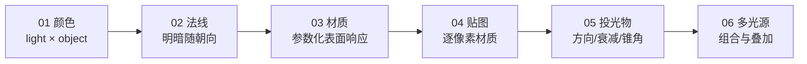

# 光照教程（02 章）

本目录是 OpenGL Lab 仓库的光照章节中文教程，共 6 篇，对应 [LearnOpenGL](http://learnopengl.com) 的 Lighting 部分。

内容基于 [LearnOpenGL-CN](https://github.com/with-fair-wind/LearnOpenGL-CN) 翻译整理，并做了两方面工作：

- **修正**：修正译文中术语不准确、病句、笔误等表述问题，统一专业术语（如「渲染」而非「呈现」、Esc = 退出键）。
- **完善**：从局部到整体的视角补充讲解——每个关键概念先给"一句话核心"，再明确职责边界（OpenGL 规范 / GLFW / 显卡驱动 / 应用程序各自负责什么），配全景链路图说明概念在整个渲染管线中的位置，并用本仓库实际代码逐段讲解。

## 篇章列表

| 篇 | 教程 | 本仓库示例 | 核心内容 |
|---|---|---|---|
| 01 | [颜色](01_colors.md) | `apps/02_lighting/01_colors/` | 光源颜色 × 物体颜色、吸收-反射直觉、光源标记立方体 |
| 02 | [基础光照](02_basic_lighting.md) | `apps/02_lighting/02_basic_lighting/` | 冯氏光照模型、法线、法线矩阵、环境光、漫反射（兰伯特定律） |
| 03 | [材质](03_materials.md) | `apps/02_lighting/03_materials/` | Material/Light 结构体 uniform、镜面反射、shininess |
| 04 | [光照贴图](04_lighting_maps.md) | `apps/02_lighting/04_lighting_maps/` | 漫反射/镜面贴图（sampler2D 材质）、逐片段材质参数 |
| 05 | [投光物](05_light_casters.md) | `apps/02_lighting/05_light_casters/` | 平行光、点光源距离衰减（二次多项式）、聚光灯锥角 |
| 06 | [多光源](06_multiple_lights.md) | `apps/02_lighting/06_multiple_lights/` | GLSL 光照函数组合、uniform 数组、方向光+点光源+聚光灯同屏 |

## 如何跟随学习

1. 按篇章顺序阅读；每篇末尾的"本章整体回顾"会串起本节在整个光照管线中的位置。
2. 每篇都有对应的仓库示例，在"本仓库示例"小节给出示例路径、构建与运行命令。
3. 构建与运行方式总览见 [`docs/build.md`](../build.md)（Conan 2 + CMake presets，默认 `mingw-gcc-debug`）。

运行示例（默认 MinGW GCC Debug）：

```powershell
conan install . -of build/mingw-gcc-debug -pr:h conan/profiles/mingw-gcc -pr:b conan/profiles/mingw-gcc -s build_type=Debug --build=missing
cmake --preset mingw-gcc-debug
cmake --build --preset mingw-gcc-debug
.\build\mingw-gcc-debug\apps\02_lighting\01_colors\02_lighting__01_colors.exe
```

示例通用操作：`Esc` 退出；本章示例相机均为固定视角，光源环绕/物体旋转等均为自动动画；贴图示例从 `assets/textures/` 加载纹理。

## 章节主线

一条贯穿全章的递进线索：**光的颜色如何变成物体的颜色** →



下一章：[模型加载](../03_model_loading/01_assimp.md)（用 Assimp 把真实模型装进这套光照管线）。
