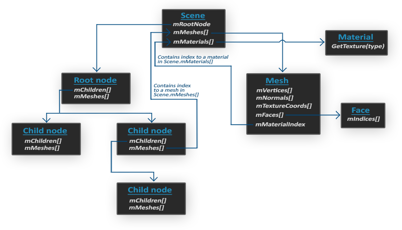
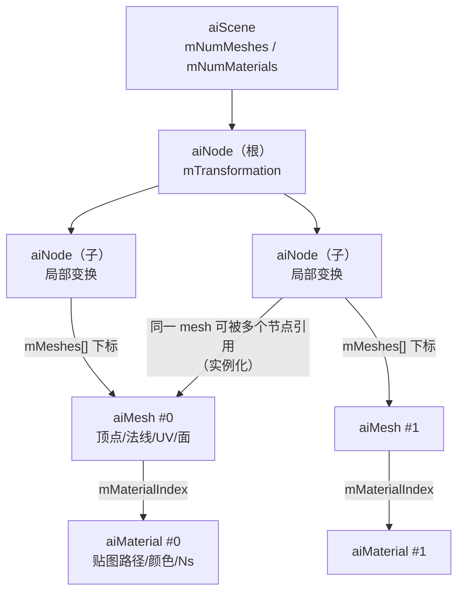
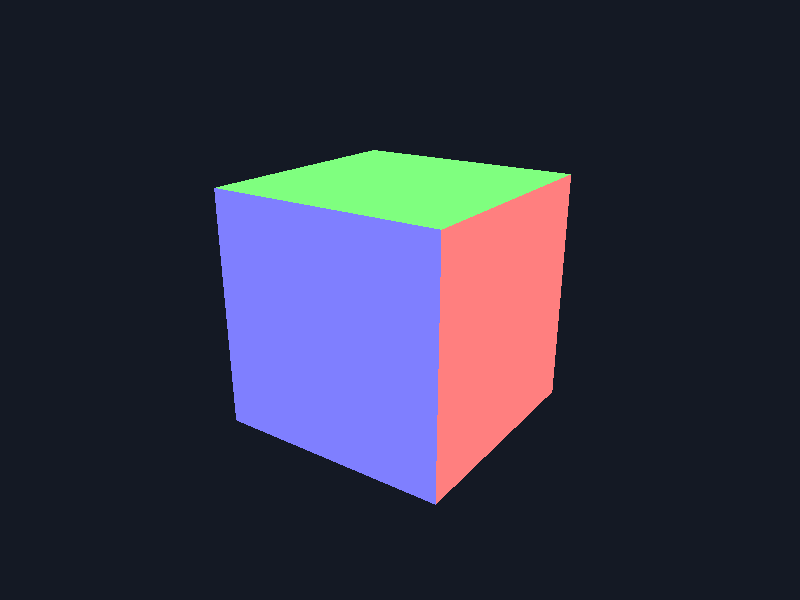

# Assimp

| 项目 | 内容 |
| --- | --- |
| 原文 | [Assimp](http://learnopengl.com/#!Model-Loading/Assimp) |
| 作者 | JoeyDeVries |
| 来源 | LearnOpenGL-CN（本文基于其内容整理修订） |
| 本仓库示例 | [`apps/03_model_loading/01_assimp/`](../../apps/03_model_loading/01_assimp/) |

到目前为止的所有场景中，我们一直都在滥用我们的箱子朋友，但时间久了即使是最好的朋友也会感到无聊。在日常的图形程序中，通常都会使用非常复杂且好玩的模型，它们比静态的箱子要好看多了。然而，和箱子对象不同，我们不太能够对像是房子、汽车或者人形角色这样的复杂形状手工定义所有的顶点、法线和纹理坐标。我们想要的是将这些模型（Model）**导入**（Import）到程序当中。模型通常都由 3D 艺术家在 [Blender](http://www.blender.org/)、[3DS Max](http://www.autodesk.nl/products/3ds-max/overview) 或者 [Maya](http://www.autodesk.com/products/autodesk-maya/overview) 这样的工具中精心制作。

这些所谓的 **3D 建模工具**（3D Modeling Tool）可以让艺术家创建复杂的形状，并使用一种叫做 **UV 映射**（uv-mapping）的手段来应用贴图。这些工具将会在导出到模型文件的时候自动生成所有的顶点坐标、顶点法线以及纹理坐标。这样即使不了解图形技术细节，艺术家们也拥有一套强大的工具来构建高品质的模型。所有的技术细节都隐藏在了导出的模型文件中——但是，作为图形开发者，我们就**必须**要了解这些技术细节了。

所以，我们的工作就是解析这些导出的模型文件以及提取所有有用的信息，将它们储存为 OpenGL 能够理解的格式。一个很常见的问题是，模型的文件格式有很多种，每一种都会以它们自己的方式来导出模型数据。像是 [Wavefront 的 .obj](http://en.wikipedia.org/wiki/Wavefront_.obj) 这样的模型格式，只包含了模型数据以及材质信息，像是模型颜色和漫反射/镜面光贴图。而以 XML 为基础的 [Collada 文件格式](http://en.wikipedia.org/wiki/COLLADA) 则非常丰富，包含模型、光照、多种材质、动画数据、摄像机、完整的场景信息等等。Wavefront 的 .obj 格式通常被认为是一个易于解析的模型格式，建议至少去它的 wiki 页面看看文件格式是如何封装的，这能让你认识到模型文件的基本结构。

总而言之，不同种类的文件格式有很多，它们之间通常并没有一个通用的结构。所以如果我们想从这些文件格式中导入模型的话，就必须为每一种需要导入的文件格式编写一个导入器。很幸运的是，正好有一个库专门处理这个问题。

**一句话核心：** Assimp 把 OBJ/FBX/glTF 等几十种格式解析成统一的 **aiScene** 数据结构——场景按 **aiNode** 节点树组织，节点引用 **aiMesh**（几何），mesh 通过材质索引关联 **aiMaterial**（材质）；后处理标志（post-processing flags）在导入时把数据整理成 GPU 友好的形式。

## 模型加载库

一个非常流行的模型导入库是 [Assimp](http://assimp.org/)，它是 **Open Asset Import Library**（开放资产导入库）的缩写。Assimp 能够导入很多种不同的模型文件格式（也能够导出部分格式），它会将所有的模型数据加载至 Assimp 的通用数据结构中。当 Assimp 加载完模型之后，我们就能够从它的数据结构中提取我们所需的所有数据了。由于 Assimp 的数据结构保持不变，不论导入的是什么种类的文件格式，它都能够将我们从这些不同的文件格式中抽象出来，用同一种方式访问我们需要的数据。

当使用 Assimp 导入一个模型的时候，它通常会将整个模型加载进一个**场景**（Scene）对象，它会包含导入的模型/场景中的所有数据。Assimp 会将场景载入为一系列的**节点**（Node），每个节点包含了场景对象中所储存数据的索引，每个节点都可以有任意数量的子节点。Assimp 数据结构的（简化）模型如下：



- 和材质和网格（Mesh）一样，所有的场景/模型数据都包含在 Scene 对象中。Scene 对象也包含了场景根节点的引用。
- 场景的 Root node（根节点）可能包含子节点（和其它的节点一样），它会有一系列指向场景对象中 `mMeshes` 数组中储存的网格数据的索引。Scene 下的 `mMeshes` 数组储存了真正的 Mesh 对象，节点中的 `mMeshes` 数组保存的只是场景中网格数组的**索引**。
- 一个 Mesh 对象本身包含了渲染所需要的所有相关数据，像是顶点位置、法向量、纹理坐标、面（Face）和物体的材质。
- 一个网格包含了多个面。Face 代表的是物体的渲染图元（Primitive）（三角形、方形、点）。一个面包含了组成图元的顶点的索引。由于顶点和索引是分开的，使用一个索引缓冲来渲染是非常简单的（见[你好，三角形](../01_getting_started/04_hello_triangle.md)）。
- 最后，一个网格也包含了一个 Material 对象，它包含了一些函数能让我们获取物体的材质属性，比如说颜色和纹理贴图（比如漫反射和镜面光贴图）。

所以，我们需要做的第一件事是将一个物体加载到 Scene 对象中，遍历节点，获取对应的 Mesh 对象（我们需要递归搜索每个节点的子节点），并处理每个 Mesh 对象来获取顶点数据、索引以及它的材质属性。最终的结果是一系列的网格数据，我们会将它们包含在一个 `Model` 对象中。

> **重要：网格**
>
> 当使用建模工具对物体建模的时候，艺术家通常不会用单个形状创建出整个模型。通常每个模型都由几个子模型/形状组合而成。组合模型的每个单独的形状就叫做一个**网格**（Mesh）。比如说有一个人形的角色：艺术家通常会将头部、四肢、衣服、武器建模为分开的组件，并将这些网格组合而成的结果表现为最终的模型。一个网格是我们在 OpenGL 中绘制物体所需的最小单位（顶点数据、索引和材质属性）。一个模型（通常）会包括多个网格。

用本仓库的语言把上图重画成数据流，节点树的「结构」与场景的「数据」分离一目了然：



关键设计点：**aiNode 只存「结构」不存「数据」**——同一 mesh 可以被多个节点引用，相同物体出现 N 次（一排相同的树）时，数据只有一份、节点变换各不相同，这正是**实例化**（instancing）思想的雏形；**节点变换是局部的**，沿树累计相乘才得到世界变换——与第一章坐标系统的 model 矩阵层级完全同构；**aiMaterial 只存贴图路径**（如 OBJ 的 `map_Kd`）而不是像素——真正的纹理要由应用自己（用 stb_image）加载。

## 构建与引入 Assimp

你可以在 Assimp 的 [GitHub 页面](https://github.com/assimp/assimp/blob/master/Build.md)中选择相应的版本。原文建议自己编译 Assimp 库，因为它们的预编译库并不一定能适用于所有系统（涉及的 CMake 配置、DirectX SDK 报错等细节见原文）。

本仓库通过 **Conan 2** 引入，无需任何手工构建步骤：`conanfile.py` 中声明 `self.requires("assimp/5.4.3")`，CMake 侧 `find_package(assimp CONFIG REQUIRED)` 后链接 `assimp::assimp` 目标即可。由于 assimp 传递依赖了旧版 stb，本仓库在 conanfile 中用 `force=True` 把 stb 统一到项目版本（详见 [`docs/build.md`](../build.md)）。

## 导入：Importer 与后处理

本仓库示例的导入代码（逐字取自示例 `main.cpp`）：

```c++
    // Assimp: Importer 负责解析并拥有 aiScene，析构时自动释放，不需要手动 delete。
    Assimp::Importer importer;

    // Assimp: 后处理把导入数据整理成 GPU 友好的形式——
    // Triangulate 把多边形拆成三角形；GenSmoothNormals 为缺法线的 mesh 生成平滑法线
    // （已有法线则保持原样）；JoinIdenticalVertices 合并重复顶点；OptimizeMeshes
    // 把过碎的 mesh 合并减少绘制调用。注意不使用 aiProcess_FlipUVs：本仓库纹理
    // 统一由 stbi_set_flip_vertically_on_load(1) 翻转，后处理再翻会导致二次翻转。
    constexpr unsigned int import_flags{aiProcess_Triangulate | aiProcess_GenSmoothNormals |
                                        aiProcess_JoinIdenticalVertices | aiProcess_OptimizeMeshes};
    const aiScene* scene{importer.ReadFile(model_path("crate/crate.obj"), import_flags)};
    if (scene == nullptr || (scene->mFlags & AI_SCENE_FLAGS_INCOMPLETE) != 0U ||
        scene->mRootNode == nullptr) {
        std::cerr << "Failed to import model: " << importer.GetErrorString() << '\n';
        glDeleteProgram(shader_program);
        glfwDestroyWindow(window);
        glfwTerminate();
        return EXIT_FAILURE;
    }
```

**所有权**：`aiScene` 由 `Importer` 拥有，Importer 析构时自动释放——绝不要自己 `delete scene`。Importer 的生存期必须覆盖所有对 scene 的访问。

**后处理标志**是 Assimp 的精髓，在解析完成后立刻把数据整理成 GPU 想要的样子。本仓库使用的四个：

| 标志 | 作用 |
| --- | --- |
| `aiProcess_Triangulate` | 把多边形面全部拆成三角形——OpenGL 经典绘制只吃三角形 |
| `aiProcess_GenSmoothNormals` | 为缺法线的 mesh 生成平滑法线；已有法线则保持原样 |
| `aiProcess_JoinIdenticalVertices` | 合并位置/属性完全相同的重复顶点，省显存 |
| `aiProcess_OptimizeMeshes` | 把过碎的小 mesh 合并，减少绘制调用次数 |

原文还介绍了更多标志：`aiProcess_FlipUVs` 翻转 UV 的 y 坐标、`aiProcess_SplitLargeMeshes` 把大网格拆小（应对顶点数限制）、`aiProcess_GenNormals` 为缺法线的模型生成面法线、`aiProcess_CalcTangentSpace` 计算切线空间等，按需组合即可，全部指令见 [Assimp 文档](http://assimp.sourceforge.net/lib_html/postprocess_8h.html)。

> **常见误解：** 也应该加上 `aiProcess_FlipUVs`，教程原文就用了它。
> **纠正：** 用不用 FlipUVs 取决于**纹理加载端**的配合。原文的加载端是「不翻转」的 stb_image，所以需要 Assimp 把 UV 翻过来对齐 OpenGL 的左下角原点；本仓库所有示例统一调用 `stbi_set_flip_vertically_on_load(1)`（加载时翻图像），UV 保持原样刚好对齐——再加 FlipUVs 就会**翻两次**，贴图上下颠倒。两套方案各自自洽，混用才是 bug 来源。

## 上传与渲染：遍历节点树

把每个 aiMesh 上传到独立的 VAO/VBO/EBO（attribute 布局沿用光照章节的「位置 + 法线 + UV」交错，函数 `upload_mesh` 见示例源码），然后**沿节点树递归绘制**（逐字取自示例）：

```c++
void render_node(const aiNode* node, const glm::mat4& parent_transform, GLuint shader_program,
                 const std::vector<GpuMesh>& gpu_meshes) {
    // Assimp: 节点变换相对父节点，左乘父级累积变换得到世界变换。
    const glm::mat4 node_transform{to_glm_mat4(node->mTransformation) * parent_transform};

    for (unsigned int mesh_slot{0U}; mesh_slot < node->mNumMeshes; ++mesh_slot) {
        const unsigned int scene_mesh_index{node->mMeshes[mesh_slot]};
        const GpuMesh& gpu_mesh{gpu_meshes[scene_mesh_index]};

        glUniformMatrix4fv(glGetUniformLocation(shader_program, "model"), 1, GL_FALSE,
                           glm::value_ptr(node_transform));
        glBindVertexArray(gpu_mesh.vertex_array_object);
        glDrawElements(GL_TRIANGLES, gpu_mesh.index_count, GL_UNSIGNED_INT, nullptr);
    }

    for (unsigned int child{0U}; child < node->mNumChildren; ++child) {
        render_node(node->mChildren[child], node_transform, shader_program, gpu_meshes);
    }
}
```

两点值得注意：

1. **矩阵换算**：`to_glm_mat4` 把 Assimp 的**行主序** aiMatrix4x4 转成 GLM 的**列主序** mat4，转换时行列互换——忘了转置的话模型会被镜像/压扁。
2. **上传一次、绘制多次**：GPU 资源按场景 mesh 下标只建一份；递归时同一 mesh 被多个节点引用就直接复用，只换 model 矩阵。

> **分层解释：** 模型加载涉及的三方职责——
> - **Assimp（库）**：解析文件格式、生成统一数据模型、执行后处理；不碰 OpenGL。
> - **应用程序（本示例）**：把 aiMesh 的数据搬进 VBO/EBO、把 aiMaterial 的贴图路径交给 stb_image、沿节点树累计变换并发出绘制调用。
> - **OpenGL/驱动**：只接收「顶点数据 + 矩阵 + 绘制命令」，对模型文件一无所知。

## 运行本仓库示例

示例加载 `assets/models/crate/crate.obj`（本仓库手写的单 mesh 立方体模型——OBJ + MTL + PPM 贴图都是纯文本，方便阅读与版本管理），并在控制台打印场景统计：

```text
scene: 1 mesh(es), 2 material(s)
  mesh[0] 'crate': 24 vertices, 12 faces, material 1, normals=yes, uv=yes
  material[0] 'DefaultMaterial': diffuse maps=0
  material[1] 'crate': diffuse maps=1 (first: crate_diffuse.ppm)
```

24 个顶点（每面 4 个）、6 个四边形面被 `aiProcess_Triangulate` 拆成 12 个三角形——OBJ 里写的四边形不需要我们预处理。运行画面：自转的箱子按法线着色，六个面呈现红/绿/蓝的清晰分区：



> **进阶（法线可视化——本示例的验证手段）：** 本示例暂时不给模型贴图和光照，片段着色器直接输出 `normalize(normal_world) * 0.5 + 0.5`：把法线三个分量从 [-1,1] 映射到 [0,1] 当作 RGB。朝 +x 的面偏红、朝 +y 的面偏绿、朝 +z 的面偏蓝，法线错误（面朝向与颜色不符、明暗分裂）一眼可见。这是排查「导入的模型光照诡异」的第一工具——先确认法线，再查光照公式。

在下一节中，我们将创建我们自己的 `Model` 和 `Mesh` 封装来加载并使用刚刚介绍的结构储存导入后的模型。如果我们想要绘制一个模型，我们不需要将整个模型渲染为一个整体，只需要渲染组成模型的每个独立的网格就可以了。

## 练习

- 打开 `assets/models/crate/crate.obj` 通读：`mtllib`/`usemtl`/`v`/`vt`/`vn`/`f` 各是什么，数一数 24 个顶点怎么被 6 个四边形面引用。
- 在 `import_flags` 里加上 `aiProcess_FlipUVs`，观察本示例（无贴图）无变化——再对照 `03_model` 示例思考为什么加了会出问题。
- 把 `model_path` 的参数改成不存在的文件，观察 `GetErrorString()` 输出的错误信息与程序的优雅退出。

## 本仓库示例

示例目录：`apps/03_model_loading/01_assimp/`

构建（默认 MinGW GCC Debug，需 MSYS2 UCRT64 在 PATH 中）：

```powershell
conan install . -of build/mingw-gcc-debug -pr:h conan/profiles/mingw-gcc -pr:b conan/profiles/mingw-gcc -s build_type=Debug --build=missing
cmake --preset mingw-gcc-debug
cmake --build --preset mingw-gcc-debug
```

运行：

```powershell
.\build\mingw-gcc-debug\apps\03_model_loading\01_assimp\03_model_loading__01_assimp.exe
```

运行时交互：按 **Esc**（退出键）退出程序。场景为自动动画——`assets/models/crate/crate.obj` 导入的箱子绕 Y 轴自转，法线可视化着色；控制台打印 aiScene 的 mesh/材质统计。模型资源从 `assets/models/` 加载。

## 本章整体回顾

本节解决了「模型文件怎么变成内存数据」：

- **局部（数据模型）**：aiScene（场景）→ aiNode 树（层级变换 + mesh 引用）→ aiMesh（顶点/法线/UV/索引）→ aiMaterial（贴图路径/参数）；数据与结构分离，mesh 可被多节点共享。
- **局部（导入管线）**：`Importer::ReadFile` + 后处理标志（Triangulate/GenSmoothNormals/JoinIdenticalVertices/OptimizeMeshes）+ 场景完整性检查；aiScene 归 Importer 所有。
- **整体（一条新数据流的起点）**：模型文件 → Assimp → aiScene → 应用侧上传 GPU → 递归节点树绘制。目前「上传」和「绘制」的代码还是手写散装（GpuMesh + render_node），每个新示例都要复制一遍——下一节把这些样板封装成 **Mesh** 结构体，让「一份几何 + 一份材质」成为一个可复用的对象。

下一节：[Mesh](02_mesh.md)
