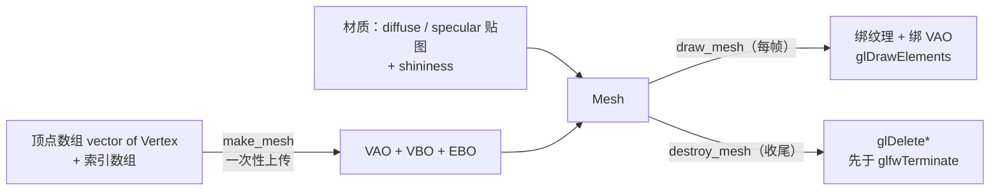
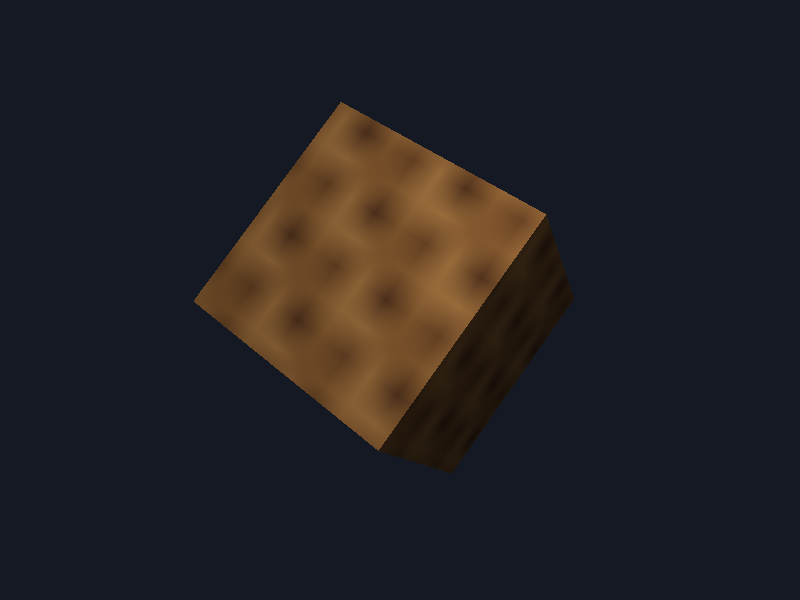

# 网格

| 项目 | 内容 |
| --- | --- |
| 原文 | [Mesh](http://learnopengl.com/#!Model-Loading/Mesh) |
| 作者 | JoeyDeVries |
| 来源 | LearnOpenGL-CN（本文基于其内容整理修订） |
| 本仓库示例 | [`apps/03_model_loading/02_mesh/`](../../apps/03_model_loading/02_mesh/) |

通过使用 Assimp，我们可以加载不同的模型到程序中，但是载入后它们都被储存为 Assimp 的数据结构。我们最终仍要将这些数据转换为 OpenGL 能够理解的格式，这样才能渲染这个物体。我们从上一节中学到，网格（Mesh）代表的是单个的可绘制实体，我们现在先来定义一个我们自己的网格封装。

首先我们来回顾一下我们目前学到的知识，想想一个网格最少需要什么数据。一个网格应该至少需要一系列的顶点，每个顶点包含一个位置向量、一个法向量和一个纹理坐标向量。一个网格还应该包含用于索引绘制的索引以及纹理形式的材质数据（漫反射/镜面贴图）。

**一句话核心：** Mesh = 顶点/索引数组上传后的 VAO/VBO/EBO 句柄 + 索引数量 + 材质（贴图、shininess）；`make_mesh` 负责创建、`draw_mesh` 负责绘制、`destroy_mesh` 负责释放——三函数生命周期，样板代码从此只写一次。

> **本仓库示例的实现约定：** 原文用 `class Mesh`（构造函数 + `setupMesh` + `Draw`）实现；本仓库按教学约定用**结构体 + 自由函数**等价实现（`make_mesh`/`draw_mesh`/`destroy_mesh`），职责边界完全一致。

## 顶点与纹理结构体

原文首先定义顶点结构体。本仓库示例的 `Vertex`（逐字取自示例 `main.cpp`——顶点不再用裸 float 数组，「一个顶点包含什么」直接体现在类型里）：

```c++
struct Vertex {
    glm::vec3 position;
    glm::vec3 normal;
    glm::vec2 tex_coords;
};
```

原文还将纹理数据整理到一个 `Texture` 结构体中（储存纹理 id 与类型字符串 `texture_diffuse`/`texture_specular`，服务于它「一个 mesh 任意多张贴图」的命名标准，见本节末尾）。本仓库示例做了简化：每个 mesh 固定一张漫反射 + 一张镜面贴图，直接作为 `Mesh` 的字段储存，省去类型字符串与动态命名。

知道了顶点和纹理的实现，我们可以开始定义网格的结构了（逐字取自示例）：

```c++
struct Mesh {
    GLuint vertex_array_object{0};
    GLuint vertex_buffer_object{0};
    GLuint element_buffer_object{0};
    GLsizei index_count{0};
    GLuint diffuse_map{0};
    GLuint specular_map{0};
    float shininess{32.0F};
};
```

几何部分（前四个字段）对应原文类中的私有渲染数据（`VAO/VBO/EBO`）与索引数量；材质部分（后三个字段）对应原文的 `vector<Texture> textures` 的简化版。一个 Mesh 就是一个**可以独立绘制的东西**。



## 初始化

多亏了 `make_mesh`，我们现在有一大列的网格数据可以用于渲染。在此之前我们还必须配置正确的缓冲，并通过顶点属性指针定义顶点着色器的布局。现在你应该对这些概念都很熟悉了，但这次会稍微有一点变动：使用结构体中的顶点数据（逐字取自示例）：

```c++
Mesh make_mesh(const std::vector<Vertex>& vertices, const std::vector<GLuint>& indices,
               GLuint diffuse_map, GLuint specular_map, float shininess) {
    Mesh mesh{};
    mesh.diffuse_map = diffuse_map;
    mesh.specular_map = specular_map;
    mesh.shininess = shininess;
    mesh.index_count = static_cast<GLsizei>(indices.size());

    glGenVertexArrays(1, &mesh.vertex_array_object);
    glGenBuffers(1, &mesh.vertex_buffer_object);
    glGenBuffers(1, &mesh.element_buffer_object);

    glBindVertexArray(mesh.vertex_array_object);

    glBindBuffer(GL_ARRAY_BUFFER, mesh.vertex_buffer_object);
    glBufferData(GL_ARRAY_BUFFER, static_cast<GLsizeiptr>(vertices.size() * sizeof(Vertex)),
                 vertices.data(), GL_STATIC_DRAW);
    glBindBuffer(GL_ELEMENT_ARRAY_BUFFER, mesh.element_buffer_object);
    glBufferData(GL_ELEMENT_ARRAY_BUFFER, static_cast<GLsizeiptr>(indices.size() * sizeof(GLuint)),
                 indices.data(), GL_STATIC_DRAW);

    // OpenGL: attribute 偏移按交错布局计算——位置在结构体开头（偏移 0），
    // 法线偏移 3 个 float，纹理坐标偏移 6 个 float；static_assert 保证布局紧密。
    constexpr GLsizei vertex_stride{static_cast<GLsizei>(sizeof(Vertex))};
    constexpr auto normal_offset{3 * sizeof(float)};
    constexpr auto tex_coord_offset{6 * sizeof(float)};
    static_assert(sizeof(Vertex) == 8 * sizeof(float), "Vertex must stay tightly packed");

    glVertexAttribPointer(0, 3, GL_FLOAT, GL_FALSE, vertex_stride, nullptr);
    glEnableVertexAttribArray(0);
    glVertexAttribPointer(1, 3, GL_FLOAT, GL_FALSE, vertex_stride,
                          reinterpret_cast<const void*>(normal_offset));
    glEnableVertexAttribArray(1);
    glVertexAttribPointer(2, 2, GL_FLOAT, GL_FALSE, vertex_stride,
                          reinterpret_cast<const void*>(tex_coord_offset));
    glEnableVertexAttribArray(2);

    glBindVertexArray(0);

    return mesh;
}
```

代码应该和你所想的没什么不同，但有了 `Vertex` 结构体的帮助，事情变得非常优雅。

C++ 结构体有一个很棒的特性：它们的内存布局是**连续的**（Sequential）。也就是说，如果我们将结构体作为一个数据数组使用，那么它将会以顺序排列结构体的变量，这会直接转换为我们在数组缓冲中所需要的 float（实际上是字节）数组。一个填充后的 `Vertex`，其内存布局等价于八个连续的 float（位置 3 + 法线 3 + 纹理坐标 2）。由于有了这个有用的特性，我们能够直接传入一大列 `Vertex` 结构体的指针作为缓冲的数据（上面的 `vertices.data()` + `size() * sizeof(Vertex)`），它们会完美地转换为 `glBufferData` 所能用的参数。自然 `sizeof` 运算也可以用在结构体上来计算它的字节大小——本仓库的 `Vertex` 正好是 32 字节（8 个 float × 每个 4 字节），`static_assert` 在编译期保证了这一点。

结构体的另外一个很好的用途是预处理指令 `offsetof(s, m)`：它的第一个参数是一个结构体，第二个参数是这个结构体中变量的名字。这个宏会返回那个变量距结构体头部的**字节偏移量**（Byte Offset）。原文正是用它来定义 `glVertexAttribPointer` 中的偏移参数——法线的偏移量自动跟随结构体中法线成员的位置（3 个 float，即 12 字节）。

> **重要（本仓库对 offsetof 的取舍）：** 本仓库示例改用**固定偏移常量**（`3 * sizeof(float)`）+ `static_assert(sizeof(Vertex) == 8 * sizeof(float))`，原因在于：`Vertex` 含有 `glm::vec3` 成员，而 GLM 的向量类型含匿名联合、并非 C++ 标准保证的*标准布局*（standard layout）类型——对非标准布局类型使用 `offsetof` 在标准中是「有条件支持」的，部分编译器会发出警告。固定偏移 + 编译期大小断言达到同样的自洽：布局一旦变动，`static_assert` 立即报错。若你的顶点结构只含平凡类型，`offsetof` 仍是更优雅的选择。

使用这样的一个结构体不仅能够提供可读性更高的代码，也允许我们很容易地拓展这个结构。如果我们希望添加另一个顶点属性，我们只需要将它添加到结构体中、更新 `static_assert` 与对应的 attribute 设置就可以了。

> **进阶（VAO 与 EBO 的绑定关系）：** `glBindBuffer(GL_ELEMENT_ARRAY_BUFFER, ebo)` 发生在**某个 VAO 绑定期间**时，这个绑定会被记录进该 VAO 的状态——之后每次 `glBindVertexArray(vao)`，EBO 自动恢复。反过来，如果 VAO 未绑定（绑定 0）时解绑 EBO，VAO 内的记录不受影响。这就是 `make_mesh` 里「先绑 VAO、再绑 EBO」的顺序依据，也是为什么 `draw_mesh` 从不需要单独绑定 EBO。注意 VBO 没有这种记录：VAO 只存 attribute 指针（含它们引用的 VBO 绑定），不存「当前 GL_ARRAY_BUFFER 绑定」。

## 渲染

我们需要为 Mesh 定义最后一个函数：绘制。在真正渲染这个网格之前，我们需要在调用 `glDrawElements` 函数之前先绑定相应的纹理。

原文的难点在于：它事先并不知道这个网格（如果有的话）有多少纹理、纹理是什么类型。所以它设定了一个命名标准：每个漫反射纹理命名为 `texture_diffuseN`、每个镜面纹理命名为 `texture_specularN`（`N` 从 1 开始），着色器中据此声明 `uniform sampler2D texture_diffuse1; texture_diffuse2; ...`，`Draw` 函数在循环中拼出 uniform 名称、把每张贴图绑定到递增的纹理单元。这允许一个网格携带任意数量的纹理。

> **重要：** 像这样的问题有很多种不同的解决方案。如果你不喜欢这个解决方案，你可以自己想一个解决办法。

本仓库采用了那个「另外的解决办法」——**每类贴图固定一张**：`Material` 着色器只有 `material.diffuse`/`material.specular` 两个采样器（与光照章节完全一致），`draw_mesh` 把两张贴图固定绑定到纹理单元 0/1（逐字取自示例）：

```c++
void draw_mesh(const Mesh& mesh) {
    glActiveTexture(GL_TEXTURE0);
    glBindTexture(GL_TEXTURE_2D, mesh.diffuse_map);
    glActiveTexture(GL_TEXTURE1);
    glBindTexture(GL_TEXTURE_2D, mesh.specular_map);

    glBindVertexArray(mesh.vertex_array_object);
    glDrawElements(GL_TRIANGLES, mesh.index_count, GL_UNSIGNED_INT, nullptr);
    glBindVertexArray(0);
}
```

这适用于本仓库的资产（每个材质每种类型最多一张贴图）；当你需要支持「一个材质多张贴图」时，原文的命名标准方案可以直接套用。

> **进阶（索引的真正价值）：** 本示例的索引是 0..35 顺序号，似乎多此一举——但它的价值在**共享顶点**时爆发：立方体按面展开有 24 个「位置-法线-UV 组合」，若只用 8 个角点位置 + 索引复用，顶点缓冲可以省 2/3。上一节 Assimp 给出的 `mFaces` 索引数组正是建模软件算好的共享索引；下一节 `process_mesh` 直接把它喂给 `make_mesh`，享受现成的顶点复用。

> **常见误解：** Mesh 应该写成带析构函数的 RAII 类，析构时自动 `glDelete*`。
> **纠正：** 析构函数**无法保证在 OpenGL 上下文销毁之后不运行**——Mesh 若是全局/静态对象，其析构可能发生在 `glfwTerminate()` 之后，`glDelete*` 在无上下文的线程上是未定义行为。教学示例里更稳妥的模式是**显式生命周期**：`destroy_mesh(mesh)` 在主循环结束后、`glfwDestroyWindow` 之前手动调用（本示例正是如此）。工程代码通常把所有 GL 资源收进一个「资源池」对象，保证它先于窗口析构——本质仍是显式控制销毁顺序。

示例用 Mesh 画**两个**东西：贴图箱子（漫反射 + 镜面贴图、shininess 32）与光源小立方体。从光照章节的 288-float 手写数组到 `std::vector<Vertex>` 的转换（逐字取自示例）：

```c++
    std::vector<Vertex> box_vertices;
    box_vertices.reserve(cube_vertices.size() / 8U);
    for (std::size_t offset{0}; offset < cube_vertices.size(); offset += 8U) {
        box_vertices.push_back(
            Vertex{glm::vec3{cube_vertices[offset], cube_vertices[offset + 1U],
                             cube_vertices[offset + 2U]},
                   glm::vec3{cube_vertices[offset + 3U], cube_vertices[offset + 4U],
                             cube_vertices[offset + 5U]},
                   glm::vec2{cube_vertices[offset + 6U], cube_vertices[offset + 7U]}});
    }

    // 索引就是 0..35 的顺序编号：立方体数据本身已按三角形展开，索引绘制保持一致性。
    std::vector<GLuint> box_indices(cube_vertices.size() / 8U, 0U);
    std::iota(box_indices.begin(), box_indices.end(), 0U);
```

`cube_vertices` 仍是光照章节那份 288-float 数组（数据零改动），按 8 个一组重新打包成 `Vertex`；索引用 `std::iota` 填成 0..35 的顺序号。两个 Mesh 各自持有独立的 GPU 对象（逐字取自示例）：

```c++
    // Mesh: 贴图箱子与光源小立方体共用同一份几何，各自持有独立的 GPU 对象。
    Mesh box_mesh{make_mesh(box_vertices, box_indices, diffuse_map, specular_map, 32.0F)};
    Mesh light_mesh{make_mesh(box_vertices, box_indices, 0U, 0U, 1.0F)};
```

光源小立方体复用同一份几何、不绑贴图（着色器不采样纹理，多绑定的两个句柄 0 只是多余状态，不产生影响）。主循环里画箱子只剩三步：设置 uniform、算 model 矩阵、`draw_mesh(box_mesh)`——对比上一章动辄几十行的循环体，封装的收益直观可见：



你可以在[这里](https://learnopengl.com/code_viewer_gh.php?code=includes/learnopengl/mesh.h)找到原文 `Mesh` 类的完整源代码。

我们刚定义的 Mesh 封装是我们之前讨论的很多话题的抽象结果。在下一节中，我们将创建一个模型，作为多个网格对象的容器，并真正地实现 Assimp 的加载接口。

## 练习

- 给 `Vertex` 加一个 `glm::vec3 tangent` 成员（10-float 布局），同步修改 attribute 设置与 `static_assert`——体会布局约定一旦改动要动哪几处。
- 把 `light_mesh` 的 diffuse 换成一张 1×1 白色纹理（提示：`glTexImage2D` 宽高传 1），验证「多绑定纹理不采样无影响」的说法。
- 按原文的 `texture_diffuseN` 命名标准扩展 `Mesh`，支持一个网格多张漫反射贴图（`std::vector` + 循环拼接 uniform 名）。

## 本仓库示例

示例目录：`apps/03_model_loading/02_mesh/`

构建（默认 MinGW GCC Debug，需 MSYS2 UCRT64 在 PATH 中）：

```powershell
conan install . -of build/mingw-gcc-debug -pr:h conan/profiles/mingw-gcc -pr:b conan/profiles/mingw-gcc -s build_type=Debug --build=missing
cmake --preset mingw-gcc-debug
cmake --build --preset mingw-gcc-debug
```

运行：

```powershell
.\build\mingw-gcc-debug\apps\03_model_loading\02_mesh\03_model_loading__02_mesh.exe
```

运行时交互：按 **Esc**（退出键）退出程序。场景为自动动画——贴图箱子（`assets/textures/container_*.ppm`）绕斜轴自转，右上点光源（白色小立方体）位置固定。

## 本章整体回顾

本节把散装 GPU 样板收拢成一个抽象：

- **局部（Vertex/Mesh 结构体）**：顶点从裸 float 变成结构体，布局在类型里自描述；Mesh 打包 VAO/VBO/EBO + 索引数 + 材质三件套。结构体内存连续，可以整块上传；偏移量用固定常量 + `static_assert`（`offsetof` 对非标准布局类型是有条件支持的）。
- **局部（三函数生命周期）**：`make_mesh` 上传一次、`draw_mesh` 绘制一条龙、`destroy_mesh` 在上下文销毁前显式释放；VAO 记录 attribute 布局与 EBO 绑定。
- **整体（最后一块缺口）**：Mesh 解决了「一份几何怎么画」，但模型文件里有**几十个 mesh、每个带不同材质**——谁来挨个调用 `make_mesh` 并管理它们？下一节的 **Model** 沿 aiNode 节点树递归遍历，把整个模型文件变成 `std::vector<Mesh>`，并从 aiMaterial 读取贴图路径完成加载。

下一节：[Model](03_model.md)
