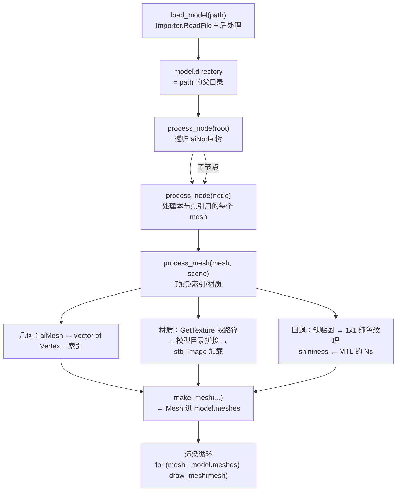
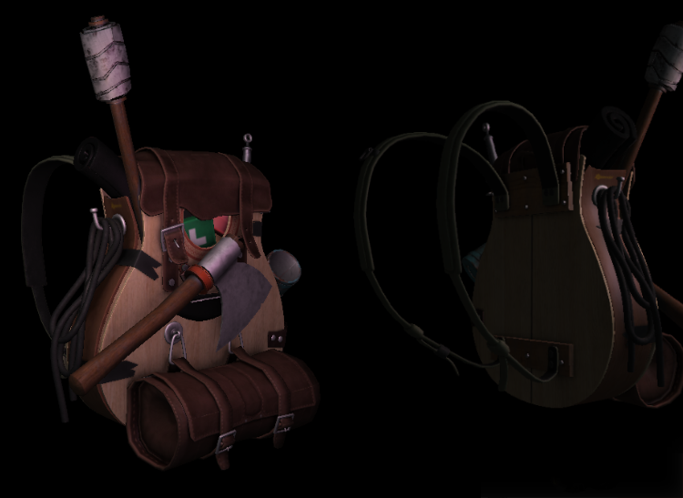
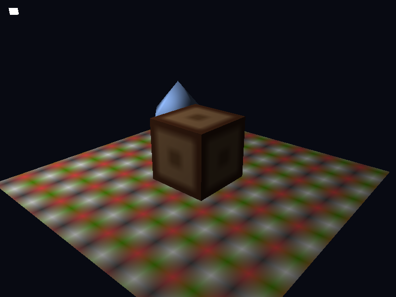

# Model

| 项目 | 内容 |
| --- | --- |
| 原文 | [Model](http://learnopengl.com/#!Model-Loading/Model) |
| 作者 | JoeyDeVries |
| 来源 | LearnOpenGL-CN（本文基于其内容整理修订） |
| 本仓库示例 | [`apps/03_model_loading/03_model/`](../../apps/03_model_loading/03_model/) |

现在是时候接触 Assimp 并创建实际的加载和转换代码了。这个教程的目标是创建另一个封装来完整地表示一个模型，或者说是包含多个网格、多个纹理的模型。一个包含木制阳台、塔楼、甚至游泳池的房子可能仍会被加载为一个模型。我们会使用 Assimp 来加载模型，并将它转换至多个在上一节中创建的 `Mesh` 对象。

**一句话核心：** Model = `std::vector<Mesh>` + 模型目录；`load_model` 导入 aiScene → `process_node` 递归节点树 → `process_mesh` 转换单个 mesh（几何 + 材质贴图 + 回退）——文件到可渲染对象只需一次调用。

> **本仓库示例的实现约定：** 原文用 `class Model`（构造函数 + `loadModel` + `processNode` + `processMesh` + `loadMaterialTextures`）；本仓库按教学约定用**结构体 + 自由函数**等价实现，职责边界完全一致。

## 加载流程全景



Model 本体只有两个字段（逐字取自示例 `main.cpp`）：

```c++
struct Model {
    std::vector<Mesh> meshes;
    std::string directory;
};
```

`Model` 包含了一个 `Mesh` 对象的 vector；`directory` 储存模型文件所在目录——材质里的贴图路径都是相对它解析的（OBJ 的 MTL 通常只写文件名），这与「模型和贴图放同一目录」的常见资源组织方式一致。绘制函数没有什么特别之处，基本上就是遍历所有网格，并调用它们各自的绘制函数。

## 导入 3D 模型到 OpenGL

要想导入一个模型，并将它转换到我们自己的数据结构中的话，首先我们需要包含 Assimp 对应的头文件（`<assimp/Importer.hpp>`、`<assimp/scene.h>`、`<assimp/postprocess.h>`）。

首先需要调用的是 `load_model`。在 `load_model` 中，我们使用 Assimp 来加载模型至它的一个叫做 scene 的数据结构中——这是 Assimp 数据接口的根对象，一旦我们有了这个场景对象，我们就能访问到加载后的模型中所有所需的数据了。Assimp 很棒的一点在于，它抽象掉了加载不同文件格式的所有技术细节，只需要一行代码就能完成所有的工作。本仓库示例的 `load_model`（逐字取自示例）：

```c++
bool load_model(Model& model, const std::filesystem::path& path) {
    Assimp::Importer importer;

    // Assimp: 后处理与 01_assimp 相同；不使用 aiProcess_FlipUVs，
    // 因为纹理统一由 stbi_set_flip_vertically_on_load(1) 翻转，后处理再翻会二次翻转。
    constexpr unsigned int import_flags{aiProcess_Triangulate | aiProcess_GenSmoothNormals |
                                        aiProcess_JoinIdenticalVertices | aiProcess_OptimizeMeshes};
    const aiScene* scene{importer.ReadFile(path.generic_string(), import_flags)};
    if (scene == nullptr || (scene->mFlags & AI_SCENE_FLAGS_INCOMPLETE) != 0U ||
        scene->mRootNode == nullptr) {
        std::cerr << "Failed to import model: " << importer.GetErrorString() << '\n';
        return false;
    }

    model.directory = path.parent_path().generic_string();
    model.meshes.clear();
    process_node(model, scene->mRootNode, scene);

    std::cout << "loaded '" << path.filename().generic_string() << "': " << model.meshes.size()
              << " mesh(es)\n";
    return !model.meshes.empty();
}
```

通过设定 `aiProcess_Triangulate`，我们告诉 Assimp，如果模型不是（全部）由三角形组成，它需要将模型所有的图元形状变换为三角形。（原文还设定了 `aiProcess_FlipUVs`，在处理时翻转 y 轴的纹理坐标，以配合它「不翻转」的纹理加载方式；本仓库的加载端统一 `stbi_set_flip_vertically_on_load(1)`，所以**不用** FlipUVs，避免二次翻转——详见上一节的说明。）

在我们加载了模型之后，我们会检查场景和其根节点不为 null，并且检查了它的一个标记（Flag），来查看返回的数据是不是不完整的。如果遇到了任何错误，我们都会通过导入器的 `GetErrorString` 函数来报告错误并返回。我们也获取了文件路径的目录路径（原文用 `path.substr(0, path.find_last_of('/'))`，本仓库用 `std::filesystem::path::parent_path`，等价且更稳）。

> **注意：** `Importer` 是 `load_model` 的局部变量，函数返回时连同 aiScene 一起释放——这没有问题，因为 `process_node`/`process_mesh` 在函数返回前已经把需要的数据**复制**进了我们自己的容器（顶点向量、索引向量、纹理对象）。渲染阶段不再触碰任何 aiScene 指针。这与 01_assimp 示例（Importer 活到渲染结束）是两种同样合法的写法，取决于 scene 的数据是否需要跨函数存活。

如果什么错误都没有发生，我们希望处理场景中的所有节点，所以我们将第一个节点（根节点）传入递归的 `process_node` 函数。

## 递归节点树

因为每个节点（可能）包含有多个子节点，我们希望首先处理参数中的节点，再继续处理该节点所有的子节点，以此类推。这正符合一个递归结构：递归函数在做一些处理之后，使用不同的参数递归调用自身，直到某个条件被满足停止递归。在我们的例子中**退出条件**（Exit Condition）是所有的节点都被处理完毕（逐字取自示例）：

```c++
void process_node(Model& model, const aiNode* node, const aiScene* scene) {
    for (unsigned int mesh_slot{0U}; mesh_slot < node->mNumMeshes; ++mesh_slot) {
        const aiMesh* mesh{scene->mMeshes[node->mMeshes[mesh_slot]]};
        model.meshes.push_back(process_mesh(model, mesh, scene));
    }

    for (unsigned int child{0U}; child < node->mNumChildren; ++child) {
        process_node(model, node->mChildren[child], scene);
    }
}
```

我们首先检查每个节点的网格索引，并索引场景的 `mMeshes` 数组来获取对应的网格。返回的网格将会传递到 `process_mesh` 函数中，它会返回一个 `Mesh` 对象，我们将它存储在 `meshes` 列表中。所有网格都被处理之后，我们会遍历节点的所有子节点，并对它们调用相同的函数。当一个节点不再有任何子节点之后，这个函数将会停止执行。

> **重要：** 认真的读者可能会发现，我们可以基本上忘掉处理任何的节点，只需要遍历场景对象的所有网格，就不需要为了索引做这一堆复杂的东西了。我们仍这么做的原因是，使用节点的最初想法是在网格之间定义一个**父子关系**。通过这样递归地遍历这层关系，我们就能将某个网格定义为另一个网格的父网格了。这个系统的一个使用案例是，当你想位移一个汽车的网格时，你可以保证它的所有子网格（比如引擎网格、方向盘网格、轮胎网格）都会随着一起位移。然而，本仓库示例为了教学简单**没有累乘节点变换**（多数 OBJ 导出器会把变换直接烘焙进顶点坐标，stage.obj 的节点树全为单位阵——见下文「常见误解」）；要支持层级变换，需要把父级变换矩阵一路传入并在 `process_mesh` 中应用到顶点上，这正是 01_assimp 示例的 `render_node` 做的事。

### 从 Assimp 到网格

将一个 `aiMesh` 对象转化为我们自己的网格对象不是那么困难。我们要做的只是访问网格的相关属性并将它们储存到我们自己的对象中。`process_mesh` 的几何部分与 01_assimp 的 `upload_mesh` 同构：遍历 `mesh->mNumVertices`，把 `mVertices`（注意：Assimp 把顶点位置数组叫做 `mVertices`，这其实并不是那么直观）、`mNormals`、`mTextureCoords[0]` 逐个转换成 `glm::vec3`/`glm::vec2` 填进 `Vertex`（原文为每次转换定义一个临时 `vec3` 变量，因为 Assimp 对向量、矩阵、字符串等都有自己的一套数据类型，并不能直接转换到 GLM 的数据类型；本仓库用花括号初始化直接构造）。

纹理坐标的处理值得注意——Assimp 允许一个模型在一个顶点上有最多 **8 组**不同的纹理坐标，我们只关心第 0 组，并且要检查网格是否真的包含了纹理坐标（可能并不会一直如此）；缺失时补 (0, 0)。

索引部分，Assimp 的接口定义了每个网格都有一个面（Face）数组，每个面代表了一个图元，在我们的例子中（由于使用了 `aiProcess_Triangulate` 选项）它总是三角形。一个面包含了多个索引，它们定义了在每个图元中，我们应该绘制哪个顶点、以什么顺序绘制。遍历所有的面，把面的索引储存进 `indices` 向量，之后交给 `glDrawElements` 使用。

## 材质

和节点一样，一个网格只包含了一个指向材质对象的索引。如果想要获取网格真正的材质，我们还需要索引场景的 `mMaterials` 数组。网格材质索引位于它的 `mMaterialIndex` 属性中。本仓库示例的材质处理（逐字取自示例）：

```c++
    const aiMaterial* material{scene->mMaterials[mesh->mMaterialIndex]};

    GLuint diffuse_map{0};
    aiString texture_path{};
    if (material->GetTextureCount(aiTextureType_DIFFUSE) > 0U &&
        material->GetTexture(aiTextureType_DIFFUSE, 0, &texture_path) == aiReturn_SUCCESS) {
        std::filesystem::path texture_file{model.directory};
        texture_file /= texture_path.C_Str();
        diffuse_map = create_texture_from_file(texture_file.generic_string());
    }

    GLuint specular_map{0};
    if (material->GetTextureCount(aiTextureType_SPECULAR) > 0U &&
        material->GetTexture(aiTextureType_SPECULAR, 0, &texture_path) == aiReturn_SUCCESS) {
        std::filesystem::path texture_file{model.directory};
        texture_file /= texture_path.C_Str();
        specular_map = create_texture_from_file(texture_file.generic_string());
    }

    // 材质回退：漫反射缺贴图用 Kd 纯色，镜面缺贴图用黑色（该 mesh 无高光）。
    aiColor3D diffuse_color{1.0F, 1.0F, 1.0F};
    material->Get(AI_MATKEY_COLOR_DIFFUSE, diffuse_color);
    if (diffuse_map == 0U) {
        std::cout << "  mesh '" << mesh->mName.C_Str()
                  << "': no diffuse map, fallback to material color\n";
        diffuse_map =
            create_solid_texture(glm::vec3{diffuse_color.r, diffuse_color.g, diffuse_color.b});
    }
    if (specular_map == 0U) {
        specular_map = create_solid_texture(glm::vec3{0.0F, 0.0F, 0.0F});
    }

    float shininess{32.0F};
    if (material->Get(AI_MATKEY_SHININESS, shininess) != aiReturn_SUCCESS) {
        shininess = 32.0F;
    }

    return make_mesh(vertices, indices, diffuse_map, specular_map, shininess);
```

按顺序拆解：

1. **取贴图路径**：`GetTexture(aiTextureType_DIFFUSE, 0, ...)` 取第 0 张漫反射贴图的**路径字符串**（OBJ 的 `map_Kd`）；`GetTextureCount` 先确认存在。原文为每种类型加载**全部**贴图（返回 `vector<Texture>`），本仓库每种类型只取第 0 张——与上一节「每类贴图固定一张」的简化一致。
2. **路径解析**：`model.directory / 贴图路径`——MTL 里写的 `box_diffuse.ppm` 拼成 `assets/models/stage/box_diffuse.ppm`，交给 stb_image 版的 `create_texture_from_file`。**我们假设了模型文件中纹理文件的路径是相对于模型文件的本地（Local）路径**，比如说与模型文件处于同一目录下（这也是为什么 `load_model` 需要记录目录字符串）。在网络上找到的某些模型会对纹理位置使用绝对（Absolute）路径，这就不能在每台机器上都工作了——在这种情况下，你可能需要手动修改模型文件，让它对纹理使用本地路径。
3. **回退**：材质没有（或加载失败）漫反射贴图时，读取 MTL 的 `Kd` 纯色生成 **1×1 纯色纹理**；镜面缺贴图回退**黑色**（高光归零）。回退成纹理而不是给着色器加分支——采样逻辑完全不用改（呼应上一章光照贴图一节的「常见误解」）。
4. **shininess**：从 `AI_MATKEY_SHININESS`（MTL 的 `Ns`）读取，失败默认 32——材质参数尽量尊重建模师的设定。

> **进阶（1×1 回退纹理的 mipmap 陷阱）：** `create_solid_texture` 的 MIN_FILTER 用的是 **GL_LINEAR 而不是 GL_LINEAR_MIPMAP_LINEAR**，这不是随手写的：mip 链不完整（1×1 纹理没有更小的 mip）时，`GL_LINEAR_MIPMAP_LINEAR` 会让纹理被视为**不完整**，采样结果恒为黑——一个著名的「回退纹理一片黑」bug。要么补全 mip（对 1×1 无意义），要么把 MIN_FILTER 降到不需要 mip 的模式。凡是手工构造的非 mip 链纹理（纯色、LUT、查表图）都要记住这一条。

## 重大优化：纹理去重

原文在此之上还做了一个重大的（但不是完全必须的）优化：大多数场景都会在多个网格中重用部分纹理——想想一个房子，它的墙壁有着花岗岩的纹理，这个纹理也可以被应用到地板、天花板、楼梯、桌子上。加载纹理并不是一个低开销的操作，在「每个网格各自加载」的实现中，即便同样的纹理已经被加载过很多遍了，仍会加载并生成一个新的纹理，这很快就会变成模型加载的性能瓶颈。

原文的做法是把所有加载过的纹理全局储存（`Texture` 结构体增加 `path` 字段，`Model` 类持有 `textures_loaded` 向量），每当想加载一个纹理的时候，先检查它有没有被加载过——有的话直接复用，跳过整个加载流程。

> **进阶（本仓库的取舍）：** 本仓库的 stage.obj 三个材质各用各的贴图，不存在重复，所以省略了去重缓存。真实项目里贴图动辄几十 MB，去重缓存（`std::unordered_map<std::string, GLuint>`——路径到纹理 id 的映射）几乎是必须的，这也是「全局纹理管理器」的雏形，原文的 `textures_loaded` 方案可以直接照搬。

> **注意：** 有些版本的 Assimp 在使用调试版本或者使用 IDE 的调试模式下加载模型会非常缓慢，所以在遇到缓慢的加载速度时，可以试试使用发布版本。

## 渲染：每个 mesh 自带材质

原文加载了一个由真正的艺术家创造的模型——Berk Gedik 设计的[吉他生存背包](https://sketchfab.com/3d-models/survival-guitar-backpack-low-poly-799f8c4511f84fab8c3f12887f7e6b36)（Survival Guitar Backpack，导出为 .obj + .mtl，漫反射/镜面/法线贴图齐全），替换掉一直使用的箱子。仅输出漫反射贴图时：


再结合光照章节的知识引入光源与镜面贴图：



本仓库没有分发这个大模型，而是加载手写的 `assets/models/stage/stage.obj`——一个「考点全覆盖」的小场景：**3 个 mesh、3 种材质**：

| mesh | 材质 | 考察点 |
| --- | --- | --- |
| ground（地面四边形） | 仅有漫反射贴图（棋盘格，UV 放大 8 倍平铺） | GL_REPEAT 平铺、无镜面贴图的回退 |
| box（箱子） | 漫反射 + 镜面贴图 | 光照章节箱子的完整复刻 |
| octa（八面体） | 纯色材质，**无任何贴图**，顶点不写法线 | Kd 回退路径、GenSmoothNormals 生成法线 |

渲染循环里遍历 `model.meshes`，逐个上传各自的 shininess 并绘制（逐字取自示例）：

```c++
        // Assimp: stage.obj 的顶点已是世界坐标，节点树变换为单位阵，model 保持恒等。
        const glm::mat4 model{1.0F};
        glUniformMatrix4fv(glGetUniformLocation(object_program, "model"), 1, GL_FALSE,
                           glm::value_ptr(model));

        // Model: 每个 mesh 携带自己的材质（贴图 + shininess），逐个设置并绘制。
        for (const Mesh& mesh : stage.meshes) {
            glUniform1f(glGetUniformLocation(object_program, "material.shininess"), mesh.shininess);
            draw_mesh(mesh);
        }
```

控制台输出如实记录了加载过程：

```text
  mesh 'octa': no diffuse map, fallback to material color
loaded 'stage.obj': 3 mesh(es)
```

点光源绕场景中心环绕运动，让三种材质轮流正对光照：



> **常见误解：** OBJ 文件里的顶点坐标一定要再乘节点变换才是世界坐标。
> **纠正：** 不一定——取决于导出设置。多数建模软件导出 OBJ 时会把所有平移旋转**直接烘焙进顶点**，节点树全为单位阵；但导出 FBX/glTF 常保留层级。所以「顶点已是世界坐标」是 stage.obj 的**事实**（示例注释也是这么写的），不是通用规律。判断方法：加载后打印根/子节点的 `mTransformation`，若非单位阵就必须在 `process_node` 里逐级累乘（这正是 01_assimp 的 `render_node` 做的事）。

> **进阶（渲染一个模型要多少次绘制调用）：** 本例 3 个 mesh = 3 次 `draw_mesh` = 3 次 draw call。真实模型（一个游戏角色）几百个 mesh、几十张贴图，逐 mesh 绘制会撞上 CPU 提交瓶颈。工业界的优化方向：**纹理图集**（把多张贴图拼一张，多 mesh 合并成一个 draw）、**实例化渲染**（`glDrawArraysInstanced`，一个 draw 画 N 份）、**批处理**（顶点数据合并 + 用顶点属性区分材质）。前提都是本节的抽象：先把「模型 = mesh 集合」理清楚，才谈得上合并。

使用 Assimp，你能够加载互联网上的无数模型。有很多资源网站都提供了多种格式的免费 3D 模型供你下载。但还是要注意，有些模型会不能正常地载入，纹理的路径会出现问题，或者 Assimp 并不支持它的格式。

## 练习

- 在 `process_node` 中累乘节点变换并打印每个节点的 `mTransformation`，验证 stage.obj 全为单位阵。
- 给 stage 换一个会旋转的 model 矩阵（`glm::rotate(model, time, up)`），观察「地面转起来」的效果——顺便体会烘焙变换与运行时变换的等价性。
- 把 `stage.mtl` 里 `octa_plain` 的 `Kd` 改成别的颜色（如 `1.0 0.2 0.2`），重新运行验证回退纹理的颜色来源。
- 实现原文的贴图去重缓存：`std::unordered_map<std::string, GLuint>`，让多个 mesh 共享同一张贴图。

## 本仓库示例

示例目录：`apps/03_model_loading/03_model/`

构建（默认 MinGW GCC Debug，需 MSYS2 UCRT64 在 PATH 中）：

```powershell
conan install . -of build/mingw-gcc-debug -pr:h conan/profiles/mingw-gcc -pr:b conan/profiles/mingw-gcc -s build_type=Debug --build=missing
cmake --preset mingw-gcc-debug
cmake --build --preset mingw-gcc-debug
```

运行：

```powershell
.\build\mingw-gcc-debug\apps\03_model_loading\03_model\03_model_loading__03_model.exe
```

运行时交互：按 **Esc**（退出键）退出程序。场景为自动动画——棋盘格地面、贴图箱子与纯色八面体（三条加载路径各取其一）在环绕点光源下被照亮；控制台打印加载统计与回退信息。模型资源从 `assets/models/stage/` 加载。

## 本章整体回顾

本节把三章知识汇成一条完整管线：

- **局部（Model 加载）**：`load_model`（导入 + 目录记录）→ `process_node`（递归节点树）→ `process_mesh`（几何转换 + 材质贴图 + 回退）→ `make_mesh`；贴图路径相对模型目录解析，缺贴图回退 1×1 纯色纹理，shininess 取自 Ns。
- **局部（资源组织）**：`assets/models/<name>/` 下 OBJ + MTL + PPM 自包含；纯文本资源可直接阅读、diff 友好。
- **整体（三章汇合）**：模型文件 → Assimp 统一数据模型 → Model/Mesh 封装 → 光照章节的冯氏光照 + 贴图材质管线 → 屏幕。至此入门三部曲（Getting Started / Lighting / Model Loading）闭环：**能开窗口、能打光照、能加载模型**。下一步的 Advanced OpenGL 章节将深入管线的更深处——深度测试、模板测试、混合、帧缓冲、实例化渲染等。

下一章：04 Advanced OpenGL（进阶 OpenGL 章节，教程尚未编写；可先阅读 learnopengl.com 的 Advanced-OpenGL 部分）
