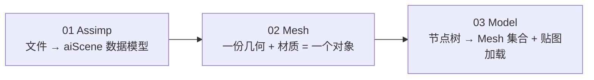

# 模型加载教程（03 章）

本目录是 OpenGL Lab 仓库的模型加载章节中文教程，共 3 篇，对应 [LearnOpenGL](http://learnopengl.com) 的 Model Loading 部分。

内容基于 [LearnOpenGL-CN](https://github.com/with-fair-wind/LearnOpenGL-CN) 翻译整理，并做了两方面工作：

- **修正**：修正译文中术语不准确、病句、笔误等表述问题，统一专业术语（如「渲染」而非「呈现」、Esc = 退出键）。
- **完善**：从局部到整体的视角补充讲解——每个关键概念先给"一句话核心"，再明确职责边界（Assimp / OpenGL / 应用程序各自负责什么），配全景链路图说明概念在渲染管线中的位置，并用本仓库实际代码逐段讲解。

## 篇章列表

| 篇 | 教程 | 本仓库示例 | 核心内容 |
|---|---|---|---|
| 01 | [Assimp](01_assimp.md) | `apps/03_model_loading/01_assimp/` | aiScene/aiNode/aiMesh/aiMaterial 数据模型、后处理标志、节点树递归渲染 |
| 02 | [Mesh](02_mesh.md) | `apps/03_model_loading/02_mesh/` | Vertex/Mesh 结构体、make/draw/destroy 三函数生命周期、VAO 与 EBO 绑定 |
| 03 | [Model](03_model.md) | `apps/03_model_loading/03_model/` | 递归加载多 mesh/多材质、贴图相对目录解析、无贴图回退、自包含模型资源 |

## 如何跟随学习

1. 按篇章顺序阅读；每篇末尾的"本章整体回顾"会串起本节在完整管线中的位置。
2. 每篇都有对应的仓库示例，在"本仓库示例"小节给出示例路径、构建与运行命令。
3. 构建与运行方式总览见 [`docs/build.md`](../build.md)（Conan 2 + CMake presets，默认 `mingw-gcc-debug`）。

运行示例（默认 MinGW GCC Debug）：

```powershell
conan install . -of build/mingw-gcc-debug -pr:h conan/profiles/mingw-gcc -pr:b conan/profiles/mingw-gcc -s build_type=Debug --build=missing
cmake --preset mingw-gcc-debug
cmake --build --preset mingw-gcc-debug
.\build\mingw-gcc-debug\apps\03_model_loading\01_assimp\03_model_loading__01_assimp.exe
```

示例通用操作：`Esc` 退出；本章示例相机均为固定视角，模型自转/光源环绕为自动动画；模型与贴图从 `assets/models/` 加载（OBJ + MTL + PPM 均为可读的纯文本资源）。

## 章节主线

一条贯穿全章的抽象阶梯：**从文件到可渲染对象** →



本章依赖前两章的全部积累：顶点布局与 VAO/VBO/EBO（Getting Started）、Phong 光照 + 贴图材质（Lighting）。合流之后，入门三部曲闭环。

上一章：[多光源](../02_lighting/06_multiple_lights.md) · 下一章：04 Advanced OpenGL（教程尚未编写）。
